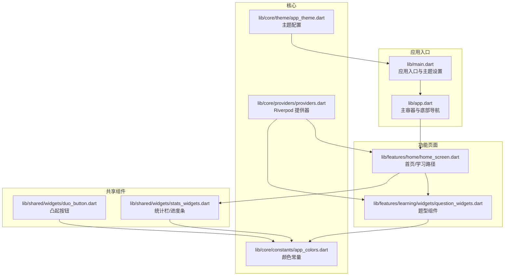
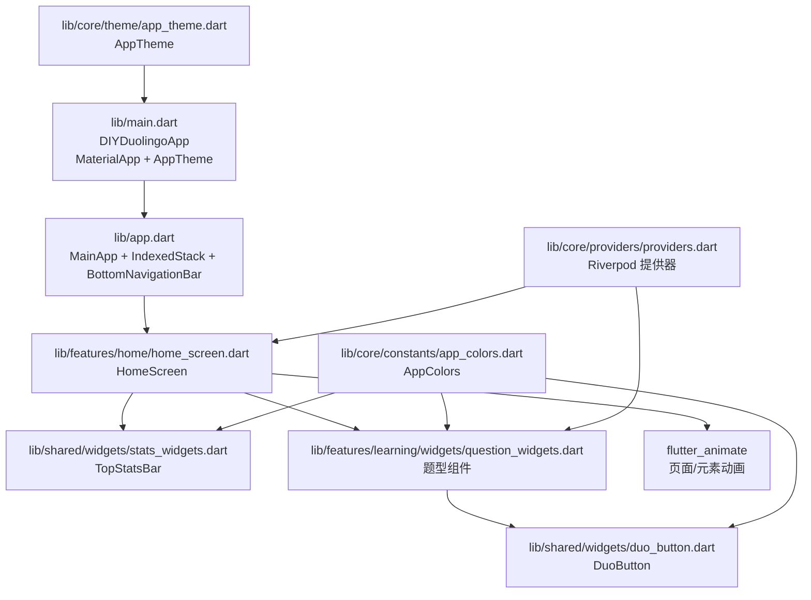
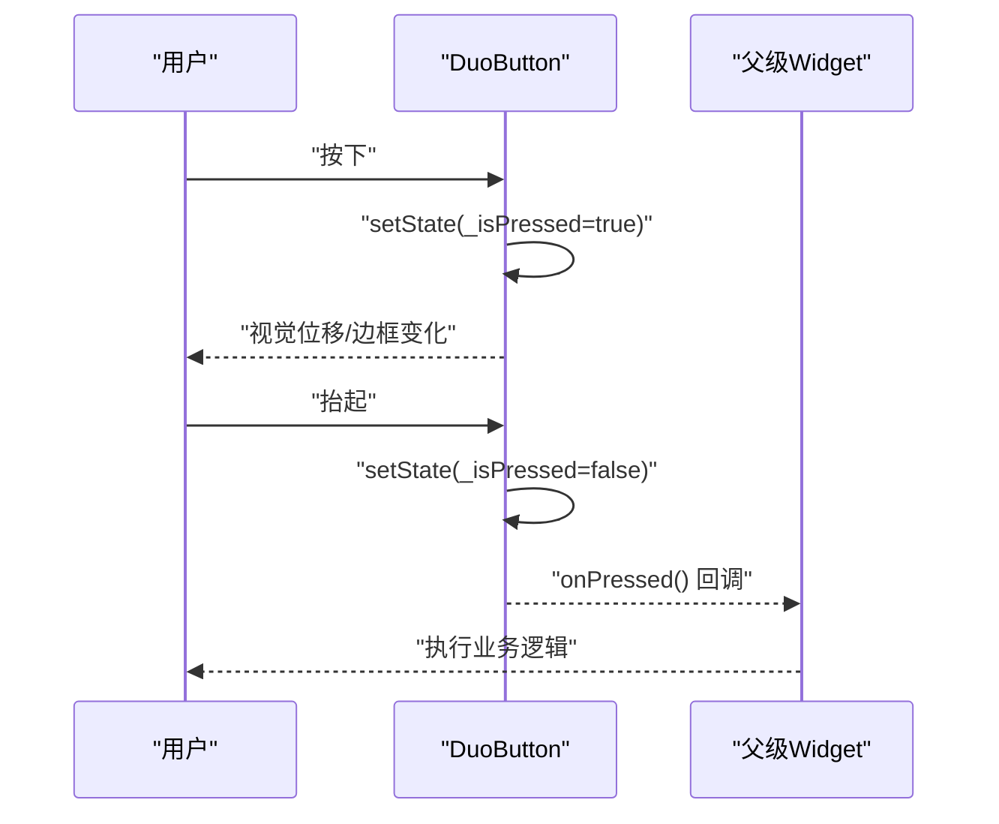
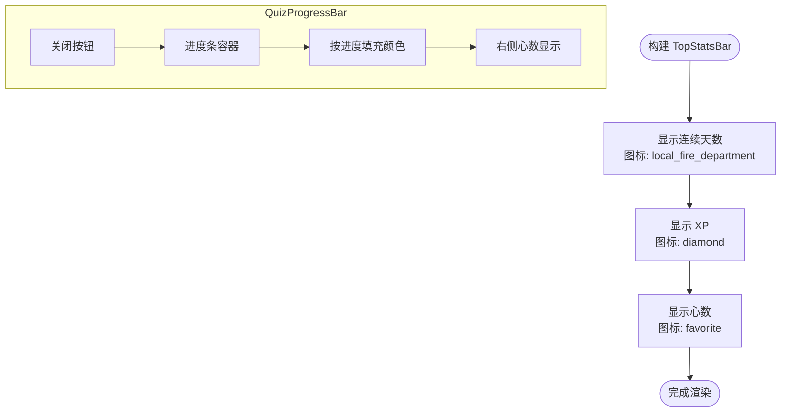
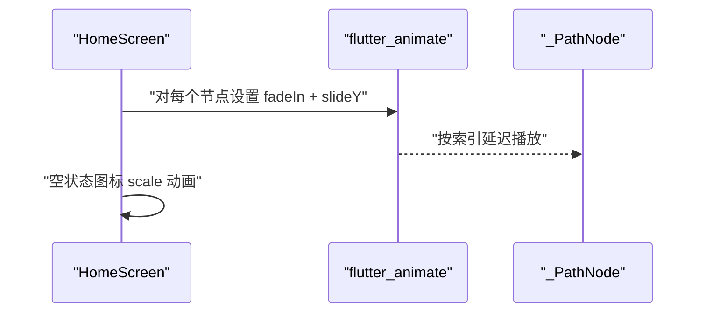
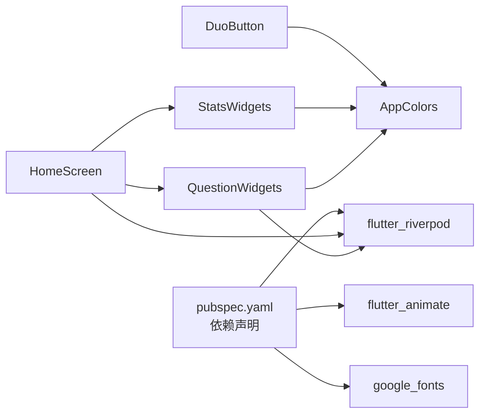

# UI组件系统

<cite>
**本文引用的文件**
- [lib/main.dart](file://lib/main.dart)
- [lib/app.dart](file://lib/app.dart)
- [lib/core/theme/app_theme.dart](file://lib/core/theme/app_theme.dart)
- [lib/core/constants/app_colors.dart](file://lib/core/constants/app_colors.dart)
- [lib/core/providers/providers.dart](file://lib/core/providers/providers.dart)
- [lib/shared/widgets/duo_button.dart](file://lib/shared/widgets/duo_button.dart)
- [lib/shared/widgets/stats_widgets.dart](file://lib/shared/widgets/stats_widgets.dart)
- [lib/features/home/home_screen.dart](file://lib/features/home/home_screen.dart)
- [lib/features/learning/widgets/question_widgets.dart](file://lib/features/learning/widgets/question_widgets.dart)
- [lib/data/models/user_stats.dart](file://lib/data/models/user_stats.dart)
- [pubspec.yaml](file://pubspec.yaml)
</cite>

## 目录
1. [简介](#简介)
2. [项目结构](#项目结构)
3. [核心组件](#核心组件)
4. [架构总览](#架构总览)
5. [组件详解](#组件详解)
6. [依赖关系分析](#依赖关系分析)
7. [性能与可访问性](#性能与可访问性)
8. [故障排查指南](#故障排查指南)
9. [结论](#结论)
10. [附录：使用示例与自定义指南](#附录使用示例与自定义指南)

## 简介
本文件系统化梳理 Dlg-Q 的 UI 组件体系，重点覆盖以下方面：
- 共享组件的设计与实现：按钮、卡片、输入框等基础组件的样式与行为
- 动画系统：页面过渡、交互动画与视觉反馈
- 主题系统：颜色方案、字体配置与响应式支持
- 最佳实践：可复用性、性能优化与无障碍访问
- 使用示例与自定义指南：帮助开发者正确使用与扩展 UI 组件

## 项目结构
项目采用按功能域分层的组织方式，核心 UI 组件集中在 shared/widgets 与 features 子模块中；主题与颜色常量位于 core；数据与状态通过 Riverpod 提供器管理。

图表来源
- [lib/main.dart:1-36](file://lib/main.dart#L1-L36)
- [lib/app.dart:10-111](file://lib/app.dart#L10-L111)
- [lib/core/theme/app_theme.dart:1-116](file://lib/core/theme/app_theme.dart#L1-L116)
- [lib/core/constants/app_colors.dart:1-43](file://lib/core/constants/app_colors.dart#L1-L43)
- [lib/core/providers/providers.dart:1-178](file://lib/core/providers/providers.dart#L1-L178)
- [lib/shared/widgets/duo_button.dart:1-103](file://lib/shared/widgets/duo_button.dart#L1-L103)
- [lib/shared/widgets/stats_widgets.dart:1-139](file://lib/shared/widgets/stats_widgets.dart#L1-L139)
- [lib/features/home/home_screen.dart:1-335](file://lib/features/home/home_screen.dart#L1-L335)
- [lib/features/learning/widgets/question_widgets.dart:1-656](file://lib/features/learning/widgets/question_widgets.dart#L1-L656)

章节来源
- [lib/main.dart:1-36](file://lib/main.dart#L1-L36)
- [lib/app.dart:10-111](file://lib/app.dart#L10-L111)
- [lib/core/theme/app_theme.dart:1-116](file://lib/core/theme/app_theme.dart#L1-L116)
- [lib/core/constants/app_colors.dart:1-43](file://lib/core/constants/app_colors.dart#L1-L43)
- [lib/core/providers/providers.dart:1-178](file://lib/core/providers/providers.dart#L1-L178)
- [lib/shared/widgets/duo_button.dart:1-103](file://lib/shared/widgets/duo_button.dart#L1-L103)
- [lib/shared/widgets/stats_widgets.dart:1-139](file://lib/shared/widgets/stats_widgets.dart#L1-L139)
- [lib/features/home/home_screen.dart:1-335](file://lib/features/home/home_screen.dart#L1-L335)
- [lib/features/learning/widgets/question_widgets.dart:1-656](file://lib/features/learning/widgets/question_widgets.dart#L1-L656)

## 核心组件
- 主题与颜色
  - 主题：基于 Material Design 2（useMaterial3=false），以 AppColors 为核心颜色体系，结合 Google Fonts 的 Nunito 字体族，统一标题、正文、按钮与输入框等组件的视觉规范。
  - 颜色：定义主色（绿、蓝、红、金、紫）、中性色（背景、表面、卡片、文字、边框、阴影）以及图标强调色（心形、连击橙）。
- 共享组件
  - 凸起按钮（DuoButton）：模拟 3D 凸起效果，支持按下态位移与边框粗细变化，内置禁用态与图标集成。
  - 统计栏与进度条（TopStatsBar、QuizProgressBar）：展示 XP、连续天数、心数等用户状态，并提供答题进度可视化。
- 动画系统
  - 页面与元素：使用 flutter_animate 对节点入场、缩放等进行轻量动画；结合 AnimatedContainer 实现交互态过渡。
  - 交互反馈：按钮按下位移动画、选项选中/对错态的颜色与图标反馈、输入框焦点态与下划线高亮。
- 状态与数据流
  - Riverpod：提供数据库、AI 分析、游戏化服务等基础服务，以及用户统计、题包列表、学习记录等数据 Provider；配合 StateNotifier 管理异步状态与动作。

章节来源
- [lib/core/theme/app_theme.dart:9-114](file://lib/core/theme/app_theme.dart#L9-L114)
- [lib/core/constants/app_colors.dart:4-42](file://lib/core/constants/app_colors.dart#L4-L42)
- [lib/shared/widgets/duo_button.dart:4-102](file://lib/shared/widgets/duo_button.dart#L4-L102)
- [lib/shared/widgets/stats_widgets.dart:5-138](file://lib/shared/widgets/stats_widgets.dart#L5-L138)
- [lib/core/providers/providers.dart:11-177](file://lib/core/providers/providers.dart#L11-L177)

## 架构总览
Dlg-Q 的 UI 架构围绕“主题驱动 + 共享组件 + 功能页面 + 状态管理”的模式展开。应用入口设置主题与系统 UI 样式；主容器负责页面切换与底部导航；共享组件提供一致的交互体验；功能页面组合共享组件与动画，完成业务场景；Riverpod 提供跨页面的状态与数据。

图表来源
- [lib/main.dart:23-35](file://lib/main.dart#L23-L35)
- [lib/app.dart:80-109](file://lib/app.dart#L80-L109)
- [lib/features/home/home_screen.dart:14-57](file://lib/features/home/home_screen.dart#L14-L57)
- [lib/shared/widgets/stats_widgets.dart:5-42](file://lib/shared/widgets/stats_widgets.dart#L5-L42)
- [lib/features/learning/widgets/question_widgets.dart:598-656](file://lib/features/learning/widgets/question_widgets.dart#L598-L656)
- [lib/shared/widgets/duo_button.dart:4-31](file://lib/shared/widgets/duo_button.dart#L4-L31)
- [lib/core/theme/app_theme.dart:9-114](file://lib/core/theme/app_theme.dart#L9-L114)
- [lib/core/constants/app_colors.dart:4-42](file://lib/core/constants/app_colors.dart#L4-L42)
- [lib/core/providers/providers.dart:11-177](file://lib/core/providers/providers.dart#L11-L177)

## 组件详解

### 主题系统与颜色方案
- 主题特性
  - 使用 Material Design 2，关闭 Material 3，确保与多邻国风格一致的视觉语言。
  - 颜色方案：primary/surface/error 等基于 AppColors，保证全局一致性。
  - 字体：Nunito 字体族，针对各级文本设定字号与字重。
  - 控件主题：按钮、输入框、卡片、底栏等均基于 AppColors 与 Google Fonts 统一风格。
- 颜色体系
  - 主色：绿色（学习）、蓝色（强调）、红色（错误）、金色（成就）、紫色（装饰）
  - 中性色：背景、表面、卡片、文字、边框、阴影
  - 强调色：心形（生命值）、连击橙（活跃状态）

章节来源
- [lib/core/theme/app_theme.dart:9-114](file://lib/core/theme/app_theme.dart#L9-L114)
- [lib/core/constants/app_colors.dart:4-42](file://lib/core/constants/app_colors.dart#L4-L42)

### 共享组件：按钮（DuoButton）
- 设计要点
  - 3D 凸起：通过 AnimatedContainer 在按下时产生轻微位移与边框加粗，模拟实体按键触感。
  - 禁用态：禁用或无回调时，背景与边框切换为浅色，避免误点击。
  - 可定制：支持颜色、深色变体、宽度、高度、图标与字号。
- 交互流程

图表来源
- [lib/shared/widgets/duo_button.dart:44-91](file://lib/shared/widgets/duo_button.dart#L44-L91)

章节来源
- [lib/shared/widgets/duo_button.dart:4-102](file://lib/shared/widgets/duo_button.dart#L4-L102)

### 共享组件：统计栏与进度条（TopStatsBar、QuizProgressBar）
- TopStatsBar
  - 展示连续天数、XP、心数，图标与数值颜色与 AppColors 对齐。
- QuizProgressBar
  - 展示答题进度与剩余心数，支持关闭按钮返回；进度条宽度随因子约束。

图表来源
- [lib/shared/widgets/stats_widgets.dart:5-42](file://lib/shared/widgets/stats_widgets.dart#L5-L42)
- [lib/shared/widgets/stats_widgets.dart:75-138](file://lib/shared/widgets/stats_widgets.dart#L75-L138)

章节来源
- [lib/shared/widgets/stats_widgets.dart:5-138](file://lib/shared/widgets/stats_widgets.dart#L5-L138)

### 动画系统与交互动画
- 页面与元素动画
  - 使用 flutter_animate 对学习路径节点进行淡入与从下方滑入的入场动画，延迟交错提升节奏感。
  - 首页空状态使用缩放动画突出图标。
- 交互反馈
  - 选项卡/按钮：AnimatedContainer 在选中/对错态快速切换颜色与边框，增强即时反馈。
  - 输入框：焦点态与下划线颜色随对错态变化，提升可读性与引导性。

图表来源
- [lib/features/home/home_screen.dart:121-125](file://lib/features/home/home_screen.dart#L121-L125)
- [lib/features/home/home_screen.dart:170](file://lib/features/home/home_screen.dart#L170)

章节来源
- [lib/features/home/home_screen.dart:11-216](file://lib/features/home/home_screen.dart#L11-L216)
- [lib/features/learning/widgets/question_widgets.dart:81-129](file://lib/features/learning/widgets/question_widgets.dart#L81-L129)

### 题型组件与输入框
- 选择题（MultipleChoiceWidget）
  - 支持选中态、正确/错误态高亮与图标反馈；选中后回调上层。
- 填空题（FillBlankWidget）
  - 将题干中的占位符替换为输入框；根据对错态改变输入框边框与文字颜色。
- 判断题（TrueFalseWidget）
  - 左右两个选项卡，选中/正确/错误态颜色与图标切换。
- 匹配题（MatchingWidget）
  - 左右两列拖动匹配，使用已用右侧项集合防止重复匹配。
- 排序题（OrderingWidget）
  - 上/下箭头调整顺序，实时回调当前顺序字符串。
- 输入框与卡片
  - 基于主题的 InputDecorationTheme 与 CardTheme，统一圆角、边框与内边距。

章节来源
- [lib/features/learning/widgets/question_widgets.dart:8-130](file://lib/features/learning/widgets/question_widgets.dart#L8-L130)
- [lib/features/learning/widgets/question_widgets.dart:132-249](file://lib/features/learning/widgets/question_widgets.dart#L132-L249)
- [lib/features/learning/widgets/question_widgets.dart:251-346](file://lib/features/learning/widgets/question_widgets.dart#L251-L346)
- [lib/features/learning/widgets/question_widgets.dart:348-470](file://lib/features/learning/widgets/question_widgets.dart#L348-L470)
- [lib/features/learning/widgets/question_widgets.dart:472-596](file://lib/features/learning/widgets/question_widgets.dart#L472-L596)
- [lib/core/theme/app_theme.dart:80-103](file://lib/core/theme/app_theme.dart#L80-L103)

## 依赖关系分析
- 外部依赖
  - flutter_animate：提供轻量动画能力
  - google_fonts：提供 Nunito 字体族
  - flutter_riverpod：提供状态与数据流管理
- 内部耦合
  - 共享组件依赖 AppColors 与主题；功能页面依赖共享组件与动画；Provider 为页面与组件提供数据与动作。

图表来源
- [pubspec.yaml:9-22](file://pubspec.yaml#L9-L22)
- [lib/shared/widgets/duo_button.dart:2](file://lib/shared/widgets/duo_button.dart#L2)
- [lib/shared/widgets/stats_widgets.dart:2](file://lib/shared/widgets/stats_widgets.dart#L2)
- [lib/features/learning/widgets/question_widgets.dart:2-6](file://lib/features/learning/widgets/question_widgets.dart#L2-L6)
- [lib/features/home/home_screen.dart:2-9](file://lib/features/home/home_screen.dart#L2-L9)

章节来源
- [pubspec.yaml:9-22](file://pubspec.yaml#L9-L22)
- [lib/shared/widgets/duo_button.dart:1-103](file://lib/shared/widgets/duo_button.dart#L1-L103)
- [lib/shared/widgets/stats_widgets.dart:1-139](file://lib/shared/widgets/stats_widgets.dart#L1-L139)
- [lib/features/learning/widgets/question_widgets.dart:1-656](file://lib/features/learning/widgets/question_widgets.dart#L1-L656)
- [lib/features/home/home_screen.dart:1-335](file://lib/features/home/home_screen.dart#L1-L335)

## 性能与可访问性
- 性能优化建议
  - 复用动画：对相同类型的动画（如淡入/滑入）集中配置，减少重复实例化。
  - 控制动画范围：仅对可见区域内的节点启用入场动画，避免长列表全量动画。
  - 合理使用 AnimatedContainer：在频繁切换颜色/尺寸时，尽量合并状态变更，减少重建。
  - 输入框与列表：对大量选项的题型组件使用虚拟化或分页策略，降低内存占用。
- 可访问性
  - 颜色对比：确保对错态与选中态具备足够对比度，满足 WCAG 基本要求。
  - 字号与行高：使用主题提供的字号与行高，保证在不同设备上的可读性。
  - 交互反馈：为按钮与选项卡提供明确的视觉与动效反馈，便于触控操作。

[本节为通用指导，不直接分析具体文件]

## 故障排查指南
- 主题未生效
  - 检查应用入口是否设置 AppTheme.lightTheme；确认 ThemeData 的 useMaterial2 与颜色方案。
- 颜色不一致
  - 统一使用 AppColors 常量；避免硬编码颜色值。
- 动画不流畅
  - 检查动画持续时间与延迟是否合理；避免在动画期间进行昂贵计算。
- 状态未刷新
  - 确认 Riverpod Provider 是否正确订阅与失效；检查 StateNotifier 的异步状态切换。

章节来源
- [lib/main.dart:23-35](file://lib/main.dart#L23-L35)
- [lib/core/theme/app_theme.dart:9-114](file://lib/core/theme/app_theme.dart#L9-L114)
- [lib/core/providers/providers.dart:42-81](file://lib/core/providers/providers.dart#L42-L81)

## 结论
Dlg-Q 的 UI 组件系统以主题与颜色常量为核心，通过共享组件与动画系统实现一致且富有表现力的交互体验；配合 Riverpod 的状态管理，既保证了可维护性，也为后续扩展打下良好基础。遵循本文的最佳实践与自定义指南，可进一步提升组件的复用性、性能与可访问性。

[本节为总结，不直接分析具体文件]

## 附录：使用示例与自定义指南

### 如何在页面中使用共享组件
- 使用凸起按钮
  - 在需要的地方引入 DuoButton，传入标签、颜色、图标与回调；若需禁用，设置 enabled=false。
  - 参考路径：[lib/shared/widgets/duo_button.dart:16-31](file://lib/shared/widgets/duo_button.dart#L16-L31)
- 使用统计栏与进度条
  - 在页面顶部放置 TopStatsBar，传入用户统计对象；在答题页顶部放置 QuizProgressBar，传入进度与心数。
  - 参考路径：[lib/shared/widgets/stats_widgets.dart:6-42](file://lib/shared/widgets/stats_widgets.dart#L6-L42)，[lib/shared/widgets/stats_widgets.dart:76-138](file://lib/shared/widgets/stats_widgets.dart#L76-L138)

### 如何在题型组件中集成动画与反馈
- 选择题/判断题：利用 AnimatedContainer 在选中/对错态切换颜色与边框；必要时添加图标反馈。
  - 参考路径：[lib/features/learning/widgets/question_widgets.dart:81-129](file://lib/features/learning/widgets/question_widgets.dart#L81-L129)
- 填空题：根据对错态动态调整输入框边框与文字颜色。
  - 参考路径：[lib/features/learning/widgets/question_widgets.dart:195-216](file://lib/features/learning/widgets/question_widgets.dart#L195-L216)
- 匹配题/排序题：通过状态变更触发重绘，保持 UI 与数据同步。
  - 参考路径：[lib/features/learning/widgets/question_widgets.dart:365-470](file://lib/features/learning/widgets/question_widgets.dart#L365-L470)，[lib/features/learning/widgets/question_widgets.dart:489-596](file://lib/features/learning/widgets/question_widgets.dart#L489-L596)

### 自定义指南
- 自定义按钮样式
  - 通过 color/darkColor/width/height/icon/fontSize 等参数微调；若需更复杂样式，可复制 DuoButton 的结构封装为新组件。
  - 参考路径：[lib/shared/widgets/duo_button.dart:16-31](file://lib/shared/widgets/duo_button.dart#L16-L31)
- 自定义颜色方案
  - 在 AppColors 中新增颜色常量；在 ThemeData 中映射到相应控件主题；确保与现有图标/强调色协调。
  - 参考路径：[lib/core/constants/app_colors.dart:4-42](file://lib/core/constants/app_colors.dart#L4-L42)，[lib/core/theme/app_theme.dart:9-114](file://lib/core/theme/app_theme.dart#L9-L114)
- 自定义字体
  - 在 ThemeData 中替换 textTheme 或使用 GoogleFonts 的其他字体族；注意字号与字重的一致性。
  - 参考路径：[lib/core/theme/app_theme.dart:20-53](file://lib/core/theme/app_theme.dart#L20-L53)

### 与状态管理的协作
- 订阅用户统计与题包列表
  - 使用 ref.watch 订阅 userStatsProvider 与 deckListProvider；在 loading/error/data 三种状态下分别渲染。
  - 参考路径：[lib/features/home/home_screen.dart:16-38](file://lib/features/home/home_screen.dart#L16-L38)，[lib/core/providers/providers.dart:32-40](file://lib/core/providers/providers.dart#L32-L40)
- 触发动作与刷新
  - 通过 UserStatsNotifier 的 onCorrect/onWrong/onDeckComplete/setDailyGoal 等方法更新状态；通过 DeckOperations 保存/删除题包与学习记录。
  - 参考路径：[lib/core/providers/providers.dart:58-81](file://lib/core/providers/providers.dart#L58-L81)，[lib/core/providers/providers.dart:102-177](file://lib/core/providers/providers.dart#L102-L177)