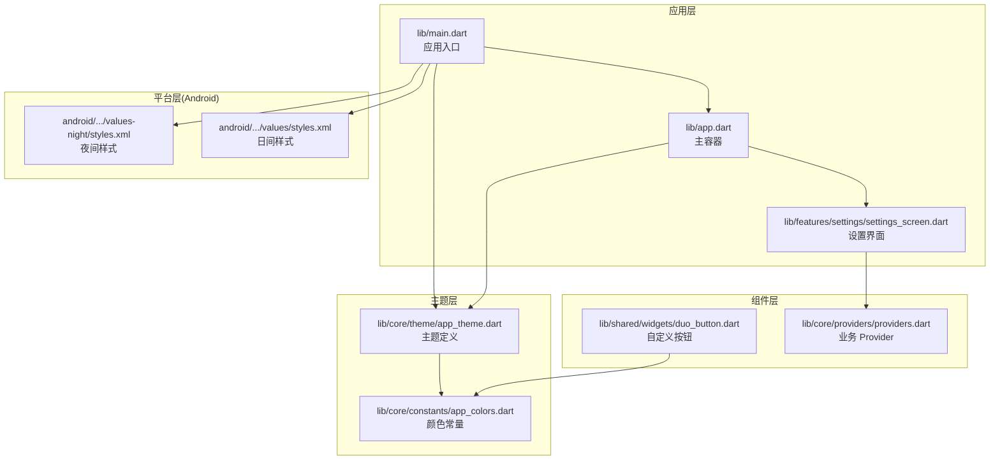
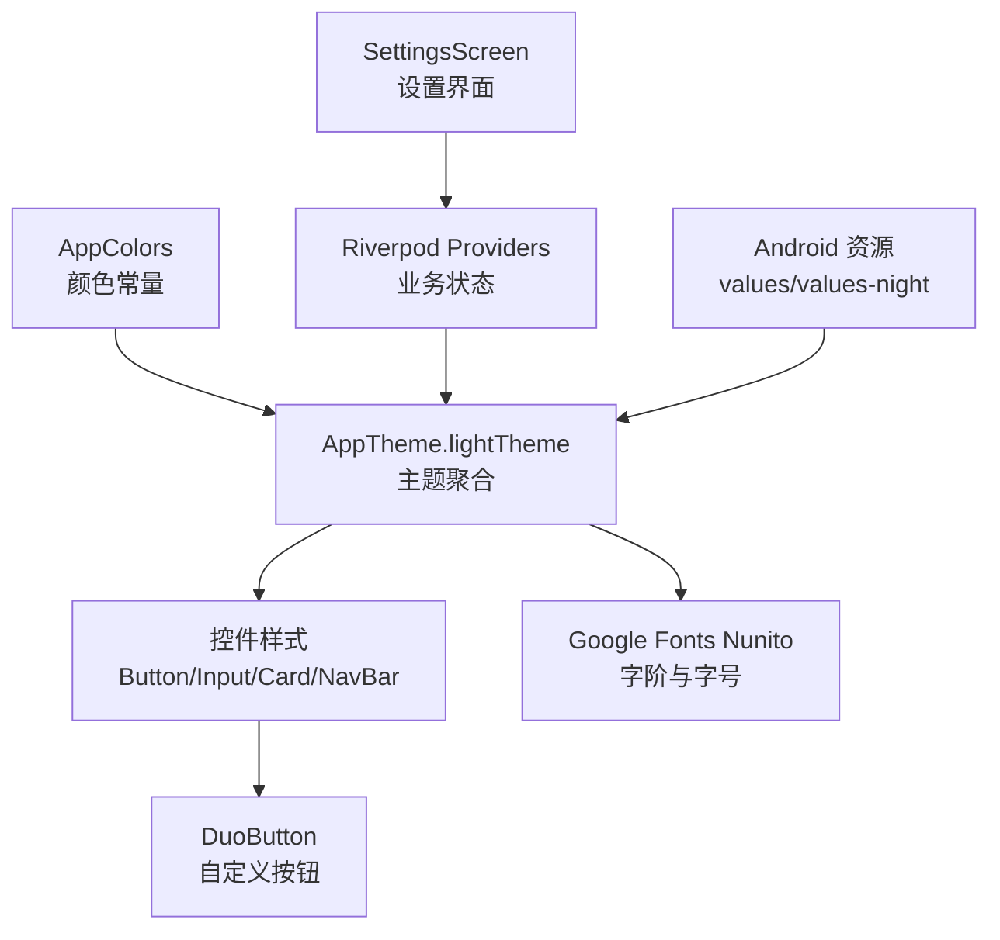
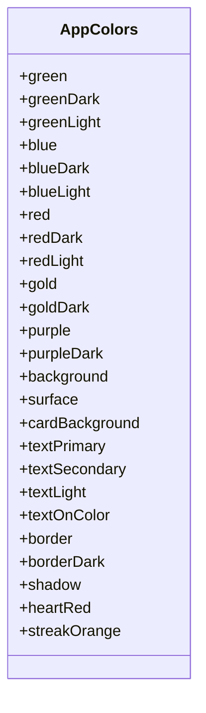
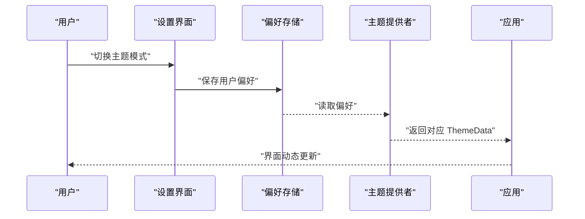
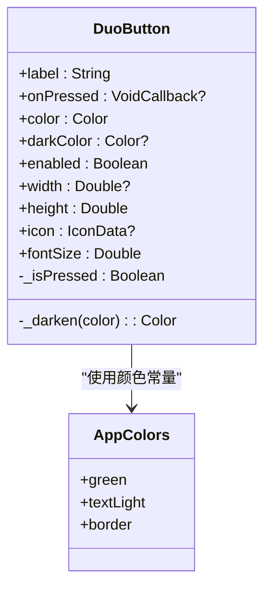
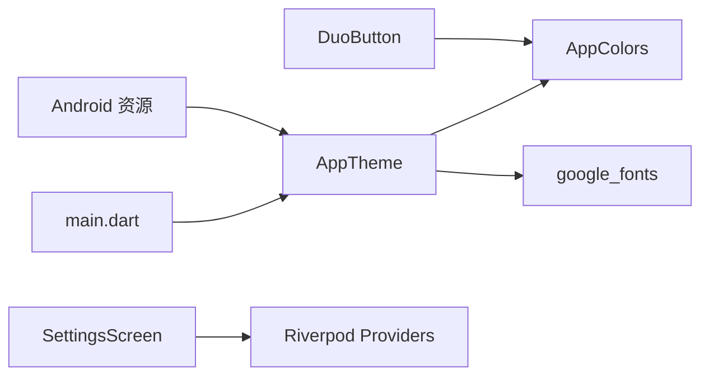

# 主题系统

<cite>
**本文引用的文件**
- [lib/main.dart](file://lib/main.dart)
- [lib/app.dart](file://lib/app.dart)
- [lib/core/theme/app_theme.dart](file://lib/core/theme/app_theme.dart)
- [lib/core/constants/app_colors.dart](file://lib/core/constants/app_colors.dart)
- [lib/shared/widgets/duo_button.dart](file://lib/shared/widgets/duo_button.dart)
- [lib/features/settings/settings_screen.dart](file://lib/features/settings/settings_screen.dart)
- [lib/core/providers/providers.dart](file://lib/core/providers/providers.dart)
- [android/app/src/main/res/values/styles.xml](file://android/app/src/main/res/values/styles.xml)
- [android/app/src/main/res/values-night/styles.xml](file://android/app/src/main/res/values-night/styles.xml)
- [pubspec.yaml](file://pubspec.yaml)
</cite>

## 目录
1. [简介](#简介)
2. [项目结构](#项目结构)
3. [核心组件](#核心组件)
4. [架构总览](#架构总览)
5. [详细组件分析](#详细组件分析)
6. [依赖关系分析](#依赖关系分析)
7. [性能考量](#性能考量)
8. [故障排查指南](#故障排查指南)
9. [结论](#结论)
10. [附录](#附录)

## 简介
本文件系统性梳理 Dlg-Q 主题系统的架构与实现，覆盖颜色体系、字体配置、布局规范、主题切换机制（含夜间模式）、用户偏好持久化、颜色常量组织、定制指南、扩展方法、性能与跨平台兼容性等。文档以代码为依据，配合可视化图示帮助读者从宏观到微观全面理解主题系统。

## 项目结构
主题系统主要由以下层次构成：
- 应用入口与根组件：负责初始化系统 UI 样式与注入主题。
- 主题定义层：集中定义 Material 主题、颜色方案、字体与控件样式。
- 颜色常量层：统一管理主色、辅色与语义化颜色。
- 自定义控件层：基于主题常量封装可复用 UI 组件。
- 设置与偏好层：提供设置界面与用户偏好的读写入口。
- 平台层：Android 资源定义夜间模式基础样式。

**图表来源**
- [lib/main.dart:23-35](file://lib/main.dart#L23-L35)
- [lib/app.dart:80-109](file://lib/app.dart#L80-L109)
- [lib/core/theme/app_theme.dart:9-114](file://lib/core/theme/app_theme.dart#L9-L114)
- [lib/core/constants/app_colors.dart:4-42](file://lib/core/constants/app_colors.dart#L4-L42)
- [lib/shared/widgets/duo_button.dart:5-31](file://lib/shared/widgets/duo_button.dart#L5-L31)
- [lib/features/settings/settings_screen.dart:7-12](file://lib/features/settings/settings_screen.dart#L7-L12)
- [android/app/src/main/res/values/styles.xml:1-18](file://android/app/src/main/res/values/styles.xml#L1-L18)
- [android/app/src/main/res/values-night/styles.xml:1-18](file://android/app/src/main/res/values-night/styles.xml#L1-L18)

**章节来源**
- [lib/main.dart:7-35](file://lib/main.dart#L7-L35)
- [lib/app.dart:10-110](file://lib/app.dart#L10-L110)
- [lib/core/theme/app_theme.dart:5-115](file://lib/core/theme/app_theme.dart#L5-L115)
- [lib/core/constants/app_colors.dart:3-42](file://lib/core/constants/app_colors.dart#L3-L42)
- [android/app/src/main/res/values/styles.xml:1-18](file://android/app/src/main/res/values/styles.xml#L1-L18)
- [android/app/src/main/res/values-night/styles.xml:1-18](file://android/app/src/main/res/values-night/styles.xml#L1-L18)

## 核心组件
- 应用入口与根组件
  - 入口设置系统状态栏样式，并通过 ProviderScope 注入全局状态。
  - 根组件 MainApp 提供底部导航与页面栈索引控制。
- 主题定义
  - AppTheme.lightTheme 使用自定义颜色常量与 Google Fonts Nunito 字体，统一定义 Material 主题参数、AppBar、Button、输入框、卡片与底部导航等样式。
- 颜色常量
  - AppColors 将主色（绿、蓝、红、金、紫）、中性色（背景、表面、卡片、文字、边框、阴影）与语义化颜色（爱心红、连击橙）集中管理。
- 自定义控件
  - DuoButton 基于 AppColors 实现多邻国风格 3D 凸起按钮，支持禁用态、按下反馈与暗色边框。
- 设置与偏好
  - SettingsScreen 提供加载/保存设置、学习目标配置、数据清理等功能；通过 Riverpod 读写业务 Provider。
- 平台层
  - Android values 与 values-night 定义启动与普通主题的基础样式，支撑系统级夜间模式。

**章节来源**
- [lib/main.dart:23-35](file://lib/main.dart#L23-L35)
- [lib/app.dart:17-109](file://lib/app.dart#L17-L109)
- [lib/core/theme/app_theme.dart:9-114](file://lib/core/theme/app_theme.dart#L9-L114)
- [lib/core/constants/app_colors.dart:4-42](file://lib/core/constants/app_colors.dart#L4-L42)
- [lib/shared/widgets/duo_button.dart:5-102](file://lib/shared/widgets/duo_button.dart#L5-L102)
- [lib/features/settings/settings_screen.dart:14-305](file://lib/features/settings/settings_screen.dart#L14-L305)
- [android/app/src/main/res/values/styles.xml:1-18](file://android/app/src/main/res/values/styles.xml#L1-L18)
- [android/app/src/main/res/values-night/styles.xml:1-18](file://android/app/src/main/res/values-night/styles.xml#L1-L18)

## 架构总览
Dlg-Q 的主题系统采用“常量驱动 + 主题聚合 + 控件封装”的分层设计：
- 常量层：AppColors 统一颜色值，避免硬编码。
- 主题层：AppTheme 聚合颜色、字体与控件样式，形成一致的视觉语言。
- 组件层：DuoButton 等控件直接消费颜色常量，保证一致性与可维护性。
- 设置层：SettingsScreen 通过 Provider 读写业务状态，间接影响主题呈现（如学习目标、品牌色使用）。
- 平台层：Android 资源定义系统级夜间模式基线样式，与 Flutter 主题协同工作。

**图表来源**
- [lib/core/constants/app_colors.dart:4-42](file://lib/core/constants/app_colors.dart#L4-L42)
- [lib/core/theme/app_theme.dart:9-114](file://lib/core/theme/app_theme.dart#L9-L114)
- [lib/shared/widgets/duo_button.dart:5-31](file://lib/shared/widgets/duo_button.dart#L5-L31)
- [lib/features/settings/settings_screen.dart:14-39](file://lib/features/settings/settings_screen.dart#L14-L39)
- [android/app/src/main/res/values/styles.xml:1-18](file://android/app/src/main/res/values/styles.xml#L1-L18)
- [android/app/src/main/res/values-night/styles.xml:1-18](file://android/app/src/main/res/values-night/styles.xml#L1-L18)

## 详细组件分析

### 颜色体系与常量组织
- 主色系：绿色、蓝色、红色、金色、紫色，配套明/暗变体，用于强调、辅助与语义化场景。
- 中性色：背景、表面、卡片背景、文字主次级、边框与阴影，确保层级与对比度。
- 语义化颜色：爱心红、连击橙，用于动效或状态提示。
- 使用原则：
  - 主色用于强调按钮、选中项与重要状态。
  - 辅助色用于次要按钮、图标与装饰。
  - 中性色用于背景、卡片与边框，保障可读性。
  - 语义化颜色用于错误、成功、警告等状态。

**图表来源**
- [lib/core/constants/app_colors.dart:4-42](file://lib/core/constants/app_colors.dart#L4-L42)

**章节来源**
- [lib/core/constants/app_colors.dart:4-42](file://lib/core/constants/app_colors.dart#L4-L42)

### 字体配置与排版规范
- 字体：使用 Google Fonts Nunito，通过 NunitoTextTheme 统一字号与字重。
- 规范：
  - 展示级（displayLarge/displayMedium/headlineMedium）
  - 正文级（bodyLarge/bodyMedium/bodySmall）
  - 文字主次级：textPrimary/textSecondary/textLight
- 在 AppTheme 中集中配置，确保标题、正文、标签等各级别的视觉一致性。

**章节来源**
- [lib/core/theme/app_theme.dart:20-53](file://lib/core/theme/app_theme.dart#L20-L53)
- [pubspec.yaml:19](file://pubspec.yaml#L19)

### 布局与控件样式规范
- 按钮：ElevatedButtonThemeData 使用 AppColors.green 作为主色，圆角 16，内边距适配，强调字重与字母间距。
- 输入框：InputDecorationTheme 使用圆角 16、边框颜色与聚焦态宽度，统一表单交互体验。
- 卡片：CardThemeData 使用圆角 16 与细边框，无阴影，强调内容区域。
- 底部导航：固定类型、低海拔、选中/未选中颜色与字号字重明确。
- AppBar：背景与标题/图标颜色与字号字重统一。

**章节来源**
- [lib/core/theme/app_theme.dart:65-113](file://lib/core/theme/app_theme.dart#L65-L113)

### 主题切换机制与夜间模式
- 当前实现：
  - 应用启动时通过 AppTheme.lightTheme 固定使用浅色主题。
  - Android 侧提供 values 与 values-night 资源，分别对应系统夜间模式关闭/开启时的窗口主题基线。
- 切换建议（扩展方向）：
  - 引入主题 Provider：使用 Riverpod StateNotifierProvider 管理当前主题模式（light/dark），在 AppTheme 中根据模式返回不同 ThemeData。
  - 动态更新：通过 ProviderScope 包裹 MaterialApp，监听主题模式变化后重建主题树。
  - 夜间模式联动：结合 MediaQuery.platformBrightness 或系统设置，自动切换颜色方案（如将 AppColors.background/surface 替换为深色版本）。
  - 用户偏好持久化：使用 shared_preferences 保存用户选择的主题模式，应用启动时读取并应用。

**图表来源**
- [lib/features/settings/settings_screen.dart:41-57](file://lib/features/settings/settings_screen.dart#L41-L57)
- [lib/core/providers/providers.dart:38-81](file://lib/core/providers/providers.dart#L38-L81)
- [android/app/src/main/res/values-night/styles.xml:1-18](file://android/app/src/main/res/values-night/styles.xml#L1-L18)

**章节来源**
- [lib/main.dart:28-33](file://lib/main.dart#L28-L33)
- [lib/core/theme/app_theme.dart:9-114](file://lib/core/theme/app_theme.dart#L9-L114)
- [android/app/src/main/res/values/styles.xml:1-18](file://android/app/src/main/res/values/styles.xml#L1-L18)
- [android/app/src/main/res/values-night/styles.xml:1-18](file://android/app/src/main/res/values-night/styles.xml#L1-L18)

### 用户偏好保存与读取
- 设置界面加载：从 OpenAI 服务与 Gamification 服务读取 API Key、模型与学习目标。
- 保存流程：更新 API Key、模型与每日 XP 目标，显示成功提示。
- 建议增强：
  - 将主题模式偏好加入设置项，保存至 shared_preferences。
  - 在应用启动时读取偏好并应用相应主题。

**章节来源**
- [lib/features/settings/settings_screen.dart:27-57](file://lib/features/settings/settings_screen.dart#L27-L57)
- [lib/core/providers/providers.dart:17-27](file://lib/core/providers/providers.dart#L17-L27)

### 自定义控件与主题解耦
- DuoButton 直接依赖 AppColors，不直接依赖 ThemeData，降低耦合度，便于在不同主题下保持一致的视觉风格。
- 按下反馈：通过 AnimatedContainer 与边框宽度变化模拟 3D 凹凸效果，提升触控反馈。

**图表来源**
- [lib/shared/widgets/duo_button.dart:5-102](file://lib/shared/widgets/duo_button.dart#L5-L102)
- [lib/core/constants/app_colors.dart:4-42](file://lib/core/constants/app_colors.dart#L4-L42)

**章节来源**
- [lib/shared/widgets/duo_button.dart:5-102](file://lib/shared/widgets/duo_button.dart#L5-L102)

### 设置界面与主题交互
- 设置界面通过 Provider 读取/写入业务状态，间接影响主题呈现（例如按钮颜色、提示样式）。
- 可扩展点：将“主题模式”加入设置项，保存后触发主题重建。

**章节来源**
- [lib/features/settings/settings_screen.dart:14-305](file://lib/features/settings/settings_screen.dart#L14-L305)
- [lib/core/providers/providers.dart:38-81](file://lib/core/providers/providers.dart#L38-L81)

## 依赖关系分析
- 主题依赖链：
  - AppTheme 依赖 AppColors 与 Google Fonts。
  - 控件（如 DuoButton）依赖 AppColors。
  - 设置界面依赖 Provider 与 AppColors。
  - Android 资源依赖系统主题属性。
- 外部依赖：
  - google_fonts：提供 Nunito 字体。
  - shared_preferences：用于偏好持久化（建议引入）。
  - flutter_riverpod：用于状态与业务逻辑管理。

**图表来源**
- [lib/core/theme/app_theme.dart:1-3](file://lib/core/theme/app_theme.dart#L1-L3)
- [lib/shared/widgets/duo_button.dart:1-2](file://lib/shared/widgets/duo_button.dart#L1-L2)
- [lib/features/settings/settings_screen.dart:1-5](file://lib/features/settings/settings_screen.dart#L1-L5)
- [lib/main.dart:1-5](file://lib/main.dart#L1-L5)
- [pubspec.yaml:19](file://pubspec.yaml#L19)

**章节来源**
- [pubspec.yaml:9-22](file://pubspec.yaml#L9-L22)

## 性能考量
- 字体加载：Nunito 字体通过 google_fonts 预设，建议在发布版本中预缓存字体资源，减少首屏渲染抖动。
- 主题重建：主题切换涉及 ThemeData 重建，应避免频繁切换；对复杂页面可延迟重建或使用局部主题包裹。
- 控件渲染：DuoButton 使用 AnimatedContainer 与边框动画，注意在低端设备上的帧率表现，必要时降低动画时长或移除阴影。
- 图像与资源：图片与 SVG 资源建议压缩与懒加载，避免阻塞主线程。

## 故障排查指南
- 字体不生效
  - 检查 google_fonts 是否正确引入与网络可用。
  - 确认 Nunito 字体是否被缓存或本地化。
- 颜色不一致
  - 确保控件使用 AppColors 常量而非硬编码颜色。
  - 检查 AppTheme 中 colorScheme 与控件样式的映射关系。
- 夜间模式异常
  - 检查 Android values-night 与系统夜间模式设置是否匹配。
  - 若需 Flutter 级别深色主题，需在 AppTheme 中增加深色分支并由 Provider 管理。
- 设置保存失败
  - 检查 Provider 的异步调用是否抛出异常并捕获错误。
  - 确认 shared_preferences 写入权限与磁盘空间。

**章节来源**
- [lib/core/theme/app_theme.dart:9-114](file://lib/core/theme/app_theme.dart#L9-L114)
- [lib/shared/widgets/duo_button.dart:5-102](file://lib/shared/widgets/duo_button.dart#L5-L102)
- [lib/features/settings/settings_screen.dart:41-57](file://lib/features/settings/settings_screen.dart#L41-L57)
- [android/app/src/main/res/values-night/styles.xml:1-18](file://android/app/src/main/res/values-night/styles.xml#L1-L18)

## 结论
Dlg-Q 主题系统以 AppColors 为核心常量，AppTheme 聚合 Material 配置与 Google Fonts 字体，形成统一的视觉语言；DuoButton 等控件通过常量解耦，确保一致性与可维护性。当前实现以浅色主题为主，夜间模式依赖 Android 资源；建议引入主题 Provider 与偏好持久化，实现动态主题切换与用户偏好保存，进一步完善跨平台与用户体验。

## 附录

### 主题定制指南
- 自定义颜色方案
  - 在 AppColors 中新增品牌色与语义色，替换 AppTheme 中对应字段。
  - 确保主色、辅色与中性色满足对比度与无障碍要求。
- 字体调整
  - 更换 google_fonts 字体家族，或在 Nunito 基础上微调字号与字重。
  - 在 AppTheme 中统一修改 TextTheme 各级样式。
- 品牌色彩集成
  - 将品牌主色与辅助色纳入 AppColors，确保控件与页面一致使用。
  - 对按钮、导航、卡片等关键控件进行专项样式校准。

### 扩展方法与最佳实践
- 动态主题更新
  - 新增主题模式枚举与 Provider，按模式返回不同 ThemeData。
  - 在应用启动与设置变更时重建主题树。
- 用户偏好保存
  - 使用 shared_preferences 保存主题模式与字体偏好，启动时读取应用。
- 跨平台兼容
  - Android values 与 values-night 与 Flutter 主题协同，确保系统级夜间模式一致。
  - Web 与桌面端需验证字体与颜色渲染差异，必要时补充平台特定资源。