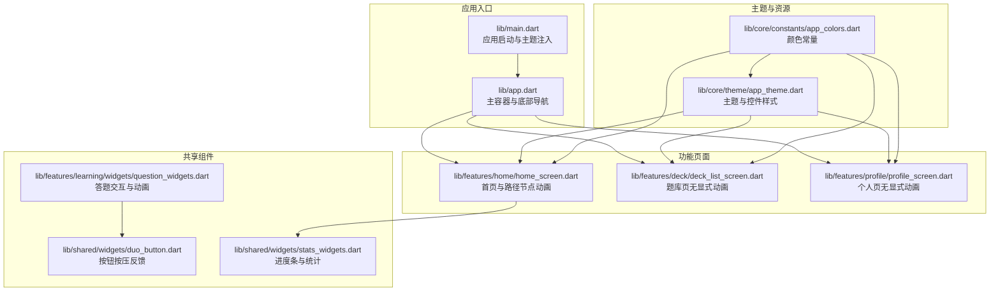
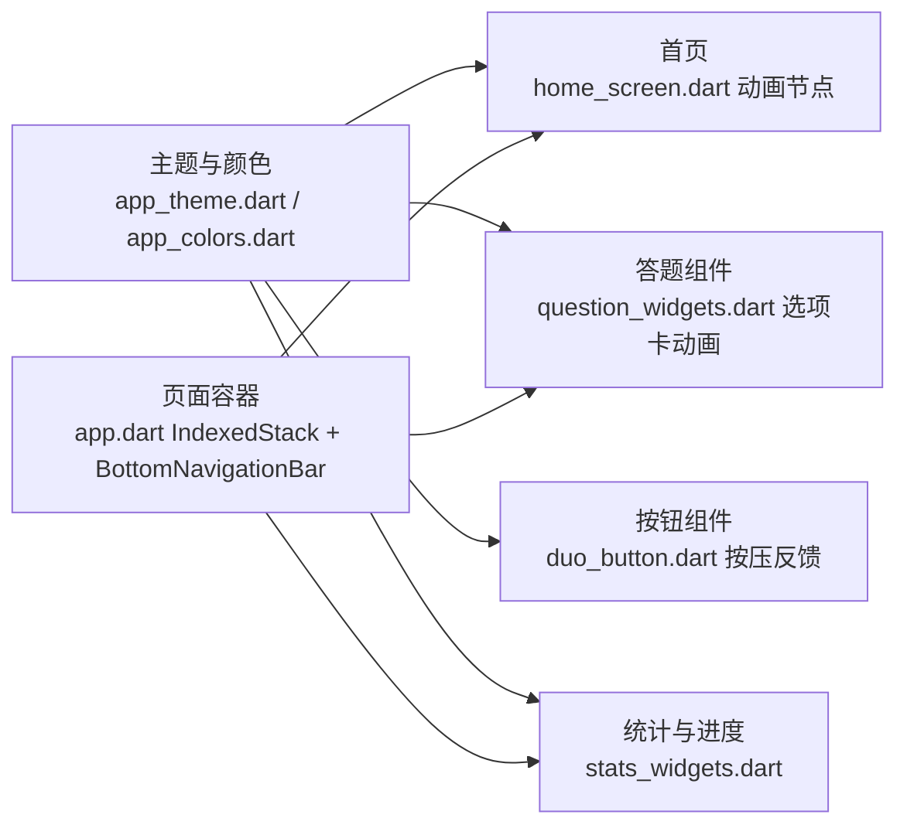
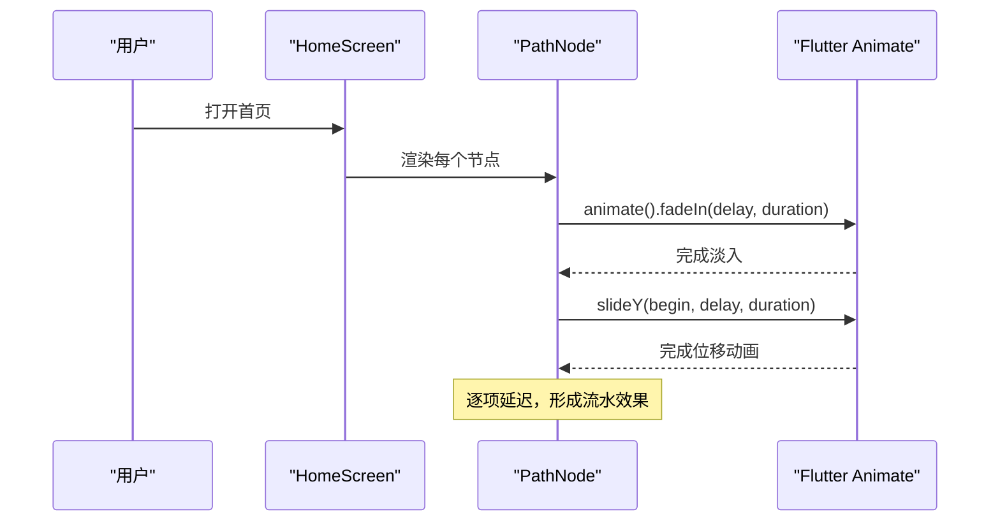
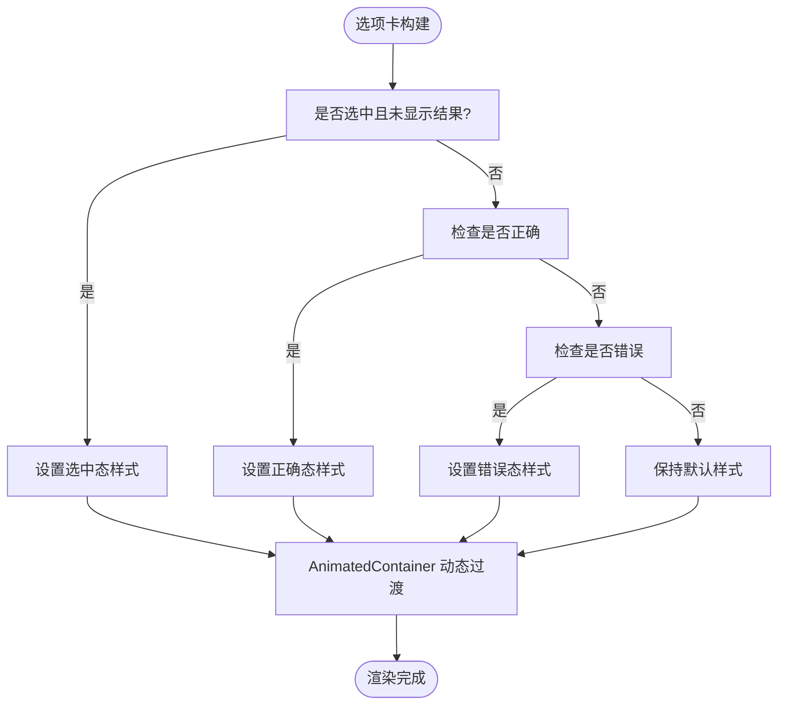
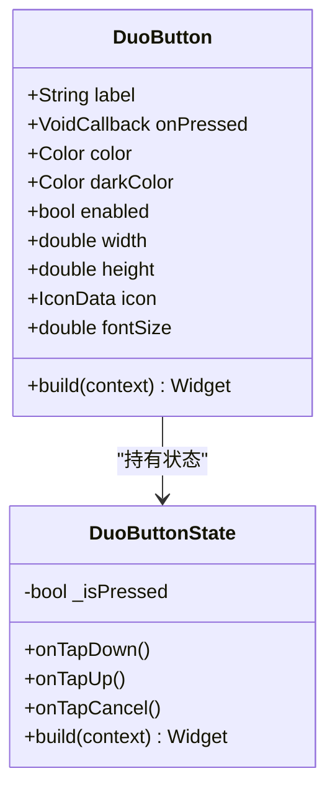
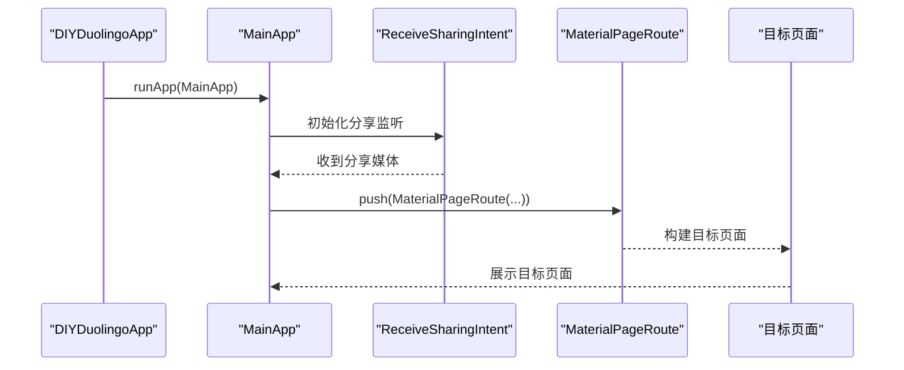
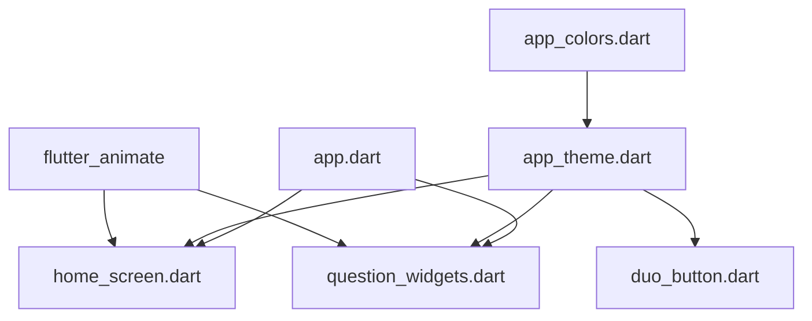

# 动画系统

<cite>
**本文引用的文件**   
- [lib/main.dart](file://lib/main.dart)
- [lib/app.dart](file://lib/app.dart)
- [lib/core/theme/app_theme.dart](file://lib/core/theme/app_theme.dart)
- [lib/core/constants/app_colors.dart](file://lib/core/constants/app_colors.dart)
- [lib/features/home/home_screen.dart](file://lib/features/home/home_screen.dart)
- [lib/features/deck/deck_list_screen.dart](file://lib/features/deck/deck_list_screen.dart)
- [lib/features/profile/profile_screen.dart](file://lib/features/profile/profile_screen.dart)
- [lib/features/learning/widgets/question_widgets.dart](file://lib/features/learning/widgets/question_widgets.dart)
- [lib/shared/widgets/duo_button.dart](file://lib/shared/widgets/duo_button.dart)
- [lib/shared/widgets/stats_widgets.dart](file://lib/shared/widgets/stats_widgets.dart)
- [pubspec.yaml](file://pubspec.yaml)
</cite>

## 目录
1. [简介](#简介)
2. [项目结构](#项目结构)
3. [核心组件](#核心组件)
4. [架构总览](#架构总览)
5. [详细组件分析](#详细组件分析)
6. [依赖关系分析](#依赖关系分析)
7. [性能考虑](#性能考虑)
8. [故障排查指南](#故障排查指南)
9. [结论](#结论)
10. [附录](#附录)

## 简介
本文件系统性梳理 Dlg-Q 动画系统的实现与设计，重点覆盖以下方面：
- 动画框架选择与配置：基于 Flutter Animate 的使用与自定义动画组合
- 页面过渡与屏幕滑动：路由切换、IndexedStack 切换与加载指示器
- 交互动画：按钮点击反馈、选项卡切换、手势响应与答题交互
- 性能优化：帧率控制、内存管理与电池优化策略
- 调试与曲线定制：动画调试工具、曲线参数与复杂序列编排

## 项目结构
Dlg-Q 采用模块化组织，动画相关逻辑主要分布在首页、题库页、个人页以及共享组件中；全局主题与颜色常量统一管理，确保视觉一致性。

图表来源
- [lib/main.dart:1-36](file://lib/main.dart#L1-L36)
- [lib/app.dart:10-111](file://lib/app.dart#L10-L111)
- [lib/core/theme/app_theme.dart:1-116](file://lib/core/theme/app_theme.dart#L1-L116)
- [lib/features/home/home_screen.dart:11-335](file://lib/features/home/home_screen.dart#L11-L335)
- [lib/features/deck/deck_list_screen.dart:10-314](file://lib/features/deck/deck_list_screen.dart#L10-L314)
- [lib/features/profile/profile_screen.dart:8-474](file://lib/features/profile/profile_screen.dart#L8-L474)
- [lib/features/learning/widgets/question_widgets.dart:1-656](file://lib/features/learning/widgets/question_widgets.dart#L1-L656)
- [lib/shared/widgets/duo_button.dart:1-103](file://lib/shared/widgets/duo_button.dart#L1-L103)
- [lib/shared/widgets/stats_widgets.dart:1-139](file://lib/shared/widgets/stats_widgets.dart#L1-L139)

章节来源
- [lib/main.dart:1-36](file://lib/main.dart#L1-L36)
- [lib/app.dart:10-111](file://lib/app.dart#L10-L111)
- [pubspec.yaml:1-34](file://pubspec.yaml#L1-L34)

## 核心组件
- 主应用与主题
  - 入口初始化与系统栏样式设置
  - 全局主题与控件样式（按钮、输入框、卡片、底栏）
- 页面容器与导航
  - 底部导航 + IndexedStack 实现页面切换
  - 分享意图处理触发新页面跳转
- 动画实现位置
  - 首页路径节点入场动画（淡入+位移）
  - 首页空态图标缩放动画
  - 答题选项卡容器的 AnimatedContainer 动画
  - 自定义按钮的按压反馈（位移动画）

章节来源
- [lib/main.dart:7-35](file://lib/main.dart#L7-L35)
- [lib/core/theme/app_theme.dart:9-114](file://lib/core/theme/app_theme.dart#L9-L114)
- [lib/app.dart:17-111](file://lib/app.dart#L17-L111)
- [lib/features/home/home_screen.dart:11-335](file://lib/features/home/home_screen.dart#L11-L335)
- [lib/features/learning/widgets/question_widgets.dart:1-656](file://lib/features/learning/widgets/question_widgets.dart#L1-L656)
- [lib/shared/widgets/duo_button.dart:1-103](file://lib/shared/widgets/duo_button.dart#L1-L103)

## 架构总览
Dlg-Q 的动画体系以“主题驱动 + 组件级动画”为主：
- 主题层：统一颜色与控件样式，保证动画色彩一致
- 页面层：IndexedStack 切换 + 轻量过渡
- 组件层：Flutter Animate 与 AnimatedContainer 实现局部动画
- 交互层：手势与状态变化驱动动画

图表来源
- [lib/core/theme/app_theme.dart:1-116](file://lib/core/theme/app_theme.dart#L1-L116)
- [lib/app.dart:17-111](file://lib/app.dart#L17-L111)
- [lib/features/home/home_screen.dart:11-335](file://lib/features/home/home_screen.dart#L11-L335)
- [lib/features/learning/widgets/question_widgets.dart:1-656](file://lib/features/learning/widgets/question_widgets.dart#L1-L656)
- [lib/shared/widgets/duo_button.dart:1-103](file://lib/shared/widgets/duo_button.dart#L1-L103)
- [lib/shared/widgets/stats_widgets.dart:1-139](file://lib/shared/widgets/stats_widgets.dart#L1-L139)

## 详细组件分析

### 首页路径节点动画（Flutter Animate）
- 动画策略
  - 使用链式动画：淡入 + 垂直位移，逐项延迟
  - 节点交错偏移形成蜿蜒路径
- 关键实现位置
  - 路径节点构建与动画链
  - 空态图标缩放动画
- 动画序列图

图表来源
- [lib/features/home/home_screen.dart:96-148](file://lib/features/home/home_screen.dart#L96-L148)

章节来源
- [lib/features/home/home_screen.dart:96-148](file://lib/features/home/home_screen.dart#L96-L148)

### 答题选项卡动画（AnimatedContainer）
- 动画策略
  - 选项选中/正确/错误状态下的背景色、边框色与图标色即时过渡
  - 使用 AnimatedContainer 在毫秒级时间内完成状态切换
- 关键实现位置
  - 多选、判断、填空等题型的选项卡容器
- 流程图

图表来源
- [lib/features/learning/widgets/question_widgets.dart:37-129](file://lib/features/learning/widgets/question_widgets.dart#L37-L129)
- [lib/features/learning/widgets/question_widgets.dart:280-345](file://lib/features/learning/widgets/question_widgets.dart#L280-L345)
- [lib/features/learning/widgets/question_widgets.dart:158-248](file://lib/features/learning/widgets/question_widgets.dart#L158-L248)

章节来源
- [lib/features/learning/widgets/question_widgets.dart:37-129](file://lib/features/learning/widgets/question_widgets.dart#L37-L129)
- [lib/features/learning/widgets/question_widgets.dart:280-345](file://lib/features/learning/widgets/question_widgets.dart#L280-L345)
- [lib/features/learning/widgets/question_widgets.dart:158-248](file://lib/features/learning/widgets/question_widgets.dart#L158-L248)

### 自定义按钮按压反馈（DuoButton）
- 动画策略
  - 使用 AnimatedContainer + Matrix4 平移模拟按压下沉
  - 点击按下/抬起/取消分别控制状态
- 关键实现位置
  - 按钮状态机与样式映射
- 类图

图表来源
- [lib/shared/widgets/duo_button.dart:5-103](file://lib/shared/widgets/duo_button.dart#L5-L103)

章节来源
- [lib/shared/widgets/duo_button.dart:33-92](file://lib/shared/widgets/duo_button.dart#L33-L92)

### 页面切换与加载动画
- 页面切换
  - 使用 IndexedStack + BottomNavigationBar 实现底部导航页切换
  - 切换时仅重绘当前页，其他页保留在堆栈中
- 加载动画
  - 首页与题库页在数据加载时展示圆形进度指示器
- 序列图（分享意图触发页面跳转）

图表来源
- [lib/main.dart:16-35](file://lib/main.dart#L16-L35)
- [lib/app.dart:33-72](file://lib/app.dart#L33-L72)

章节来源
- [lib/app.dart:17-111](file://lib/app.dart#L17-L111)
- [lib/app.dart:33-72](file://lib/app.dart#L33-L72)

### 统计与进度条（TopStatsBar 与 QuizProgressBar）
- 统计芯片与进度条均使用基础容器与 FractionallySizedBox 实现进度填充
- 适合配合动画进行渐变过渡（例如在数据更新时使用 AnimatedBuilder 或 AnimatedContainer）

章节来源
- [lib/shared/widgets/stats_widgets.dart:6-138](file://lib/shared/widgets/stats_widgets.dart#L6-L138)

## 依赖关系分析
- 动画库
  - flutter_animate：用于首页节点的链式动画
- 主题与颜色
  - app_theme.dart 与 app_colors.dart 提供统一配色与控件样式
- 路由与导航
  - app.dart 使用 IndexedStack + BottomNavigationBar 实现页面切换
- 交互组件
  - duo_button.dart 与 question_widgets.dart 提供按压反馈与选项卡动画

图表来源
- [pubspec.yaml:18-18](file://pubspec.yaml#L18-L18)
- [lib/core/theme/app_theme.dart:1-116](file://lib/core/theme/app_theme.dart#L1-L116)
- [lib/core/constants/app_colors.dart](file://lib/core/constants/app_colors.dart)
- [lib/app.dart:17-111](file://lib/app.dart#L17-L111)
- [lib/features/home/home_screen.dart:11-335](file://lib/features/home/home_screen.dart#L11-L335)
- [lib/features/learning/widgets/question_widgets.dart:1-656](file://lib/features/learning/widgets/question_widgets.dart#L1-L656)
- [lib/shared/widgets/duo_button.dart:1-103](file://lib/shared/widgets/duo_button.dart#L1-L103)

章节来源
- [pubspec.yaml:18-18](file://pubspec.yaml#L18-L18)
- [lib/core/theme/app_theme.dart:9-114](file://lib/core/theme/app_theme.dart#L9-L114)

## 性能考虑
- 帧率控制
  - 首页节点动画使用短时长与合理延迟，避免同时大量动画并发
  - 答题选项卡使用 AnimatedContainer，避免不必要的重建
- 内存管理
  - IndexedStack 保留非活动页面，注意避免在非活动页中进行高负载动画
  - 控制动画持续时间与缓动函数，减少过度绘制
- 电池优化
  - 避免在滚动视图中执行昂贵的动画
  - 对高频交互（如按钮按压）使用轻量动画，降低 GPU/CPU 占用
- 资源与主题
  - 统一颜色与字体主题，减少重复计算与样式解析

## 故障排查指南
- 动画不生效
  - 检查是否正确引入动画扩展与时间单位（如毫秒）
  - 确认动画链顺序与延迟是否合理
- 交互无反馈
  - 检查按钮的 enabled 状态与 onPressed 是否为空
  - 确认 AnimatedContainer 的 duration 是否过短导致不可见
- 页面切换异常
  - 确认 IndexedStack 的 index 与 BottomNavigationBar 的 onTap 同步
  - 检查路由 push 的页面是否正确传参
- 调试工具
  - 使用 Flutter DevTools 的 Timeline 与 Performance 面板观察帧率与布局耗时
  - 在动画前后对比绘制区域，定位过度绘制问题

## 结论
Dlg-Q 的动画体系以“主题一致 + 组件级动画”为核心，结合 Flutter Animate 与 AnimatedContainer，在首页路径节点、答题选项卡与按钮按压等场景实现了流畅自然的交互体验。通过合理的延迟与缓动策略、统一的主题与颜色体系，以及对性能的关注，整体动画表现稳定且具备良好的可维护性。

## 附录
- 动画曲线定制建议
  - 使用 Curves 类或自定义 Cubic 曲线，匹配品牌调性
  - 对进入/退出动画采用不同曲线，增强层次感
- 复杂动画序列编排
  - 使用 AnimationController 与 TweenSequence 编排多阶段动画
  - 将独立动画模块化，便于复用与测试
- 最佳实践清单
  - 优先使用 AnimatedContainer/AnimatedBuilder 精准控制动画范围
  - 避免在动画期间进行大规模布局计算
  - 对高频交互采用轻量动画，降低功耗