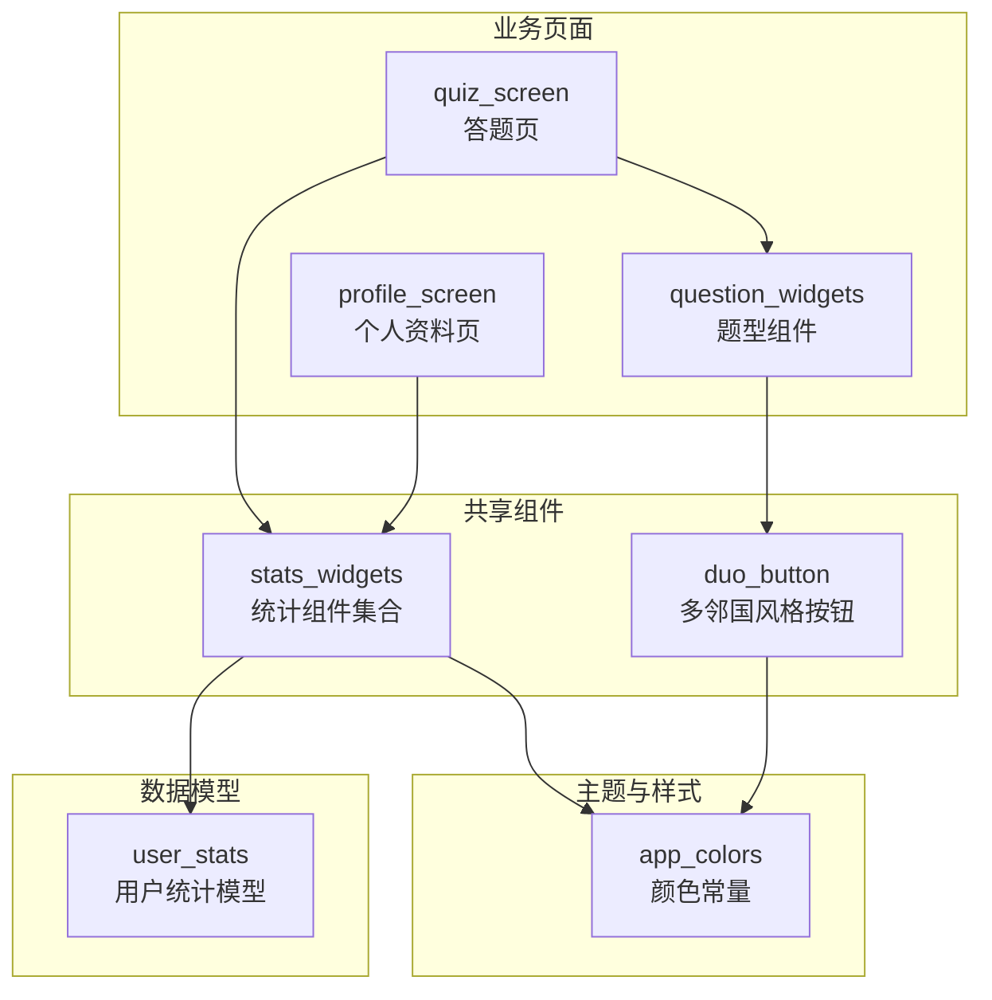
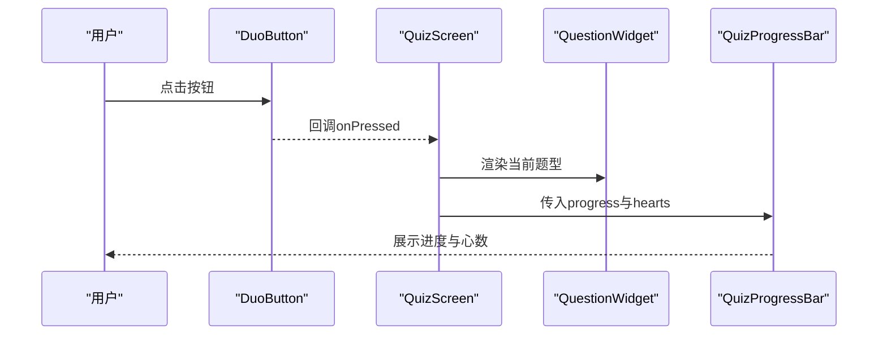
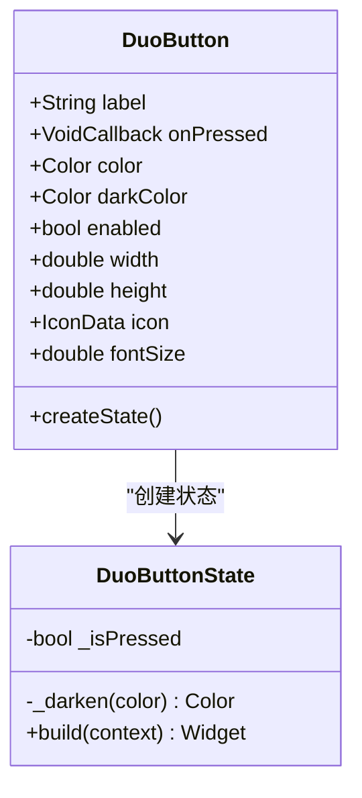
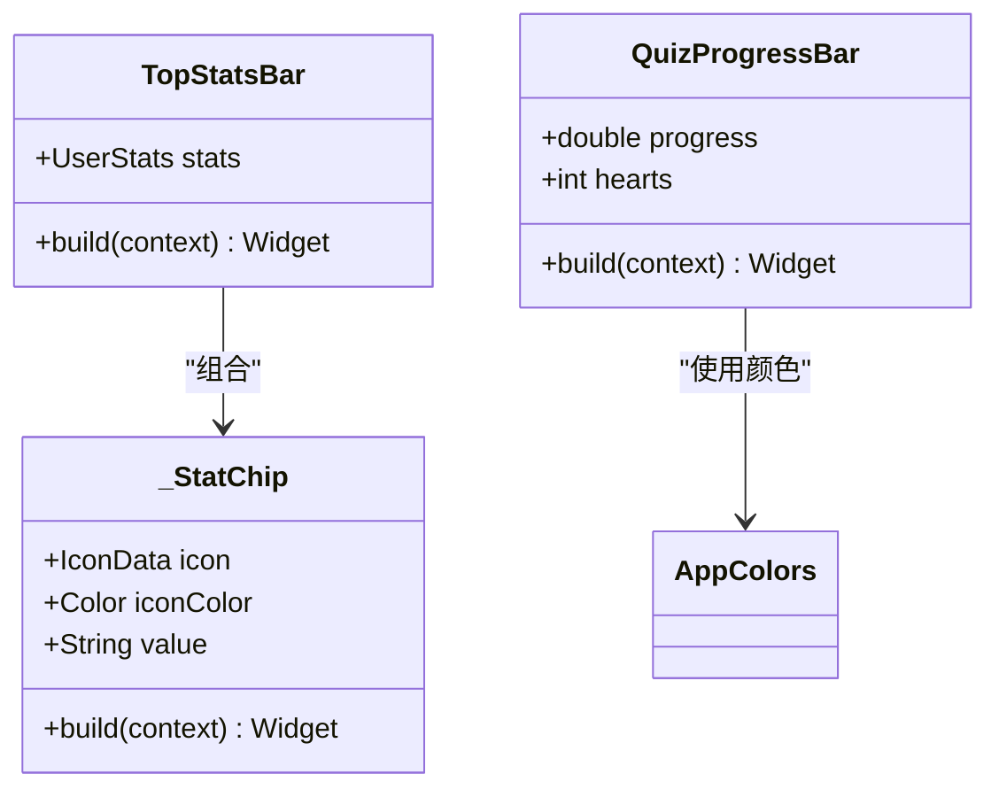
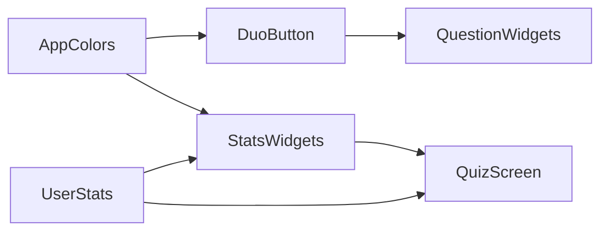

# 基础UI组件

<cite>
**本文引用的文件**
- [lib/shared/widgets/duo_button.dart](file://lib/shared/widgets/duo_button.dart)
- [lib/shared/widgets/stats_widgets.dart](file://lib/shared/widgets/stats_widgets.dart)
- [lib/core/constants/app_colors.dart](file://lib/core/constants/app_colors.dart)
- [lib/data/models/user_stats.dart](file://lib/data/models/user_stats.dart)
- [lib/features/profile/profile_screen.dart](file://lib/features/profile/profile_screen.dart)
- [lib/features/learning/quiz_screen.dart](file://lib/features/learning/quiz_screen.dart)
- [lib/features/learning/widgets/question_widgets.dart](file://lib/features/learning/widgets/question_widgets.dart)
</cite>

## 目录
1. [简介](#简介)
2. [项目结构](#项目结构)
3. [核心组件](#核心组件)
4. [架构概览](#架构概览)
5. [详细组件分析](#详细组件分析)
6. [依赖关系分析](#依赖关系分析)
7. [性能考虑](#性能考虑)
8. [故障排除指南](#故障排除指南)
9. [结论](#结论)
10. [附录](#附录)

## 简介
本文件聚焦Dlg-Q项目中的基础UI组件，重点解析以下两个组件：
- duo_button：多邻国风格的3D凸起按钮，强调触控反馈与视觉层次。
- stats_widgets：统计数据展示组件集合，包括顶部状态栏、答题进度条等。

文档将从设计理念、实现细节、属性配置、事件处理、样式定制、生命周期管理、性能优化到常见问题解决进行系统化说明，并提供可复用的使用示例与最佳实践。

## 项目结构
基础UI组件位于共享层，供多个功能模块复用；颜色系统集中定义，便于统一风格；统计数据模型在数据层提供结构化数据支撑。

**图示来源**
- [lib/shared/widgets/duo_button.dart:1-103](file://lib/shared/widgets/duo_button.dart#L1-L103)
- [lib/shared/widgets/stats_widgets.dart:1-139](file://lib/shared/widgets/stats_widgets.dart#L1-L139)
- [lib/core/constants/app_colors.dart:1-43](file://lib/core/constants/app_colors.dart#L1-L43)
- [lib/data/models/user_stats.dart:1-83](file://lib/data/models/user_stats.dart#L1-L83)
- [lib/features/profile/profile_screen.dart:108-210](file://lib/features/profile/profile_screen.dart#L108-L210)
- [lib/features/learning/quiz_screen.dart:1-200](file://lib/features/learning/quiz_screen.dart#L1-L200)
- [lib/features/learning/widgets/question_widgets.dart:1-656](file://lib/features/learning/widgets/question_widgets.dart#L1-L656)

**章节来源**
- [lib/shared/widgets/duo_button.dart:1-103](file://lib/shared/widgets/duo_button.dart#L1-L103)
- [lib/shared/widgets/stats_widgets.dart:1-139](file://lib/shared/widgets/stats_widgets.dart#L1-L139)
- [lib/core/constants/app_colors.dart:1-43](file://lib/core/constants/app_colors.dart#L1-L43)
- [lib/data/models/user_stats.dart:1-83](file://lib/data/models/user_stats.dart#L1-L83)
- [lib/features/profile/profile_screen.dart:108-210](file://lib/features/profile/profile_screen.dart#L108-L210)
- [lib/features/learning/quiz_screen.dart:1-200](file://lib/features/learning/quiz_screen.dart#L1-L200)
- [lib/features/learning/widgets/question_widgets.dart:1-656](file://lib/features/learning/widgets/question_widgets.dart#L1-L656)

## 核心组件
- duo_button：提供可配置的颜色、尺寸、图标与禁用态，通过手势识别与AnimatedContainer实现按压反馈与阴影变化，适合作为主操作入口或导航按钮。
- stats_widgets：包含TopStatsBar（顶部状态栏）、QuizProgressBar（答题进度条）等，用于展示用户XP、连续天数、心数等关键指标，配合用户统计模型实现动态更新。

**章节来源**
- [lib/shared/widgets/duo_button.dart:5-31](file://lib/shared/widgets/duo_button.dart#L5-L31)
- [lib/shared/widgets/stats_widgets.dart:6-42](file://lib/shared/widgets/stats_widgets.dart#L6-L42)
- [lib/shared/widgets/stats_widgets.dart:76-138](file://lib/shared/widgets/stats_widgets.dart#L76-L138)

## 架构概览
组件间协作关系如下：
- duo_button作为通用交互元素，在答题页的题型组件中被广泛使用，以一致的视觉与交互体验提升学习过程的沉浸感。
- stats_widgets在答题页与个人资料页分别承担“实时进度”和“长期统计”的职责，二者共同构成用户的学习状态可视化体系。
- app_colors提供统一色彩语义，确保不同组件在视觉上保持一致性。
- user_stats为统计组件提供数据源，驱动UI的动态更新。

**图示来源**
- [lib/shared/widgets/duo_button.dart:44-91](file://lib/shared/widgets/duo_button.dart#L44-L91)
- [lib/features/learning/quiz_screen.dart:126-138](file://lib/features/learning/quiz_screen.dart#L126-L138)
- [lib/features/learning/widgets/question_widgets.dart:599-655](file://lib/features/learning/widgets/question_widgets.dart#L599-L655)
- [lib/shared/widgets/stats_widgets.dart:76-138](file://lib/shared/widgets/stats_widgets.dart#L76-L138)

## 详细组件分析

### duo_button 组件
- 设计理念
  - 模仿多邻国的3D凸起风格，强调触控反馈与层级感，通过阴影与位移模拟“按下”效果，提升交互真实感。
  - 支持禁用态、图标、字体大小等灵活配置，满足不同场景下的按钮需求。
- 实现要点
  - 使用GestureDetector捕获触摸事件，结合AnimatedContainer实现平滑过渡。
  - 内部维护_pressed状态，根据状态切换背景色与边框宽度，同时通过Matrix4平移产生下沉效果。
  - 提供暗色派生逻辑，若未显式指定darkColor，则自动对主色进行亮度降低生成。
- 属性配置
  - label：按钮文本
  - onPressed：点击回调
  - color：主色，默认来自AppColors.green
  - darkColor：暗色（可选），未提供时自动计算
  - enabled：启用/禁用
  - width/height：宽高
  - icon：左侧图标
  - fontSize：文字字号
- 事件处理
  - onTapDown：进入按压态
  - onTapUp：释放时触发回调并恢复状态
  - onTapCancel：取消按压时恢复状态
- 样式定制
  - 通过AppColors统一着色，支持自定义颜色与暗色派生
  - 文字采用高权重与合理字距，保证可读性
- 生命周期与状态管理
  - StatefulWidget内部状态仅用于视觉反馈，避免跨组件共享状态
  - 状态更新集中在_build中，减少不必要的重建
- 性能优化建议
  - 合理设置动画时长，避免过度动画影响流畅度
  - 在高频交互场景下，尽量减少父级重建范围
- 最佳实践
  - 优先使用图标+文字的组合，增强识别度
  - 对重要操作按钮提供明确的视觉反馈与无障碍提示
- 常见问题
  - 点击无效：检查enabled与onPressed是否为空
  - 视觉不协调：确认颜色与AppColors一致，或显式传入darkColor

**图示来源**
- [lib/shared/widgets/duo_button.dart:5-31](file://lib/shared/widgets/duo_button.dart#L5-L31)
- [lib/shared/widgets/duo_button.dart:33-101](file://lib/shared/widgets/duo_button.dart#L33-L101)

**章节来源**
- [lib/shared/widgets/duo_button.dart:5-31](file://lib/shared/widgets/duo_button.dart#L5-L31)
- [lib/shared/widgets/duo_button.dart:33-101](file://lib/shared/widgets/duo_button.dart#L33-L101)
- [lib/core/constants/app_colors.dart:8-10](file://lib/core/constants/app_colors.dart#L8-L10)

### stats_widgets 组件
- TopStatsBar（顶部状态栏）
  - 功能：展示连续天数、XP、心数三项关键指标，右对齐布局，适合顶部导航区域。
  - 实现：由_statChip组成，每个_statChip包含图标、颜色与数值文本。
  - 数据来源：UserStats模型，包含streak、xp、hearts、maxHearts等字段。
- QuizProgressBar（答题进度条）
  - 功能：显示当前题目进度与剩余心数，右侧提供关闭按钮。
  - 实现：左侧IconButton用于返回，中间FractionallySizedBox作为进度条，右侧显示心数。
  - 数据来源：QuizScreen通过Riverpod订阅userStatsProvider，计算进度与心数。
- _StatChip（内部小部件）
  - 功能：封装图标+数值的紧凑展示单元，支持自定义iconColor与value。
  - 实现：Row容器内水平排列Icon与Text，间距与字号固定。
- _StatCard（个人资料页统计卡）
  - 功能：在个人资料页展示连续天数、总XP、心数的卡片式统计。
  - 实现：三列布局，每列居中展示图标、数值与标签，圆角边框与浅色背景突出卡片形态。
- 使用示例与组合模式
  - 在答题页顶部使用TopStatsBar展示全局状态，在答题过程中使用QuizProgressBar展示当前进度与心数。
  - 在个人资料页使用_statCard组合展示长期统计，配合每日目标进度条形成完整的学习状态视图。
- 响应式设计与无障碍
  - 响应式：使用Expanded与Flexible控制布局弹性；在移动端适配不同屏幕宽度。
  - 无障碍：为按钮与图标提供语义化描述，确保颜色对比度符合可读性要求。
- 生命周期与数据流
  - 统计数据通过Riverpod Provider提供，组件以ConsumerWidget或StatelessWidget消费，避免手动订阅。
  - 当数据加载中或出错时，组件提供占位与降级展示，保证用户体验连贯性。
- 性能优化
  - 使用const构造器与不可变小部件减少重建开销。
  - 进度条使用FractionallySizedBox按比例裁剪，避免复杂绘制。
- 常见问题
  - 数值溢出：确保progress在0.0~1.0范围内，使用clamp进行约束。
  - 心数异常：校验hearts与maxHearts的边界，防止除零或越界。

**图示来源**
- [lib/shared/widgets/stats_widgets.dart:6-42](file://lib/shared/widgets/stats_widgets.dart#L6-L42)
- [lib/shared/widgets/stats_widgets.dart:44-73](file://lib/shared/widgets/stats_widgets.dart#L44-L73)
- [lib/shared/widgets/stats_widgets.dart:76-138](file://lib/shared/widgets/stats_widgets.dart#L76-L138)
- [lib/core/constants/app_colors.dart:1-43](file://lib/core/constants/app_colors.dart#L1-L43)

**章节来源**
- [lib/shared/widgets/stats_widgets.dart:6-42](file://lib/shared/widgets/stats_widgets.dart#L6-L42)
- [lib/shared/widgets/stats_widgets.dart:44-73](file://lib/shared/widgets/stats_widgets.dart#L44-L73)
- [lib/shared/widgets/stats_widgets.dart:76-138](file://lib/shared/widgets/stats_widgets.dart#L76-L138)
- [lib/data/models/user_stats.dart:1-83](file://lib/data/models/user_stats.dart#L1-L83)
- [lib/features/profile/profile_screen.dart:108-210](file://lib/features/profile/profile_screen.dart#L108-L210)

## 依赖关系分析
- duo_button依赖AppColors提供统一颜色，内部通过_darken派生暗色，保证视觉层次。
- stats_widgets依赖AppColors与UserStats，TopStatsBar与QuizProgressBar分别在不同页面承担不同职责。
- quiz_screen通过Riverpod订阅userStatsProvider，向QuizProgressBar传递progress与hearts，实现数据驱动的UI更新。
- question_widgets在答题流程中与duo_button协同，提供一致的交互体验。

**图示来源**
- [lib/core/constants/app_colors.dart:1-43](file://lib/core/constants/app_colors.dart#L1-L43)
- [lib/shared/widgets/duo_button.dart:1-103](file://lib/shared/widgets/duo_button.dart#L1-L103)
- [lib/shared/widgets/stats_widgets.dart:1-139](file://lib/shared/widgets/stats_widgets.dart#L1-L139)
- [lib/data/models/user_stats.dart:1-83](file://lib/data/models/user_stats.dart#L1-L83)
- [lib/features/learning/quiz_screen.dart:1-200](file://lib/features/learning/quiz_screen.dart#L1-L200)
- [lib/features/learning/widgets/question_widgets.dart:1-656](file://lib/features/learning/widgets/question_widgets.dart#L1-L656)

**章节来源**
- [lib/core/constants/app_colors.dart:1-43](file://lib/core/constants/app_colors.dart#L1-L43)
- [lib/shared/widgets/duo_button.dart:1-103](file://lib/shared/widgets/duo_button.dart#L1-L103)
- [lib/shared/widgets/stats_widgets.dart:1-139](file://lib/shared/widgets/stats_widgets.dart#L1-L139)
- [lib/data/models/user_stats.dart:1-83](file://lib/data/models/user_stats.dart#L1-L83)
- [lib/features/learning/quiz_screen.dart:1-200](file://lib/features/learning/quiz_screen.dart#L1-L200)
- [lib/features/learning/widgets/question_widgets.dart:1-656](file://lib/features/learning/widgets/question_widgets.dart#L1-L656)

## 性能考虑
- 动画与过渡
  - duo_button的AnimatedContainer时长较短，避免拖慢交互响应；建议在更复杂的场景中适度延长动画时长。
- 重建与渲染
  - stats_widgets大量使用const与不可变小部件，减少不必要的重建；在列表或网格中优先使用GridView或Row/Column的弹性布局。
- 数据流
  - Riverpod提供细粒度的状态订阅，避免全局刷新；在个人资料页与答题页分别订阅所需数据，降低耦合。
- 图标与颜色
  - 统一使用AppColors，减少重复颜色计算；在深色/浅色主题切换时，确保颜色对比度满足可读性要求。

## 故障排除指南
- 按钮无响应
  - 检查enabled与onPressed是否为null；确认父级未拦截手势。
- 进度条异常
  - 确保progress在0.0~1.0范围内，必要时使用clamp；检查hearts边界。
- 颜色不一致
  - 统一使用AppColors提供的颜色；如需自定义，确保暗色派生逻辑正确。
- 布局错位
  - 在不同屏幕宽度下使用Expanded/Flexible；避免硬编码尺寸导致的溢出。

## 结论
duo_button与stats_widgets构成了Dlg-Q项目的基础UI骨架：前者提供一致的交互反馈，后者负责学习状态的可视化呈现。通过统一的颜色系统与数据模型，二者在答题页与个人资料页实现了高内聚、低耦合的协作关系。遵循本文的最佳实践与性能建议，可在保证用户体验的同时提升开发效率与可维护性。

## 附录
- 使用示例路径
  - 按钮：[lib/shared/widgets/duo_button.dart:5-31](file://lib/shared/widgets/duo_button.dart#L5-L31)
  - 顶部状态栏：[lib/shared/widgets/stats_widgets.dart:6-42](file://lib/shared/widgets/stats_widgets.dart#L6-L42)
  - 答题进度条：[lib/shared/widgets/stats_widgets.dart:76-138](file://lib/shared/widgets/stats_widgets.dart#L76-L138)
  - 个人资料页统计卡：[lib/features/profile/profile_screen.dart:108-133](file://lib/features/profile/profile_screen.dart#L108-L133)
  - 答题页集成：[lib/features/learning/quiz_screen.dart:126-138](file://lib/features/learning/quiz_screen.dart#L126-L138)
  - 题型组件与按钮协作：[lib/features/learning/widgets/question_widgets.dart:1-656](file://lib/features/learning/widgets/question_widgets.dart#L1-L656)