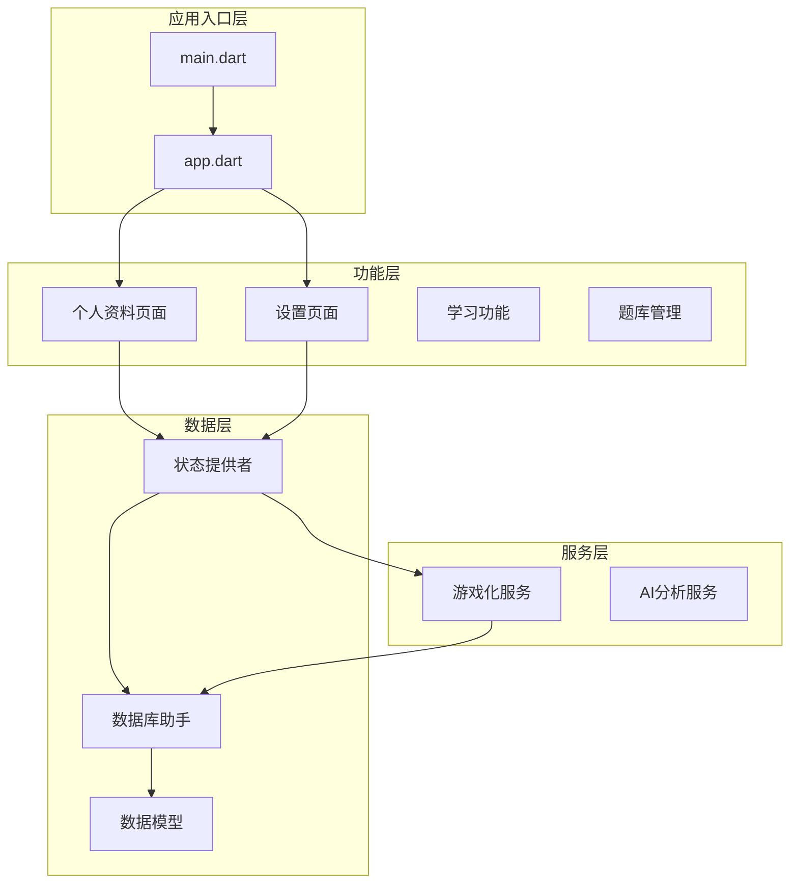
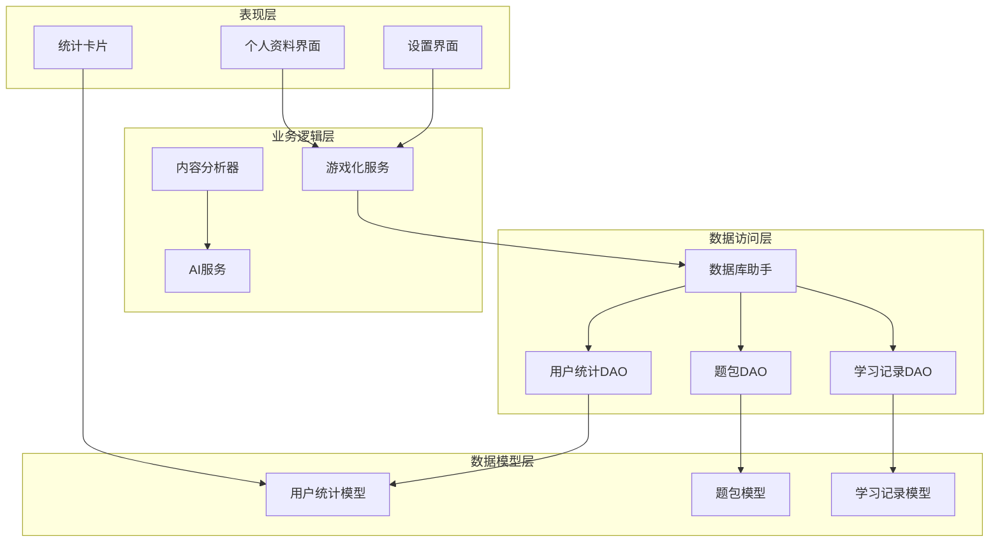
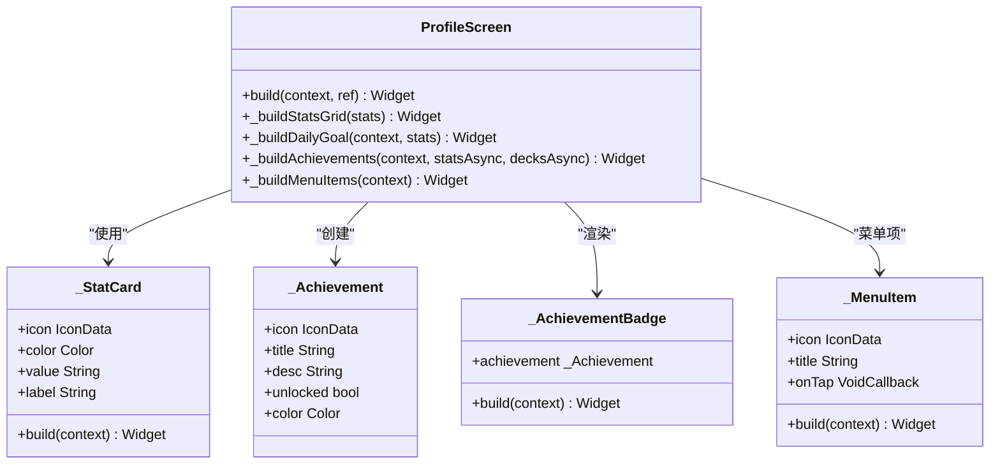
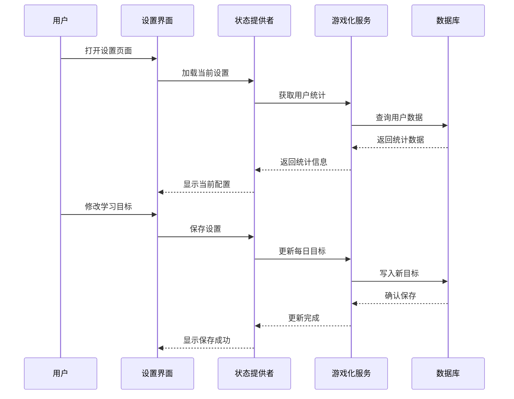
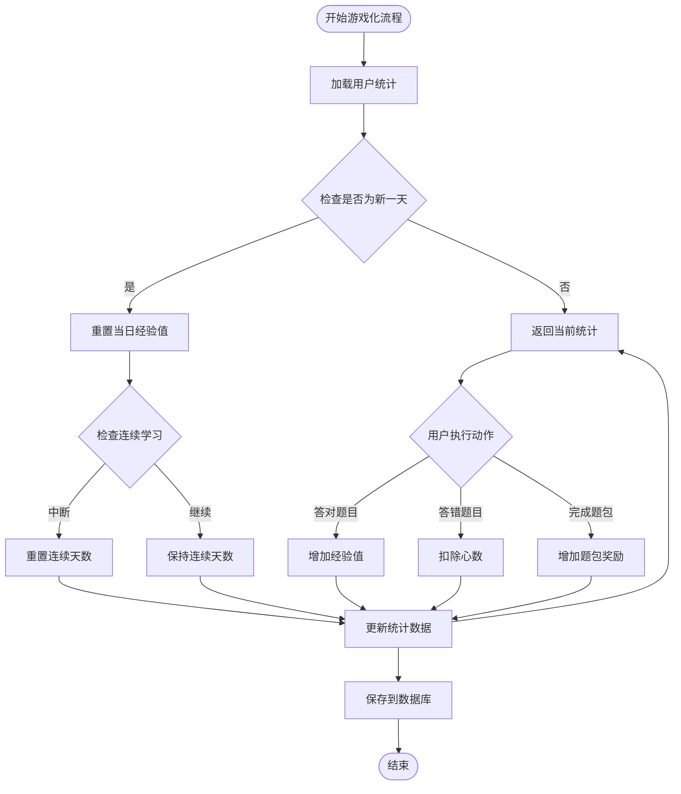
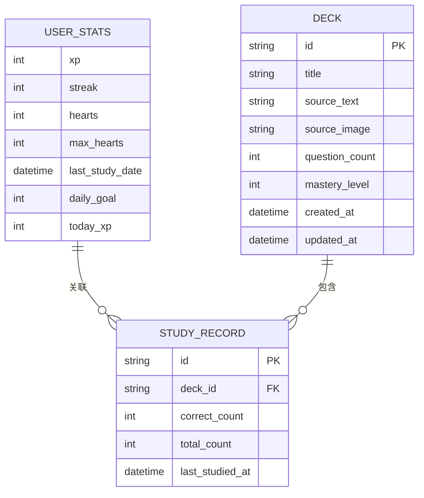
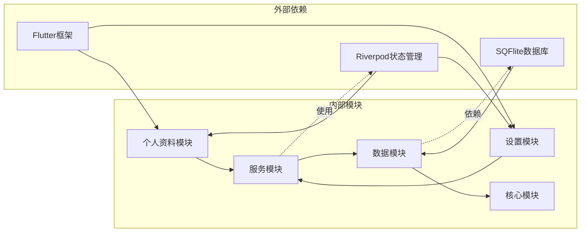

# 个人资料系统

<cite>
**本文档引用的文件**
- [lib/main.dart](file://lib/main.dart)
- [lib/app.dart](file://lib/app.dart)
- [lib/features/profile/profile_screen.dart](file://lib/features/profile/profile_screen.dart)
- [lib/features/settings/settings_screen.dart](file://lib/features/settings/settings_screen.dart)
- [lib/core/providers/providers.dart](file://lib/core/providers/providers.dart)
- [lib/data/database/database_helper.dart](file://lib/data/database/database_helper.dart)
- [lib/data/models/user_stats.dart](file://lib/data/models/user_stats.dart)
- [lib/data/models/deck.dart](file://lib/data/models/deck.dart)
- [lib/data/models/study_record.dart](file://lib/data/models/study_record.dart)
- [lib/services/gamification_service.dart](file://lib/services/gamification_service.dart)
- [lib/shared/widgets/stats_widgets.dart](file://lib/shared/widgets/stats_widgets.dart)
</cite>

## 目录
1. [简介](#简介)
2. [项目结构](#项目结构)
3. [核心组件](#核心组件)
4. [架构概览](#架构概览)
5. [详细组件分析](#详细组件分析)
6. [依赖关系分析](#依赖关系分析)
7. [性能考虑](#性能考虑)
8. [故障排除指南](#故障排除指南)
9. [结论](#结论)

## 简介

Dlg-Q的个人资料系统是一个基于Flutter和Riverpod构建的学习追踪与游戏化平台。该系统专注于为用户提供完整的个人学习档案管理，包括头像展示、昵称管理、基本信息维护、统计数据收集与展示、游戏化元素集成（经验值、等级、成就系统）以及个性化设置选项。

系统采用响应式设计模式，通过Riverpod提供状态管理，使用SQLite数据库进行本地数据持久化，实现了跨设备的数据一致性保证。用户可以通过个人资料界面直观地查看学习进度、完成情况和成就获得，同时通过设置界面自定义学习目标和偏好配置。

## 项目结构

个人资料系统在Dlg-Q项目中的组织结构体现了清晰的关注点分离和模块化设计：

**图表来源**
- [lib/main.dart:1-36](file://lib/main.dart#L1-L36)
- [lib/app.dart:10-111](file://lib/app.dart#L10-L111)

**章节来源**
- [lib/main.dart:1-36](file://lib/main.dart#L1-L36)
- [lib/app.dart:10-111](file://lib/app.dart#L10-L111)

## 核心组件

个人资料系统由多个相互协作的核心组件构成，每个组件都有明确的职责分工：

### 用户统计模型
UserStats模型是整个系统的数据核心，负责存储和管理用户的所有学习统计数据。该模型包含经验值(xp)、连续学习天数(streak)、心数(hearts)、最大心数(maxHearts)、最后学习日期(lastStudyDate)、每日目标(dailyGoal)和当日经验值(todayXp)等关键字段。

### 游戏化服务
GamificationService作为游戏化逻辑的核心处理器，实现了完整的经验值计算、连续打卡追踪、心数管理和成就判定等功能。该服务通过数据库交互实现数据持久化，并提供了丰富的API供其他组件调用。

### 状态管理提供者
通过Riverpod的StateNotifierProvider模式，系统实现了响应式的状态管理。UserStatsNotifier负责协调游戏化服务与UI组件之间的数据流，确保用户界面能够实时反映最新的学习状态。

### 数据持久化层
DatabaseHelper封装了所有数据库操作，包括表结构定义、数据查询、更新和删除等。系统使用SQLite作为本地存储引擎，确保数据的安全性和可靠性。

**章节来源**
- [lib/data/models/user_stats.dart:1-83](file://lib/data/models/user_stats.dart#L1-L83)
- [lib/services/gamification_service.dart:1-116](file://lib/services/gamification_service.dart#L1-L116)
- [lib/core/providers/providers.dart:42-81](file://lib/core/providers/providers.dart#L42-L81)
- [lib/data/database/database_helper.dart:8-192](file://lib/data/database/database_helper.dart#L8-L192)

## 架构概览

个人资料系统的整体架构采用了分层设计模式，确保了良好的可维护性和扩展性：

**图表来源**
- [lib/features/profile/profile_screen.dart:1-474](file://lib/features/profile/profile_screen.dart#L1-L474)
- [lib/features/settings/settings_screen.dart:1-356](file://lib/features/settings/settings_screen.dart#L1-L356)
- [lib/services/gamification_service.dart:1-116](file://lib/services/gamification_service.dart#L1-L116)

系统采用MVVM架构模式，其中：
- **Model层**：数据模型负责数据结构定义和序列化
- **View层**：UI组件负责用户交互和界面展示
- **ViewModel层**：通过Riverpod提供状态管理和业务逻辑协调

## 详细组件分析

### 个人资料界面组件

个人资料界面是用户学习档案的主要展示区域，包含了完整的个人信息展示和统计信息可视化：

**图表来源**
- [lib/features/profile/profile_screen.dart:8-474](file://lib/features/profile/profile_screen.dart#L8-L474)

个人资料界面的核心功能包括：

#### 头像和等级展示
界面顶部采用渐变背景设计，展示用户头像占位符和当前等级信息。等级计算基于经验值，每100经验值提升一级。

#### 统计数据网格
提供三个核心统计指标的可视化展示：
- 连续学习天数：显示用户的坚持学习记录
- 总经验值：累计获得的奖励点数
- 心数状态：学习过程中的生命值系统

#### 每日目标追踪
实现可视化的学习目标完成进度，包括进度条显示和完成状态提示。

#### 成就系统
通过成就徽章展示用户获得的各种成就，涵盖学习行为、技能掌握等多个维度。

**章节来源**
- [lib/features/profile/profile_screen.dart:1-474](file://lib/features/profile/profile_screen.dart#L1-L474)

### 设置界面组件

设置界面为用户提供了个性化的配置选项，涵盖了学习目标设定、AI服务配置和数据管理等功能：

**图表来源**
- [lib/features/settings/settings_screen.dart:14-57](file://lib/features/settings/settings_screen.dart#L14-L57)

设置界面的主要功能模块：

#### OpenAI配置管理
允许用户输入API密钥和选择使用的AI模型，支持多种OpenAI模型的选择和切换。

#### 学习目标设定
提供预设的每日XP目标选项，用户可以根据自己的学习节奏选择合适的挑战难度。

#### 数据管理功能
提供数据清除功能，允许用户重置所有学习数据，包括题包、题目和学习记录。

**章节来源**
- [lib/features/settings/settings_screen.dart:1-356](file://lib/features/settings/settings_screen.dart#L1-L356)

### 游戏化服务组件

游戏化服务是个人资料系统的核心逻辑处理单元，实现了完整的经验值管理和成就判定机制：

**图表来源**
- [lib/services/gamification_service.dart:14-85](file://lib/services/gamification_service.dart#L14-L85)

游戏化服务的关键特性：

#### 经验值计算机制
- 正确回答问题：每次+10 XP
- 完成题包：基础+50 XP，完美完成+100 XP
- 连续学习奖励：根据streak提供额外经验

#### 心数管理系统
实现类似"生命值"的游戏机制，答错题目会扣除心数，需要时间自然恢复或通过特定方式补充。

#### 成就判定逻辑
系统内置多种成就条件，包括学习行为、技能掌握和里程碑达成等，为用户提供持续的学习动力。

**章节来源**
- [lib/services/gamification_service.dart:1-116](file://lib/services/gamification_service.dart#L1-L116)

### 数据模型组件

个人资料系统使用强类型的数据模型确保数据的完整性和一致性：

**图表来源**
- [lib/data/models/user_stats.dart:1-83](file://lib/data/models/user_stats.dart#L1-L83)
- [lib/data/models/deck.dart:1-71](file://lib/data/models/deck.dart#L1-L71)
- [lib/data/models/study_record.dart:1-41](file://lib/data/models/study_record.dart#L1-L41)

数据模型的设计特点：

#### 序列化支持
所有模型都实现了toMap()和fromMap()方法，便于与数据库进行数据交换。

#### 默认值处理
通过合理的默认值设置，确保新用户也能获得良好的初始体验。

#### 关系映射
通过外键约束和级联操作，维护数据之间的引用完整性。

**章节来源**
- [lib/data/models/user_stats.dart:1-83](file://lib/data/models/user_stats.dart#L1-L83)
- [lib/data/models/deck.dart:1-71](file://lib/data/models/deck.dart#L1-L71)
- [lib/data/models/study_record.dart:1-41](file://lib/data/models/study_record.dart#L1-L41)

## 依赖关系分析

个人资料系统的依赖关系体现了清晰的层次化设计：

**图表来源**
- [lib/core/providers/providers.dart:1-178](file://lib/core/providers/providers.dart#L1-L178)

主要依赖关系特点：

#### 框架依赖
- Flutter：提供UI框架和平台集成能力
- Riverpod：提供响应式状态管理
- SQFlite：提供SQLite数据库支持

#### 模块内聚
各模块之间通过明确定义的接口进行通信，降低了耦合度。

#### 可测试性
清晰的依赖注入设计使得各个组件易于进行单元测试和集成测试。

**章节来源**
- [lib/core/providers/providers.dart:1-178](file://lib/core/providers/providers.dart#L1-L178)

## 性能考虑

个人资料系统在设计时充分考虑了性能优化和用户体验：

### 状态管理优化
- 使用Riverpod的FutureProvider和StateNotifierProvider实现高效的异步状态管理
- 通过惰性加载避免不必要的数据初始化
- 实现智能的缓存策略减少重复查询

### 数据库性能
- 采用SQLite本地存储确保快速的数据访问
- 合理的索引设计优化查询性能
- 批量操作减少数据库I/O次数

### UI渲染优化
- 使用SingleChildScrollView确保内容滚动性能
- 按需渲染复杂组件避免过度绘制
- 合理的布局嵌套减少布局计算开销

## 故障排除指南

### 常见问题及解决方案

#### 数据同步问题
**症状**：用户在不同设备上看到不一致的学习数据
**解决方案**：
1. 检查数据库连接状态
2. 验证网络连接（如涉及云端同步）
3. 重启应用重新初始化状态

#### 统计数据异常
**症状**：经验值或连续天数显示错误
**解决方案**：
1. 清除应用缓存后重启
2. 检查系统时间和时区设置
3. 重新登录账户

#### 成就系统失效
**症状**：成就无法正常解锁
**解决方案**：
1. 检查成就条件是否满足
2. 验证相关数据是否正确保存
3. 联系技术支持获取帮助

**章节来源**
- [lib/data/database/database_helper.dart:176-191](file://lib/data/database/database_helper.dart#L176-L191)

## 结论

Dlg-Q的个人资料系统通过精心设计的架构和完善的组件实现，为用户提供了全面的学习追踪和游戏化体验。系统不仅实现了基本的个人信息展示功能，更重要的是构建了一个完整的激励体系，通过经验值、等级和成就系统有效提升了用户的学习积极性和参与度。

系统的模块化设计确保了良好的可维护性和扩展性，为未来功能的添加和优化奠定了坚实的基础。通过SQLite本地存储和Riverpod状态管理的结合，系统在保证数据一致性的同时，也确保了优秀的性能表现。

对于用户而言，个人资料系统不仅是一个信息展示工具，更是学习旅程的见证者和推动者，通过可视化的统计数据和成就反馈，帮助用户更好地了解自己的学习进度和成果。