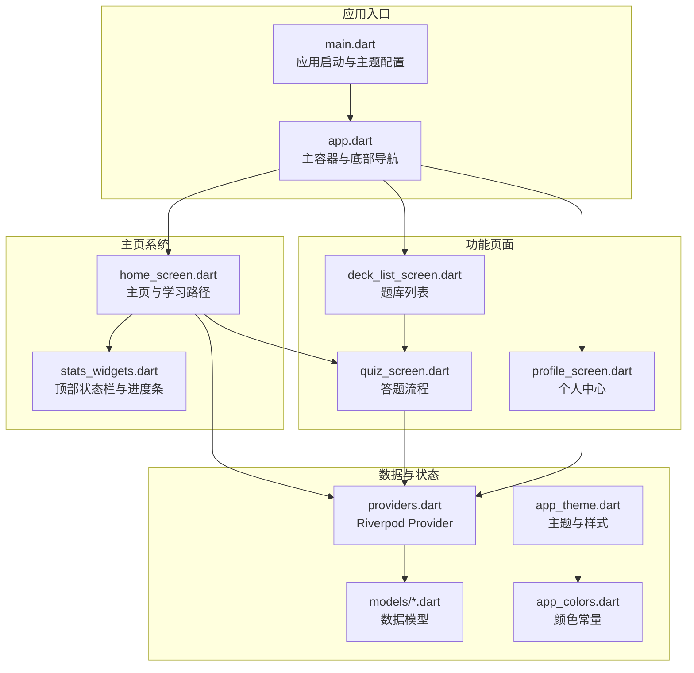
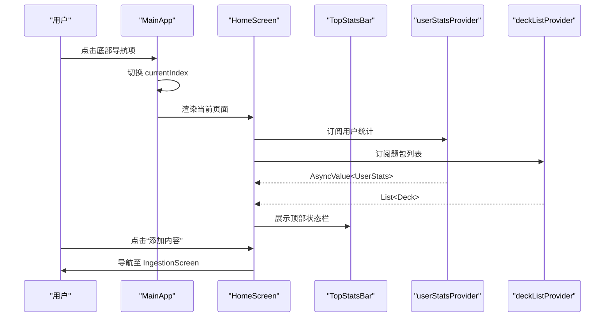
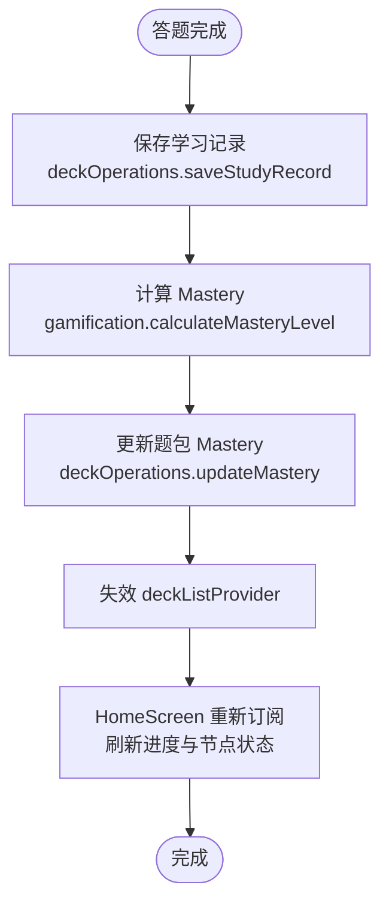
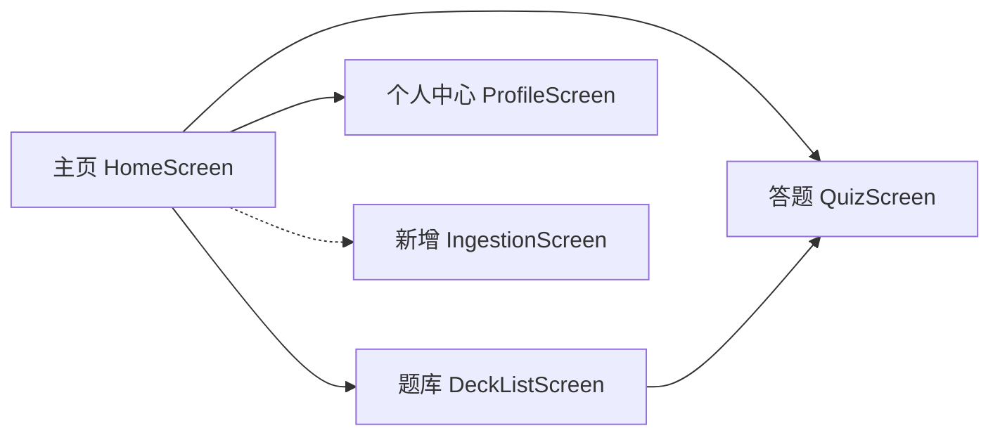
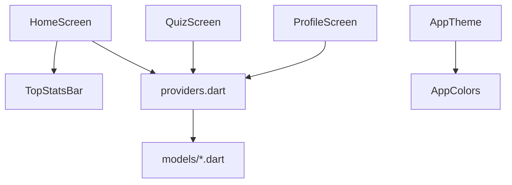

# 主页系统

<cite>
**本文档引用的文件**
- [lib/main.dart](file://lib/main.dart)
- [lib/app.dart](file://lib/app.dart)
- [lib/features/home/home_screen.dart](file://lib/features/home/home_screen.dart)
- [lib/features/deck/deck_list_screen.dart](file://lib/features/deck/deck_list_screen.dart)
- [lib/features/profile/profile_screen.dart](file://lib/features/profile/profile_screen.dart)
- [lib/features/learning/quiz_screen.dart](file://lib/features/learning/quiz_screen.dart)
- [lib/shared/widgets/stats_widgets.dart](file://lib/shared/widgets/stats_widgets.dart)
- [lib/core/theme/app_theme.dart](file://lib/core/theme/app_theme.dart)
- [lib/core/constants/app_colors.dart](file://lib/core/constants/app_colors.dart)
- [lib/core/providers/providers.dart](file://lib/core/providers/providers.dart)
- [lib/data/models/deck.dart](file://lib/data/models/deck.dart)
- [lib/data/models/user_stats.dart](file://lib/data/models/user_stats.dart)
</cite>

## 目录
1. [简介](#简介)
2. [项目结构](#项目结构)
3. [核心组件](#核心组件)
4. [架构总览](#架构总览)
5. [详细组件分析](#详细组件分析)
6. [依赖分析](#依赖分析)
7. [性能考虑](#性能考虑)
8. [故障排除指南](#故障排除指南)
9. [结论](#结论)
10. [附录](#附录)

## 简介
本文件为 Dlg-Q 的主页系统提供全面的功能文档，重点覆盖以下方面：
- 主页整体布局与导航结构：底部导航栏与三大功能入口（学习、题库、我的）的组织方式
- 信息展示机制：学习提醒、进度概览与快捷操作入口
- 动态内容更新机制：学习进度刷新、通知显示与个性化推荐
- 与其他功能模块的链接关系：用户如何从主页快速跳转到其他功能
- 使用指南：帮助用户高效管理学习任务与查看学习成果
- 响应式设计与适配策略：在不同屏幕尺寸下的体验保障

## 项目结构
Dlg-Q 采用基于功能模块的目录组织方式，主页系统位于 features/home 子目录中，配合 Riverpod 状态管理与共享组件，形成清晰的分层架构。

图表来源
- [lib/main.dart:1-36](file://lib/main.dart#L1-L36)
- [lib/app.dart:10-111](file://lib/app.dart#L10-L111)
- [lib/features/home/home_screen.dart:11-57](file://lib/features/home/home_screen.dart#L11-L57)
- [lib/shared/widgets/stats_widgets.dart:6-42](file://lib/shared/widgets/stats_widgets.dart#L6-L42)
- [lib/features/deck/deck_list_screen.dart:10-97](file://lib/features/deck/deck_list_screen.dart#L10-L97)
- [lib/features/profile/profile_screen.dart:8-106](file://lib/features/profile/profile_screen.dart#L8-L106)
- [lib/features/learning/quiz_screen.dart:12-119](file://lib/features/learning/quiz_screen.dart#L12-L119)
- [lib/core/providers/providers.dart:31-81](file://lib/core/providers/providers.dart#L31-L81)
- [lib/core/theme/app_theme.dart:9-114](file://lib/core/theme/app_theme.dart#L9-L114)
- [lib/core/constants/app_colors.dart:4-43](file://lib/core/constants/app_colors.dart#L4-L43)

章节来源
- [lib/main.dart:1-36](file://lib/main.dart#L1-L36)
- [lib/app.dart:10-111](file://lib/app.dart#L10-L111)

## 核心组件
- 应用入口与主题
  - 应用启动时设置状态栏样式，并通过 ProviderScope 包裹应用根组件，启用 Riverpod 状态管理。
  - 主题配置集中在 AppTheme.lightTheme，统一管理颜色、字体、控件样式与底部导航样式。
- 主容器与底部导航
  - MainApp 维护当前选中页索引，使用 IndexedStack 缓存页面，避免重复构建。
  - 底部导航包含“学习”、“题库”、“我的”三个入口，分别对应主页、题库列表与个人中心。
- 主页（HomeScreen）
  - 顶部状态栏显示连续天数、XP 与心数；内容区展示学习路径，按题包 Mastery 状态呈现不同视觉反馈。
  - 提供“添加内容”悬浮按钮，引导用户从外部分享或新增内容。
- 共享组件
  - TopStatsBar：顶部状态栏组件，复用连续天数、XP、心数展示。
  - QuizProgressBar：答题过程中的进度条与心数显示。
- Provider 体系
  - deckListProvider：题包列表数据源
  - userStatsProvider：用户统计（XP、连续天数、心数、每日目标等）
  - deckOperationsProvider：题包增删改查与学习记录持久化
  - gamificationServiceProvider：经验值与 Mastery 计算

章节来源
- [lib/main.dart:7-35](file://lib/main.dart#L7-L35)
- [lib/app.dart:17-111](file://lib/app.dart#L17-L111)
- [lib/features/home/home_screen.dart:15-57](file://lib/features/home/home_screen.dart#L15-L57)
- [lib/shared/widgets/stats_widgets.dart:6-42](file://lib/shared/widgets/stats_widgets.dart#L6-L42)
- [lib/core/theme/app_theme.dart:9-114](file://lib/core/theme/app_theme.dart#L9-L114)
- [lib/core/providers/providers.dart:31-81](file://lib/core/providers/providers.dart#L31-L81)

## 架构总览
主页系统围绕 Riverpod Provider 实现响应式数据流，通过消费者组件订阅数据变化，自动刷新 UI。底部导航作为路由容器，配合 IndexedStack 在页面间切换时保持状态。

图表来源
- [lib/app.dart:80-109](file://lib/app.dart#L80-L109)
- [lib/features/home/home_screen.dart:16-38](file://lib/features/home/home_screen.dart#L16-L38)
- [lib/shared/widgets/stats_widgets.dart:12-41](file://lib/shared/widgets/stats_widgets.dart#L12-L41)
- [lib/core/providers/providers.dart:37-40](file://lib/core/providers/providers.dart#L37-L40)

## 详细组件分析

### 主页布局与导航结构
- 布局层次
  - SafeArea 包裹，顶部为 TopStatsBar，中部为可滚动内容区域，底部为浮动“添加内容”按钮。
  - 学习路径采用蜿蜒节点布局，交错偏移营造路径感；节点根据 Mastery 状态与当前学习节点呈现不同颜色与图标。
- 导航组织
  - MainApp 使用 BottomNavigationBar 管理三个主入口，通过 IndexedStack 缓存页面，提升交互流畅度。
  - “学习”入口直接进入 HomeScreen；“题库”进入 DeckListScreen；“我的”进入 ProfileScreen。
- 快捷操作入口
  - 浮动按钮统一风格，引导用户新增内容；空白状态下提供“添加第一条内容”按钮，降低上手门槛。

章节来源
- [lib/features/home/home_screen.dart:19-57](file://lib/features/home/home_screen.dart#L19-L57)
- [lib/features/home/home_screen.dart:59-94](file://lib/features/home/home_screen.dart#L59-L94)
- [lib/features/home/home_screen.dart:96-148](file://lib/features/home/home_screen.dart#L96-L148)
- [lib/app.dart:87-107](file://lib/app.dart#L87-L107)

### 信息展示机制
- 顶部状态栏（TopStatsBar）
  - 展示连续天数、XP 与心数，采用紧凑的 Chip 形式，右侧对齐，便于快速浏览。
- 学习路径概览
  - 展示已完成/总数的题包数量，以及每个题包的 Mastery 进度条与标题。
  - 当题包 Mastery 达到阈值时，节点高亮并显示星标；当前未完成的第一个题包以绿色播放图标突出显示。
- 个人中心（ProfileScreen）
  - 展示头像与等级背景、统计卡片（连续天数、XP、心数）、每日目标进度与完成提示、成就徽章与菜单项。

章节来源
- [lib/shared/widgets/stats_widgets.dart:6-42](file://lib/shared/widgets/stats_widgets.dart#L6-L42)
- [lib/features/home/home_screen.dart:78-85](file://lib/features/home/home_screen.dart#L78-L85)
- [lib/features/home/home_screen.dart:219-334](file://lib/features/home/home_screen.dart#L219-L334)
- [lib/features/profile/profile_screen.dart:108-209](file://lib/features/profile/profile_screen.dart#L108-L209)

### 动态内容更新机制
- 数据订阅与刷新
  - HomeScreen 订阅 userStatsProvider 与 deckListProvider，当 Provider 数据变更时，消费者自动重建。
  - DeckOperations 提供 invalidate 触发器，用于在新增/删除题包后刷新列表。
- 学习进度刷新
  - 答题完成后，QuizScreen 调用 UserStatsNotifier.onDeckComplete 并持久化学习记录，随后刷新主页的 Mastery 进度。
- 通知与个性化
  - 顶部状态栏实时反映 XP、连续天数与心数；每日目标进度条随 todayXp 变化而更新。
  - 成就系统根据题包数量与 Mastery 状态解锁，增强学习激励。

图表来源
- [lib/features/learning/quiz_screen.dart:92-101](file://lib/features/learning/quiz_screen.dart#L92-L101)
- [lib/core/providers/providers.dart:160-177](file://lib/core/providers/providers.dart#L160-L177)
- [lib/core/providers/providers.dart:143-158](file://lib/core/providers/providers.dart#L143-L158)
- [lib/features/home/home_screen.dart:16-17](file://lib/features/home/home_screen.dart#L16-L17)

章节来源
- [lib/core/providers/providers.dart:31-40](file://lib/core/providers/providers.dart#L31-L40)
- [lib/core/providers/providers.dart:102-177](file://lib/core/providers/providers.dart#L102-L177)
- [lib/features/learning/quiz_screen.dart:92-101](file://lib/features/learning/quiz_screen.dart#L92-L101)

### 主页与各功能模块的链接关系
- 主页 → 题库
  - HomeScreen 的学习路径节点点击后进入 QuizScreen；DeckListScreen 提供更完整的题包列表与搜索、删除能力。
- 主页 → 个人中心
  - 通过底部导航进入 ProfileScreen，查看统计、每日目标、成就与设置。
- 主页 → 新增内容
  - 通过“添加内容”按钮进入 IngestionScreen，支持从外部分享导入内容。

图表来源
- [lib/features/home/home_screen.dart:113-119](file://lib/features/home/home_screen.dart#L113-L119)
- [lib/features/deck/deck_list_screen.dart:67-75](file://lib/features/deck/deck_list_screen.dart#L67-L75)
- [lib/features/profile/profile_screen.dart:297-301](file://lib/features/profile/profile_screen.dart#L297-L301)

章节来源
- [lib/features/home/home_screen.dart:113-119](file://lib/features/home/home_screen.dart#L113-L119)
- [lib/features/deck/deck_list_screen.dart:67-75](file://lib/features/deck/deck_list_screen.dart#L67-L75)
- [lib/features/profile/profile_screen.dart:297-301](file://lib/features/profile/profile_screen.dart#L297-L301)

### 使用指南
- 快速开始
  - 若无题包，点击“添加第一条内容”，从外部分享或新增内容，AI 将自动拆解为题目。
- 学习路径
  - 查看已完成/总数题包数量；点击当前未完成的第一个题包开始学习。
- 题库管理
  - 在题库中搜索、继续学习或删除题包；删除前会有确认对话框。
- 个人中心
  - 查看等级、每日目标进度与成就；进入设置或关于页面。

章节来源
- [lib/features/home/home_screen.dart:150-215](file://lib/features/home/home_screen.dart#L150-L215)
- [lib/features/deck/deck_list_screen.dart:124-148](file://lib/features/deck/deck_list_screen.dart#L124-L148)
- [lib/features/profile/profile_screen.dart:291-318](file://lib/features/profile/profile_screen.dart#L291-L318)

### 响应式设计与适配策略
- 布局适配
  - 使用 SafeArea 保证安全区域；列布局与可滚动区域适配不同屏幕高度。
  - 学习路径节点采用 Align 与宽度因子控制，实现交错布局与横向留白。
- 主题与样式
  - AppTheme.lightTheme 统一字体、颜色与控件样式；BottomNavigationBarThemeData 固定底部导航类型与选中/未选中样式。
- 交互一致性
  - 所有按钮与输入框采用统一圆角与边框宽度，确保在不同设备上的一致体验。

章节来源
- [lib/features/home/home_screen.dart:20-41](file://lib/features/home/home_screen.dart#L20-L41)
- [lib/core/theme/app_theme.dart:104-112](file://lib/core/theme/app_theme.dart#L104-L112)
- [lib/core/constants/app_colors.dart:4-43](file://lib/core/constants/app_colors.dart#L4-L43)

## 依赖分析
- 组件耦合
  - HomeScreen 依赖 TopStatsBar 与 Deck 模型；通过 Provider 订阅数据，降低与具体存储实现的耦合。
  - QuizScreen 与 ProfileScreen 通过 Provider 与数据库交互，保持业务逻辑与 UI 的分离。
- 外部依赖
  - Riverpod：状态管理与数据订阅
  - Flutter Animate：动画效果（主页节点入场与空状态缩放）
  - Google Fonts：主题字体

图表来源
- [lib/features/home/home_screen.dart:14-17](file://lib/features/home/home_screen.dart#L14-L17)
- [lib/features/learning/quiz_screen.dart:12-119](file://lib/features/learning/quiz_screen.dart#L12-L119)
- [lib/features/profile/profile_screen.dart:12-14](file://lib/features/profile/profile_screen.dart#L12-L14)
- [lib/core/providers/providers.dart:31-40](file://lib/core/providers/providers.dart#L31-L40)
- [lib/core/theme/app_theme.dart:9-114](file://lib/core/theme/app_theme.dart#L9-L114)
- [lib/core/constants/app_colors.dart:4-43](file://lib/core/constants/app_colors.dart#L4-L43)

章节来源
- [lib/core/providers/providers.dart:31-40](file://lib/core/providers/providers.dart#L31-L40)
- [lib/data/models/deck.dart:2-21](file://lib/data/models/deck.dart#L2-L21)
- [lib/data/models/user_stats.dart:2-19](file://lib/data/models/user_stats.dart#L2-L19)

## 性能考虑
- 页面缓存
  - IndexedStack 在底部导航切换时缓存页面，减少重建开销。
- 异步数据加载
  - 使用 FutureProvider 与 StateNotifierProvider 管理异步数据与状态，避免阻塞主线程。
- 列表渲染优化
  - 题包列表使用 ListView.builder，仅渲染可见项；空状态与加载指示器减少无效绘制。
- 动画与过渡
  - 适度使用动画提升体验，同时注意在低端设备上的性能影响。

## 故障排除指南
- 无法看到题包
  - 检查 deckListProvider 是否成功加载；若为空，尝试点击“添加内容”导入数据。
- 进度不更新
  - 确认 QuizScreen 已调用保存学习记录与 Mastery 更新；检查 Provider 的 invalidate 是否触发。
- 底部导航点击无反应
  - 检查 MainApp 的 currentIndex 与 onTap 逻辑；确认 BottomNavigationBar 的 items 配置正确。
- 主题样式异常
  - 检查 AppTheme.lightTheme 与 AppColors 常量是否被正确引用；确认 MaterialApp 的 theme 设置。

章节来源
- [lib/features/home/home_screen.dart:31-38](file://lib/features/home/home_screen.dart#L31-L38)
- [lib/features/learning/quiz_screen.dart:92-101](file://lib/features/learning/quiz_screen.dart#L92-L101)
- [lib/app.dart:87-107](file://lib/app.dart#L87-L107)
- [lib/core/theme/app_theme.dart:9-114](file://lib/core/theme/app_theme.dart#L9-L114)

## 结论
Dlg-Q 的主页系统以简洁直观的方式组织学习入口与信息展示，结合 Riverpod 的响应式数据流与统一的主题样式，实现了良好的用户体验与可维护性。通过底部导航与学习路径的可视化设计，用户可以高效地管理学习任务并追踪学习成果。未来可在通知与个性化推荐方面进一步扩展，以提升用户粘性与学习动力。

## 附录
- 数据模型要点
  - Deck：题包基本信息与 Mastery 状态
  - UserStats：XP、连续天数、心数、每日目标与今日 XP
- Provider 关键点
  - deckListProvider：题包列表数据源
  - userStatsProvider：用户统计状态
  - deckOperationsProvider：题包与学习记录操作

章节来源
- [lib/data/models/deck.dart:2-21](file://lib/data/models/deck.dart#L2-L21)
- [lib/data/models/user_stats.dart:2-19](file://lib/data/models/user_stats.dart#L2-L19)
- [lib/core/providers/providers.dart:31-40](file://lib/core/providers/providers.dart#L31-L40)
- [lib/core/providers/providers.dart:102-177](file://lib/core/providers/providers.dart#L102-L177)