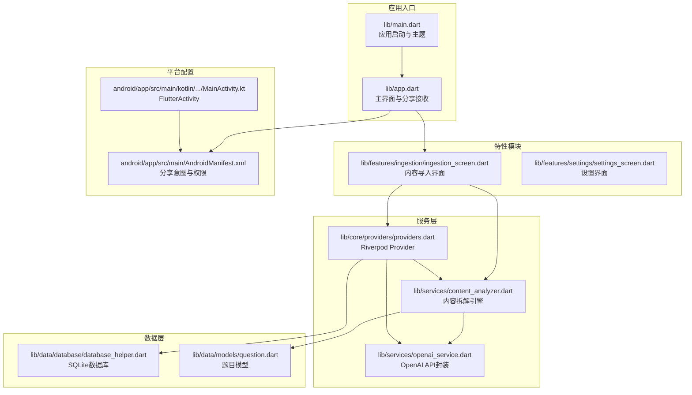
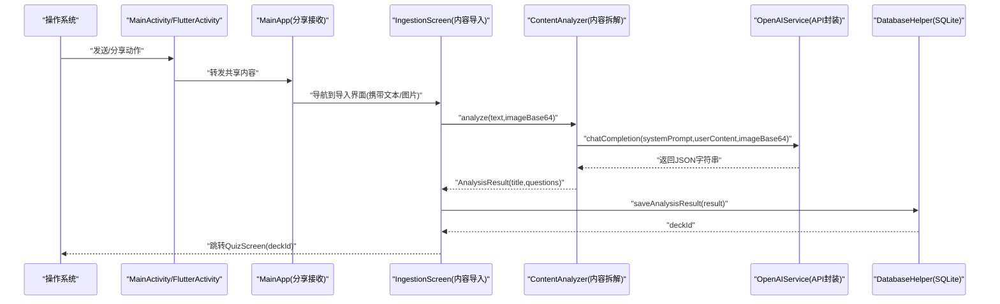
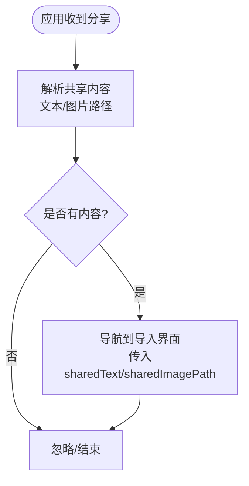
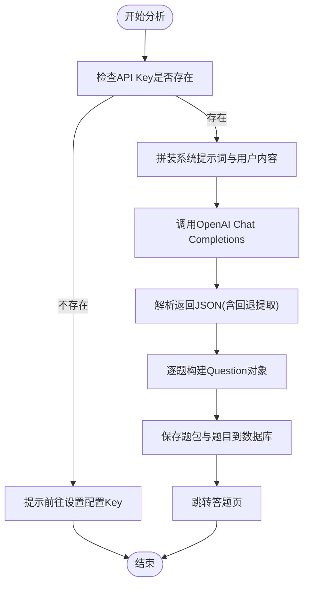
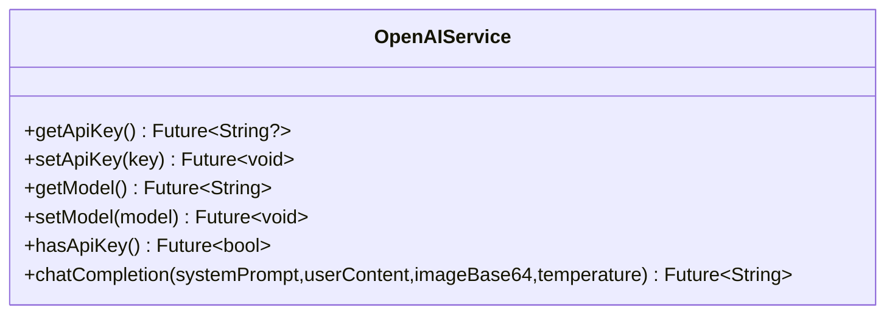
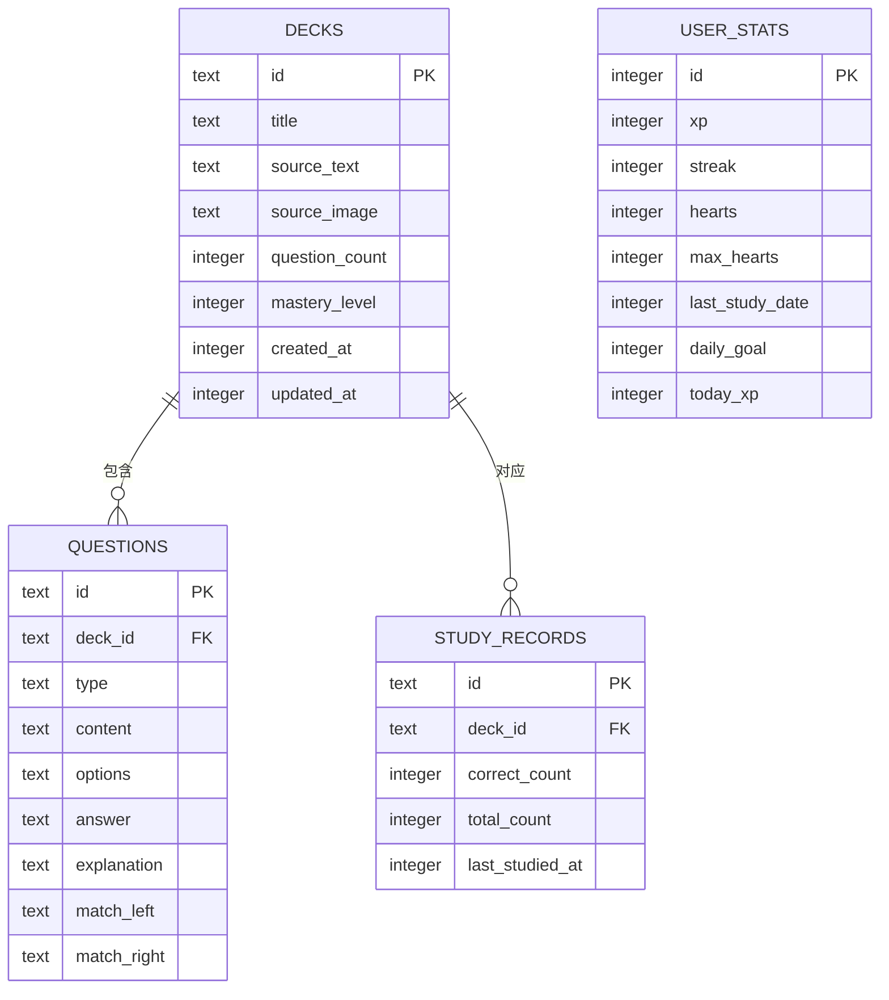
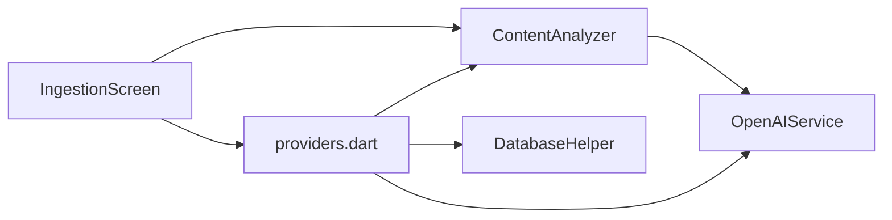

# 内容导入系统

<cite>
**本文引用的文件**
- [lib/main.dart](file://lib/main.dart)
- [lib/app.dart](file://lib/app.dart)
- [lib/features/ingestion/ingestion_screen.dart](file://lib/features/ingestion/ingestion_screen.dart)
- [lib/services/content_analyzer.dart](file://lib/services/content_analyzer.dart)
- [lib/services/openai_service.dart](file://lib/services/openai_service.dart)
- [lib/core/providers/providers.dart](file://lib/core/providers/providers.dart)
- [lib/data/database/database_helper.dart](file://lib/data/database/database_helper.dart)
- [lib/data/models/question.dart](file://lib/data/models/question.dart)
- [lib/features/settings/settings_screen.dart](file://lib/features/settings/settings_screen.dart)
- [android/app/src/main/AndroidManifest.xml](file://android/app/src/main/AndroidManifest.xml)
- [android/app/src/main/kotlin/com/example/dlg_q/MainActivity.kt](file://android/app/src/main/kotlin/com/example/dlg_q/MainActivity.kt)
- [pubspec.yaml](file://pubspec.yaml)
</cite>

## 目录
1. [简介](#简介)
2. [项目结构](#项目结构)
3. [核心组件](#核心组件)
4. [架构总览](#架构总览)
5. [详细组件分析](#详细组件分析)
6. [依赖分析](#依赖分析)
7. [性能考虑](#性能考虑)
8. [故障排除指南](#故障排除指南)
9. [结论](#结论)
10. [附录](#附录)

## 简介
本系统为“Dlg-Q”应用的内容导入与智能拆题能力提供端到端解决方案。其核心目标是：
- 接收来自微信、知乎、小红书等第三方应用通过系统分享接口传递的文本与图片内容；
- 将原始内容交由AI进行结构化拆解，生成多种题型的题目；
- 将拆解结果持久化至本地数据库，并引导用户进入答题流程。

系统围绕“应用内分享接收 → 内容分析 → AI拆题 → 结果入库 → 答题跳转”的主路径构建，具备完善的容错与异常处理机制，确保在不同来源与格式的分享内容下保持稳定可用。

## 项目结构
项目采用Flutter框架，代码组织遵循“特性分层 + 核心服务 + 数据层”的结构：
- 应用入口与主题：lib/main.dart、lib/app.dart
- 特性模块：features 下包含首页、题库、个人中心、内容导入等页面
- 服务层：services 下包含内容分析、OpenAI集成、游戏化等服务
- 数据层：data 下包含数据库、模型与数据访问
- 平台配置：android 目录下的 AndroidManifest.xml 与 MainActivity.kt
- 依赖声明：pubspec.yaml

**图示来源**
- [lib/main.dart:1-36](file://lib/main.dart#L1-L36)
- [lib/app.dart:10-111](file://lib/app.dart#L10-L111)
- [lib/features/ingestion/ingestion_screen.dart:13-335](file://lib/features/ingestion/ingestion_screen.dart#L13-L335)
- [lib/services/openai_service.dart:1-109](file://lib/services/openai_service.dart#L1-L109)
- [lib/services/content_analyzer.dart:14-172](file://lib/services/content_analyzer.dart#L14-L172)
- [lib/core/providers/providers.dart:1-178](file://lib/core/providers/providers.dart#L1-L178)
- [lib/data/database/database_helper.dart:1-192](file://lib/data/database/database_helper.dart#L1-L192)
- [lib/data/models/question.dart:1-76](file://lib/data/models/question.dart#L1-L76)
- [android/app/src/main/AndroidManifest.xml:1-65](file://android/app/src/main/AndroidManifest.xml#L1-L65)
- [android/app/src/main/kotlin/com/example/dlg_q/MainActivity.kt:1-6](file://android/app/src/main/kotlin/com/example/dlg_q/MainActivity.kt#L1-L6)

**章节来源**
- [lib/main.dart:1-36](file://lib/main.dart#L1-L36)
- [lib/app.dart:10-111](file://lib/app.dart#L10-L111)
- [android/app/src/main/AndroidManifest.xml:1-65](file://android/app/src/main/AndroidManifest.xml#L1-L65)
- [pubspec.yaml:1-34](file://pubspec.yaml#L1-L34)

## 核心组件
- 应用入口与主题：负责初始化系统UI样式与应用根组件。
- 主界面与分享接收：监听系统分享事件，解析共享文本与图片，导航至内容导入界面。
- 内容导入界面：提供输入框、粘贴板读取、图片预览与AI拆题按钮；驱动分析流程并处理错误。
- 内容拆解引擎：构造系统提示词与用户内容，调用OpenAI Chat Completions接口，解析返回的JSON并生成结构化题目。
- OpenAI服务：封装Dio网络请求、鉴权头、超时配置、模型与API Key管理。
- Riverpod Provider：集中管理服务实例与数据库操作，提供统一的数据流与状态管理。
- 数据库与模型：SQLite存储题包、题目与学习记录，提供CRUD与查询能力。
- 平台配置：Android Manifest声明分享意图与权限，确保系统能将外部分享内容路由到应用。

**章节来源**
- [lib/app.dart:33-72](file://lib/app.dart#L33-L72)
- [lib/features/ingestion/ingestion_screen.dart:69-126](file://lib/features/ingestion/ingestion_screen.dart#L69-L126)
- [lib/services/content_analyzer.dart:14-172](file://lib/services/content_analyzer.dart#L14-L172)
- [lib/services/openai_service.dart:1-109](file://lib/services/openai_service.dart#L1-L109)
- [lib/core/providers/providers.dart:1-178](file://lib/core/providers/providers.dart#L1-L178)
- [lib/data/database/database_helper.dart:1-192](file://lib/data/database/database_helper.dart#L1-L192)
- [android/app/src/main/AndroidManifest.xml:28-45](file://android/app/src/main/AndroidManifest.xml#L28-L45)

## 架构总览
系统采用“分享接收 → 内容分析 → AI拆题 → 结果入库 → 答题跳转”的主流程，配合Riverpod进行状态与依赖注入，数据库完成持久化。

**图示来源**
- [android/app/src/main/AndroidManifest.xml:28-45](file://android/app/src/main/AndroidManifest.xml#L28-L45)
- [android/app/src/main/kotlin/com/example/dlg_q/MainActivity.kt:1-6](file://android/app/src/main/kotlin/com/example/dlg_q/MainActivity.kt#L1-L6)
- [lib/app.dart:33-72](file://lib/app.dart#L33-L72)
- [lib/features/ingestion/ingestion_screen.dart:69-126](file://lib/features/ingestion/ingestion_screen.dart#L69-L126)
- [lib/services/content_analyzer.dart:105-133](file://lib/services/content_analyzer.dart#L105-L133)
- [lib/services/openai_service.dart:42-107](file://lib/services/openai_service.dart#L42-L107)
- [lib/core/providers/providers.dart:97-141](file://lib/core/providers/providers.dart#L97-L141)
- [lib/data/database/database_helper.dart:104-133](file://lib/data/database/database_helper.dart#L104-L133)

## 详细组件分析

### 应用间分享处理机制
- Android端通过Intent Filter声明接收文本与图片分享，支持单文件与多文件场景。
- Flutter端通过receive_sharing_intent插件监听初始分享与运行时分享事件，解析SharedMediaFile列表，区分文本与图片路径。
- 若存在可解析内容，则导航至内容导入界面，将文本与图片路径作为参数传入。

**图示来源**
- [android/app/src/main/AndroidManifest.xml:28-45](file://android/app/src/main/AndroidManifest.xml#L28-L45)
- [lib/app.dart:33-72](file://lib/app.dart#L33-L72)

**章节来源**
- [android/app/src/main/AndroidManifest.xml:28-45](file://android/app/src/main/AndroidManifest.xml#L28-L45)
- [lib/app.dart:33-72](file://lib/app.dart#L33-L72)

### 内容分析流程（从原始分享到AI智能拆题）
- 输入准备：导入界面支持手动输入文本与图片预览；若无输入则提示用户。
- API Key校验：检查设置中是否已配置OpenAI API Key，未配置则提示前往设置。
- 调用拆解：调用ContentAnalyzer.analyze，将文本与可选图片（base64）一并提交给OpenAI。
- 响应解析：ContentAnalyzer尝试直接解析JSON，若失败则提取第一个JSON块；对每道题调用Question.fromJson进行反序列化。
- 结果入库：通过DeckOperations.saveAnalysisResult将题包与题目写入数据库，并刷新题包列表。
- 跳转答题：完成后跳转QuizScreen，开始学习。

**图示来源**
- [lib/features/ingestion/ingestion_screen.dart:69-126](file://lib/features/ingestion/ingestion_screen.dart#L69-L126)
- [lib/services/content_analyzer.dart:105-170](file://lib/services/content_analyzer.dart#L105-L170)
- [lib/core/providers/providers.dart:97-141](file://lib/core/providers/providers.dart#L97-L141)
- [lib/data/models/question.dart:56-74](file://lib/data/models/question.dart#L56-L74)

**章节来源**
- [lib/features/ingestion/ingestion_screen.dart:69-126](file://lib/features/ingestion/ingestion_screen.dart#L69-L126)
- [lib/services/content_analyzer.dart:105-170](file://lib/services/content_analyzer.dart#L105-L170)
- [lib/core/providers/providers.dart:97-141](file://lib/core/providers/providers.dart#L97-L141)
- [lib/data/models/question.dart:56-74](file://lib/data/models/question.dart#L56-L74)

### OpenAI API集成方式与调用机制
- 配置项：API Key、模型名、基础URL、连接/接收超时。
- 认证头：Authorization: Bearer <API Key>。
- 请求体：model、messages（系统+用户）、temperature、response_format=json_object、max_tokens。
- 响应处理：校验HTTP状态码与choices非空；提取第一条回复内容。
- 异常策略：未配置Key、HTTP失败、空结果均抛出异常，由上层捕获并显示错误信息。

**图示来源**
- [lib/services/openai_service.dart:1-109](file://lib/services/openai_service.dart#L1-L109)

**章节来源**
- [lib/services/openai_service.dart:1-109](file://lib/services/openai_service.dart#L1-L109)

### 数据模型与持久化
- 题目模型：包含题型、题干、选项、答案、解析及匹配题左右列。
- 数据库：创建decks、questions、study_records、user_stats四张表；提供插入、查询、更新、删除与upsert操作。
- Provider：集中管理数据库与服务实例，DeckOperations封装题包与题目的批量写入与列表刷新。

**图示来源**
- [lib/data/database/database_helper.dart:32-100](file://lib/data/database/database_helper.dart#L32-L100)
- [lib/data/models/question.dart:4-75](file://lib/data/models/question.dart#L4-L75)
- [lib/core/providers/providers.dart:97-141](file://lib/core/providers/providers.dart#L97-L141)

**章节来源**
- [lib/data/database/database_helper.dart:1-192](file://lib/data/database/database_helper.dart#L1-L192)
- [lib/data/models/question.dart:1-76](file://lib/data/models/question.dart#L1-L76)
- [lib/core/providers/providers.dart:97-141](file://lib/core/providers/providers.dart#L97-L141)

### 使用示例
- 在微信/知乎/小红书等应用中打开一段知识内容，点击“分享”并选择本应用。
- 应用接收到分享后自动跳转到内容导入界面，文本与图片会自动填充。
- 点击“AI拆解为题目”，系统将调用AI生成题目并保存到题库，随后进入答题页开始学习。

**章节来源**
- [lib/app.dart:33-72](file://lib/app.dart#L33-L72)
- [lib/features/ingestion/ingestion_screen.dart:150-276](file://lib/features/ingestion/ingestion_screen.dart#L150-L276)

## 依赖分析
- 外部依赖：Flutter生态与第三方库，包括Riverpod、sqflite、dio、receive_sharing_intent、shared_preferences等。
- 组件耦合：IngestionScreen依赖ContentAnalyzer与OpenAIService；ContentAnalyzer依赖OpenAIService；Provider集中管理服务与数据库；数据库被DeckOperations与GamificationService使用。
- 循环依赖：当前结构清晰，未发现循环依赖迹象。

**图示来源**
- [lib/features/ingestion/ingestion_screen.dart:69-126](file://lib/features/ingestion/ingestion_screen.dart#L69-L126)
- [lib/services/content_analyzer.dart:14-23](file://lib/services/content_analyzer.dart#L14-L23)
- [lib/services/openai_service.dart:1-109](file://lib/services/openai_service.dart#L1-L109)
- [lib/core/providers/providers.dart:1-178](file://lib/core/providers/providers.dart#L1-L178)
- [lib/data/database/database_helper.dart:1-192](file://lib/data/database/database_helper.dart#L1-L192)

**章节来源**
- [pubspec.yaml:9-22](file://pubspec.yaml#L9-L22)
- [lib/core/providers/providers.dart:1-178](file://lib/core/providers/providers.dart#L1-L178)

## 性能考虑
- 网络请求：Dio配置了合理的连接与接收超时，避免长时间阻塞；建议在弱网环境下适当增加重试与降级策略。
- 图片处理：仅在需要时将图片转换为base64，避免不必要的内存占用；对大图建议压缩后再上传。
- 解析健壮性：ContentAnalyzer对AI返回的JSON进行严格解析与回退提取，减少因格式不规范导致的失败。
- 数据库写入：批量插入时尽量合并事务，减少IO次数；当前实现逐条插入，可考虑优化为批处理以提升吞吐。

## 故障排除指南
- 未配置API Key：导入界面检测到Key缺失时会提示前往设置配置；请在设置中填写有效的OpenAI API Key与模型。
- 网络异常：OpenAI API请求失败会抛出异常，界面显示错误信息；请检查网络连通性与API Key有效性。
- AI返回为空：当choices为空或HTTP状态非200时抛出异常；可重试或检查模型与提示词。
- 图片加载失败：导入界面在加载图片为base64时忽略错误，不影响文本分析；可在设置中重新选择图片。
- 分享未触发：确认Android Manifest中已声明SEND/SEND_MULTIPLE与text/image MIME类型；确保应用已在系统分享菜单中启用。

**章节来源**
- [lib/features/ingestion/ingestion_screen.dart:76-82](file://lib/features/ingestion/ingestion_screen.dart#L76-L82)
- [lib/services/openai_service.dart:52-55](file://lib/services/openai_service.dart#L52-L55)
- [lib/services/openai_service.dart:96-104](file://lib/services/openai_service.dart#L96-L104)
- [lib/features/ingestion/ingestion_screen.dart:55-57](file://lib/features/ingestion/ingestion_screen.dart#L55-L57)
- [android/app/src/main/AndroidManifest.xml:28-45](file://android/app/src/main/AndroidManifest.xml#L28-L45)

## 结论
Dlg-Q的内容导入系统通过Android系统分享机制与Flutter应用的无缝衔接，实现了从外部内容到结构化题目的自动化拆解与持久化。系统以Riverpod为核心组织状态与依赖，结合SQLite完成可靠的数据存储，并通过OpenAI API实现高质量的智能拆题。整体流程清晰、容错完备，能够在多样化的分享场景下保持稳定与易用。

## 附录
- 设置界面用于配置OpenAI API Key与模型，确保导入功能可用。
- 数据库初始化包含四张核心表，支持题包、题目、学习记录与用户统计的完整生命周期管理。

**章节来源**
- [lib/features/settings/settings_screen.dart:14-57](file://lib/features/settings/settings_screen.dart#L14-L57)
- [lib/data/database/database_helper.dart:32-100](file://lib/data/database/database_helper.dart#L32-L100)