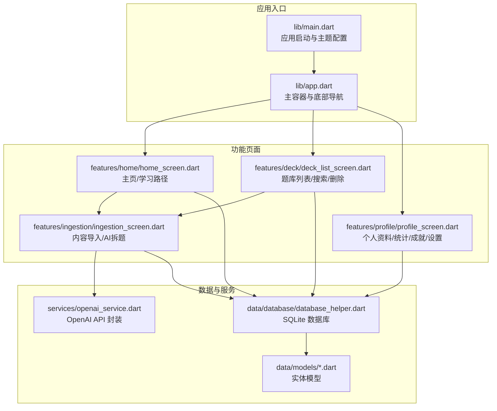
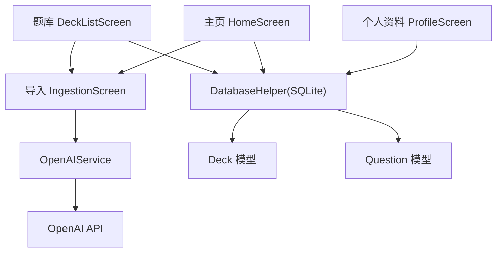
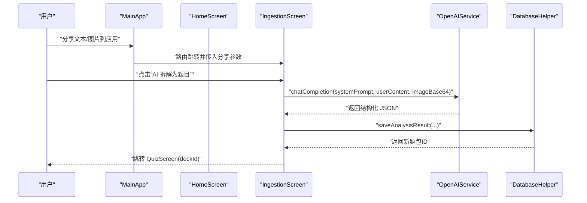
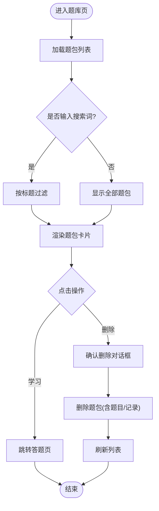
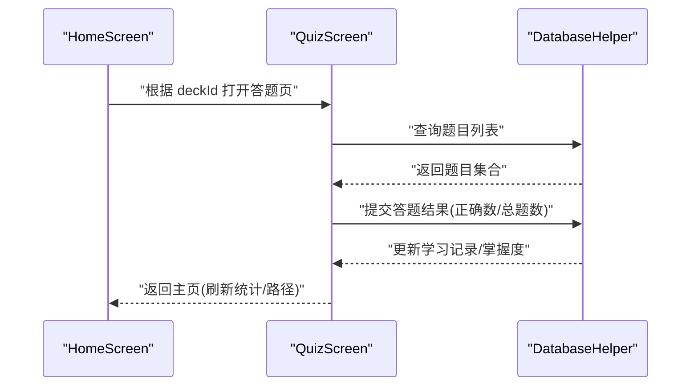
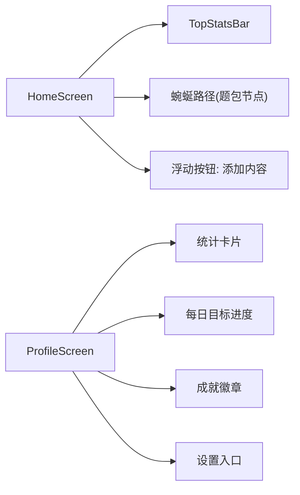
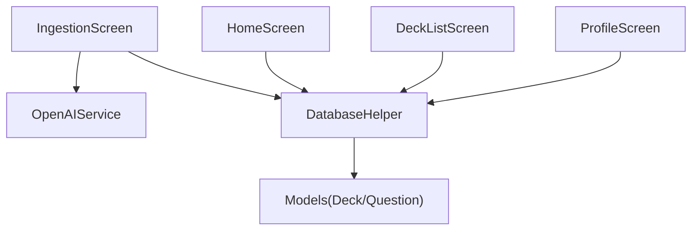

# 功能模块

<cite>
**本文引用的文件**
- [lib/main.dart](file://lib/main.dart)
- [lib/app.dart](file://lib/app.dart)
- [lib/features/home/home_screen.dart](file://lib/features/home/home_screen.dart)
- [lib/features/ingestion/ingestion_screen.dart](file://lib/features/ingestion/ingestion_screen.dart)
- [lib/features/deck/deck_list_screen.dart](file://lib/features/deck/deck_list_screen.dart)
- [lib/features/profile/profile_screen.dart](file://lib/features/profile/profile_screen.dart)
- [lib/data/models/deck.dart](file://lib/data/models/deck.dart)
- [lib/data/models/question.dart](file://lib/data/models/question.dart)
- [lib/data/database/database_helper.dart](file://lib/data/database/database_helper.dart)
- [lib/services/openai_service.dart](file://lib/services/openai_service.dart)
- [README.md](file://README.md)
</cite>

## 目录
1. [简介](#简介)
2. [项目结构](#项目结构)
3. [核心组件](#核心组件)
4. [架构总览](#架构总览)
5. [详细组件分析](#详细组件分析)
6. [依赖分析](#依赖分析)
7. [性能考虑](#性能考虑)
8. [故障排查指南](#故障排查指南)
9. [结论](#结论)
10. [附录](#附录)

## 简介
Dlg-Q 是一个基于 Flutter 的“自定义题库 + AI 拆题”的学习应用，核心围绕四大功能模块展开：
- 内容导入系统：支持从外部分享（文本/图片）或剪贴板导入，交由 AI 分析并生成题包。
- 题库管理：展示所有题包、搜索过滤、删除题包，并提供继续/开始学习入口。
- 学习系统：以题包为单位进行答题练习，结合掌握度与学习记录。
- 个人资料与主页：展示用户统计、成就、每日目标以及导航至各功能。

应用采用 Riverpod 状态管理，数据库使用 sqflite，AI 能力通过 OpenAI API 提供。

## 项目结构
应用采用按特性分层的目录组织方式：
- features：功能页面层（home、ingestion、deck、profile、learning、settings）
- data：数据模型与数据库访问层（models、database）
- services：外部服务封装（openai_service、gamification_service）
- core：主题、颜色、全局 provider 定义
- shared：可复用 UI 组件（widgets）

图表来源
- [lib/main.dart:1-36](file://lib/main.dart#L1-L36)
- [lib/app.dart:10-111](file://lib/app.dart#L10-L111)
- [lib/features/home/home_screen.dart:11-335](file://lib/features/home/home_screen.dart#L11-L335)
- [lib/features/ingestion/ingestion_screen.dart:13-335](file://lib/features/ingestion/ingestion_screen.dart#L13-L335)
- [lib/features/deck/deck_list_screen.dart:10-314](file://lib/features/deck/deck_list_screen.dart#L10-L314)
- [lib/features/profile/profile_screen.dart:8-474](file://lib/features/profile/profile_screen.dart#L8-L474)
- [lib/data/database/database_helper.dart:1-192](file://lib/data/database/database_helper.dart#L1-L192)
- [lib/services/openai_service.dart:1-109](file://lib/services/openai_service.dart#L1-L109)

章节来源
- [lib/main.dart:1-36](file://lib/main.dart#L1-L36)
- [lib/app.dart:10-111](file://lib/app.dart#L10-L111)
- [README.md:1-18](file://README.md#L1-L18)

## 核心组件
- 主应用与导航
  - 入口在 main.dart 中初始化系统 UI 样式并挂载 ProviderScope，随后渲染 DIYDuolingoApp。
  - 主容器 MainApp 使用 BottomNavigationBar 切换主页、题库、我的三个页面；同时处理“分享到应用”事件，将外部分享内容直接跳转到内容导入页。
- 数据模型
  - 题包 Deck：包含标题、来源文本/图片、题目数量、掌握度、创建/更新时间等字段。
  - 题目 Question：包含类型、题干、选项、答案、解析及匹配题左右列等。
- 数据库
  - DatabaseHelper 提供 decks、questions、study_records、user_stats 表的 CRUD 操作，并在首次打开时初始化表结构与默认用户统计。
- 服务
  - OpenAIService：封装 OpenAI Chat Completions 调用，支持文本与图片输入、温度参数、响应格式为 JSON，持久化保存 API Key 与模型配置。

章节来源
- [lib/main.dart:7-35](file://lib/main.dart#L7-L35)
- [lib/app.dart:17-110](file://lib/app.dart#L17-L110)
- [lib/data/models/deck.dart:1-71](file://lib/data/models/deck.dart#L1-L71)
- [lib/data/models/question.dart:1-76](file://lib/data/models/question.dart#L1-L76)
- [lib/data/database/database_helper.dart:32-100](file://lib/data/database/database_helper.dart#L32-L100)
- [lib/services/openai_service.dart:17-107](file://lib/services/openai_service.dart#L17-L107)

## 架构总览
应用采用“页面层 + 数据层 + 服务层”的清晰分层，配合 Riverpod 的 Provider 实现响应式状态订阅与跨组件共享。

图表来源
- [lib/features/home/home_screen.dart:15-57](file://lib/features/home/home_screen.dart#L15-L57)
- [lib/features/ingestion/ingestion_screen.dart:69-126](file://lib/features/ingestion/ingestion_screen.dart#L69-L126)
- [lib/features/deck/deck_list_screen.dart:21-97](file://lib/features/deck/deck_list_screen.dart#L21-L97)
- [lib/features/profile/profile_screen.dart:12-106](file://lib/features/profile/profile_screen.dart#L12-L106)
- [lib/data/database/database_helper.dart:104-191](file://lib/data/database/database_helper.dart#L104-L191)
- [lib/services/openai_service.dart:46-107](file://lib/services/openai_service.dart#L46-L107)

## 详细组件分析

### 内容导入系统（Ingestion）
设计理念
- 通过“分享到应用”或手动输入/粘贴的方式，将任意文本或图片作为学习素材。
- 交由 OpenAI 进行内容分析与结构化解析，生成标准化的题包与题目，再写入本地数据库并自动进入答题页。

用户工作流
- 打开导入页 -> 读取分享内容（文本/图片）-> 校验 API Key -> 调用 AI 分析 -> 生成题包 -> 保存到数据库 -> 跳转答题页。

图表来源
- [lib/app.dart:33-72](file://lib/app.dart#L33-L72)
- [lib/features/ingestion/ingestion_screen.dart:69-126](file://lib/features/ingestion/ingestion_screen.dart#L69-L126)
- [lib/services/openai_service.dart:46-107](file://lib/services/openai_service.dart#L46-L107)
- [lib/data/database/database_helper.dart:104-133](file://lib/data/database/database_helper.dart#L104-L133)

章节来源
- [lib/features/ingestion/ingestion_screen.dart:13-335](file://lib/features/ingestion/ingestion_screen.dart#L13-L335)
- [lib/services/openai_service.dart:1-109](file://lib/services/openai_service.dart#L1-L109)
- [lib/data/database/database_helper.dart:102-133](file://lib/data/database/database_helper.dart#L102-L133)

### 题库管理（DeckList）
设计理念
- 展示所有题包，支持搜索过滤、删除确认、继续/开始学习入口。
- 题包卡片直观显示掌握度进度与创建日期，便于用户快速定位当前学习任务。

用户工作流
- 打开题库页 -> 输入关键词搜索 -> 点击“继续学习/开始学习” -> 跳转答题页。
- 删除题包时弹出确认对话框，确认后调用数据库删除（级联删除题目与学习记录）。

图表来源
- [lib/features/deck/deck_list_screen.dart:21-97](file://lib/features/deck/deck_list_screen.dart#L21-L97)
- [lib/data/database/database_helper.dart:128-133](file://lib/data/database/database_helper.dart#L128-L133)

章节来源
- [lib/features/deck/deck_list_screen.dart:10-314](file://lib/features/deck/deck_list_screen.dart#L10-L314)
- [lib/data/database/database_helper.dart:102-133](file://lib/data/database/database_helper.dart#L102-L133)

### 学习系统（Home/Quiz）
设计理念
- 主页以“蜿蜒路径”形式展示题包，已完成与当前可学的题包有明确视觉区分。
- 点击题包进入答题页，结合掌握度与学习记录实现个性化学习推进。

用户工作流
- 主页点击题包 -> 跳转答题页 -> 答题过程中更新学习记录与掌握度 -> 返回主页刷新状态。

图表来源
- [lib/features/home/home_screen.dart:113-119](file://lib/features/home/home_screen.dart#L113-L119)
- [lib/data/database/database_helper.dart:135-174](file://lib/data/database/database_helper.dart#L135-L174)

章节来源
- [lib/features/home/home_screen.dart:11-335](file://lib/features/home/home_screen.dart#L11-L335)
- [lib/data/database/database_helper.dart:135-174](file://lib/data/database/database_helper.dart#L135-L174)

### 个人资料与主页（Profile/Home）
设计理念
- 主页聚合用户统计、题包学习路径与一键导入入口，形成“看—学—加”的闭环。
- 个人资料页展示等级、XP、心数、每日目标进度与成就徽章，增强激励与留存。

用户工作流
- 主页：查看统计与路径 -> 点击“添加内容”进入导入页。
- 个人资料：查看统计与成就 -> 进入设置页配置 API Key 与模型。

图表来源
- [lib/features/home/home_screen.dart:19-57](file://lib/features/home/home_screen.dart#L19-L57)
- [lib/features/profile/profile_screen.dart:12-106](file://lib/features/profile/profile_screen.dart#L12-L106)

章节来源
- [lib/features/home/home_screen.dart:11-335](file://lib/features/home/home_screen.dart#L11-L335)
- [lib/features/profile/profile_screen.dart:8-474](file://lib/features/profile/profile_screen.dart#L8-L474)

## 依赖分析
- 组件耦合
  - 页面层仅依赖 Provider 与服务层接口，不直接持有业务逻辑，降低耦合。
  - 数据库与模型之间通过 toMap/fromMap 映射，保持数据层独立性。
- 外部依赖
  - OpenAI API：用于内容解析与题目生成，需配置 API Key 与模型。
  - sqflite：轻量本地数据库，满足移动端离线存储需求。
- 潜在循环依赖
  - 当前结构无明显循环依赖；若未来引入更复杂的业务规则，建议通过 Repository 抽象进一步解耦。

图表来源
- [lib/features/ingestion/ingestion_screen.dart:69-126](file://lib/features/ingestion/ingestion_screen.dart#L69-L126)
- [lib/features/home/home_screen.dart:15-38](file://lib/features/home/home_screen.dart#L15-L38)
- [lib/features/deck/deck_list_screen.dart:21-83](file://lib/features/deck/deck_list_screen.dart#L21-L83)
- [lib/features/profile/profile_screen.dart:12-106](file://lib/features/profile/profile_screen.dart#L12-L106)
- [lib/data/database/database_helper.dart:104-191](file://lib/data/database/database_helper.dart#L104-L191)

章节来源
- [lib/features/ingestion/ingestion_screen.dart:69-126](file://lib/features/ingestion/ingestion_screen.dart#L69-L126)
- [lib/features/home/home_screen.dart:15-38](file://lib/features/home/home_screen.dart#L15-L38)
- [lib/features/deck/deck_list_screen.dart:21-83](file://lib/features/deck/deck_list_screen.dart#L21-L83)
- [lib/features/profile/profile_screen.dart:12-106](file://lib/features/profile/profile_screen.dart#L12-L106)
- [lib/data/database/database_helper.dart:104-191](file://lib/data/database/database_helper.dart#L104-L191)

## 性能考虑
- 状态管理
  - 使用 Riverpod 的 ProviderWatch 仅在数据变化时重建相关 UI，避免全量重绘。
- 数据库
  - 采用 sqflite 并在首次打开时一次性初始化表结构，减少运行时开销。
- 网络请求
  - OpenAI 请求设置连接与接收超时，避免阻塞主线程；对空结果与异常进行兜底处理。
- UI 渲染
  - 路径节点与卡片采用惰性加载与动画渐显，提升首屏体验。

## 故障排查指南
- 无法开始导入
  - 检查是否已在设置中配置 OpenAI API Key；若未配置，导入页会提示“请先在设置中配置 OpenAI API Key”。
- 导入失败
  - 关注导入页错误提示，常见原因包括网络异常、API Key 无效、AI 返回空结果等。
- 题包删除后未生效
  - 确认删除确认对话框已选择“删除”，数据库删除会级联清理题目与学习记录。
- 掌握度不更新
  - 确认答题页提交了正确答案与总题数，数据库会据此更新学习记录与掌握度。

章节来源
- [lib/features/ingestion/ingestion_screen.dart:76-82](file://lib/features/ingestion/ingestion_screen.dart#L76-L82)
- [lib/features/ingestion/ingestion_screen.dart:118-125](file://lib/features/ingestion/ingestion_screen.dart#L118-L125)
- [lib/features/deck/deck_list_screen.dart:124-148](file://lib/features/deck/deck_list_screen.dart#L124-L148)
- [lib/data/database/database_helper.dart:128-133](file://lib/data/database/database_helper.dart#L128-L133)

## 结论
Dlg-Q 通过清晰的功能分层与稳定的依赖关系，实现了从“内容导入 → 题库管理 → 学习推进 → 个人激励”的完整闭环。其模块化设计便于扩展与维护，为后续接入更多 AI 能力、题型与学习模式提供了良好基础。

## 附录
- 最佳实践
  - 在导入前确保网络稳定与 API Key 正确，避免重复调用导致资源浪费。
  - 使用题库搜索快速定位题包，删除题包前确认影响范围。
  - 建议每日完成目标以维持连击与 XP 积累。
- 扩展与定制
  - 新增题型：在 QuestionType 与 Question 模型中扩展类型枚举与序列化逻辑，再在 UI 与答题逻辑中适配。
  - 自定义提示词：在导入页调用 AI 时传入自定义 systemPrompt，以适配不同领域内容。
  - 多语言与主题：通过 core/theme 与 core/constants 进行统一管理，便于国际化与品牌定制。