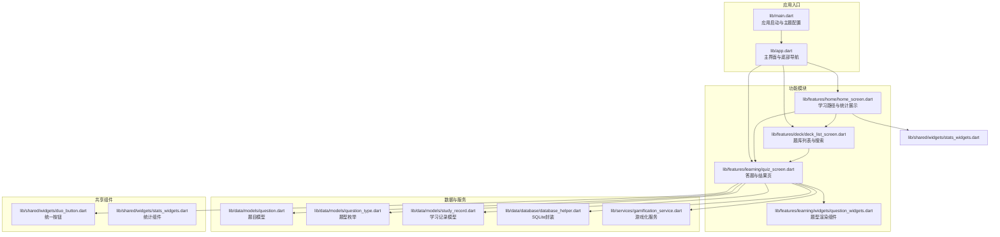
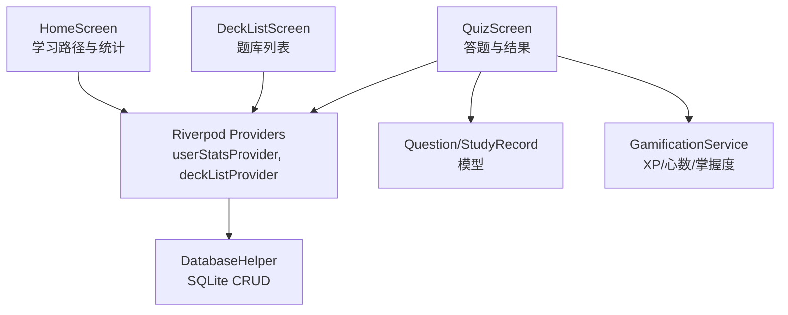
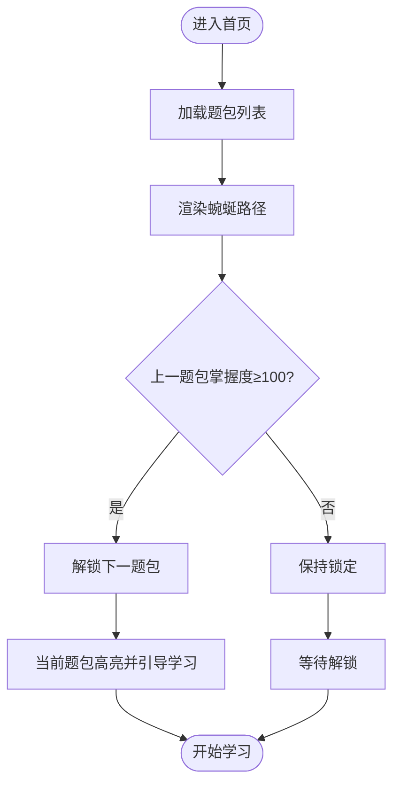
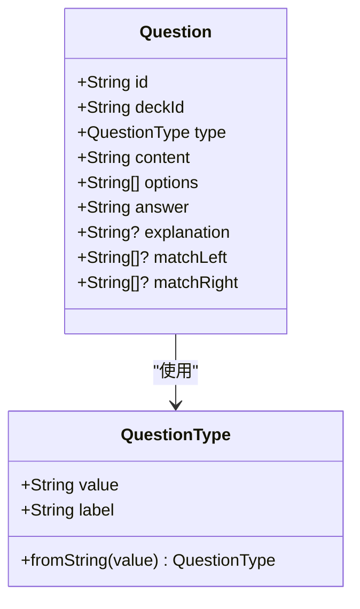
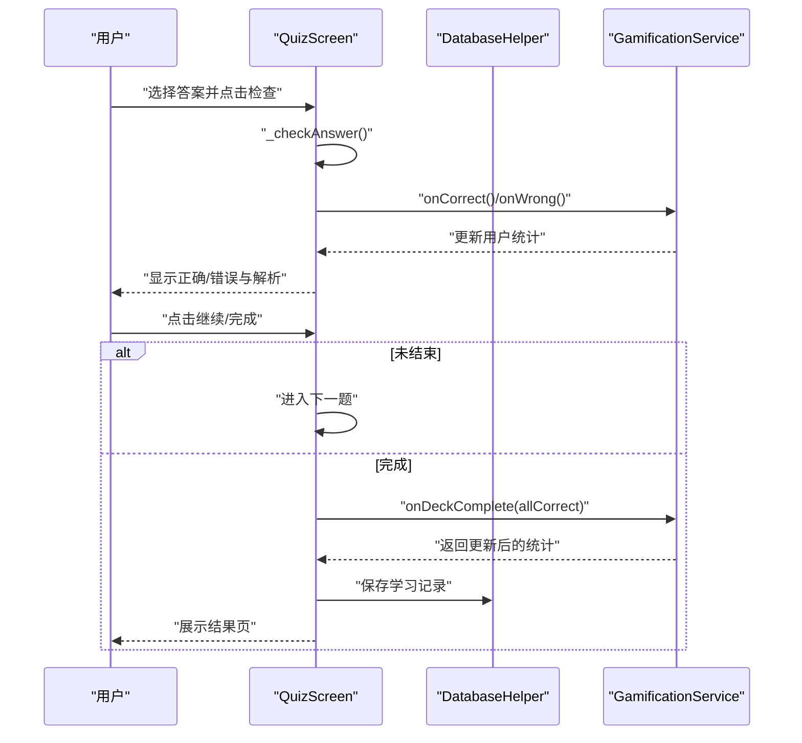
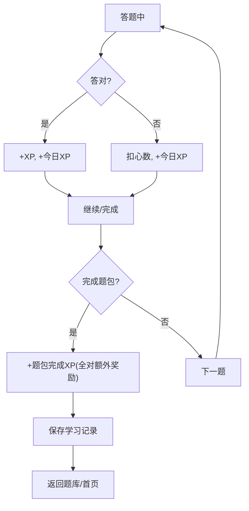
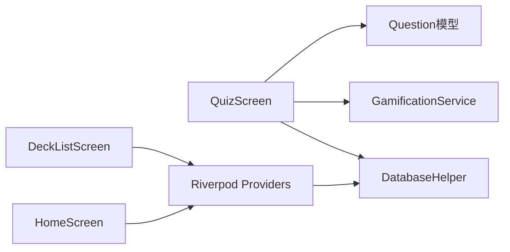

# 学习系统

<cite>
**本文引用的文件**
- [lib/main.dart](file://lib/main.dart)
- [lib/app.dart](file://lib/app.dart)
- [lib/features/home/home_screen.dart](file://lib/features/home/home_screen.dart)
- [lib/features/deck/deck_list_screen.dart](file://lib/features/deck/deck_list_screen.dart)
- [lib/features/learning/quiz_screen.dart](file://lib/features/learning/quiz_screen.dart)
- [lib/features/learning/widgets/question_widgets.dart](file://lib/features/learning/widgets/question_widgets.dart)
- [lib/data/models/question.dart](file://lib/data/models/question.dart)
- [lib/data/models/question_type.dart](file://lib/data/models/question_type.dart)
- [lib/data/models/study_record.dart](file://lib/data/models/study_record.dart)
- [lib/data/database/database_helper.dart](file://lib/data/database/database_helper.dart)
- [lib/services/gamification_service.dart](file://lib/services/gamification_service.dart)
- [lib/shared/widgets/duo_button.dart](file://lib/shared/widgets/duo_button.dart)
- [lib/shared/widgets/stats_widgets.dart](file://lib/shared/widgets/stats_widgets.dart)
- [README.md](file://README.md)
</cite>

## 目录
1. [引言](#引言)
2. [项目结构](#项目结构)
3. [核心组件](#核心组件)
4. [架构总览](#架构总览)
5. [详细组件分析](#详细组件分析)
6. [依赖关系分析](#依赖关系分析)
7. [性能考虑](#性能考虑)
8. [故障排查指南](#故障排查指南)
9. [结论](#结论)
10. [附录](#附录)

## 引言
本文件面向Dlg-Q学习系统，围绕渐进式学习路径、题型支持、答题流程、学习反馈与个性化推荐进行系统化说明。系统采用Flutter + Riverpod架构，数据持久化基于SQLite（sqflite），通过题包（Deck）组织题目（Question），以学习记录（StudyRecord）追踪掌握度，并结合游戏化机制（XP、连续打卡、心数）驱动学习动力。

## 项目结构
系统采用按功能域分层的目录组织：入口应用、功能模块（首页、题库、学习、个人中心）、数据模型与数据库、服务层（游戏化、大模型接口占位）、共享组件与主题常量。整体结构清晰，职责边界明确，便于扩展新的题型与学习策略。

图表来源
- [lib/main.dart:1-36](file://lib/main.dart#L1-L36)
- [lib/app.dart:10-111](file://lib/app.dart#L10-L111)
- [lib/features/home/home_screen.dart:11-335](file://lib/features/home/home_screen.dart#L11-L335)
- [lib/features/deck/deck_list_screen.dart:10-314](file://lib/features/deck/deck_list_screen.dart#L10-L314)
- [lib/features/learning/quiz_screen.dart:12-438](file://lib/features/learning/quiz_screen.dart#L12-L438)
- [lib/features/learning/widgets/question_widgets.dart](file://lib/features/learning/widgets/question_widgets.dart)
- [lib/data/models/question.dart:1-76](file://lib/data/models/question.dart#L1-L76)
- [lib/data/models/question_type.dart:1-20](file://lib/data/models/question_type.dart#L1-L20)
- [lib/data/models/study_record.dart:1-41](file://lib/data/models/study_record.dart#L1-L41)
- [lib/data/database/database_helper.dart:1-192](file://lib/data/database/database_helper.dart#L1-L192)
- [lib/services/gamification_service.dart:1-116](file://lib/services/gamification_service.dart#L1-L116)
- [lib/shared/widgets/duo_button.dart](file://lib/shared/widgets/duo_button.dart)
- [lib/shared/widgets/stats_widgets.dart](file://lib/shared/widgets/stats_widgets.dart)

章节来源
- [lib/main.dart:1-36](file://lib/main.dart#L1-L36)
- [lib/app.dart:10-111](file://lib/app.dart#L10-L111)
- [README.md:1-18](file://README.md#L1-L18)

## 核心组件
- 应用入口与主题
  - 应用启动设置状态栏样式，使用ProviderScope包裹全局状态，MaterialApp承载主界面。
- 主界面与导航
  - 底部导航包含“学习”、“题库”、“我的”，IndexedStack保持页面栈，支持分享意图处理。
- 学习路径与统计
  - 首页展示用户统计与题包渐进式路径，蜿蜒节点指示已完成、当前可学与未解锁状态。
- 题库管理
  - 支持搜索、删除题包；卡片展示掌握度进度与开始/继续按钮。
- 答题流程
  - 加载题包题目，逐题作答，即时反馈正确与否，显示解析，完成时汇总XP与正确率。
- 数据与模型
  - 题目模型支持多选、填空、判断、匹配、排序；学习记录用于统计正确/总数与最近学习时间；数据库封装CRUD与初始化。
- 游戏化机制
  - XP、连续打卡、心数、每日目标与掌握度计算，贯穿答题与完成环节。

章节来源
- [lib/main.dart:7-35](file://lib/main.dart#L7-L35)
- [lib/app.dart:17-109](file://lib/app.dart#L17-L109)
- [lib/features/home/home_screen.dart:11-335](file://lib/features/home/home_screen.dart#L11-L335)
- [lib/features/deck/deck_list_screen.dart:10-314](file://lib/features/deck/deck_list_screen.dart#L10-L314)
- [lib/features/learning/quiz_screen.dart:12-438](file://lib/features/learning/quiz_screen.dart#L12-L438)
- [lib/data/models/question.dart:1-76](file://lib/data/models/question.dart#L1-L76)
- [lib/data/models/study_record.dart:1-41](file://lib/data/models/study_record.dart#L1-L41)
- [lib/data/database/database_helper.dart:32-100](file://lib/data/database/database_helper.dart#L32-L100)
- [lib/services/gamification_service.dart:5-116](file://lib/services/gamification_service.dart#L5-L116)

## 架构总览
系统采用“视图-状态-数据源”的分层设计：
- 视图层：各功能屏幕负责UI与交互（首页、题库、答题、个人中心）。
- 状态层：Riverpod提供全局状态订阅与更新（用户统计、题包列表、答题状态）。
- 数据层：数据库封装SQLite操作，模型负责序列化/反序列化；服务层提供游戏化逻辑。

图表来源
- [lib/features/home/home_screen.dart:11-335](file://lib/features/home/home_screen.dart#L11-L335)
- [lib/features/deck/deck_list_screen.dart:10-314](file://lib/features/deck/deck_list_screen.dart#L10-L314)
- [lib/features/learning/quiz_screen.dart:12-438](file://lib/features/learning/quiz_screen.dart#L12-L438)
- [lib/data/database/database_helper.dart:102-192](file://lib/data/database/database_helper.dart#L102-L192)
- [lib/services/gamification_service.dart:5-116](file://lib/services/gamification_service.dart#L5-L116)

## 详细组件分析

### 渐进式学习路径与难度递增
- 路径设计
  - 首页以蜿蜒节点呈现题包顺序，已完成的题包高亮，当前可学题包带引导动效，未解锁题包显示锁形。
  - 节点下方进度条反映掌握度，超过阈值进入下一题包。
- 难度递增机制
  - 当前实现以“掌握度百分比”作为解锁条件，未见显式的动态难度调整算法（如根据正确率自适应题目难度）。可扩展方向：基于学习记录的正确率与时间趋势，动态筛选或生成更高等级题目。

图表来源
- [lib/features/home/home_screen.dart:59-148](file://lib/features/home/home_screen.dart#L59-L148)

章节来源
- [lib/features/home/home_screen.dart:59-148](file://lib/features/home/home_screen.dart#L59-L148)

### 题型支持与处理
- 支持的题型
  - 多项选择、填空、判断、匹配、排序。
- 答案校验策略
  - 选择/判断：严格比较（去空白、大小写敏感）。
  - 填空：忽略大小写与多余空白。
  - 匹配/排序：规范化分隔符后比较。
- 题型渲染
  - 通过独立的题型组件渲染器根据题型动态生成输入控件与交互。

图表来源
- [lib/data/models/question.dart:4-76](file://lib/data/models/question.dart#L4-L76)
- [lib/data/models/question_type.dart:2-19](file://lib/data/models/question_type.dart#L2-L19)

章节来源
- [lib/data/models/question.dart:1-76](file://lib/data/models/question.dart#L1-L76)
- [lib/data/models/question_type.dart:1-20](file://lib/data/models/question_type.dart#L1-L20)
- [lib/features/learning/quiz_screen.dart:62-77](file://lib/features/learning/quiz_screen.dart#L62-L77)
- [lib/features/learning/widgets/question_widgets.dart](file://lib/features/learning/widgets/question_widgets.dart)

### 答题流程与即时反馈
- 流程概览
  - 加载题包题目 → 显示题干与题型 → 用户作答 → 即时检查 → 展示解析与正确答案 → 下一题或完成。
- 关键交互
  - “检查”按钮触发答案校验，根据正确与否切换底部栏样式与提示。
  - 完成后展示XP奖励与正确率统计卡片。
- 反馈机制
  - 正确：增加XP与当日XP；错误：扣心数并记录连续打卡。
  - 完成题包：额外XP奖励，按全对与否发放不同奖励。

图表来源
- [lib/features/learning/quiz_screen.dart:45-101](file://lib/features/learning/quiz_screen.dart#L45-L101)
- [lib/services/gamification_service.dart:31-85](file://lib/services/gamification_service.dart#L31-L85)
- [lib/data/database/database_helper.dart:163-174](file://lib/data/database/database_helper.dart#L163-L174)

章节来源
- [lib/features/learning/quiz_screen.dart:12-438](file://lib/features/learning/quiz_screen.dart#L12-L438)
- [lib/services/gamification_service.dart:5-116](file://lib/services/gamification_service.dart#L5-L116)
- [lib/data/database/database_helper.dart:102-192](file://lib/data/database/database_helper.dart#L102-L192)

### 学习反馈与统计
- 实时反馈
  - 底部栏颜色随正确与否变化，提供“正确答案”提示与继续按钮。
  - 解析区域在显示结果时出现，提升学习效果。
- 统计维度
  - 题包完成时计算正确率与XP奖励，结果页展示XP与正确率卡片。
- 掌握度与路径推进
  - 学习记录用于计算掌握度百分比，作为题包解锁依据。

图表来源
- [lib/features/learning/quiz_screen.dart:118-125](file://lib/features/learning/quiz_screen.dart#L118-L125)
- [lib/features/learning/quiz_screen.dart:311-385](file://lib/features/learning/quiz_screen.dart#L311-L385)
- [lib/services/gamification_service.dart:75-85](file://lib/services/gamification_service.dart#L75-L85)
- [lib/data/models/study_record.dart:17-39](file://lib/data/models/study_record.dart#L17-L39)

章节来源
- [lib/features/learning/quiz_screen.dart:118-125](file://lib/features/learning/quiz_screen.dart#L118-L125)
- [lib/features/learning/quiz_screen.dart:311-385](file://lib/features/learning/quiz_screen.dart#L311-L385)
- [lib/data/models/study_record.dart:1-41](file://lib/data/models/study_record.dart#L1-L41)
- [lib/services/gamification_service.dart:75-116](file://lib/services/gamification_service.dart#L75-L116)

### 个性化推荐与适应性学习
- 现状
  - 未发现基于模型的个性化推荐或自适应难度算法。当前推荐策略为“按掌握度顺序推进”。
- 可扩展方案
  - 基于学习记录的正确率、复习间隔与遗忘曲线，动态生成下一题或混合题型。
  - 引入“弱项强化”：针对低正确率题型或知识点进行重复练习。
  - 结合用户偏好（如题型偏好）与学习目标（每日目标、总XP）进行内容调度。

章节来源
- [lib/features/home/home_screen.dart:59-148](file://lib/features/home/home_screen.dart#L59-L148)
- [lib/data/models/study_record.dart:1-41](file://lib/data/models/study_record.dart#L1-41)
- [lib/services/gamification_service.dart:109-116](file://lib/services/gamification_service.dart#L109-L116)

## 依赖关系分析
- 组件耦合
  - QuizScreen依赖数据库与游戏化服务，耦合集中在答题与统计更新。
  - 首页与题库通过Riverpod提供者共享数据，降低直接耦合。
- 外部依赖
  - sqflite用于本地数据库；flutter_riverpod用于状态管理；flutter_animate用于动画；receive_sharing_intent用于处理分享内容。

图表来源
- [lib/features/learning/quiz_screen.dart:12-438](file://lib/features/learning/quiz_screen.dart#L12-L438)
- [lib/features/home/home_screen.dart:11-335](file://lib/features/home/home_screen.dart#L11-L335)
- [lib/features/deck/deck_list_screen.dart:10-314](file://lib/features/deck/deck_list_screen.dart#L10-L314)
- [lib/data/database/database_helper.dart:102-192](file://lib/data/database/database_helper.dart#L102-L192)
- [lib/services/gamification_service.dart:5-116](file://lib/services/gamification_service.dart#L5-L116)

章节来源
- [lib/features/learning/quiz_screen.dart:12-438](file://lib/features/learning/quiz_screen.dart#L12-L438)
- [lib/features/home/home_screen.dart:11-335](file://lib/features/home/home_screen.dart#L11-L335)
- [lib/features/deck/deck_list_screen.dart:10-314](file://lib/features/deck/deck_list_screen.dart#L10-L314)
- [lib/data/database/database_helper.dart:102-192](file://lib/data/database/database_helper.dart#L102-L192)
- [lib/services/gamification_service.dart:5-116](file://lib/services/gamification_service.dart#L5-L116)

## 性能考虑
- 列表渲染
  - 使用IndexedStack与SingleChildScrollView避免频繁重建；列表使用ListView.builder提升滚动性能。
- 数据访问
  - 数据库查询按需执行，避免在构建函数中进行IO；Riverpod异步加载避免阻塞UI。
- 动画与交互
  - 仅在必要时启用动画，减少不必要的帧消耗。
- 建议
  - 对大量题目的题包，可引入分页加载与缓存；对匹配/排序题型，优化渲染与输入控件的响应性。

## 故障排查指南
- 无法加载题包或题目
  - 检查数据库初始化与表结构；确认题包与题目关联字段一致。
- 答案判定异常
  - 核对题型校验逻辑（大小写、空白、分隔符规范化）；确保题干与答案格式符合预期。
- 游戏化统计不更新
  - 确认调用时机（每题答对/答错、题包完成）与数据库更新成功。
- 分享内容未进入导入
  - 检查分享意图初始化与路由跳转逻辑。

章节来源
- [lib/data/database/database_helper.dart:32-100](file://lib/data/database/database_helper.dart#L32-L100)
- [lib/features/learning/quiz_screen.dart:45-101](file://lib/features/learning/quiz_screen.dart#L45-L101)
- [lib/app.dart:33-72](file://lib/app.dart#L33-L72)

## 结论
Dlg-Q学习系统以清晰的渐进式路径与基础的游戏化机制为基础，提供了完整的从内容导入、题库管理到答题反馈的学习闭环。当前实现侧重稳定与易用，个性化与自适应能力尚有较大扩展空间。后续可在掌握度计算、题型混合与复习策略等方面引入更智能的算法，进一步提升学习效率与体验。

## 附录
- 使用指南（概念性）
  - 制定学习计划：设定每日目标（XP），按掌握度顺序推进题包。
  - 进度监控：关注题包掌握度与连续打卡天数，利用解析加深理解。
  - 效果评估：通过正确率与XP增长评估阶段性成果，识别薄弱环节。
- 开发建议
  - 引入更多题型与解析质量评分；
  - 增加复习提醒与弱项专项训练；
  - 与大模型服务集成，实现智能出题与个性化推荐。