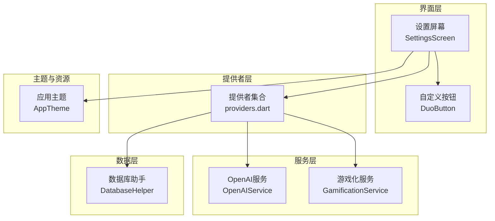
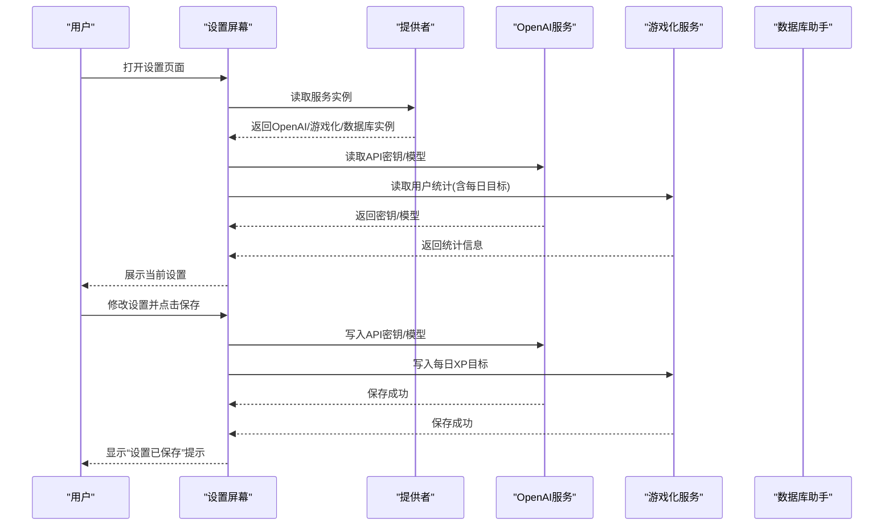
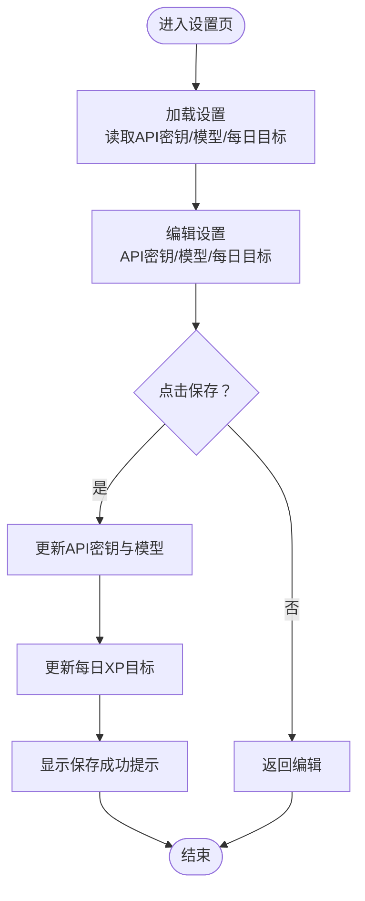
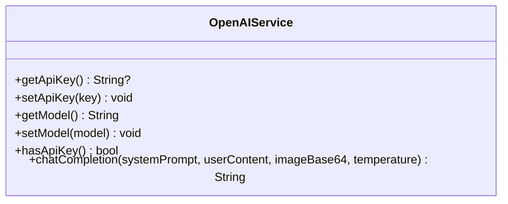
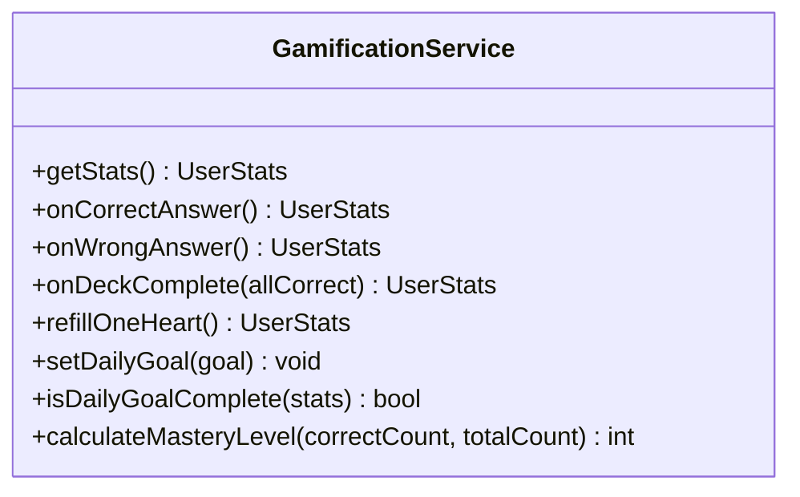
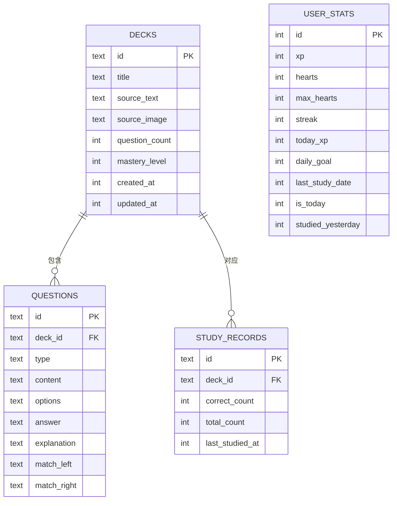
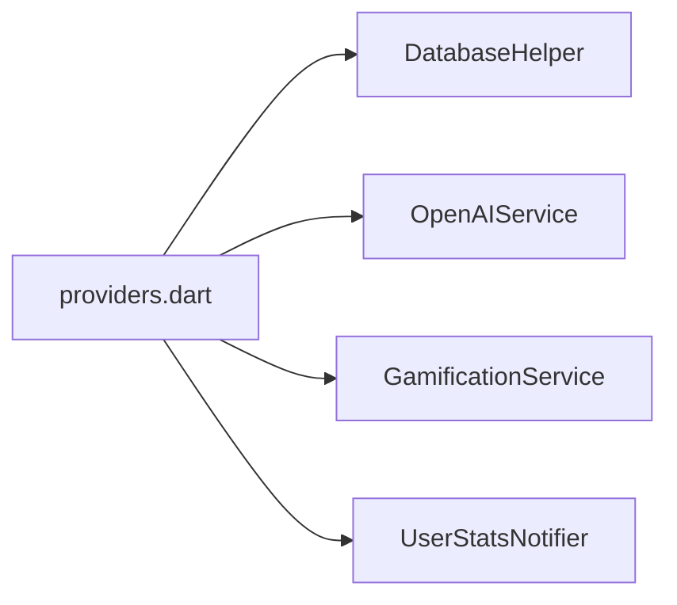
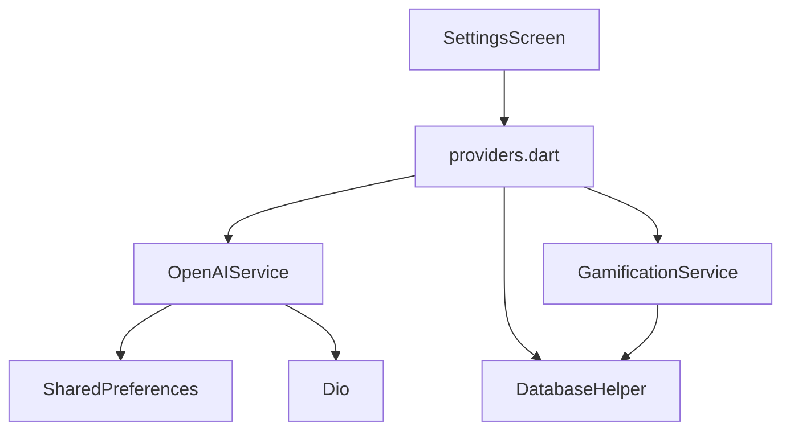

# 设置系统

<cite>
**本文引用的文件**
- [settings_screen.dart](file://lib/features/settings/settings_screen.dart)
- [openai_service.dart](file://lib/services/openai_service.dart)
- [gamification_service.dart](file://lib/services/gamification_service.dart)
- [providers.dart](file://lib/core/providers/providers.dart)
- [app_theme.dart](file://lib/core/theme/app_theme.dart)
- [database_helper.dart](file://lib/data/database/database_helper.dart)
- [duo_button.dart](file://lib/shared/widgets/duo_button.dart)
</cite>

## 目录
1. [简介](#简介)
2. [项目结构](#项目结构)
3. [核心组件](#核心组件)
4. [架构总览](#架构总览)
5. [详细组件分析](#详细组件分析)
6. [依赖关系分析](#依赖关系分析)
7. [性能与可靠性考量](#性能与可靠性考量)
8. [故障排查指南](#故障排查指南)
9. [结论](#结论)
10. [附录：设置项使用指南](#附录设置项使用指南)

## 简介
本文件面向Dlg-Q的设置系统，提供从功能到实现细节的完整说明。重点覆盖以下方面：
- 配置项：API密钥、模型选择、学习目标（每日XP目标）、数据清理
- 存储与同步：本地SharedPreferences存储API密钥与模型；用户统计数据持久化至SQLite；无云端备份
- 验证与错误处理：API密钥存在性校验、网络请求异常处理、UI反馈与交互保护
- 隐私与安全：敏感信息以密码框显示、本地存储、不涉及云端同步
- 设置项依赖与冲突：模型与API密钥的耦合、每日目标与XP统计的联动
- 使用指南：如何按需定制应用行为

## 项目结构
设置系统主要由以下模块构成：
- 设置界面：负责展示与编辑各项设置，并触发保存流程
- 服务层：
  - OpenAI服务：封装API密钥与模型键值的读写、调用Chat Completions接口
  - 游戏化服务：管理用户统计（XP、心数、连击等）及每日目标
- 数据层：通过数据库助手进行本地持久化
- 提供者（Riverpod）：集中管理服务实例与状态
- 主题与UI：多邻国风格主题与自定义按钮组件

图表来源
- [settings_screen.dart:66-262](file://lib/features/settings/settings_screen.dart#L66-L262)
- [providers.dart:13-27](file://lib/core/providers/providers.dart#L13-L27)
- [openai_service.dart:6-35](file://lib/services/openai_service.dart#L6-L35)
- [gamification_service.dart:5-28](file://lib/services/gamification_service.dart#L5-L28)
- [database_helper.dart:9-30](file://lib/data/database/database_helper.dart#L9-L30)
- [app_theme.dart:6-114](file://lib/core/theme/app_theme.dart#L6-L114)

章节来源
- [settings_screen.dart:1-356](file://lib/features/settings/settings_screen.dart#L1-L356)
- [providers.dart:1-177](file://lib/core/providers/providers.dart#L1-L177)

## 核心组件
- 设置屏幕（SettingsScreen）
  - 加载：启动时读取API密钥、模型、用户统计中的每日目标
  - 编辑：API密钥（密码框）、模型单选、每日XP目标选择
  - 保存：调用OpenAI服务更新密钥与模型，调用游戏化服务更新每日目标
  - 数据清理：弹窗确认后清空题包、题目与学习记录，并刷新列表与统计
- OpenAI服务（OpenAIService）
  - 键值存储：通过SharedPreferences保存API密钥与模型
  - 接口调用：封装Chat Completions请求，包含超时、鉴权头、JSON响应解析
  - 校验：若未设置API密钥则抛出异常
- 游戏化服务（GamificationService）
  - 统计：每日重置逻辑、连击计算、XP增长、心数变化
  - 目标：设置每日XP目标、判断是否达成
- 数据库助手（DatabaseHelper）
  - 表结构：decks、questions、study_records、user_stats
  - CRUD：题包、题目、学习记录、用户统计的增删改查
- 提供者（providers.dart）
  - 服务注入：OpenAI、游戏化、数据库
  - 状态：用户统计状态通知器
- 自定义按钮（DuoButton）
  - 3D凸起样式、禁用态与按下态动画

章节来源
- [settings_screen.dart:14-305](file://lib/features/settings/settings_screen.dart#L14-L305)
- [openai_service.dart:6-109](file://lib/services/openai_service.dart#L6-L109)
- [gamification_service.dart:5-116](file://lib/services/gamification_service.dart#L5-L116)
- [database_helper.dart:9-191](file://lib/data/database/database_helper.dart#L9-L191)
- [providers.dart:13-40](file://lib/core/providers/providers.dart#L13-L40)
- [duo_button.dart:5-103](file://lib/shared/widgets/duo_button.dart#L5-L103)

## 架构总览
设置系统采用“界面-提供者-服务-数据”的分层设计，Riverpod统一管理依赖与状态。

图表来源
- [settings_screen.dart:27-57](file://lib/features/settings/settings_screen.dart#L27-L57)
- [providers.dart:17-27](file://lib/core/providers/providers.dart#L17-L27)
- [openai_service.dart:17-35](file://lib/services/openai_service.dart#L17-L35)
- [gamification_service.dart:98-102](file://lib/services/gamification_service.dart#L98-L102)

## 详细组件分析

### 设置屏幕（SettingsScreen）
- 初始化与加载
  - 启动时异步加载API密钥、模型与每日目标，避免阻塞UI
- 输入控件
  - API密钥：密码框，obscureText为true，保存时trim去空白
  - 模型：单选列表，支持三种模型
  - 每日XP目标：可点选预设值（10/20/30/50/100）
- 保存流程
  - 串行调用OpenAI服务更新密钥与模型
  - 通过用户统计状态通知器更新每日目标
  - 成功后显示绿色提示
- 数据清理
  - 弹窗二次确认，删除所有题包及其关联题目与学习记录
  - 刷新题包列表与用户统计状态

图表来源
- [settings_screen.dart:27-57](file://lib/features/settings/settings_screen.dart#L27-L57)

章节来源
- [settings_screen.dart:14-305](file://lib/features/settings/settings_screen.dart#L14-L305)

### OpenAI服务（OpenAIService）
- 存储
  - 使用SharedPreferences保存API密钥与模型键值
- 调用
  - 封装Dio请求，设置基础URL、超时、鉴权头
  - 支持文本与图片（base64）混合消息
  - 默认温度、JSON响应格式、最大token
- 校验
  - 若未设置API密钥则抛出异常
  - 对HTTP状态码与返回结构进行校验

图表来源
- [openai_service.dart:6-109](file://lib/services/openai_service.dart#L6-L109)

章节来源
- [openai_service.dart:6-109](file://lib/services/openai_service.dart#L6-L109)

### 游戏化服务（GamificationService）
- 统计与每日重置
  - 若非今日，重置当日XP或连击
- XP与心数
  - 正确答题增加XP与当日XP；错误答题扣心但记录学习
- 目标与掌握度
  - 设置每日目标；计算题包掌握度（正确率百分比）

图表来源
- [gamification_service.dart:5-116](file://lib/services/gamification_service.dart#L5-L116)

章节来源
- [gamification_service.dart:5-116](file://lib/services/gamification_service.dart#L5-L116)

### 数据库助手（DatabaseHelper）
- 表结构
  - decks、questions、study_records、user_stats
- 操作
  - 题包：插入、查询、更新、删除（级联删除题目与学习记录）
  - 题目：按题包查询
  - 学习记录：upsert
  - 用户统计：获取与更新

图表来源
- [database_helper.dart:32-191](file://lib/data/database/database_helper.dart#L32-L191)

章节来源
- [database_helper.dart:9-191](file://lib/data/database/database_helper.dart#L9-L191)

### 提供者（providers.dart）
- 服务提供
  - databaseProvider、openaiServiceProvider、gamificationServiceProvider
- 状态提供
  - userStatsProvider（状态通知器用于更新每日目标）

图表来源
- [providers.dart:13-40](file://lib/core/providers/providers.dart#L13-L40)

章节来源
- [providers.dart:1-177](file://lib/core/providers/providers.dart#L1-L177)

### 主题与UI（AppTheme、DuoButton）
- AppTheme：定义浅色主题、颜色体系、字体与组件样式
- DuoButton：自定义3D凸起按钮，支持禁用态与按下动画

章节来源
- [app_theme.dart:6-114](file://lib/core/theme/app_theme.dart#L6-L114)
- [duo_button.dart:5-103](file://lib/shared/widgets/duo_button.dart#L5-L103)

## 依赖关系分析
- 设置屏幕依赖提供者获取服务实例
- OpenAI服务依赖SharedPreferences与Dio
- 游戏化服务依赖数据库助手
- 数据库助手依赖sqflite与SQLite

图表来源
- [settings_screen.dart:27-47](file://lib/features/settings/settings_screen.dart#L27-L47)
- [providers.dart:17-27](file://lib/core/providers/providers.dart#L17-L27)
- [openai_service.dart:17-35](file://lib/services/openai_service.dart#L17-L35)
- [gamification_service.dart:15-28](file://lib/services/gamification_service.dart#L15-L28)
- [database_helper.dart:16-30](file://lib/data/database/database_helper.dart#L16-L30)

章节来源
- [settings_screen.dart:27-47](file://lib/features/settings/settings_screen.dart#L27-L47)
- [providers.dart:13-27](file://lib/core/providers/providers.dart#L13-L27)

## 性能与可靠性考量
- I/O与异步
  - 设置加载与保存均采用异步，避免主线程阻塞
- 网络请求
  - 设置连接与接收超时，减少长时间等待
- 本地存储
  - SharedPreferences键值读写为轻量操作；数据库批量删除题包时会级联删除题目与学习记录
- UI反馈
  - 保存期间禁用按钮，防止重复提交；成功后显示提示

章节来源
- [openai_service.dart:11-15](file://lib/services/openai_service.dart#L11-L15)
- [settings_screen.dart:41-57](file://lib/features/settings/settings_screen.dart#L41-L57)

## 故障排查指南
- 无法保存设置
  - 检查API密钥是否为空；若为空，保存时不会写入密钥
  - 确认网络可用，OpenAI服务的超时与状态码校验
- 未显示任何设置
  - 确认提供者已正确注入服务实例
- 数据清理无效
  - 确认弹窗确认流程已完成；检查题包列表与统计是否刷新

章节来源
- [openai_service.dart:52-55](file://lib/services/openai_service.dart#L52-L55)
- [settings_screen.dart:265-304](file://lib/features/settings/settings_screen.dart#L265-L304)
- [providers.dart:17-27](file://lib/core/providers/providers.dart#L17-L27)

## 结论
设置系统围绕“本地存储+本地数据库”的架构设计，提供了简洁可靠的配置入口。API密钥与模型通过SharedPreferences管理，用户统计数据持久化于SQLite。系统在交互层面具备良好的防误触与反馈机制，在错误处理上明确区分了密钥缺失与网络异常两类场景。当前未实现云端备份与同步，建议在后续版本中评估引入端到端加密的备份方案以提升数据可移植性与容灾能力。

## 附录：设置项使用指南
- API密钥设置
  - 在“OpenAI配置”区域输入密钥，系统将以密码框形式隐藏
  - 保存后立即生效；如未设置，调用模型将抛出异常
- 模型选择
  - 支持三种模型；不同模型在性能与功能上有所差异
- 每日XP目标
  - 选择10/20/30/50/100 XP作为当日学习目标
  - 达成目标后可在统计中体现
- 数据管理
  - “清除所有数据”会删除题包、题目与学习记录；操作不可逆，请谨慎使用

章节来源
- [settings_screen.dart:81-257](file://lib/features/settings/settings_screen.dart#L81-L257)
- [openai_service.dart:17-35](file://lib/services/openai_service.dart#L17-L35)
- [gamification_service.dart:98-107](file://lib/services/gamification_service.dart#L98-L107)