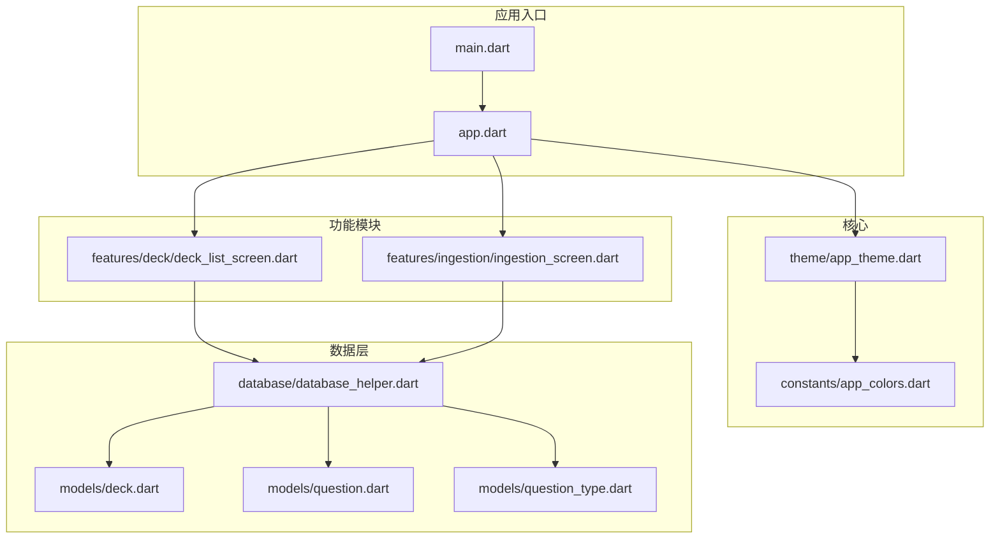
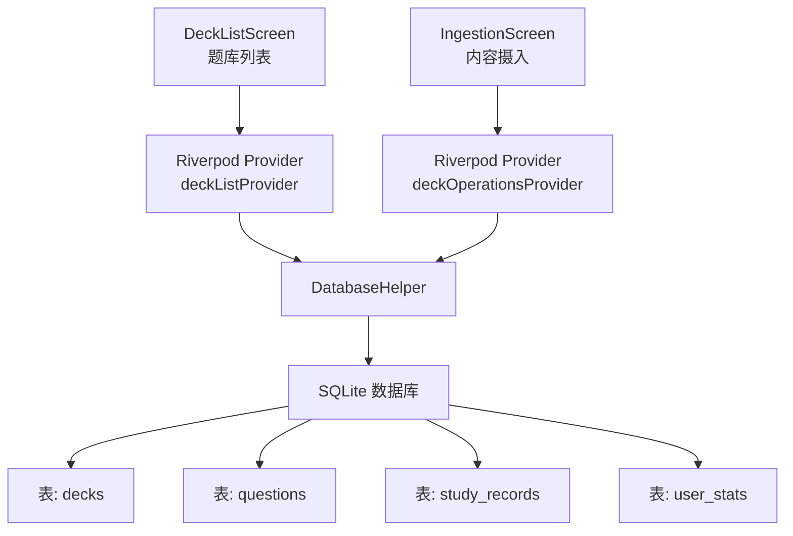
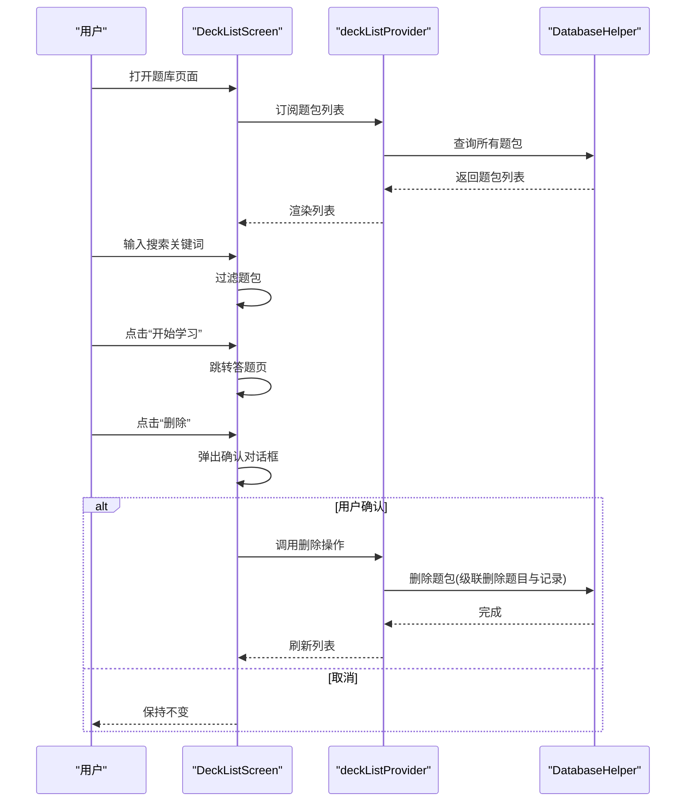
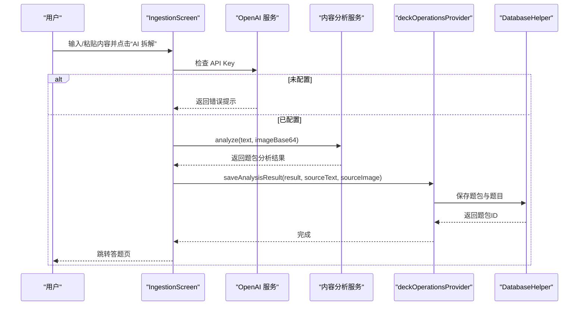
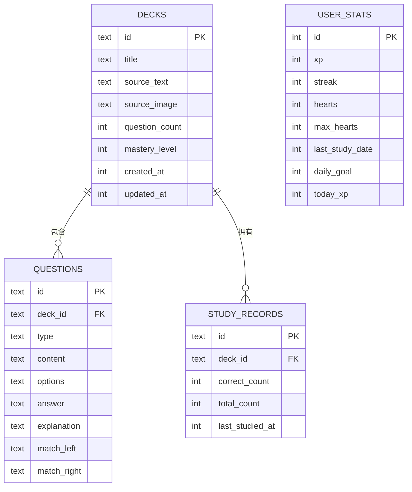
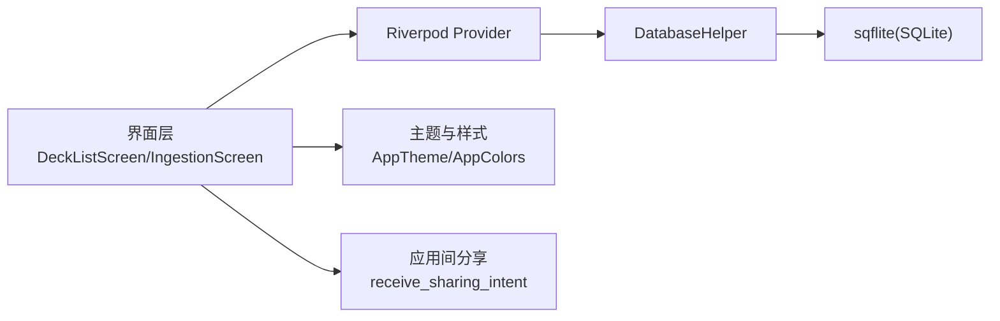

# 题库管理系统

<cite>
**本文档引用的文件**
- [lib/main.dart](file://lib/main.dart)
- [lib/app.dart](file://lib/app.dart)
- [lib/core/theme/app_theme.dart](file://lib/core/theme/app_theme.dart)
- [lib/core/constants/app_colors.dart](file://lib/core/constants/app_colors.dart)
- [lib/data/database/database_helper.dart](file://lib/data/database/database_helper.dart)
- [lib/data/models/deck.dart](file://lib/data/models/deck.dart)
- [lib/data/models/question.dart](file://lib/data/models/question.dart)
- [lib/data/models/question_type.dart](file://lib/data/models/question_type.dart)
- [lib/features/deck/deck_list_screen.dart](file://lib/features/deck/deck_list_screen.dart)
- [lib/features/ingestion/ingestion_screen.dart](file://lib/features/ingestion/ingestion_screen.dart)
- [README.md](file://README.md)
</cite>

## 目录
1. [简介](#简介)
2. [项目结构](#项目结构)
3. [核心组件](#核心组件)
4. [架构总览](#架构总览)
5. [详细组件分析](#详细组件分析)
6. [依赖关系分析](#依赖关系分析)
7. [性能考虑](#性能考虑)
8. [故障排查指南](#故障排查指南)
9. [结论](#结论)
10. [附录](#附录)

## 简介
本系统是一个基于 Flutter 的题库管理系统，围绕“题包（Deck）”与“题目（Question）”两大核心实体构建，支持从文本/图片内容中由 AI 自动生成题目，形成题包并进行学习与复习。系统采用 Riverpod 状态管理、SQLite 数据持久化，界面遵循多邻国风格主题设计。

## 项目结构
项目采用按功能域分层的目录组织方式：
- 应用入口与导航：lib/main.dart、lib/app.dart
- 核心主题与常量：lib/core/theme/app_theme.dart、lib/core/constants/app_colors.dart
- 数据层：lib/data/database/database_helper.dart、lib/data/models/*
- 功能模块：lib/features/deck/deck_list_screen.dart、lib/features/ingestion/ingestion_screen.dart 等
- 共享组件：lib/shared/widgets/*
- 服务层：lib/services/*（如 gamification_service.dart、openai_service.dart）

图表来源
- [lib/main.dart:1-36](file://lib/main.dart#L1-L36)
- [lib/app.dart:1-111](file://lib/app.dart#L1-L111)
- [lib/core/theme/app_theme.dart:1-116](file://lib/core/theme/app_theme.dart#L1-L116)
- [lib/core/constants/app_colors.dart:1-43](file://lib/core/constants/app_colors.dart#L1-L43)
- [lib/data/database/database_helper.dart:1-192](file://lib/data/database/database_helper.dart#L1-L192)
- [lib/data/models/deck.dart:1-71](file://lib/data/models/deck.dart#L1-L71)
- [lib/data/models/question.dart:1-76](file://lib/data/models/question.dart#L1-L76)
- [lib/data/models/question_type.dart:1-20](file://lib/data/models/question_type.dart#L1-L20)
- [lib/features/deck/deck_list_screen.dart:1-314](file://lib/features/deck/deck_list_screen.dart#L1-L314)
- [lib/features/ingestion/ingestion_screen.dart:1-335](file://lib/features/ingestion/ingestion_screen.dart#L1-L335)

章节来源
- [lib/main.dart:1-36](file://lib/main.dart#L1-L36)
- [lib/app.dart:1-111](file://lib/app.dart#L1-L111)
- [README.md:1-18](file://README.md#L1-L18)

## 核心组件
- 题包（Deck）：代表一个内容拆解出的题目集合，包含标题、来源文本/图片、题目数量、掌握度、创建/更新时间等字段。
- 题目（Question）：包含题型、题干、选项、正确答案、解析以及匹配题左右两列等字段；支持多种题型。
- 题目类型（QuestionType）：枚举类型，支持选择题、填空题、判断题、匹配题、排序题。
- 数据库助手（DatabaseHelper）：封装 SQLite 表结构与 CRUD 操作，负责题包、题目、学习记录、用户统计的持久化。
- 题库列表（DeckListScreen）：展示题包列表、搜索过滤、删除确认、跳转学习等功能。
- 内容摄入（IngestionScreen）：接收分享或剪贴板内容，调用 AI 分析生成题包并自动进入答题页。

章节来源
- [lib/data/models/deck.dart:1-71](file://lib/data/models/deck.dart#L1-L71)
- [lib/data/models/question.dart:1-76](file://lib/data/models/question.dart#L1-L76)
- [lib/data/models/question_type.dart:1-20](file://lib/data/models/question_type.dart#L1-L20)
- [lib/data/database/database_helper.dart:1-192](file://lib/data/database/database_helper.dart#L1-L192)
- [lib/features/deck/deck_list_screen.dart:1-314](file://lib/features/deck/deck_list_screen.dart#L1-L314)
- [lib/features/ingestion/ingestion_screen.dart:1-335](file://lib/features/ingestion/ingestion_screen.dart#L1-L335)

## 架构总览
系统采用“界面层-状态管理-数据层-数据库”的分层架构：
- 界面层：使用 Flutter Material 组件与自定义主题，提供题库列表、内容摄入、学习等页面。
- 状态管理：使用 Riverpod 提供响应式状态与 Provider，实现数据订阅与刷新。
- 数据层：通过 DatabaseHelper 统一管理 SQLite 访问，提供题包、题目、学习记录、用户统计的增删改查。
- 数据库：SQLite 表结构清晰，外键约束保证数据一致性，支持级联删除。

图表来源
- [lib/features/deck/deck_list_screen.dart:1-314](file://lib/features/deck/deck_list_screen.dart#L1-L314)
- [lib/features/ingestion/ingestion_screen.dart:1-335](file://lib/features/ingestion/ingestion_screen.dart#L1-L335)
- [lib/data/database/database_helper.dart:1-192](file://lib/data/database/database_helper.dart#L1-L192)

## 详细组件分析

### 题库列表（DeckListScreen）
- 功能要点
  - 支持搜索过滤题包标题
  - 展示题包基本信息（标题、题目数、创建日期、掌握度进度条）
  - 提供“开始学习/继续学习”按钮跳转答题页
  - 提供删除确认对话框，删除时级联清理题目与学习记录
- 交互流程
  - 加载题包列表 → 搜索过滤 → 列表项点击学习 → 删除菜单确认 → 删除后刷新列表

图表来源
- [lib/features/deck/deck_list_screen.dart:1-314](file://lib/features/deck/deck_list_screen.dart#L1-L314)
- [lib/data/database/database_helper.dart:128-133](file://lib/data/database/database_helper.dart#L128-L133)

章节来源
- [lib/features/deck/deck_list_screen.dart:1-314](file://lib/features/deck/deck_list_screen.dart#L1-L314)

### 内容摄入与题包生成（IngestionScreen）
- 功能要点
  - 支持从分享或剪贴板导入文本/图片
  - 调用内容分析服务生成题包结构
  - 自动保存题包并跳转答题页
  - 显示加载动画与状态提示
- 交互流程
  - 输入/粘贴内容 → 校验 OpenAI Key → 调用分析 → 生成题目 → 保存题包 → 跳转答题页

图表来源
- [lib/features/ingestion/ingestion_screen.dart:1-335](file://lib/features/ingestion/ingestion_screen.dart#L1-L335)
- [lib/data/database/database_helper.dart:104-153](file://lib/data/database/database_helper.dart#L104-L153)

章节来源
- [lib/features/ingestion/ingestion_screen.dart:1-335](file://lib/features/ingestion/ingestion_screen.dart#L1-L335)

### 数据模型与持久化（DatabaseHelper 与模型）
- 数据模型
  - 题包（Deck）：包含唯一标识、标题、来源文本/图片、题目数量、掌握度、创建/更新时间
  - 题目（Question）：包含题型、题干、选项、正确答案、解析、匹配题左右列等
  - 题目类型（QuestionType）：枚举值映射字符串与标签
- 数据库表结构
  - decks：主键 id，外键约束用于级联删除
  - questions：外键 deck_id 关联 decks，存储题目详情
  - study_records：记录每套题包的学习情况
  - user_stats：单行记录用户 XP、连击、心数等
- 数据访问模式
  - 插入/查询/更新/删除均通过统一的 DatabaseHelper 方法完成
  - 使用 toMap/fromMap 实现模型与数据库行之间的序列化/反序列化
  - 使用冲突算法 replace 实现“插入或替换”的 upsert 模式

图表来源
- [lib/data/database/database_helper.dart:32-100](file://lib/data/database/database_helper.dart#L32-L100)
- [lib/data/models/deck.dart:45-70](file://lib/data/models/deck.dart#L45-L70)
- [lib/data/models/question.dart:28-54](file://lib/data/models/question.dart#L28-L54)

章节来源
- [lib/data/models/deck.dart:1-71](file://lib/data/models/deck.dart#L1-L71)
- [lib/data/models/question.dart:1-76](file://lib/data/models/question.dart#L1-L76)
- [lib/data/models/question_type.dart:1-20](file://lib/data/models/question_type.dart#L1-L20)
- [lib/data/database/database_helper.dart:1-192](file://lib/data/database/database_helper.dart#L1-L192)

### 题目类型与分类管理
- 支持的题目类型
  - multiple_choice：选择题
  - fill_blank：填空题
  - true_false：判断题
  - matching：匹配题（含左右两列）
  - ordering：排序题
- 分类与组织
  - 题目按所属题包（deckId）组织，通过外键关联
  - 题包可按标题搜索与筛选
  - 掌握度（masteryLevel）用于进度可视化与学习建议

章节来源
- [lib/data/models/question_type.dart:1-20](file://lib/data/models/question_type.dart#L1-L20)
- [lib/data/models/question.dart:1-76](file://lib/data/models/question.dart#L1-L76)
- [lib/features/deck/deck_list_screen.dart:54-58](file://lib/features/deck/deck_list_screen.dart#L54-L58)

### 批量操作与用户体验
- 批量删除：删除题包时自动级联删除其下所有题目与学习记录，避免脏数据
- 搜索过滤：实时根据题包标题进行过滤
- 进度可视化：根据掌握度显示不同颜色与百分比进度条
- 流畅的加载与反馈：摄入页面提供状态提示与进度指示器

章节来源
- [lib/data/database/database_helper.dart:128-133](file://lib/data/database/database_helper.dart#L128-L133)
- [lib/features/deck/deck_list_screen.dart:54-58](file://lib/features/deck/deck_list_screen.dart#L54-L58)
- [lib/features/deck/deck_list_screen.dart:246-280](file://lib/features/deck/deck_list_screen.dart#L246-L280)
- [lib/features/ingestion/ingestion_screen.dart:278-333](file://lib/features/ingestion/ingestion_screen.dart#L278-L333)

## 依赖关系分析
- 组件耦合
  - 界面层仅依赖 Riverpod Provider，不直接访问数据库，降低耦合
  - DatabaseHelper 作为单一数据源，集中处理 CRUD 逻辑
- 外部依赖
  - sqflite：本地 SQLite 数据库
  - flutter_riverpod：状态管理
  - receive_sharing_intent：处理应用间分享
  - google_fonts：字体主题
- 可能的循环依赖
  - 当前结构无明显循环依赖；若后续扩展服务层，需确保 Provider 与服务解耦

图表来源
- [lib/features/deck/deck_list_screen.dart:1-314](file://lib/features/deck/deck_list_screen.dart#L1-L314)
- [lib/features/ingestion/ingestion_screen.dart:1-335](file://lib/features/ingestion/ingestion_screen.dart#L1-L335)
- [lib/data/database/database_helper.dart:1-192](file://lib/data/database/database_helper.dart#L1-L192)
- [lib/core/theme/app_theme.dart:1-116](file://lib/core/theme/app_theme.dart#L1-L116)
- [lib/core/constants/app_colors.dart:1-43](file://lib/core/constants/app_colors.dart#L1-L43)

章节来源
- [lib/main.dart:1-36](file://lib/main.dart#L1-L36)
- [lib/app.dart:1-111](file://lib/app.dart#L1-L111)

## 性能考虑
- 数据库优化
  - 使用索引：可在 decks.created_at 上建立索引以提升排序查询性能
  - 批量写入：在生成大量题目时，可考虑事务包裹减少 IO 次数
- 界面渲染
  - 列表使用 ListView.builder，按需渲染，避免一次性加载过多卡片
  - 搜索过滤在内存中进行，建议对题包数量较大时增加分页或服务端过滤
- 网络与 AI
  - 分析过程耗时较长，应保持加载状态与错误提示，避免阻塞 UI
  - 对外部 API Key 的检查可缓存结果，减少重复校验

## 故障排查指南
- 无法删除题包
  - 检查是否触发了删除确认对话框
  - 查看数据库日志，确认是否执行了级联删除
- 题包为空或搜索无结果
  - 确认是否已成功生成题包并保存
  - 检查搜索关键词大小写与拼写
- AI 分析失败
  - 确认已配置 OpenAI API Key
  - 检查网络连接与返回格式
- 图片加载异常
  - 确认分享的图片路径有效且可读
  - 捕获异常并降级显示占位图

章节来源
- [lib/features/deck/deck_list_screen.dart:124-148](file://lib/features/deck/deck_list_screen.dart#L124-L148)
- [lib/features/ingestion/ingestion_screen.dart:76-82](file://lib/features/ingestion/ingestion_screen.dart#L76-L82)
- [lib/features/ingestion/ingestion_screen.dart:118-126](file://lib/features/ingestion/ingestion_screen.dart#L118-L126)

## 结论
本系统以清晰的数据模型与分层架构为基础，结合 Riverpod 状态管理与 SQLite 持久化，实现了从内容摄入到题库管理再到学习反馈的完整闭环。界面简洁直观，支持多种题目类型与进度可视化，具备良好的扩展性与可维护性。

## 附录

### 最佳实践
- 题目质量控制
  - 在生成题目后提供人工审核入口（建议扩展）
  - 建立题目难度分级与标签体系（建议扩展）
- 分类策略
  - 以题包为单位进行分类，题包内题目按知识点细分
  - 支持自定义标签与收藏夹（建议扩展）
- 用户自定义选项
  - 支持每日目标、心数上限、连击奖励等个性化设置（建议扩展）
- 扩展性设计
  - 新增题目类型：在 QuestionType 中新增枚举值并在 Question 模型中扩展字段
  - 新增管理功能：通过 Provider 注入新功能模块，保持与数据库层解耦

### 数据库迁移建议
- 版本升级：每次新增表或字段时，增加版本号并编写迁移脚本
- 索引优化：针对高频查询字段建立索引
- 备份策略：定期导出 user_stats 与 study_records 以便恢复