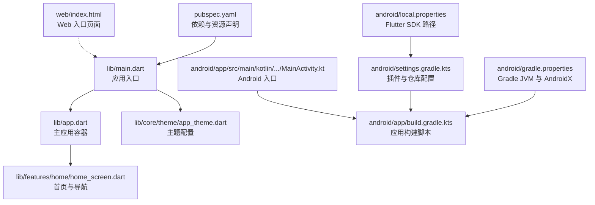
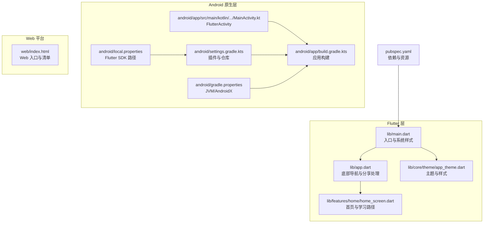
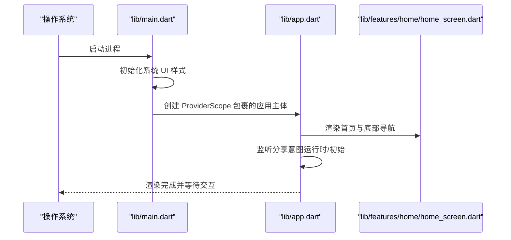
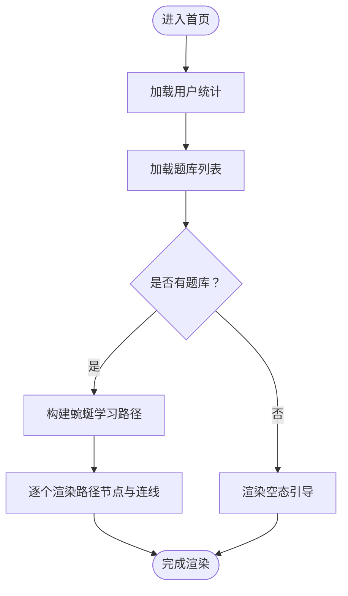
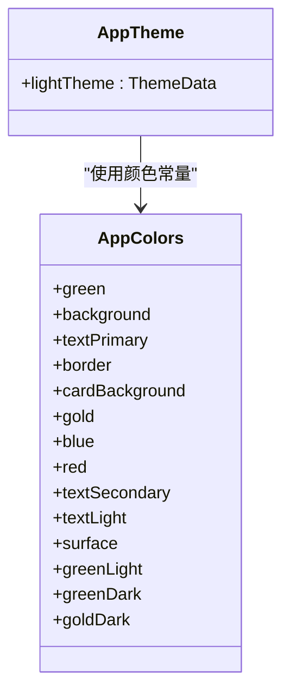
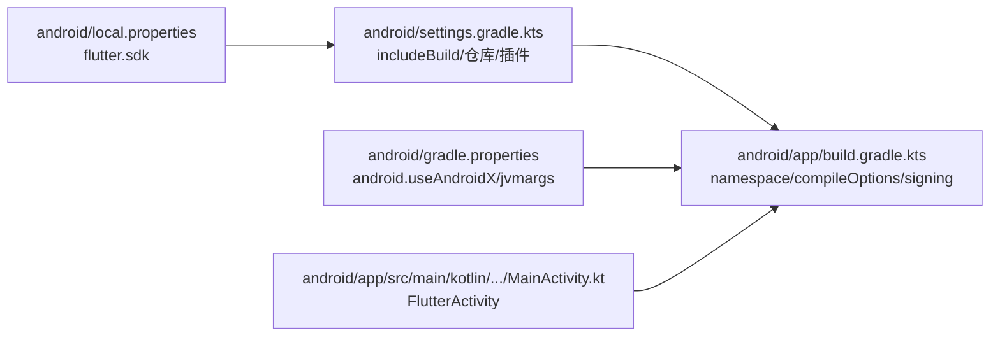
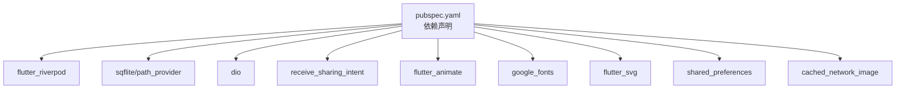

# 快速开始

<cite>
**本文引用的文件**
- [pubspec.yaml](file://pubspec.yaml)
- [main.dart](file://lib/main.dart)
- [app.dart](file://lib/app.dart)
- [home_screen.dart](file://lib/features/home/home_screen.dart)
- [app_theme.dart](file://lib/core/theme/app_theme.dart)
- [MainActivity.kt](file://android/app/src/main/kotlin/com/example/dlg_q/MainActivity.kt)
- [build.gradle.kts（应用层）](file://android/app/build.gradle.kts)
- [build.gradle.kts（根工程）](file://android/build.gradle.kts)
- [settings.gradle.kts](file://android/settings.gradle.kts)
- [gradle.properties](file://android/gradle.properties)
- [local.properties](file://android/local.properties)
- [index.html（Web）](file://web/index.html)
- [widget_test.dart](file://test/widget_test.dart)
- [analysis_options.yaml](file://analysis_options.yaml)
- [README.md](file://README.md)
</cite>

## 目录
1. [简介](#简介)
2. [项目结构](#项目结构)
3. [核心组件](#核心组件)
4. [架构总览](#架构总览)
5. [详细组件分析](#详细组件分析)
6. [依赖分析](#依赖分析)
7. [性能考虑](#性能考虑)
8. [故障排除指南](#故障排除指南)
9. [结论](#结论)
10. [附录](#附录)

## 简介
本指南面向希望快速搭建并运行 Dlg-Q 项目的开发者，覆盖环境准备（Flutter SDK、Android Studio、模拟器/真机）、依赖安装与解析、运行与调试（含热重载）、常见问题排查以及多层级分步指引。项目基于 Flutter 3.5+，采用 Riverpod 状态管理、SQLite 数据存储、网络请求与动画增强等技术栈。

## 项目结构
Dlg-Q 采用标准 Flutter 工程目录组织，核心入口位于 lib/main.dart；Android 原生集成通过 Kotlin Activity；Web 构建支持位于 web/；测试与分析配置分别在 test/ 与 analysis_options.yaml。

图表来源
- [main.dart:1-36](file://lib/main.dart#L1-L36)
- [app.dart:1-111](file://lib/app.dart#L1-L111)
- [home_screen.dart:1-335](file://lib/features/home/home_screen.dart#L1-L335)
- [app_theme.dart:1-116](file://lib/core/theme/app_theme.dart#L1-L116)
- [MainActivity.kt:1-6](file://android/app/src/main/kotlin/com/example/dlg_q/MainActivity.kt#L1-L6)
- [build.gradle.kts（应用层）:1-46](file://android/app/build.gradle.kts#L1-L46)
- [settings.gradle.kts:1-27](file://android/settings.gradle.kts#L1-L27)
- [gradle.properties:1-7](file://android/gradle.properties#L1-L7)
- [local.properties:1-1](file://android/local.properties#L1-L1)
- [index.html（Web）:1-46](file://web/index.html#L1-L46)
- [pubspec.yaml:1-34](file://pubspec.yaml#L1-L34)

章节来源
- [pubspec.yaml:1-34](file://pubspec.yaml#L1-L34)
- [main.dart:1-36](file://lib/main.dart#L1-L36)
- [app.dart:1-111](file://lib/app.dart#L1-L111)
- [home_screen.dart:1-335](file://lib/features/home/home_screen.dart#L1-L335)
- [app_theme.dart:1-116](file://lib/core/theme/app_theme.dart#L1-L116)
- [MainActivity.kt:1-6](file://android/app/src/main/kotlin/com/example/dlg_q/MainActivity.kt#L1-L6)
- [build.gradle.kts（应用层）:1-46](file://android/app/build.gradle.kts#L1-L46)
- [build.gradle.kts（根工程）:1-25](file://android/build.gradle.kts#L1-L25)
- [settings.gradle.kts:1-27](file://android/settings.gradle.kts#L1-L27)
- [gradle.properties:1-7](file://android/gradle.properties#L1-L7)
- [local.properties:1-1](file://android/local.properties#L1-L1)
- [index.html（Web）:1-46](file://web/index.html#L1-L46)

## 核心组件
- 应用入口与启动：lib/main.dart 初始化系统 UI 样式并通过 ProviderScope 包裹应用主体，随后在 lib/app.dart 中实现底部导航与分享意图处理。
- 主题系统：lib/core/theme/app_theme.dart 定义了浅色主题与 Material 设计参数，统一字体、颜色与控件样式。
- 首页与导航：lib/features/home/home_screen.dart 提供学习路径可视化、空态引导与浮动按钮跳转到内容导入页。
- Android 入口：android/app/src/main/kotlin/com/example/dlg_q/MainActivity.kt 继承 FlutterActivity，作为原生宿主入口。
- Web 支持：web/index.html 提供 Web 平台初始化与清单链接。

章节来源
- [main.dart:1-36](file://lib/main.dart#L1-L36)
- [app.dart:1-111](file://lib/app.dart#L1-L111)
- [app_theme.dart:1-116](file://lib/core/theme/app_theme.dart#L1-L116)
- [home_screen.dart:1-335](file://lib/features/home/home_screen.dart#L1-L335)
- [MainActivity.kt:1-6](file://android/app/src/main/kotlin/com/example/dlg_q/MainActivity.kt#L1-L6)
- [index.html（Web）:1-46](file://web/index.html#L1-L46)

## 架构总览
Dlg-Q 的运行时由 Flutter 引擎驱动，Android 侧通过 Gradle/Kotlin 插件编译打包，Web 侧通过 web/index.html 启动。应用通过 Riverpod 管理状态，首页展示学习路径与题库卡片，并支持通过系统分享能力进入内容导入流程。

图表来源
- [main.dart:1-36](file://lib/main.dart#L1-L36)
- [app.dart:1-111](file://lib/app.dart#L1-L111)
- [home_screen.dart:1-335](file://lib/features/home/home_screen.dart#L1-L335)
- [app_theme.dart:1-116](file://lib/core/theme/app_theme.dart#L1-L116)
- [MainActivity.kt:1-6](file://android/app/src/main/kotlin/com/example/dlg_q/MainActivity.kt#L1-L6)
- [build.gradle.kts（应用层）:1-46](file://android/app/build.gradle.kts#L1-L46)
- [settings.gradle.kts:1-27](file://android/settings.gradle.kts#L1-L27)
- [gradle.properties:1-7](file://android/gradle.properties#L1-L7)
- [local.properties:1-1](file://android/local.properties#L1-L1)
- [index.html（Web）:1-46](file://web/index.html#L1-L46)
- [pubspec.yaml:1-34](file://pubspec.yaml#L1-L34)

## 详细组件分析

### 组件一：应用入口与启动流程
- 入口文件负责初始化引擎、设置状态栏样式，并通过 ProviderScope 包裹应用主体。
- 应用主体在 app.dart 中实现底部导航与分享意图监听，支持运行时与初始分享内容的处理。

图表来源
- [main.dart:1-36](file://lib/main.dart#L1-L36)
- [app.dart:1-111](file://lib/app.dart#L1-L111)
- [home_screen.dart:1-335](file://lib/features/home/home_screen.dart#L1-L335)

章节来源
- [main.dart:1-36](file://lib/main.dart#L1-L36)
- [app.dart:1-111](file://lib/app.dart#L1-L111)

### 组件二：首页与学习路径
- 首页使用 Riverpod 订阅用户统计与题库列表，按需渲染加载态、错误态或学习路径。
- 通过动画库增强节点入场与路径连线，提供良好的视觉反馈。
- 空态时提供引导文案与“添加内容”按钮，点击后进入内容导入页。

图表来源
- [home_screen.dart:1-335](file://lib/features/home/home_screen.dart#L1-L335)

章节来源
- [home_screen.dart:1-335](file://lib/features/home/home_screen.dart#L1-L335)

### 组件三：主题与样式
- 主题系统集中于 app_theme.dart，统一主色、文字、按钮、输入框、卡片与底部导航等组件样式，确保一致的视觉体验。

图表来源
- [app_theme.dart:1-116](file://lib/core/theme/app_theme.dart#L1-L116)

章节来源
- [app_theme.dart:1-116](file://lib/core/theme/app_theme.dart#L1-L116)

### 组件四：Android 构建与插件配置
- settings.gradle.kts 通过 local.properties 注入 Flutter SDK 路径，并声明 Gradle 插件与仓库。
- build.gradle.kts（应用层）配置命名空间、编译选项、签名与 Flutter 源码位置。
- gradle.properties 开启 AndroidX 并设置 JVM 参数。

图表来源
- [settings.gradle.kts:1-27](file://android/settings.gradle.kts#L1-L27)
- [build.gradle.kts（应用层）:1-46](file://android/app/build.gradle.kts#L1-L46)
- [gradle.properties:1-7](file://android/gradle.properties#L1-L7)
- [local.properties:1-1](file://android/local.properties#L1-L1)
- [MainActivity.kt:1-6](file://android/app/src/main/kotlin/com/example/dlg_q/MainActivity.kt#L1-L6)

章节来源
- [settings.gradle.kts:1-27](file://android/settings.gradle.kts#L1-L27)
- [build.gradle.kts（应用层）:1-46](file://android/app/build.gradle.kts#L1-L46)
- [gradle.properties:1-7](file://android/gradle.properties#L1-L7)
- [local.properties:1-1](file://android/local.properties#L1-L1)
- [MainActivity.kt:1-6](file://android/app/src/main/kotlin/com/example/dlg_q/MainActivity.kt#L1-L6)

## 依赖分析
- 语言与框架：Flutter SDK 版本要求 ^3.5.0；Material Design 启用。
- 状态管理：flutter_riverpod 提供响应式状态订阅与 Provider。
- 数据持久化：sqflite + path_provider 实现本地数据库与路径访问。
- 网络与缓存：dio 用于 HTTP 请求，cached_network_image 用于网络图片缓存。
- 分享与动画：receive_sharing_intent 处理系统分享；flutter_animate 提供动画能力。
- 字体与图标：google_fonts 与 flutter_svg。
- 存储偏好：shared_preferences。

图表来源
- [pubspec.yaml:1-34](file://pubspec.yaml#L1-L34)

章节来源
- [pubspec.yaml:1-34](file://pubspec.yaml#L1-L34)

## 性能考虑
- 使用 Riverpod 的细粒度订阅避免不必要的重建。
- 首页在数据加载时显示轻量级指示器，减少阻塞感。
- 动画采用按需入场与延迟策略，降低首屏压力。
- 本地数据库与缓存结合，减少网络抖动对体验的影响。

## 故障排除指南
- 无法找到 Flutter SDK
  - 检查 android/local.properties 是否正确指向 Flutter 安装路径。
  - 参考：[local.properties:1-1](file://android/local.properties#L1-L1)
- Gradle 同步失败或找不到插件
  - 确认 settings.gradle.kts 中已 includeBuild 并配置仓库。
  - 参考：[settings.gradle.kts:1-27](file://android/settings.gradle.kts#L1-L27)
- 编译错误（Java/Kotlin 版本不匹配）
  - 确保 compileOptions 与 Kotlin 编译目标为 JVM 17。
  - 参考：[build.gradle.kts（应用层）:12-41](file://android/app/build.gradle.kts#L12-L41)
- Web 构建异常
  - 检查 web/index.html 的 base href 与 manifest 链接是否正确。
  - 参考：[index.html（Web）:17-33](file://web/index.html#L17-L33)
- 热重载/调试无响应
  - 确认 Android 模拟器/真机已启用开发者选项与 USB 调试（Android），或浏览器已允许网络权限（Web）。
  - 参考：[README.md:5-17](file://README.md#L5-L17)
- 依赖安装失败
  - 执行 flutter pub get 或 flutter pub upgrade，确保网络可访问官方镜像源。
  - 参考：[pubspec.yaml:1-34](file://pubspec.yaml#L1-L34)
- Lint 规则导致的构建警告
  - 可根据 analysis_options.yaml 自定义规则或临时忽略特定规则。
  - 参考：[analysis_options.yaml:1-29](file://analysis_options.yaml#L1-L29)

章节来源
- [local.properties:1-1](file://android/local.properties#L1-L1)
- [settings.gradle.kts:1-27](file://android/settings.gradle.kts#L1-L27)
- [build.gradle.kts（应用层）:12-41](file://android/app/build.gradle.kts#L12-L41)
- [index.html（Web）:17-33](file://web/index.html#L17-L33)
- [README.md:5-17](file://README.md#L5-L17)
- [pubspec.yaml:1-34](file://pubspec.yaml#L1-L34)
- [analysis_options.yaml:1-29](file://analysis_options.yaml#L1-L29)

## 结论
通过本指南，您可以在本地快速完成 Dlg-Q 项目的环境搭建与运行。建议先完成 Flutter SDK 与 Android Studio 配置，再进行依赖安装与设备准备，最后以 flutter run 启动并在需要时切换到 Web 平台验证。遇到问题时，优先核对 Gradle/SDK 路径与网络代理设置。

## 附录

### A. 分步安装与运行指南（适合初学者）
- 步骤 1：安装 Flutter SDK
  - 下载并解压 Flutter 到固定目录，配置 PATH。
  - 在终端执行 flutter doctor 校验环境。
- 步骤 2：安装 Android Studio
  - 安装 Android Studio 与 Android SDK/NDK。
  - 在 AVD Manager 创建模拟器或连接真机。
- 步骤 3：配置本地属性
  - 在 android/local.properties 中写入 flutter.sdk 的实际路径。
  - 参考：[local.properties:1-1](file://android/local.properties#L1-L1)
- 步骤 4：安装依赖
  - 在项目根目录执行 flutter pub get。
  - 参考：[pubspec.yaml:1-34](file://pubspec.yaml#L1-L34)
- 步骤 5：运行应用
  - 在终端执行 flutter run 启动到模拟器/真机。
  - 如需 Web 平台：flutter run -d chrome。
  - 参考：[README.md:5-17](file://README.md#L5-L17)
- 步骤 6：热重载与调试
  - 修改代码后保存，观察控制台提示与设备屏幕更新。
  - 使用断点与日志定位问题。
- 步骤 7：常见问题
  - 若报错找不到 SDK，请确认 ANDROID_HOME 与 flutter.sdk 路径。
  - 若 Gradle 同步失败，清理缓存并重新同步。
  - 参考：[settings.gradle.kts:1-27](file://android/settings.gradle.kts#L1-L27)、[gradle.properties:1-7](file://android/gradle.properties#L1-L7)

章节来源
- [README.md:5-17](file://README.md#L5-L17)
- [pubspec.yaml:1-34](file://pubspec.yaml#L1-L34)
- [local.properties:1-1](file://android/local.properties#L1-L1)
- [settings.gradle.kts:1-27](file://android/settings.gradle.kts#L1-L27)
- [gradle.properties:1-7](file://android/gradle.properties#L1-L7)

### B. 进阶调试与测试
- 单元与集成测试
  - 使用 flutter test 运行测试套件，示例见 test/widget_test.dart。
  - 参考：[widget_test.dart:1-11](file://test/widget_test.dart#L1-L11)
- 代码规范与分析
  - 使用 flutter analyze 检查潜在问题，规则由 analysis_options.yaml 控制。
  - 参考：[analysis_options.yaml:1-29](file://analysis_options.yaml#L1-L29)

章节来源
- [widget_test.dart:1-11](file://test/widget_test.dart#L1-L11)
- [analysis_options.yaml:1-29](file://analysis_options.yaml#L1-L29)