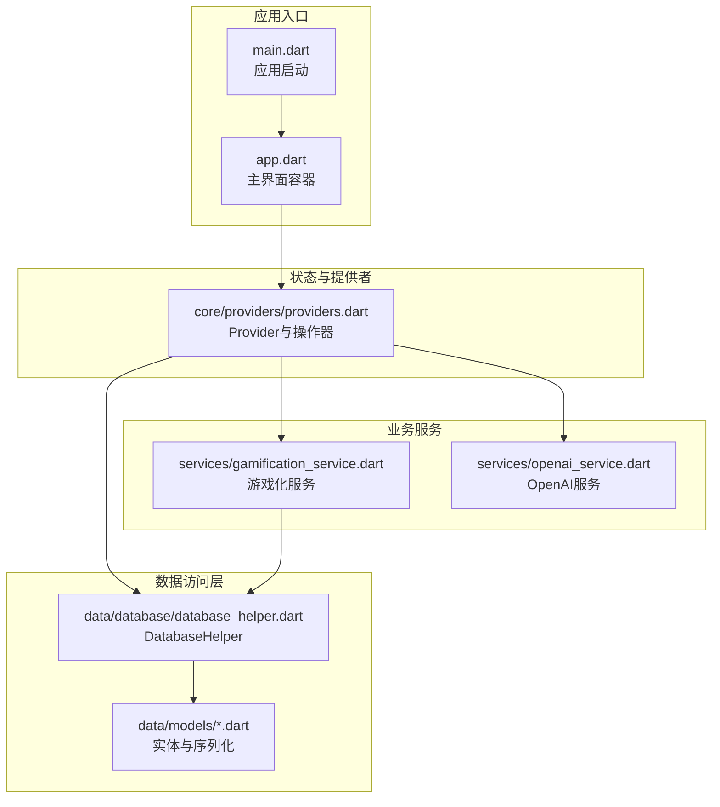
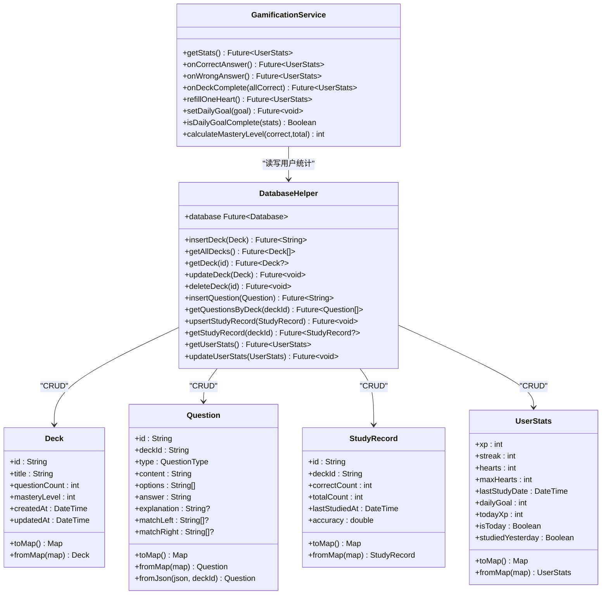
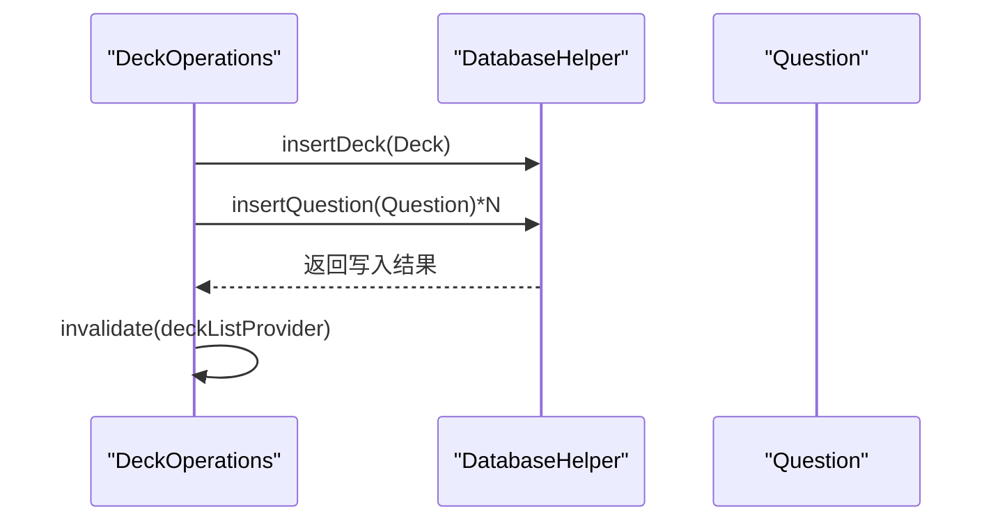
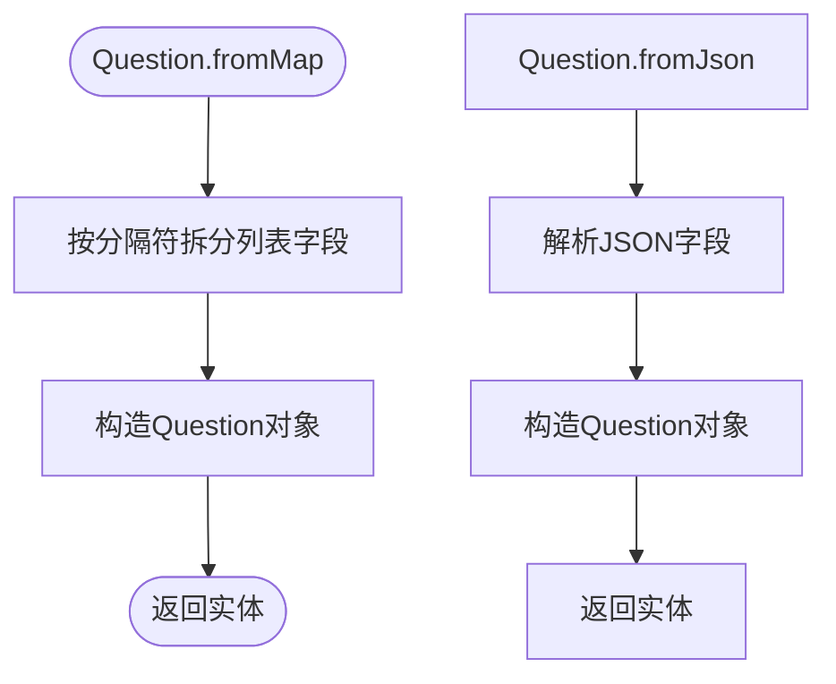
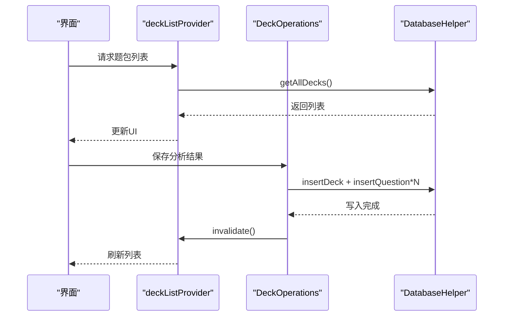
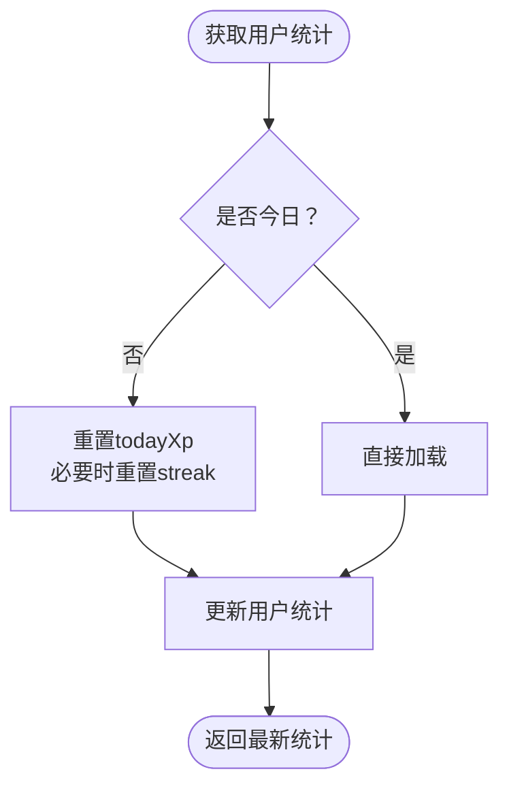
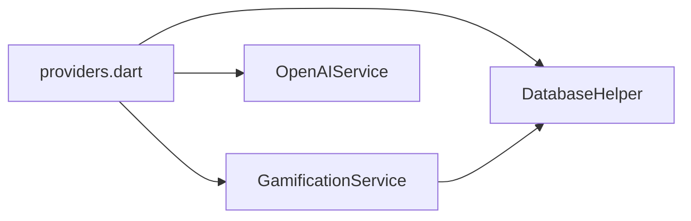

# 仓储层

<cite>
**本文引用的文件**
- [lib/data/database/database_helper.dart](file://lib/data/database/database_helper.dart)
- [lib/data/models/deck.dart](file://lib/data/models/deck.dart)
- [lib/data/models/question.dart](file://lib/data/models/question.dart)
- [lib/data/models/study_record.dart](file://lib/data/models/study_record.dart)
- [lib/data/models/user_stats.dart](file://lib/data/models/user_stats.dart)
- [lib/data/models/question_type.dart](file://lib/data/models/question_type.dart)
- [lib/core/providers/providers.dart](file://lib/core/providers/providers.dart)
- [lib/services/gamification_service.dart](file://lib/services/gamification_service.dart)
- [lib/services/openai_service.dart](file://lib/services/openai_service.dart)
- [lib/main.dart](file://lib/main.dart)
- [lib/app.dart](file://lib/app.dart)
</cite>

## 目录
1. [引言](#引言)
2. [项目结构](#项目结构)
3. [核心组件](#核心组件)
4. [架构总览](#架构总览)
5. [详细组件分析](#详细组件分析)
6. [依赖关系分析](#依赖关系分析)
7. [性能考虑](#性能考虑)
8. [故障排查指南](#故障排查指南)
9. [结论](#结论)
10. [附录](#附录)

## 引言
本文件聚焦于Dlg-Q应用的数据访问层（仓储层）设计与实现，系统性阐述Repository模式在项目中的落地方式、数据模型与DAO的职责边界、典型增删改查与批量操作流程、缓存策略与失效机制、性能优化手段（查询优化、连接池管理、异步处理），并给出事务管理策略与错误处理实践。读者可据此理解如何在Flutter+Riverpod架构下以轻量、可维护的方式组织数据访问逻辑。

## 项目结构
数据访问层主要由以下模块构成：
- 数据库与DAO：基于sqflite的DatabaseHelper，封装对题包、题目、学习记录、用户统计等表的CRUD与关联操作。
- 数据模型：Deck、Question、StudyRecord、UserStats及其序列化/反序列化工具。
- 提供者与业务编排：Riverpod Provider负责实例化与注入DatabaseHelper，并在DeckOperations等操作器中协调DAO与业务服务。
- 业务服务：GamificationService通过DatabaseHelper读写用户统计，实现XP、心数、连续打卡等游戏化逻辑。

图表来源
- [lib/main.dart:1-36](file://lib/main.dart#L1-L36)
- [lib/app.dart:10-111](file://lib/app.dart#L10-L111)
- [lib/core/providers/providers.dart:1-178](file://lib/core/providers/providers.dart#L1-L178)
- [lib/data/database/database_helper.dart:1-192](file://lib/data/database/database_helper.dart#L1-L192)
- [lib/services/gamification_service.dart:1-116](file://lib/services/gamification_service.dart#L1-L116)
- [lib/services/openai_service.dart:1-109](file://lib/services/openai_service.dart#L1-L109)

章节来源
- [lib/main.dart:1-36](file://lib/main.dart#L1-L36)
- [lib/app.dart:10-111](file://lib/app.dart#L10-L111)
- [lib/core/providers/providers.dart:1-178](file://lib/core/providers/providers.dart#L1-L178)

## 核心组件
- DatabaseHelper：单例式数据库访问器，负责数据库初始化、表结构创建、各实体的CRUD与关联删除；提供插入、查询、更新、删除等方法族。
- 实体模型：Deck、Question、StudyRecord、UserStats均提供toMap/fromMap工厂，便于与SQLite字段映射；Question还支持fromJson以适配外部解析结果。
- Riverpod提供者：databaseProvider注入DatabaseHelper；deckListProvider、deckQuestionsProvider、studyRecordProvider等以FutureProvider家族提供数据；DeckOperations作为操作器聚合多表写入与缓存失效。
- 游戏化服务：GamificationService通过DatabaseHelper读取/更新用户统计，结合每日重置、连续打卡、心数扣减等规则，驱动XP增长与目标达成。

章节来源
- [lib/data/database/database_helper.dart:8-192](file://lib/data/database/database_helper.dart#L8-L192)
- [lib/data/models/deck.dart:1-71](file://lib/data/models/deck.dart#L1-L71)
- [lib/data/models/question.dart:1-76](file://lib/data/models/question.dart#L1-L76)
- [lib/data/models/study_record.dart:1-41](file://lib/data/models/study_record.dart#L1-L41)
- [lib/data/models/user_stats.dart:1-83](file://lib/data/models/user_stats.dart#L1-L83)
- [lib/core/providers/providers.dart:13-178](file://lib/core/providers/providers.dart#L13-L178)
- [lib/services/gamification_service.dart:5-116](file://lib/services/gamification_service.dart#L5-L116)

## 架构总览
仓储层采用“DAO + 模型 + 提供者”的分层设计：
- DAO层：DatabaseHelper集中封装SQL操作，按实体划分方法族，保证数据一致性与可测试性。
- 模型层：每个实体具备toMap/fromMap，确保与数据库字段的稳定映射；Question支持fromJson以兼容外部解析。
- 提供者层：Riverpod以Provider/FutureProvider/StateNotifierProvider组织依赖注入与状态管理；DeckOperations统一协调批量写入与缓存失效。
- 业务服务层：GamificationService在DAO之上实现业务规则，如每日重置、XP计算、心数管理等。

图表来源
- [lib/data/database/database_helper.dart:8-192](file://lib/data/database/database_helper.dart#L8-L192)
- [lib/data/models/deck.dart:1-71](file://lib/data/models/deck.dart#L1-L71)
- [lib/data/models/question.dart:1-76](file://lib/data/models/question.dart#L1-L76)
- [lib/data/models/study_record.dart:1-41](file://lib/data/models/study_record.dart#L1-L41)
- [lib/data/models/user_stats.dart:1-83](file://lib/data/models/user_stats.dart#L1-L83)
- [lib/services/gamification_service.dart:5-116](file://lib/services/gamification_service.dart#L5-L116)

## 详细组件分析

### DatabaseHelper：仓储实现与事务策略
- 单例与延迟初始化：通过内部构造函数与工厂构造保持单例，首次使用时打开数据库并执行建表与初始化。
- 表结构与约束：decks/questions/study_records/user_stats四张表，外键级联删除保证数据一致性；user_stats为单行表，初始化默认值。
- CRUD方法族：
  - 题包：insertDeck/getAllDecks/getDeck/updateDeck/deleteDeck（删除时级联清理questions与study_records）。
  - 题目：insertQuestion/getQuestionsByDeck（按deck_id过滤）。
  - 学习记录：upsertStudyRecord（replace冲突算法实现UPSERT）、getStudyRecord。
  - 用户统计：getUserStats/updateUserStats（固定id=1）。
- 事务策略：当前实现未显式开启事务块。对于批量写入（如保存分析结果），建议在调用方进行事务包裹以提升一致性与性能。

图表来源
- [lib/core/providers/providers.dart:102-141](file://lib/core/providers/providers.dart#L102-L141)
- [lib/data/database/database_helper.dart:104-153](file://lib/data/database/database_helper.dart#L104-L153)

章节来源
- [lib/data/database/database_helper.dart:8-192](file://lib/data/database/database_helper.dart#L8-L192)
- [lib/core/providers/providers.dart:102-141](file://lib/core/providers/providers.dart#L102-L141)

### 数据模型：序列化与跨层映射
- Deck/StudyRecord/UserStats：toMap/fromMap直接映射到SQLite字段，时间戳统一使用毫秒时间戳。
- Question：toMap/fromMap将列表以特殊分隔符存储；fromMap恢复；fromJson支持从外部JSON构建，便于内容解析后入库。
- QuestionType：字符串枚举，支持fromString转换，保证类型安全与持久化兼容。

图表来源
- [lib/data/models/question.dart:42-54](file://lib/data/models/question.dart#L42-L54)
- [lib/data/models/question.dart:57-74](file://lib/data/models/question.dart#L57-L74)

章节来源
- [lib/data/models/deck.dart:45-70](file://lib/data/models/deck.dart#L45-L70)
- [lib/data/models/question.dart:28-54](file://lib/data/models/question.dart#L28-L54)
- [lib/data/models/study_record.dart:19-40](file://lib/data/models/study_record.dart#L19-L40)
- [lib/data/models/user_stats.dart:41-65](file://lib/data/models/user_stats.dart#L41-L65)
- [lib/data/models/question_type.dart:13-18](file://lib/data/models/question_type.dart#L13-L18)

### Riverpod提供者与操作器：仓储编排
- databaseProvider：全局注入DatabaseHelper。
- deckListProvider/deckQuestionsProvider/studyRecordProvider：以FutureProvider家族提供数据源，自动触发刷新。
- DeckOperations：聚合保存分析结果、删除题包、更新掌握度、保存学习记录等操作；每次成功写入后invalidate相关Provider，确保UI状态与数据库一致。
- UserStatsNotifier：封装用户统计的状态加载、正确/错误反馈、完成题包奖励、目标设置与刷新。

图表来源
- [lib/core/providers/providers.dart:32-35](file://lib/core/providers/providers.dart#L32-L35)
- [lib/core/providers/providers.dart:102-141](file://lib/core/providers/providers.dart#L102-L141)
- [lib/data/database/database_helper.dart:104-153](file://lib/data/database/database_helper.dart#L104-L153)

章节来源
- [lib/core/providers/providers.dart:13-178](file://lib/core/providers/providers.dart#L13-L178)

### 游戏化服务：仓储之上的业务规则
- 每日重置：若非今日，重置todayXp；若昨天未学习则重置streak。
- XP与心数：答对增加XP与今日XP；答错扣心，但记录当日学习行为以维持streak。
- 题包完成奖励：根据全对与否给予不同XP奖励。
- 掌握度计算：基于正确/总数计算百分比并取整。

图表来源
- [lib/services/gamification_service.dart:14-28](file://lib/services/gamification_service.dart#L14-L28)

章节来源
- [lib/services/gamification_service.dart:5-116](file://lib/services/gamification_service.dart#L5-L116)

## 依赖关系分析
- 组件耦合：DatabaseHelper被GamificationService与DeckOperations共同依赖；Riverpod提供者作为粘合层，降低上层对具体DAO的感知。
- 外部依赖：sqflite（本地数据库）、shared_preferences（OpenAI配置存储）、dio（HTTP客户端）。
- 循环依赖：当前未发现循环依赖；GamificationService仅读写UserStats，不反向依赖DAO。

图表来源
- [lib/core/providers/providers.dart:13-27](file://lib/core/providers/providers.dart#L13-L27)
- [lib/services/gamification_service.dart:6-8](file://lib/services/gamification_service.dart#L6-L8)

章节来源
- [lib/core/providers/providers.dart:1-178](file://lib/core/providers/providers.dart#L1-L178)
- [lib/services/gamification_service.dart:1-116](file://lib/services/gamification_service.dart#L1-L116)

## 性能考虑
- 查询优化
  - 使用索引：对高频查询字段（如decks.created_at、questions.deck_id、study_records.deck_id、user_stats.id）可考虑建立索引以加速排序与过滤。
  - 分页与限制：在列表查询中加入LIMIT/OFFSET或游标分页，避免一次性加载过多数据。
  - 条件查询：优先使用带索引的WHERE条件，减少全表扫描。
- 连接池与并发
  - sqflite默认使用连接池，建议避免在同一事务内长时间持有锁；批量写入时合并为单事务，减少提交次数。
  - 在高并发场景下，合理拆分读写路径，避免UI线程阻塞。
- 异步与缓存
  - Riverpod的FutureProvider已内置异步加载与缓存；DeckOperations在写入后invalidate相关Provider，确保UI及时更新。
  - 当前未实现显式内存缓存；可在Provider层引入MemoryCache以减少重复查询（需注意失效策略）。
- 批量操作
  - 保存分析结果时，insertDeck与insertQuestion应置于同一事务中，失败回滚保证一致性。
- I/O与序列化
  - Question的toMap/fromMap使用分隔符存储列表，注意分隔符不会出现在正常内容中；序列化开销较小，仍建议避免频繁大对象转换。

[本节为通用性能指导，不直接分析特定文件，故无章节来源]

## 故障排查指南
- 数据库初始化失败
  - 检查数据库路径与权限；确认_onCreate回调成功执行并创建所有表。
- 查询为空
  - 确认where条件与参数绑定正确；检查外键是否存在；验证数据是否已被删除（如级联删除）。
- 写入异常
  - 检查主键冲突与唯一约束；对于UPSERTr使用replace算法时，确认字段覆盖策略符合预期。
- 缓存未刷新
  - 确认写入后调用了invalidate；检查Provider作用域与重建时机。
- 游戏化统计异常
  - 检查每日重置逻辑与时间判断；确认lastStudyDate与系统时间一致。

章节来源
- [lib/data/database/database_helper.dart:32-100](file://lib/data/database/database_helper.dart#L32-L100)
- [lib/core/providers/providers.dart:160-177](file://lib/core/providers/providers.dart#L160-L177)
- [lib/services/gamification_service.dart:14-28](file://lib/services/gamification_service.dart#L14-L28)

## 结论
本仓储层以DatabaseHelper为核心，围绕实体模型提供清晰的CRUD接口，并通过Riverpod提供者实现依赖注入与状态编排。Game化服务在DAO之上实现了业务规则与数据一致性保障。建议后续在批量写入场景引入显式事务、在Provider层增加内存缓存与失效策略，并对高频查询字段建立索引以进一步提升性能与稳定性。

## 附录
- 关键实现位置参考
  - 数据库初始化与建表：[lib/data/database/database_helper.dart:22-100](file://lib/data/database/database_helper.dart#L22-L100)
  - 题包CRUD：[lib/data/database/database_helper.dart:104-133](file://lib/data/database/database_helper.dart#L104-L133)
  - 题目CRUD：[lib/data/database/database_helper.dart:137-159](file://lib/data/database/database_helper.dart#L137-L159)
  - 学习记录UPSERT：[lib/data/database/database_helper.dart:163-174](file://lib/data/database/database_helper.dart#L163-L174)
  - 用户统计读写：[lib/data/database/database_helper.dart:178-190](file://lib/data/database/database_helper.dart#L178-L190)
  - Provider与操作器：[lib/core/providers/providers.dart:13-178](file://lib/core/providers/providers.dart#L13-L178)
  - 游戏化服务：[lib/services/gamification_service.dart:5-116](file://lib/services/gamification_service.dart#L5-L116)
  - OpenAI服务（外部集成）：[lib/services/openai_service.dart:1-109](file://lib/services/openai_service.dart#L1-L109)