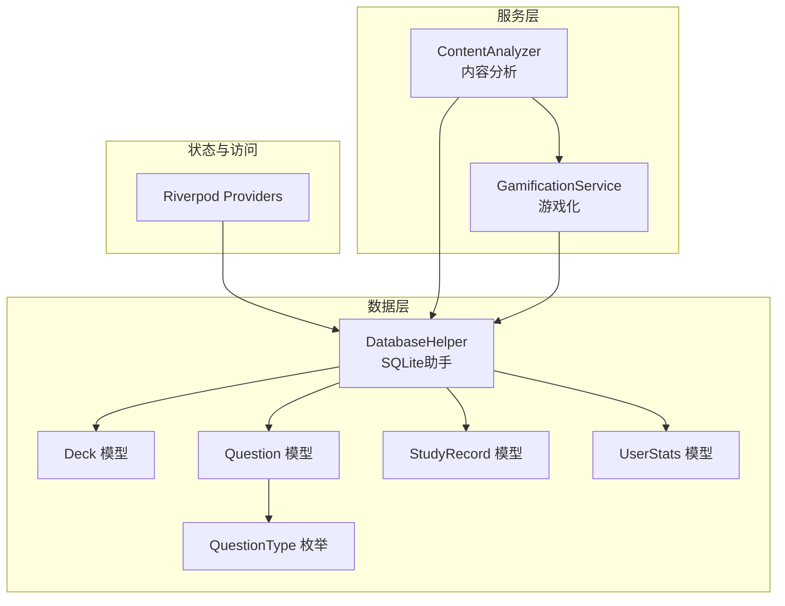
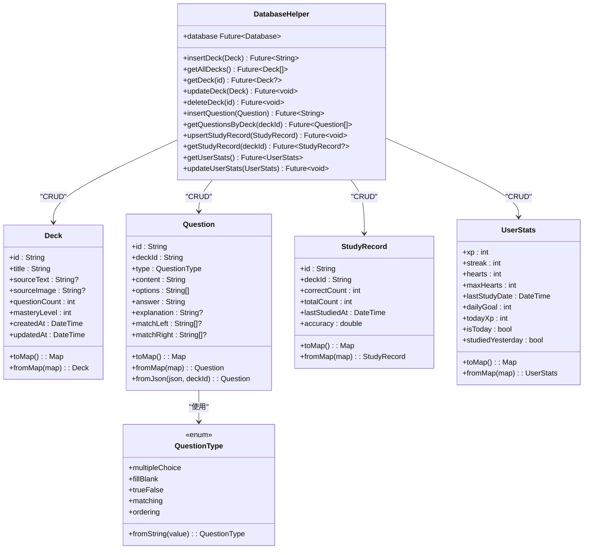
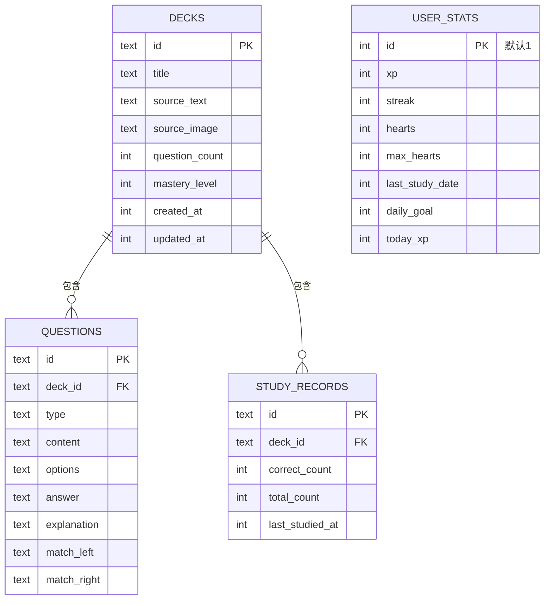
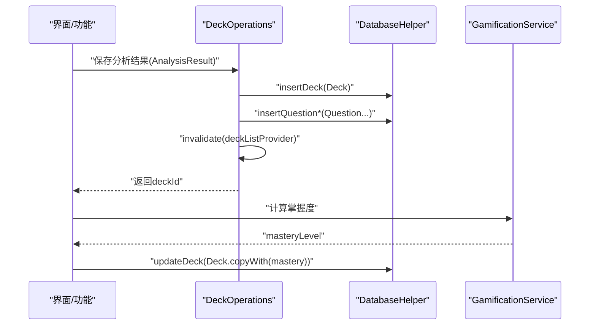
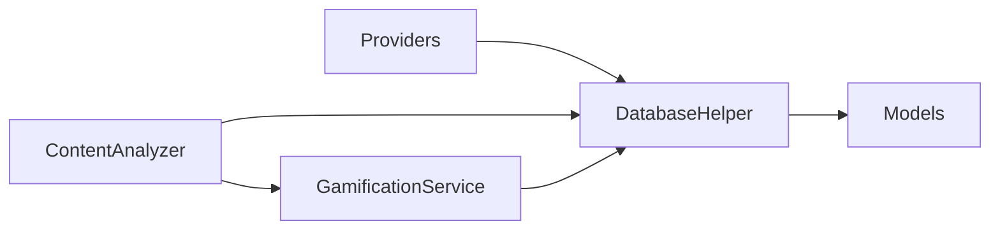

# 数据层

<cite>
**本文引用的文件**
- [lib/data/database/database_helper.dart](file://lib/data/database/database_helper.dart)
- [lib/data/models/deck.dart](file://lib/data/models/deck.dart)
- [lib/data/models/question.dart](file://lib/data/models/question.dart)
- [lib/data/models/question_type.dart](file://lib/data/models/question_type.dart)
- [lib/data/models/study_record.dart](file://lib/data/models/study_record.dart)
- [lib/data/models/user_stats.dart](file://lib/data/models/user_stats.dart)
- [lib/core/providers/providers.dart](file://lib/core/providers/providers.dart)
- [lib/services/gamification_service.dart](file://lib/services/gamification_service.dart)
- [lib/services/content_analyzer.dart](file://lib/services/content_analyzer.dart)
</cite>

## 目录
1. [简介](#简介)
2. [项目结构](#项目结构)
3. [核心组件](#核心组件)
4. [架构总览](#架构总览)
5. [详细组件分析](#详细组件分析)
6. [依赖分析](#依赖分析)
7. [性能考量](#性能考量)
8. [故障排查指南](#故障排查指南)
9. [结论](#结论)
10. [附录](#附录)

## 简介
本文件面向Dlg-Q应用的数据层，系统化梳理SQLite数据库设计与实现、数据模型定义、Repository模式的落地、缓存与性能优化策略、数据迁移与版本管理、数据生命周期与安全考虑，并提供可操作的数据库操作示例与最佳实践。

## 项目结构
数据层位于lib/data目录，采用“模型+数据库助手”的分层组织方式：
- models：定义领域模型与序列化/反序列化逻辑
- database：封装SQLite初始化、表结构、CRUD与事务语义
- providers：以Riverpod Provider体系暴露数据访问能力
- services：业务服务（如内容分析、游戏化）与数据层交互

图示来源
- [lib/data/database/database_helper.dart:1-192](file://lib/data/database/database_helper.dart#L1-L192)
- [lib/data/models/deck.dart:1-71](file://lib/data/models/deck.dart#L1-L71)
- [lib/data/models/question.dart:1-76](file://lib/data/models/question.dart#L1-L76)
- [lib/data/models/study_record.dart:1-41](file://lib/data/models/study_record.dart#L1-L41)
- [lib/data/models/user_stats.dart:1-83](file://lib/data/models/user_stats.dart#L1-L83)
- [lib/data/models/question_type.dart:1-20](file://lib/data/models/question_type.dart#L1-L20)
- [lib/core/providers/providers.dart:1-178](file://lib/core/providers/providers.dart#L1-L178)
- [lib/services/content_analyzer.dart:1-172](file://lib/services/content_analyzer.dart#L1-L172)
- [lib/services/gamification_service.dart:1-116](file://lib/services/gamification_service.dart#L1-L116)

章节来源
- [lib/data/database/database_helper.dart:1-192](file://lib/data/database/database_helper.dart#L1-L192)
- [lib/core/providers/providers.dart:1-178](file://lib/core/providers/providers.dart#L1-L178)

## 核心组件
- 数据库助手：负责数据库初始化、表结构创建、CRUD操作与事务级删除
- 数据模型：Deck、Question、StudyRecord、UserStats及其序列化/反序列化
- Provider体系：统一暴露查询、写入与业务操作入口
- 业务服务：内容分析与游戏化，与数据库交互并驱动数据变更

章节来源
- [lib/data/database/database_helper.dart:1-192](file://lib/data/database/database_helper.dart#L1-L192)
- [lib/data/models/deck.dart:1-71](file://lib/data/models/deck.dart#L1-L71)
- [lib/data/models/question.dart:1-76](file://lib/data/models/question.dart#L1-L76)
- [lib/data/models/study_record.dart:1-41](file://lib/data/models/study_record.dart#L1-L41)
- [lib/data/models/user_stats.dart:1-83](file://lib/data/models/user_stats.dart#L1-L83)
- [lib/core/providers/providers.dart:1-178](file://lib/core/providers/providers.dart#L1-L178)
- [lib/services/gamification_service.dart:1-116](file://lib/services/gamification_service.dart#L1-L116)
- [lib/services/content_analyzer.dart:1-172](file://lib/services/content_analyzer.dart#L1-L172)

## 架构总览
数据层采用轻量Repository模式：DatabaseHelper作为底层仓库，向上提供类型安全的CRUD方法；上层通过Riverpod Provider组合调用，形成清晰的职责边界。

图示来源
- [lib/data/database/database_helper.dart:1-192](file://lib/data/database/database_helper.dart#L1-L192)
- [lib/data/models/deck.dart:1-71](file://lib/data/models/deck.dart#L1-L71)
- [lib/data/models/question.dart:1-76](file://lib/data/models/question.dart#L1-L76)
- [lib/data/models/study_record.dart:1-41](file://lib/data/models/study_record.dart#L1-L41)
- [lib/data/models/user_stats.dart:1-83](file://lib/data/models/user_stats.dart#L1-L83)
- [lib/data/models/question_type.dart:1-20](file://lib/data/models/question_type.dart#L1-L20)

## 详细组件分析

### 数据库设计与表结构
- 题包表(decks)
  - 主键：id
  - 字段：title、source_text、source_image、question_count、mastery_level、created_at、updated_at
  - 约束：非空、默认值
- 题目表(questions)
  - 主键：id
  - 外键：deck_id 引用 decks(id)，删除级联
  - 字段：type、content、options、answer、explanation、match_left、match_right
- 学习记录表(study_records)
  - 主键：id
  - 外键：deck_id 引用 decks(id)，删除级联
  - 字段：correct_count、total_count、last_studied_at
- 用户统计表(user_stats)
  - 主键：默认常量1
  - 字段：xp、streak、hearts、max_hearts、last_study_date、daily_goal、today_xp
  - 初始化：应用首次创建时插入默认行

图示来源
- [lib/data/database/database_helper.dart:32-100](file://lib/data/database/database_helper.dart#L32-L100)

章节来源
- [lib/data/database/database_helper.dart:32-100](file://lib/data/database/database_helper.dart#L32-L100)

### 数据模型定义与验证规则
- Deck
  - 字段：id、title、sourceText、sourceImage、questionCount、masteryLevel、createdAt、updatedAt
  - 序列化：toMap/fromMap，时间戳毫秒值存储
  - 业务约束：masteryLevel范围0-100；questionCount非负
- Question
  - 字段：id、deckId、type、content、options、answer、explanation、matchLeft、matchRight
  - 序列化：toMap/fromMap，数组以控制字符分隔存储
  - 验证：type通过QuestionType.fromString解析；options/explanation可空；匹配题左右列表长度一致
- StudyRecord
  - 字段：id、deckId、correctCount、totalCount、lastStudiedAt
  - 计算：accuracy=correctCount/totalCount（totalCount>0）
  - 业务约束：计数非负；lastStudiedAt为学习时间
- UserStats
  - 字段：xp、streak、hearts、maxHearts、lastStudyDate、dailyGoal、todayXp
  - 辅助：isToday、studiedYesterday用于每日重置逻辑
  - 业务约束：hearts不超过maxHearts；dailyGoal非负

章节来源
- [lib/data/models/deck.dart:1-71](file://lib/data/models/deck.dart#L1-L71)
- [lib/data/models/question.dart:1-76](file://lib/data/models/question.dart#L1-L76)
- [lib/data/models/study_record.dart:1-41](file://lib/data/models/study_record.dart#L1-L41)
- [lib/data/models/user_stats.dart:1-83](file://lib/data/models/user_stats.dart#L1-L83)
- [lib/data/models/question_type.dart:1-20](file://lib/data/models/question_type.dart#L1-L20)

### Repository模式实现
- DatabaseHelper作为单一仓库，封装：
  - 数据库连接与延迟初始化
  - 表结构创建与默认数据初始化
  - CRUD方法：题包、题目、学习记录、用户统计
  - 关系删除：删除题包时级联删除其题目与学习记录
- Provider体系：
  - databaseProvider：提供DatabaseHelper实例
  - deckListProvider/deckQuestionsProvider/studyRecordProvider：查询型Provider
  - deckOperationsProvider：封装业务操作（保存分析结果、删除题包、更新掌握度、保存学习记录）
  - UserStatsNotifier：管理用户统计状态与异步加载/刷新

图示来源
- [lib/core/providers/providers.dart:97-177](file://lib/core/providers/providers.dart#L97-L177)
- [lib/data/database/database_helper.dart:104-133](file://lib/data/database/database_helper.dart#L104-L133)
- [lib/services/gamification_service.dart:109-114](file://lib/services/gamification_service.dart#L109-L114)

章节来源
- [lib/data/database/database_helper.dart:1-192](file://lib/data/database/database_helper.dart#L1-L192)
- [lib/core/providers/providers.dart:1-178](file://lib/core/providers/providers.dart#L1-L178)
- [lib/services/gamification_service.dart:1-116](file://lib/services/gamification_service.dart#L1-L116)

### 缓存策略与性能优化
- 查询缓存
  - Riverpod FutureProvider家族缓存查询结果，避免重复IO
  - invalidate触发后重新拉取，保证一致性
- 写入优化
  - upsertStudyRecord使用冲突替换策略，减少条件判断
  - 批量插入：保存分析结果时先插入Deck再批量插入Question
- 时间戳存储
  - 所有日期字段以毫秒时间戳存储，便于排序与比较
- 索引建议
  - 当前未显式创建索引。建议：
    - decks(created_at)：按时间倒序展示
    - questions(deck_id)：按题包查询
    - study_records(deck_id)：按题包查询学习记录
  - 以上建议基于现有查询模式，实际部署可根据查询热点评估

章节来源
- [lib/core/providers/providers.dart:32-93](file://lib/core/providers/providers.dart#L32-L93)
- [lib/data/database/database_helper.dart:163-167](file://lib/data/database/database_helper.dart#L163-L167)

### 数据迁移与版本管理
- 版本号：当前版本为1
- 迁移策略
  - 新增表：在_onCreate中添加CREATE TABLE语句，并在插入默认数据处补充新表初始化
  - 修改表结构：新增ALTER TABLE迁移脚本，按版本递增执行
  - 删除/重命名：谨慎处理，必要时先迁移数据再删除旧结构
- 最佳实践
  - 保持向后兼容：新增字段使用默认值
  - 升级流程：升级前备份，升级后校验数据完整性
  - 测试覆盖：针对迁移脚本编写单元测试

章节来源
- [lib/data/database/database_helper.dart:22-30](file://lib/data/database/database_helper.dart#L22-L30)
- [lib/data/database/database_helper.dart:32-100](file://lib/data/database/database_helper.dart#L32-L100)

### 数据生命周期管理
- 题包生命周期
  - 创建：保存分析结果时生成Deck
  - 使用：按题包获取题目列表与学习记录
  - 删除：删除题包时级联删除其题目与学习记录
- 学习记录生命周期
  - 产生：答题完成后保存StudyRecord
  - 更新：每次答题通过upsert更新
  - 展示：按deckId查询并计算准确率
- 用户统计生命周期
  - 初始化：应用首次创建时插入默认行
  - 每日重置：根据lastStudyDate判断是否重置todayXp与streak
  - 动态更新：答对/答错、完成题包、设置目标等触发

章节来源
- [lib/data/database/database_helper.dart:128-133](file://lib/data/database/database_helper.dart#L128-L133)
- [lib/data/database/database_helper.dart:163-174](file://lib/data/database/database_helper.dart#L163-L174)
- [lib/data/models/user_stats.dart:67-81](file://lib/data/models/user_stats.dart#L67-L81)
- [lib/services/gamification_service.dart:14-28](file://lib/services/gamification_service.dart#L14-L28)

### 安全考虑
- SQL注入防护：统一使用参数化查询与whereArgs
- 数据完整性：外键约束与删除级联确保引用一致性
- 敏感数据：当前未涉及敏感字段；若引入用户标识，应避免明文存储
- 权限与隔离：SQLite文件权限由平台管理，注意应用内文件访问控制

章节来源
- [lib/data/database/database_helper.dart:110-114](file://lib/data/database/database_helper.dart#L110-L114)
- [lib/data/database/database_helper.dart:155-159](file://lib/data/database/database_helper.dart#L155-L159)

## 依赖分析
- 组件耦合
  - DatabaseHelper与各模型强耦合（toMap/fromMap），便于统一序列化
  - Provider层依赖DatabaseHelper与业务服务，形成清晰的调用链
- 外部依赖
  - sqflite：SQLite访问
  - path：路径拼接
  - riverpod：状态与依赖注入
  - openai_service：内容分析（间接依赖）

图示来源
- [lib/core/providers/providers.dart:1-178](file://lib/core/providers/providers.dart#L1-L178)
- [lib/data/database/database_helper.dart:1-192](file://lib/data/database/database_helper.dart#L1-L192)
- [lib/services/content_analyzer.dart:1-172](file://lib/services/content_analyzer.dart#L1-L172)
- [lib/services/gamification_service.dart:1-116](file://lib/services/gamification_service.dart#L1-L116)

章节来源
- [lib/core/providers/providers.dart:1-178](file://lib/core/providers/providers.dart#L1-L178)
- [lib/data/database/database_helper.dart:1-192](file://lib/data/database/database_helper.dart#L1-L192)
- [lib/services/content_analyzer.dart:1-172](file://lib/services/content_analyzer.dart#L1-L172)
- [lib/services/gamification_service.dart:1-116](file://lib/services/gamification_service.dart#L1-L116)

## 性能考量
- 查询性能
  - 使用参数化查询与whereArgs，避免字符串拼接
  - 对高频查询字段（deck_id、created_at）建立索引
- 写入性能
  - 批量插入：保存分析结果时一次性插入多道题目
  - 冲突替换：upsertStudyRecord减少条件判断
- 内存与序列化
  - Question的数组字段使用控制字符分隔存储，避免复杂JSON解析
- 并发与事务
  - sqflite默认串行执行SQL；对于大批量写入，可考虑分批提交
- 缓存命中
  - Riverpod缓存查询结果，减少重复数据库访问

章节来源
- [lib/data/database/database_helper.dart:137-153](file://lib/data/database/database_helper.dart#L137-L153)
- [lib/data/database/database_helper.dart:163-167](file://lib/data/database/database_helper.dart#L163-L167)
- [lib/core/providers/providers.dart:32-93](file://lib/core/providers/providers.dart#L32-L93)

## 故障排查指南
- 数据库未初始化
  - 现象：查询报错或空结果
  - 排查：确认_onCreate已执行且表存在
- 外键约束失败
  - 现象：删除题包时报外键错误
  - 排查：确认删除顺序为先删questions与study_records，再删decks
- 用户统计异常
  - 现象：streak不正确或todayXp未重置
  - 排查：核对lastStudyDate与isToday/studiedYesterday逻辑
- 内容解析失败
  - 现象：AI返回内容无法解析为题目
  - 排查：检查JSON格式、字段完整性；必要时提取JSON块重试

章节来源
- [lib/data/database/database_helper.dart:128-133](file://lib/data/database/database_helper.dart#L128-L133)
- [lib/data/models/user_stats.dart:67-81](file://lib/data/models/user_stats.dart#L67-L81)
- [lib/services/content_analyzer.dart:135-170](file://lib/services/content_analyzer.dart#L135-L170)

## 结论
数据层以DatabaseHelper为核心仓库，结合Riverpod Provider体系，实现了清晰的职责分离与良好的扩展性。模型层提供稳定的序列化接口，业务服务与数据库交互明确。当前版本具备基础的表结构、CRUD与业务逻辑，后续可在索引、迁移与缓存方面进一步优化。

## 附录

### 数据库操作示例（步骤说明）
- 插入题包与题目
  - 生成Deck对象并调用insertDeck
  - 遍历题目集合调用insertQuestion
  - 通过invalidate刷新题包列表
- 保存学习记录
  - 构造StudyRecord并调用upsertStudyRecord
  - 同步更新题包掌握度
- 删除题包
  - 调用deleteDeck，内部级联删除题目与学习记录
- 获取用户统计与每日重置
  - 调用getStats，内部根据日期判断重置逻辑

章节来源
- [lib/core/providers/providers.dart:106-141](file://lib/core/providers/providers.dart#L106-L141)
- [lib/core/providers/providers.dart:143-158](file://lib/core/providers/providers.dart#L143-L158)
- [lib/core/providers/providers.dart:160-176](file://lib/core/providers/providers.dart#L160-L176)
- [lib/data/database/database_helper.dart:104-133](file://lib/data/database/database_helper.dart#L104-L133)
- [lib/data/database/database_helper.dart:163-174](file://lib/data/database/database_helper.dart#L163-L174)
- [lib/services/gamification_service.dart:14-28](file://lib/services/gamification_service.dart#L14-L28)