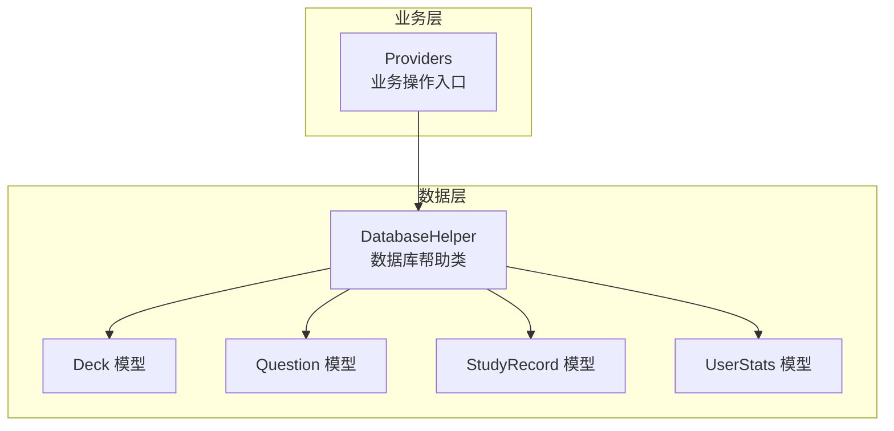
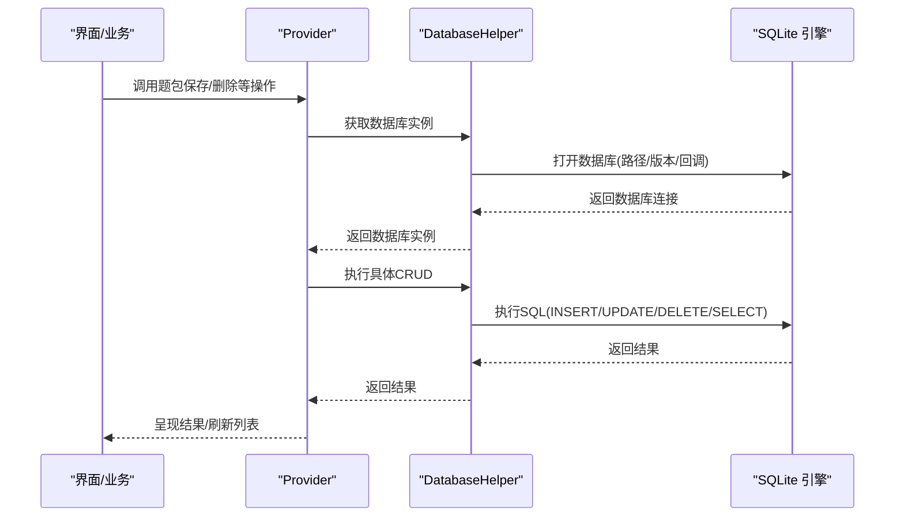
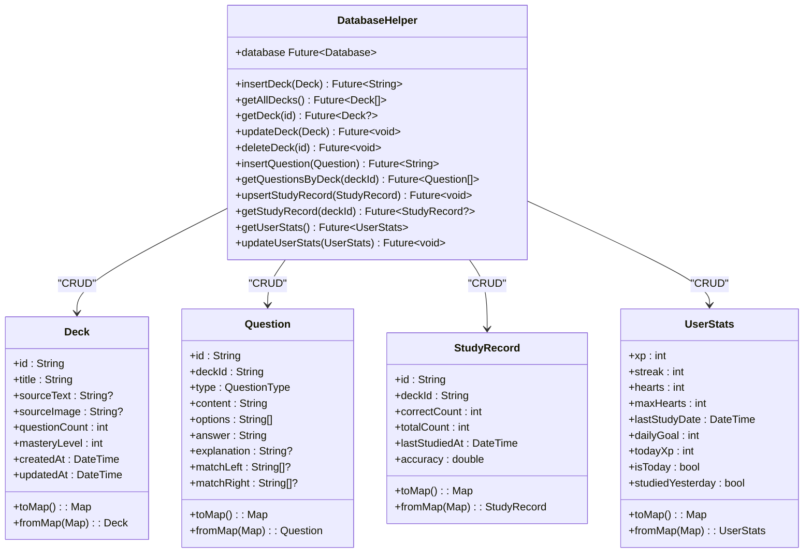
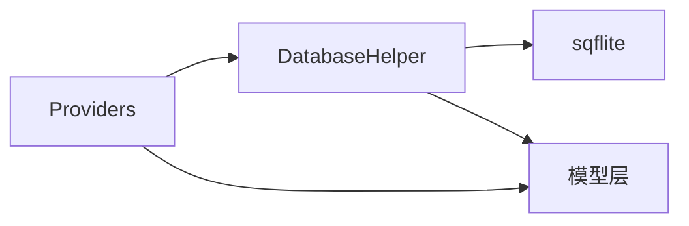

# 数据库设计

<cite>
**本文引用的文件**
- [lib/data/database/database_helper.dart](file://lib/data/database/database_helper.dart)
- [lib/data/models/deck.dart](file://lib/data/models/deck.dart)
- [lib/data/models/question.dart](file://lib/data/models/question.dart)
- [lib/data/models/study_record.dart](file://lib/data/models/study_record.dart)
- [lib/data/models/user_stats.dart](file://lib/data/models/user_stats.dart)
- [lib/core/providers/providers.dart](file://lib/core/providers/providers.dart)
- [pubspec.yaml](file://pubspec.yaml)
</cite>

## 目录
1. [简介](#简介)
2. [项目结构](#项目结构)
3. [核心组件](#核心组件)
4. [架构总览](#架构总览)
5. [详细组件分析](#详细组件分析)
6. [依赖分析](#依赖分析)
7. [性能考虑](#性能考虑)
8. [故障排除指南](#故障排除指南)
9. [结论](#结论)
10. [附录](#附录)

## 简介
本文件面向Dlg-Q应用的SQLite数据库设计，系统性阐述整体架构、表结构设计原则、关系映射策略、索引优化方案、初始化流程、连接与事务管理、数据完整性与一致性保障、版本管理与迁移策略、备份与恢复、安全考虑以及性能优化与故障排除建议。文档以实际代码为依据，避免臆造信息，确保可追溯性。

## 项目结构
数据库相关代码集中在Flutter模块中，采用“数据层+模型层”的分层组织方式：
- 数据访问层：通过DatabaseHelper封装数据库初始化、表结构定义、CRUD操作与单行表初始化。
- 模型层：Deck、Question、StudyRecord、UserStats四个实体模型，负责对象与数据库字段之间的映射。
- 使用方：通过Provider注入DatabaseHelper实例，在业务逻辑中调用数据库操作。

图表来源
- [lib/data/database/database_helper.dart:1-191](file://lib/data/database/database_helper.dart#L1-L191)
- [lib/data/models/deck.dart:1-71](file://lib/data/models/deck.dart#L1-L71)
- [lib/data/models/question.dart:1-76](file://lib/data/models/question.dart#L1-L76)
- [lib/data/models/study_record.dart:1-40](file://lib/data/models/study_record.dart#L1-L40)
- [lib/data/models/user_stats.dart:1-83](file://lib/data/models/user_stats.dart#L1-L83)
- [lib/core/providers/providers.dart:95-148](file://lib/core/providers/providers.dart#L95-L148)

章节来源
- [lib/data/database/database_helper.dart:1-191](file://lib/data/database/database_helper.dart#L1-L191)
- [lib/core/providers/providers.dart:95-148](file://lib/core/providers/providers.dart#L95-L148)

## 核心组件
- DatabaseHelper：单例模式，负责数据库打开、版本控制、初始化脚本执行、CRUD操作与单行表初始化。
- 四大模型：Deck、Question、StudyRecord、UserStats，提供toMap/fromMap映射，支撑DAO层的插入、查询与更新。
- Provider集成：在业务层通过Provider获取DatabaseHelper实例，完成题包保存、删除等操作。

章节来源
- [lib/data/database/database_helper.dart:1-191](file://lib/data/database/database_helper.dart#L1-L191)
- [lib/data/models/deck.dart:1-71](file://lib/data/models/deck.dart#L1-L71)
- [lib/data/models/question.dart:1-76](file://lib/data/models/question.dart#L1-L76)
- [lib/data/models/study_record.dart:1-40](file://lib/data/models/study_record.dart#L1-L40)
- [lib/data/models/user_stats.dart:1-83](file://lib/data/models/user_stats.dart#L1-L83)
- [lib/core/providers/providers.dart:95-148](file://lib/core/providers/providers.dart#L95-L148)

## 架构总览
数据库采用本地SQLite存储，通过sqflite驱动。初始化时按版本号1执行onCreate脚本，创建四张表并写入单行统计表初始值。业务层通过Provider注入DatabaseHelper，实现题包、题目、学习记录与用户统计的增删改查。

图表来源
- [lib/data/database/database_helper.dart:16-30](file://lib/data/database/database_helper.dart#L16-L30)
- [lib/core/providers/providers.dart:95-148](file://lib/core/providers/providers.dart#L95-L148)

## 详细组件分析

### 表结构与设计原则
- decks（题包表）
  - 主键：id（文本）
  - 字段：标题、来源文本/图片、题目数量、掌握度、创建时间、更新时间
  - 设计要点：主键唯一；整表按创建时间倒序查询，便于展示最新题包
- questions（题目表）
  - 主键：id（文本）
  - 外键：deck_id → decks(id)，级联删除
  - 字段：类型、内容、选项、答案、解析、匹配题左右列
  - 设计要点：外键约束保证题包与题目的引用完整性；匹配题左右列使用分隔符序列化存储
- study_records（学习记录表）
  - 主键：id（文本）
  - 外键：deck_id → decks(id)，级联删除
  - 字段：正确数、总数、最后学习时间
  - 设计要点：通过冲突算法替换实现UPSERT；与decks保持一对一关系
- user_stats（用户统计表，单行）
  - 主键：默认1（整型）
  - 字段：经验、连击、生命值、最大生命值、上次学习日期、日目标、当日经验
  - 设计要点：单行表用于全局统计；初始化时写入默认值

章节来源
- [lib/data/database/database_helper.dart:34-100](file://lib/data/database/database_helper.dart#L34-L100)
- [lib/data/models/question.dart:28-54](file://lib/data/models/question.dart#L28-L54)
- [lib/data/models/study_record.dart:19-39](file://lib/data/models/study_record.dart#L19-L39)
- [lib/data/models/user_stats.dart:41-65](file://lib/data/models/user_stats.dart#L41-L65)

### 关系映射策略
- 一对多：decks → questions（一个题包包含多道题目）
- 一对多：decks → study_records（一个题包对应一条学习记录）
- 单行表：user_stats仅有一条记录，作为全局统计载体
- 外键约束与级联删除：decks删除时自动清理其下所有题目与学习记录，保证引用完整性

章节来源
- [lib/data/database/database_helper.dart:48-73](file://lib/data/database/database_helper.dart#L48-L73)
- [lib/data/database/database_helper.dart:128-133](file://lib/data/database/database_helper.dart#L128-L133)

### 索引优化方案
当前未显式创建索引。基于现有查询模式，建议：
- 在decks上对created_at建立索引，加速按时间排序的列表加载
- 在questions上对deck_id建立索引，加速按题包筛选题目
- 在study_records上对deck_id建立索引，加速按题包查询学习记录
- 在user_stats上对id建立索引（默认主键）

章节来源
- [lib/data/database/database_helper.dart:110-113](file://lib/data/database/database_helper.dart#L110-L113)
- [lib/data/database/database_helper.dart:155-159](file://lib/data/database/database_helper.dart#L155-L159)
- [lib/data/database/database_helper.dart:169-174](file://lib/data/database/database_helper.dart#L169-L174)

### 数据库初始化与连接管理
- 初始化流程
  - 获取应用数据库目录路径，拼接文件名生成db文件路径
  - 以版本1打开数据库，注册onCreate回调
  - 在onCreate中创建四张表并初始化user_stats单行记录
- 连接管理
  - DatabaseHelper采用单例模式，延迟初始化
  - 首次访问时创建数据库连接并缓存，后续复用同一连接

章节来源
- [lib/data/database/database_helper.dart:22-30](file://lib/data/database/database_helper.dart#L22-L30)
- [lib/data/database/database_helper.dart:32-100](file://lib/data/database/database_helper.dart#L32-L100)
- [lib/data/database/database_helper.dart:16-20](file://lib/data/database/database_helper.dart#L16-L20)

### 事务处理机制
- 当前实现未显式使用事务API
- 建议在批量写入或需要强一致性的场景（如保存分析结果）使用事务包裹，确保原子性
- 对于单条写入操作，sqflite默认单语句即在一个隐式事务内提交

章节来源
- [lib/core/providers/providers.dart:107-141](file://lib/core/providers/providers.dart#L107-L141)

### 数据完整性约束与一致性
- 外键约束：questions与study_records均引用decks并设置级联删除
- 主键约束：各表主键唯一，防止重复
- 默认值：user_stats单行表字段设置合理默认值，避免空值
- 单行表约束：通过固定主键id=1实现单行约束

章节来源
- [lib/data/database/database_helper.dart:48-87](file://lib/data/database/database_helper.dart#L48-L87)
- [lib/data/database/database_helper.dart:89-99](file://lib/data/database/database_helper.dart#L89-L99)

### 版本管理、迁移与升级路径
- 当前版本：version=1
- 迁移策略建议
  - 新增版本号（如2），在onUpgrade中编写迁移脚本
  - 迁移脚本应包含：新增表、新增字段、索引创建、数据补全等
  - 迁移过程中保留历史数据，必要时进行数据转换
- 升级路径
  - 从v1到v2：添加新表或字段，执行数据迁移
  - 从v2到v3：继续扩展，遵循幂等性与向后兼容

章节来源
- [lib/data/database/database_helper.dart:25-29](file://lib/data/database/database_helper.dart#L25-L29)

### 具体SQL语句示例
以下为实际使用的SQL片段路径（不直接展示代码内容）：
- 创建decks表
  - [CREATE TABLE decks ...:34-45](file://lib/data/database/database_helper.dart#L34-L45)
- 创建questions表（含外键与级联删除）
  - [CREATE TABLE questions ...:48-61](file://lib/data/database/database_helper.dart#L48-L61)
- 创建study_records表（含外键与级联删除）
  - [CREATE TABLE study_records ...:63-73](file://lib/data/database/database_helper.dart#L63-L73)
- 创建user_stats表（单行）
  - [CREATE TABLE user_stats ...:75-87](file://lib/data/database/database_helper.dart#L75-L87)
- 插入user_stats初始记录
  - [INSERT INTO user_stats ...:89-99](file://lib/data/database/database_helper.dart#L89-L99)
- 查询题包列表（按创建时间倒序）
  - [SELECT ... ORDER BY created_at DESC:110-114](file://lib/data/database/database_helper.dart#L110-L114)
- 按题包查询题目
  - [SELECT ... WHERE deck_id = ?:155-159](file://lib/data/database/database_helper.dart#L155-L159)
- UPSERT学习记录（冲突替换）
  - [INSERT ... conflictAlgorithm=replace:163-167](file://lib/data/database/database_helper.dart#L163-L167)

章节来源
- [lib/data/database/database_helper.dart:34-100](file://lib/data/database/database_helper.dart#L34-L100)
- [lib/data/database/database_helper.dart:110-114](file://lib/data/database/database_helper.dart#L110-L114)
- [lib/data/database/database_helper.dart:155-159](file://lib/data/database/database_helper.dart#L155-L159)
- [lib/data/database/database_helper.dart:163-167](file://lib/data/database/database_helper.dart#L163-L167)

### 类与依赖关系图

图表来源
- [lib/data/database/database_helper.dart:1-191](file://lib/data/database/database_helper.dart#L1-L191)
- [lib/data/models/deck.dart:1-71](file://lib/data/models/deck.dart#L1-L71)
- [lib/data/models/question.dart:1-76](file://lib/data/models/question.dart#L1-L76)
- [lib/data/models/study_record.dart:1-40](file://lib/data/models/study_record.dart#L1-L40)
- [lib/data/models/user_stats.dart:1-83](file://lib/data/models/user_stats.dart#L1-L83)

## 依赖分析
- sqflite：数据库引擎与API（打开数据库、执行SQL、版本控制）
- path：路径拼接（数据库文件路径）
- 业务依赖：Provider注入DatabaseHelper，实现题包保存、删除等操作

图表来源
- [lib/core/providers/providers.dart:95-148](file://lib/core/providers/providers.dart#L95-L148)
- [lib/data/database/database_helper.dart:1-7](file://lib/data/database/database_helper.dart#L1-L7)
- [pubspec.yaml](file://pubspec.yaml)

章节来源
- [lib/core/providers/providers.dart:95-148](file://lib/core/providers/providers.dart#L95-L148)
- [lib/data/database/database_helper.dart:1-7](file://lib/data/database/database_helper.dart#L1-L7)
- [pubspec.yaml](file://pubspec.yaml)

## 性能考虑
- 查询优化
  - 为高频查询字段（如decks.created_at、questions.deck_id、study_records.deck_id）建立索引
  - 避免SELECT *，仅查询所需字段
- 写入优化
  - 批量写入时使用事务，减少磁盘I/O与同步成本
  - 合理使用冲突算法（如replace）实现UPSERT，避免重复查询
- 序列化存储
  - 多选项与匹配题左右列采用分隔符序列化，减少复杂JSON存储带来的体积与解析成本
- 时间戳存储
  - 统一使用毫秒级时间戳，便于排序与范围查询

章节来源
- [lib/data/database/database_helper.dart:110-114](file://lib/data/database/database_helper.dart#L110-L114)
- [lib/data/database/database_helper.dart:155-159](file://lib/data/database/database_helper.dart#L155-L159)
- [lib/data/database/database_helper.dart:163-167](file://lib/data/database/database_helper.dart#L163-L167)
- [lib/data/models/question.dart:34-38](file://lib/data/models/question.dart#L34-L38)

## 故障排除指南
- 数据库无法打开
  - 检查数据库路径拼接与权限
  - 确认版本号与onCreate脚本无语法错误
- 外键约束失败
  - 确保先创建父表再创建子表
  - 检查引用字段类型与长度是否一致
- 单行表异常
  - 确认user_stats仅存在一条记录且主键为1
  - 初始化逻辑需在onCreate中执行
- 查询结果为空
  - 检查WHERE条件与参数绑定
  - 确认字段名与表名大小写一致
- 性能问题
  - 为热点查询字段添加索引
  - 减少不必要的JOIN与大字段查询

章节来源
- [lib/data/database/database_helper.dart:22-30](file://lib/data/database/database_helper.dart#L22-L30)
- [lib/data/database/database_helper.dart:32-100](file://lib/data/database/database_helper.dart#L32-L100)
- [lib/data/database/database_helper.dart:178-190](file://lib/data/database/database_helper.dart#L178-L190)

## 结论
Dlg-Q的数据库设计以简洁实用为核心，采用SQLite本地存储，通过外键与级联删除保障引用完整性，单行表承载全局统计。当前版本为1，未显式创建索引，建议在生产环境中补充索引与事务支持，并制定版本迁移策略以应对未来演进需求。

## 附录
- 术语
  - 主键：唯一标识一行记录的字段
  - 外键：引用其他表主键的字段
  - 级联删除：删除父表记录时自动删除子表关联记录
  - UPSERT：更新或插入的复合操作
- 参考实现路径
  - [DatabaseHelper 初始化与表创建:22-100](file://lib/data/database/database_helper.dart#L22-L100)
  - [Provider 注入与业务调用:95-148](file://lib/core/providers/providers.dart#L95-L148)
  - [模型映射与序列化:28-54](file://lib/data/models/question.dart#L28-L54)