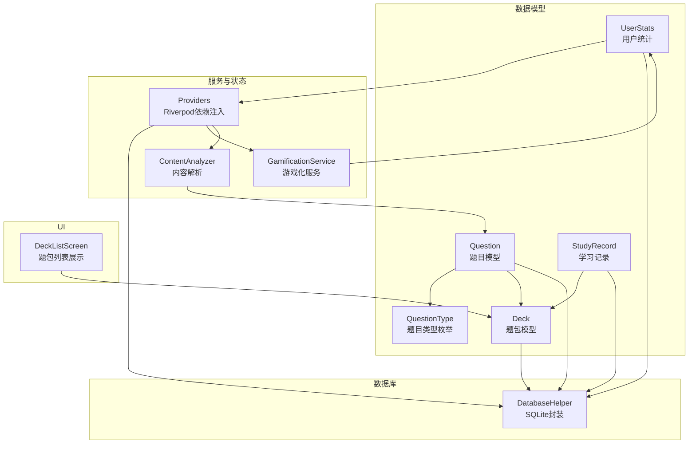
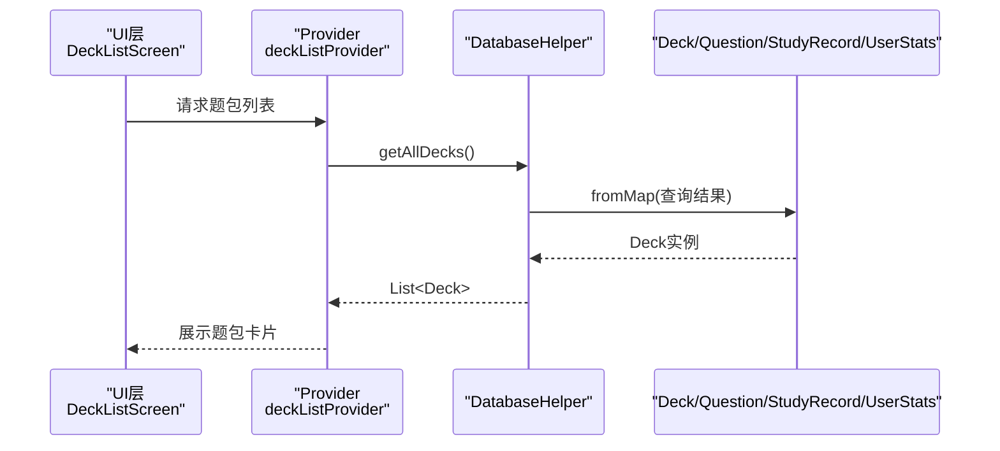
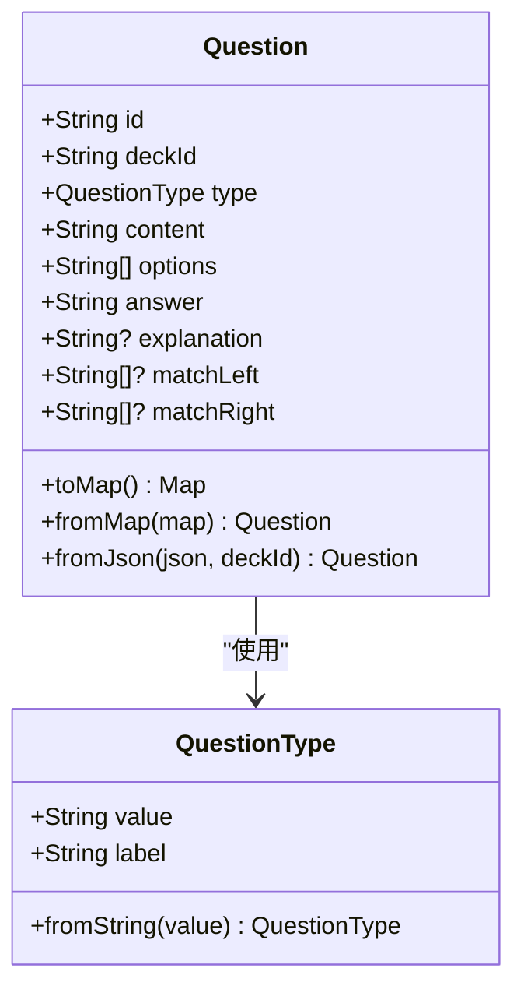
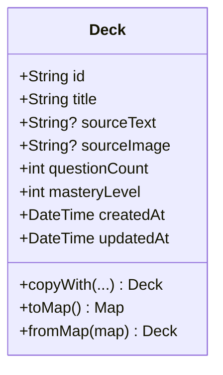
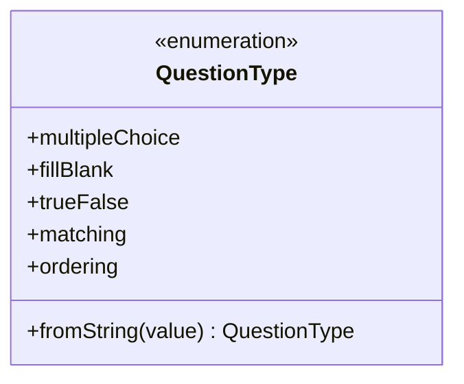
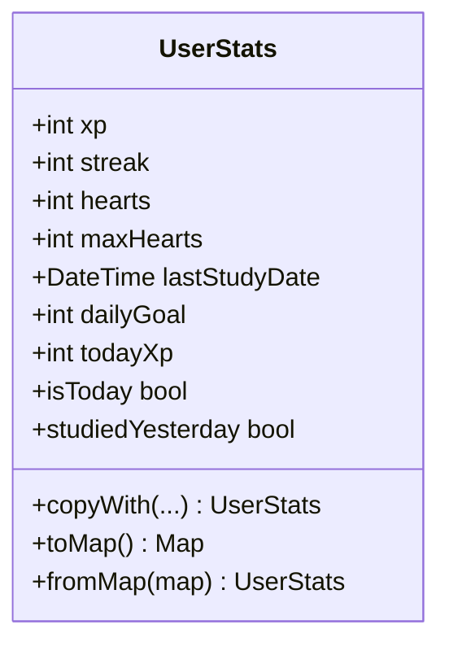
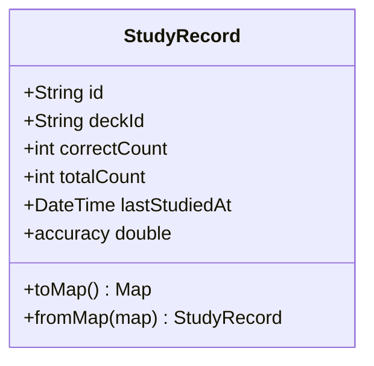
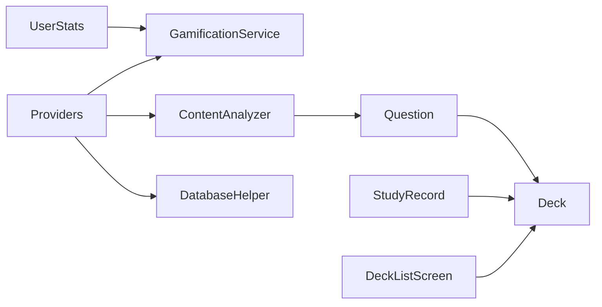
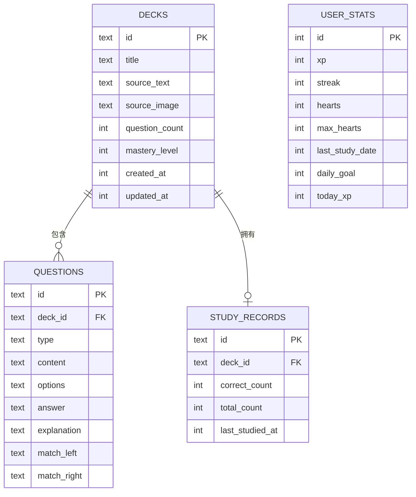

# 数据模型

<cite>
**本文引用的文件**
- [question.dart](file://lib/data/models/question.dart)
- [deck.dart](file://lib/data/models/deck.dart)
- [user_stats.dart](file://lib/data/models/user_stats.dart)
- [study_record.dart](file://lib/data/models/study_record.dart)
- [question_type.dart](file://lib/data/models/question_type.dart)
- [database_helper.dart](file://lib/data/database/database_helper.dart)
- [providers.dart](file://lib/core/providers/providers.dart)
- [content_analyzer.dart](file://lib/services/content_analyzer.dart)
- [gamification_service.dart](file://lib/services/gamification_service.dart)
- [deck_list_screen.dart](file://lib/features/deck/deck_list_screen.dart)
</cite>

## 目录
1. [简介](#简介)
2. [项目结构](#项目结构)
3. [核心组件](#核心组件)
4. [架构总览](#架构总览)
5. [详细组件分析](#详细组件分析)
6. [依赖分析](#依赖分析)
7. [性能考虑](#性能考虑)
8. [故障排查指南](#故障排查指南)
9. [结论](#结论)
10. [附录](#附录)

## 简介
本文件系统性梳理Dlg-Q项目的数据模型，围绕核心实体Question、Deck、UserStats、StudyRecord、QuestionType展开，解释其设计理念、字段定义、数据类型、验证规则与业务约束；阐明模型间的关系映射（一对一、一对多、多对多）；说明序列化/反序列化流程（JSON与数据库映射）；并提供使用示例、最佳实践与常见问题解决方案。该体系支撑内容解析、题包管理、学习记录与游戏化积分等核心功能。

## 项目结构
数据模型相关代码主要分布在以下位置：
- 数据模型：lib/data/models
- 数据库访问：lib/data/database
- 状态与依赖注入：lib/core/providers
- 业务服务：lib/services
- UI使用示例：lib/features

图示来源
- [question.dart:1-76](file://lib/data/models/question.dart#L1-L76)
- [deck.dart:1-71](file://lib/data/models/deck.dart#L1-L71)
- [question_type.dart:1-20](file://lib/data/models/question_type.dart#L1-L20)
- [user_stats.dart:1-83](file://lib/data/models/user_stats.dart#L1-L83)
- [study_record.dart:1-41](file://lib/data/models/study_record.dart#L1-L41)
- [database_helper.dart:1-192](file://lib/data/database/database_helper.dart#L1-L192)
- [providers.dart:1-178](file://lib/core/providers/providers.dart#L1-L178)
- [content_analyzer.dart:1-172](file://lib/services/content_analyzer.dart#L1-L172)
- [gamification_service.dart:1-116](file://lib/services/gamification_service.dart#L1-L116)
- [deck_list_screen.dart:1-314](file://lib/features/deck/deck_list_screen.dart#L1-L314)

章节来源
- [database_helper.dart:1-192](file://lib/data/database/database_helper.dart#L1-L192)
- [providers.dart:1-178](file://lib/core/providers/providers.dart#L1-L178)

## 核心组件
本节概述五个核心数据模型及其职责边界与典型用途。

- Question（题目）
  - 用途：承载单题信息，支持多种题型（选择、填空、判断、匹配、排序），包含题干、选项、答案、解析及匹配题左右两列。
  - 关键点：通过QuestionType区分类型；提供toMap/fromMap用于数据库持久化；提供fromJson用于从AI返回的JSON构建。
- Deck（题包）
  - 用途：代表由一段内容拆解出的一组题目集合，包含标题、来源文本/图片、题目数量、掌握度、创建/更新时间等。
  - 关键点：提供copyWith便于不可变更新；toMap/fromMap用于数据库持久化。
- QuestionType（题目类型）
  - 用途：枚举题型值与标签，提供fromString解析。
- UserStats（用户统计）
  - 用途：记录用户的经验值、连续打卡、心数、最大心数、最后学习日期、日目标、当日获得经验等。
  - 关键点：提供isToday与studiedYesterday辅助每日重置逻辑；toMap/fromMap用于数据库持久化。
- StudyRecord（学习记录）
  - 用途：记录某题包的正确数、总数、最近学习时间；提供accuracy计算准确率。
  - 关键点：toMap/fromMap用于数据库持久化；upsert策略保证唯一性。

章节来源
- [question.dart:1-76](file://lib/data/models/question.dart#L1-L76)
- [deck.dart:1-71](file://lib/data/models/deck.dart#L1-L71)
- [question_type.dart:1-20](file://lib/data/models/question_type.dart#L1-L20)
- [user_stats.dart:1-83](file://lib/data/models/user_stats.dart#L1-L83)
- [study_record.dart:1-41](file://lib/data/models/study_record.dart#L1-L41)

## 架构总览
数据模型与数据库、服务、状态管理的交互如下：

图示来源
- [deck_list_screen.dart:20-82](file://lib/features/deck/deck_list_screen.dart#L20-L82)
- [providers.dart:32-35](file://lib/core/providers/providers.dart#L32-L35)
- [database_helper.dart:110-114](file://lib/data/database/database_helper.dart#L110-L114)
- [deck.dart:45-69](file://lib/data/models/deck.dart#L45-L69)

## 详细组件分析

### Question（题目）模型
- 字段与类型
  - id: 字符串，主键
  - deckId: 字符串，外键关联Deck
  - type: QuestionType，题型枚举
  - content: 字符串，题干
  - options: 字符串列表，适用于选择/判断/排序题
  - answer: 字符串，正确答案
  - explanation: 字符串可选，解析
  - matchLeft/matchRight: 字符串列表可选，匹配题左右两列
- 验证与约束
  - 必填项：id、deckId、type、content、answer
  - 选项与答案一致性：选择/判断/排序题需确保answer存在于options中（业务层面）
  - 匹配题：左右列长度相等且answer为“左i-右j”的连接串
- 序列化/反序列化
  - 数据库存储：toMap将列表字段以特定分隔符拼接；fromMap还原
  - JSON导入：fromJson从AI返回的JSON构建，默认type回退为multiple_choice
- 使用场景
  - 内容解析后批量入库；学习时逐题渲染；答题校验答案
- 最佳实践
  - 保持answer与options严格一致；匹配题answer格式规范；填空题content中占位符清晰

图示来源
- [question.dart:1-76](file://lib/data/models/question.dart#L1-L76)
- [question_type.dart:1-20](file://lib/data/models/question_type.dart#L1-L20)

章节来源
- [question.dart:1-76](file://lib/data/models/question.dart#L1-L76)
- [question_type.dart:1-20](file://lib/data/models/question_type.dart#L1-L20)
- [content_analyzer.dart:135-170](file://lib/services/content_analyzer.dart#L135-L170)

### Deck（题包）模型
- 字段与类型
  - id: 字符串，主键
  - title: 字符串，标题
  - sourceText/sourceImage: 字符串可选，来源文本/图片
  - questionCount: 整数，题目数量
  - masteryLevel: 整数，掌握度百分比（0-100）
  - createdAt/updatedAt: 时间戳
- 验证与约束
  - 必填项：id、title、createdAt、updatedAt
  - masteryLevel范围：0-100（业务约束）
- 序列化/反序列化
  - 时间字段以毫秒时间戳存储；toMap/fromMap互转
- 使用场景
  - 展示题包列表、筛选、删除；作为Question的容器
- 最佳实践
  - 更新时同步更新updatedAt；删除题包时级联清理子数据

图示来源
- [deck.dart:1-71](file://lib/data/models/deck.dart#L1-L71)

章节来源
- [deck.dart:1-71](file://lib/data/models/deck.dart#L1-L71)
- [database_helper.dart:34-45](file://lib/data/database/database_helper.dart#L34-L45)

### QuestionType（题目类型）模型
- 字段与类型
  - value: 字符串，内部标识
  - label: 字符串，显示标签
- 支持类型
  - multiple_choice、fill_blank、true_false、matching、ordering
- 使用场景
  - Question.type的值域；fromString解析字符串到枚举

图示来源
- [question_type.dart:1-20](file://lib/data/models/question_type.dart#L1-L20)

章节来源
- [question_type.dart:1-20](file://lib/data/models/question_type.dart#L1-L20)
- [question.dart:42-54](file://lib/data/models/question.dart#L42-L54)

### UserStats（用户统计）模型
- 字段与类型
  - xp: 经验值
  - streak: 连续打卡天数
  - hearts/maxHearts: 当前心数与最大心数
  - lastStudyDate: 最后学习日期
  - dailyGoal: 日目标经验值
  - todayXp: 当日已获经验值
- 验证与约束
  - 默认初始值合理（如hearts=5、dailyGoal=50）
  - isToday与studiedYesterday用于每日重置逻辑
- 序列化/反序列化
  - 时间字段以毫秒时间戳存储；toMap/fromMap互转
- 使用场景
  - 游戏化服务根据答题结果更新XP、心数、streak；每日重置todayXp
- 最佳实践
  - 每次读取先检查是否跨日，必要时重置todayXp并维护streak

图示来源
- [user_stats.dart:1-83](file://lib/data/models/user_stats.dart#L1-L83)

章节来源
- [user_stats.dart:1-83](file://lib/data/models/user_stats.dart#L1-L83)
- [gamification_service.dart:14-28](file://lib/services/gamification_service.dart#L14-L28)

### StudyRecord（学习记录）模型
- 字段与类型
  - id: 字符串，主键
  - deckId: 字符串，外键关联Deck
  - correctCount/totalCount: 正确数与总数
  - lastStudiedAt: 最近学习时间
- 验证与约束
  - 必填项：id、deckId、lastStudiedAt
  - accuracy基于totalCount计算，totalCount为0时accuracy为0
- 序列化/反序列化
  - 时间字段以毫秒时间戳存储；toMap/fromMap互转
- 使用场景
  - 保存答题结果；计算题包掌握度；驱动Deck.masteryLevel更新
- 最佳实践
  - 使用upsert策略避免重复插入；更新时同步更新Deck.masteryLevel

图示来源
- [study_record.dart:1-41](file://lib/data/models/study_record.dart#L1-L41)

章节来源
- [study_record.dart:1-41](file://lib/data/models/study_record.dart#L1-L41)
- [database_helper.dart:163-174](file://lib/data/database/database_helper.dart#L163-L174)

## 依赖分析
- 模型与数据库
  - Question、Deck、StudyRecord、UserStats均提供toMap/fromMap并与SQLite表结构一一对应
  - 外键约束：questions.deck_id、study_records.deck_id引用decks.id并设置CASCADE删除
- 服务与状态
  - ContentAnalyzer负责将AI返回的JSON解析为Question列表
  - GamificationService负责UserStats的读取、更新与每日重置
  - Providers将数据库、服务与UI解耦，通过Riverpod统一管理
- UI使用
  - DeckListScreen消费deckListProvider展示题包列表；Deck作为Question容器被StudyRecord引用

图示来源
- [database_helper.dart:32-100](file://lib/data/database/database_helper.dart#L32-L100)
- [providers.dart:1-178](file://lib/core/providers/providers.dart#L1-L178)
- [content_analyzer.dart:1-172](file://lib/services/content_analyzer.dart#L1-L172)
- [gamification_service.dart:1-116](file://lib/services/gamification_service.dart#L1-L116)
- [deck_list_screen.dart:1-314](file://lib/features/deck/deck_list_screen.dart#L1-L314)

章节来源
- [database_helper.dart:32-100](file://lib/data/database/database_helper.dart#L32-L100)
- [providers.dart:1-178](file://lib/core/providers/providers.dart#L1-L178)

## 性能考虑
- 数据库索引
  - 建议在questions.deck_id上建立索引以加速按题包查询
- 批量写入
  - 保存分析结果时采用循环insert，建议在大量数据场景下使用事务批处理
- 序列化开销
  - 列表字段使用分隔符拼接，注意分隔符不出现于原始数据；fromMap中split后过滤空字符串
- 查询优化
  - 题包列表按created_at倒序；学习记录按deck_id查询；建议在高频查询字段添加索引

## 故障排查指南
- 无法解析AI返回的JSON
  - 现象：解析异常或未生成有效题目
  - 处理：ContentAnalyzer会尝试提取JSON块；若仍失败，检查AI输出格式与网络稳定性
  - 参考路径：[content_analyzer.dart:135-170](file://lib/services/content_analyzer.dart#L135-L170)
- 题目类型不匹配
  - 现象：fromMap解析type失败
  - 处理：fromString默认回退为multiple_choice；确保数据源的type字段合法
  - 参考路径：[question.dart:42-54](file://lib/data/models/question.dart#L42-L54)
- 学习记录重复
  - 现象：upsert未生效导致重复
  - 处理：确认id格式与冲突算法replace；确保id唯一
  - 参考路径：[database_helper.dart:163-167](file://lib/data/database/database_helper.dart#L163-L167)
- 掌握度计算异常
  - 现象：totalCount为0时accuracy为0
  - 处理：前端显示时注意除零保护；后端计算使用calculateMasteryLevel
  - 参考路径：[study_record.dart:17-17](file://lib/data/models/study_record.dart#L17-L17)，[gamification_service.dart:109-115](file://lib/services/gamification_service.dart#L109-L115)
- 每日重置逻辑异常
  - 现象：streak未正确重置或连续天数错误
  - 处理：检查UserStats.isToday与studiedYesterday；确保系统时间正确
  - 参考路径：[user_stats.dart:68-81](file://lib/data/models/user_stats.dart#L68-L81)，[gamification_service.dart:14-28](file://lib/services/gamification_service.dart#L14-L28)

章节来源
- [content_analyzer.dart:135-170](file://lib/services/content_analyzer.dart#L135-L170)
- [question.dart:42-54](file://lib/data/models/question.dart#L42-L54)
- [database_helper.dart:163-167](file://lib/data/database/database_helper.dart#L163-L167)
- [study_record.dart:17-17](file://lib/data/models/study_record.dart#L17-L17)
- [gamification_service.dart:109-115](file://lib/services/gamification_service.dart#L109-L115)
- [user_stats.dart:68-81](file://lib/data/models/user_stats.dart#L68-L81)

## 结论
Dlg-Q的数据模型以Question、Deck、UserStats、StudyRecord为核心，配合QuestionType实现多题型支持；通过DatabaseHelper完成SQLite持久化，结合Riverpod实现清晰的状态与依赖管理。模型间关系明确：Deck包含多个Question，StudyRecord记录某Deck的学习表现，UserStats反映用户游戏化指标。遵循本文的最佳实践与排障建议，可确保数据一致性、性能与可维护性。

## 附录

### 模型关系映射
- 一对一
  - StudyRecord与Deck：每题包一条学习记录（upsert保证唯一）
- 一对多
  - Deck与Question：一个题包包含多道题目
- 多对多
  - 无直接多对多关系；可通过StudyRecord与Question的组合间接表达

图示来源
- [database_helper.dart:34-87](file://lib/data/database/database_helper.dart#L34-L87)

### 序列化与数据库映射要点
- 字段映射
  - 字符串字段：原样映射
  - 列表字段：使用特定分隔符拼接/分割
  - 时间字段：毫秒时间戳
  - 枚举字段：使用value字符串
- JSON转换
  - Question.fromJson用于AI返回的JSON；fromMap用于数据库读取
  - ContentAnalyzer负责从AI响应中提取并解析JSON

章节来源
- [question.dart:28-54](file://lib/data/models/question.dart#L28-L54)
- [deck.dart:45-69](file://lib/data/models/deck.dart#L45-L69)
- [user_stats.dart:41-65](file://lib/data/models/user_stats.dart#L41-L65)
- [study_record.dart:19-39](file://lib/data/models/study_record.dart#L19-L39)
- [content_analyzer.dart:135-170](file://lib/services/content_analyzer.dart#L135-L170)

### 使用示例与最佳实践
- 保存分析结果为题包
  - 步骤：创建Deck与Question列表，调用DatabaseHelper批量插入；随后刷新题包列表
  - 参考路径：[providers.dart:106-141](file://lib/core/providers/providers.dart#L106-L141)
- 删除题包
  - 步骤：级联删除questions与study_records，再删除deck
  - 参考路径：[database_helper.dart:128-133](file://lib/data/database/database_helper.dart#L128-L133)
- 更新题包掌握度
  - 步骤：计算准确率得到masteryLevel，更新Deck.masteryLevel
  - 参考路径：[providers.dart:150-158](file://lib/core/providers/providers.dart#L150-L158)，[gamification_service.dart:109-115](file://lib/services/gamification_service.dart#L109-L115)
- 答题计分与心数
  - 步骤：根据答题结果调用onCorrectAnswer/onWrongAnswer；每日重置todayXp
  - 参考路径：[gamification_service.dart:31-73](file://lib/services/gamification_service.dart#L31-L73)，[user_stats.dart:68-81](file://lib/data/models/user_stats.dart#L68-L81)

章节来源
- [providers.dart:106-158](file://lib/core/providers/providers.dart#L106-L158)
- [database_helper.dart:128-133](file://lib/data/database/database_helper.dart#L128-L133)
- [gamification_service.dart:31-73](file://lib/services/gamification_service.dart#L31-L73)
- [user_stats.dart:68-81](file://lib/data/models/user_stats.dart#L68-L81)