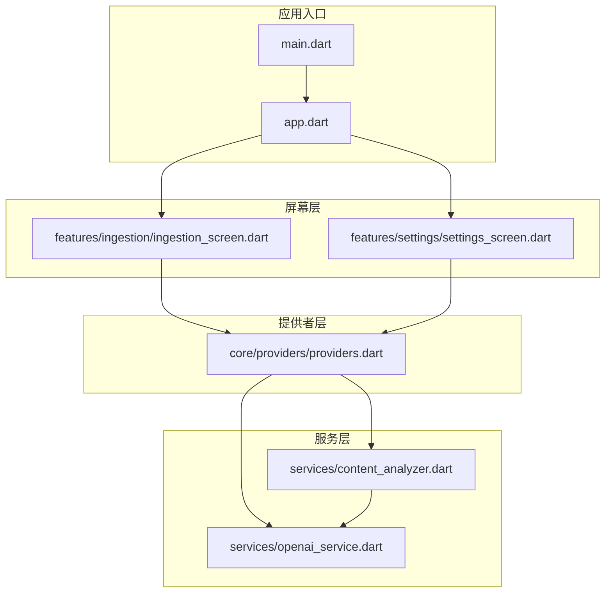
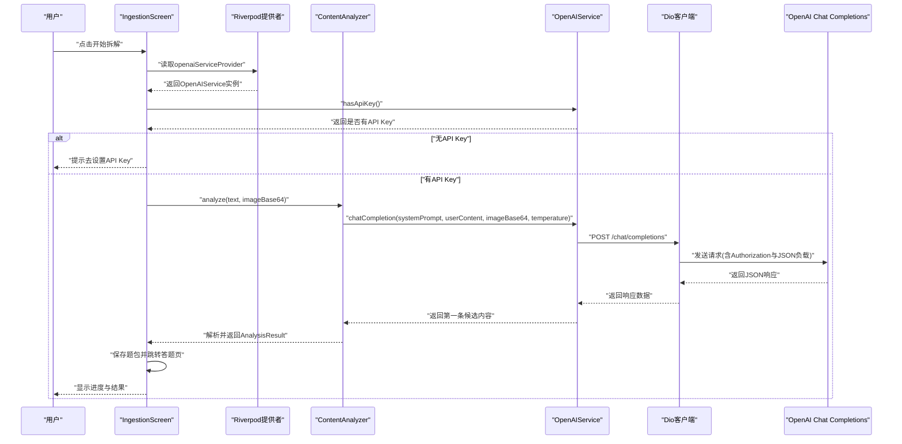
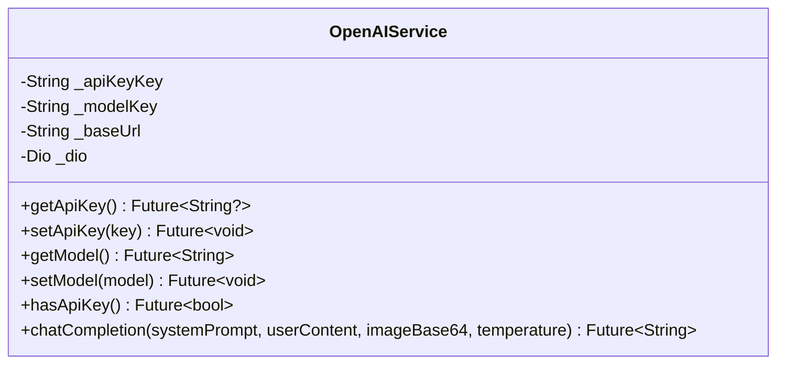
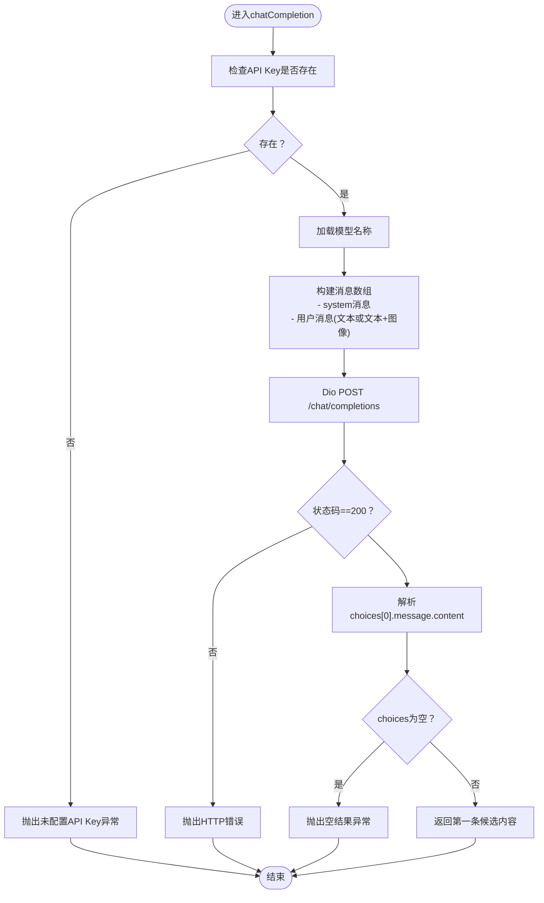
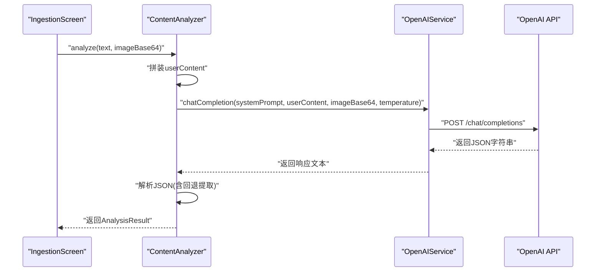
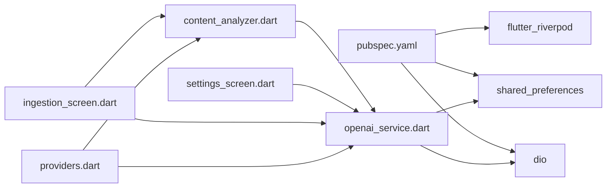

# OpenAI API服务

<cite>
**本文档引用的文件**
- [openai_service.dart](file://lib/services/openai_service.dart)
- [content_analyzer.dart](file://lib/services/content_analyzer.dart)
- [ingestion_screen.dart](file://lib/features/ingestion/ingestion_screen.dart)
- [settings_screen.dart](file://lib/features/settings/settings_screen.dart)
- [providers.dart](file://lib/core/providers/providers.dart)
- [app.dart](file://lib/app.dart)
- [main.dart](file://lib/main.dart)
- [pubspec.yaml](file://pubspec.yaml)
</cite>

## 目录
1. [简介](#简介)
2. [项目结构](#项目结构)
3. [核心组件](#核心组件)
4. [架构总览](#架构总览)
5. [详细组件分析](#详细组件分析)
6. [依赖分析](#依赖分析)
7. [性能考虑](#性能考虑)
8. [故障排除指南](#故障排除指南)
9. [结论](#结论)
10. [附录](#附录)

## 简介
本文件面向DIY多邻国学习APP中的OpenAI API服务，聚焦于OpenAIService类的实现原理与集成方式，涵盖API密钥管理、模型配置、请求处理机制以及chatCompletion方法的完整工作流程。文档还阐述Dio HTTP客户端的配置细节（超时、认证头、错误处理），并提供API配置指南（环境变量、模型选择、温度参数调优）、具体调用示例、错误处理代码路径与性能优化建议。

## 项目结构
该项目采用Flutter框架，核心业务围绕“内容导入-AI分析-题库生成-学习”的闭环展开。与OpenAI服务直接相关的模块分布如下：
- 服务层：OpenAIService（封装Dio与API交互）、ContentAnalyzer（基于系统提示词与用户内容生成结构化题目）
- 屏幕层：IngestionScreen（内容导入与分析）、SettingsScreen（API配置界面）
- 提供者层：Riverpod提供者（openaiServiceProvider、contentAnalyzerProvider等）
- 应用入口：main.dart、app.dart

**图示来源**
- [main.dart:1-36](file://lib/main.dart#L1-L36)
- [app.dart:1-111](file://lib/app.dart#L1-L111)
- [ingestion_screen.dart:1-335](file://lib/features/ingestion/ingestion_screen.dart#L1-L335)
- [settings_screen.dart:1-356](file://lib/features/settings/settings_screen.dart#L1-L356)
- [providers.dart:1-178](file://lib/core/providers/providers.dart#L1-L178)
- [openai_service.dart:1-109](file://lib/services/openai_service.dart#L1-L109)
- [content_analyzer.dart:1-172](file://lib/services/content_analyzer.dart#L1-L172)

**章节来源**
- [main.dart:1-36](file://lib/main.dart#L1-L36)
- [app.dart:1-111](file://lib/app.dart#L1-L111)
- [providers.dart:1-178](file://lib/core/providers/providers.dart#L1-L178)

## 核心组件
本节聚焦OpenAIService类及其协作组件，解释API密钥管理、模型配置与请求处理机制。

- OpenAIService
  - 负责API密钥与模型的持久化存储（SharedPreferences）
  - 使用Dio发起HTTP请求，设置基础URL、连接与接收超时
  - 实现chatCompletion方法，支持文本与可选图像输入，返回第一条候选回复
- ContentAnalyzer
  - 维护系统提示词模板，约束输出格式（JSON）
  - 调用OpenAIService进行内容分析，解析并校验返回的JSON结构
- Riverpod提供者
  - openaiServiceProvider：全局注入OpenAIService实例
  - contentAnalyzerProvider：基于OpenAIService创建ContentAnalyzer
- 屏幕组件
  - SettingsScreen：读取/保存API Key与模型；展示模型选择
  - IngestionScreen：触发分析流程，处理异常与状态反馈

**章节来源**
- [openai_service.dart:1-109](file://lib/services/openai_service.dart#L1-L109)
- [content_analyzer.dart:1-172](file://lib/services/content_analyzer.dart#L1-L172)
- [providers.dart:17-23](file://lib/core/providers/providers.dart#L17-L23)
- [settings_screen.dart:27-57](file://lib/features/settings/settings_screen.dart#L27-L57)
- [ingestion_screen.dart:69-126](file://lib/features/ingestion/ingestion_screen.dart#L69-L126)

## 架构总览
下图展示了从用户操作到OpenAI API调用的端到端流程，包括设置配置、内容导入、AI分析与题库保存。

**图示来源**
- [ingestion_screen.dart:69-126](file://lib/features/ingestion/ingestion_screen.dart#L69-L126)
- [providers.dart:17-23](file://lib/core/providers/providers.dart#L17-L23)
- [content_analyzer.dart:108-133](file://lib/services/content_analyzer.dart#L108-L133)
- [openai_service.dart:46-107](file://lib/services/openai_service.dart#L46-L107)

## 详细组件分析

### OpenAIService类分析
OpenAIService封装了与OpenAI API交互所需的全部逻辑，包括密钥与模型的持久化、Dio配置、请求构造与响应解析。

- 关键职责
  - API密钥管理：getApiKey/setApiKey，使用SharedPreferences存储
  - 模型配置：getModel/setModel，默认模型为gpt-4o-mini
  - HTTP客户端：Dio，基础URL为https://api.openai.com/v1，设置连接与接收超时
  - 请求处理：chatCompletion，构建系统消息与用户消息（支持文本+图像），设置Authorization头与JSON负载，解析choices[0].message.content
  - 错误处理：API Key缺失、非200状态码、空结果集等场景抛出异常

- 类关系图

**图示来源**
- [openai_service.dart:6-109](file://lib/services/openai_service.dart#L6-L109)

**章节来源**
- [openai_service.dart:7-35](file://lib/services/openai_service.dart#L7-L35)
- [openai_service.dart:11-15](file://lib/services/openai_service.dart#L11-L15)
- [openai_service.dart:46-107](file://lib/services/openai_service.dart#L46-L107)

### chatCompletion方法工作流程
该方法实现了从系统提示词、用户内容（可带图像）到OpenAI API请求与响应解析的完整链路。

- 输入参数
  - systemPrompt：系统提示词（由ContentAnalyzer维护）
  - userContent：用户输入文本
  - imageBase64：可选图像的base64编码（不含data:image前缀）
  - temperature：推理温度（默认0.7）

- 构建消息数组
  - 固定加入system角色的消息
  - 若提供imageBase64，则用户消息为混合数组（文本+图像URL），否则为纯文本

- 发送请求
  - 基础URL：https://api.openai.com/v1
  - 路径：/chat/completions
  - 头部：Authorization: Bearer <API Key>，Content-Type: application/json
  - 负载：包含model、messages、temperature、response_format=json_object、max_tokens=4096

- 响应解析
  - 校验状态码200
  - 读取choices[0].message.content作为返回文本
  - 对空结果抛出异常

- 流程图

**图示来源**
- [openai_service.dart:46-107](file://lib/services/openai_service.dart#L46-L107)

**章节来源**
- [openai_service.dart:46-107](file://lib/services/openai_service.dart#L46-L107)

### ContentAnalyzer分析流程
ContentAnalyzer负责将用户输入（文本/图片）转换为结构化题目，其核心逻辑如下：

- 系统提示词
  - 定义知识点提取、题型多样性、输出格式（严格JSON）等要求
  - 明确各题型字段与约束（选项数量、答案格式、解析说明等）

- 用户内容拼装
  - 条件拼接“文本内容”与“图片内容”说明
  - 调用OpenAIService.chatCompletion获取原始JSON字符串

- JSON解析与校验
  - 直接尝试解析；若失败则尝试提取第一个JSON块
  - 校验questions数组有效性，逐条反序列化为Question对象
  - 返回AnalysisResult(title, questions)

- 时序图

**图示来源**
- [content_analyzer.dart:108-133](file://lib/services/content_analyzer.dart#L108-L133)
- [content_analyzer.dart:135-170](file://lib/services/content_analyzer.dart#L135-L170)
- [openai_service.dart:46-107](file://lib/services/openai_service.dart#L46-L107)

**章节来源**
- [content_analyzer.dart:19-103](file://lib/services/content_analyzer.dart#L19-L103)
- [content_analyzer.dart:108-133](file://lib/services/content_analyzer.dart#L108-L133)
- [content_analyzer.dart:135-170](file://lib/services/content_analyzer.dart#L135-L170)

### SettingsScreen与API配置
SettingsScreen提供API Key与模型选择的配置入口，读取与保存逻辑如下：

- 读取配置
  - 通过openaiServiceProvider读取API Key与模型
  - 初始化学习目标（每日XP目标）

- 保存配置
  - setApiKey与setModel写入SharedPreferences
  - 同步更新用户统计数据

- 模型选择
  - 支持gpt-4o-mini、gpt-4o、gpt-4o-2024-11-20三种模型
  - 默认模型为gpt-4o-mini

**章节来源**
- [settings_screen.dart:27-57](file://lib/features/settings/settings_screen.dart#L27-L57)
- [settings_screen.dart:141-166](file://lib/features/settings/settings_screen.dart#L141-L166)

### IngestionScreen与分析流程
IngestionScreen负责内容导入与分析，关键流程如下：

- 输入准备
  - 文本内容来自剪贴板或用户输入
  - 图片内容读取为base64编码

- 调用分析
  - 检查API Key可用性
  - 通过contentAnalyzerProvider调用analyze
  - 保存分析结果为题包并跳转答题页

- 异常处理
  - 输入为空、API Key缺失、分析失败等场景均设置错误信息并提示用户

**章节来源**
- [ingestion_screen.dart:36-58](file://lib/features/ingestion/ingestion_screen.dart#L36-L58)
- [ingestion_screen.dart:69-126](file://lib/features/ingestion/ingestion_screen.dart#L69-L126)

## 依赖分析
- 外部依赖
  - dio：HTTP客户端，用于OpenAI API请求
  - shared_preferences：本地持久化API Key与模型
  - flutter_riverpod：状态管理与提供者注入
- 内部依赖
  - openai_service.dart被content_analyzer.dart与settings_screen.dart共同依赖
  - providers.dart统一管理openaiServiceProvider与contentAnalyzerProvider

**图示来源**
- [pubspec.yaml:9-22](file://pubspec.yaml#L9-L22)
- [openai_service.dart:1-3](file://lib/services/openai_service.dart#L1-L3)
- [content_analyzer.dart:1-3](file://lib/services/content_analyzer.dart#L1-L3)
- [providers.dart:17-23](file://lib/core/providers/providers.dart#L17-L23)

**章节来源**
- [pubspec.yaml:9-22](file://pubspec.yaml#L9-L22)
- [providers.dart:17-23](file://lib/core/providers/providers.dart#L17-L23)

## 性能考虑
- 超时设置
  - 连接超时：30秒；接收超时：120秒，适合长文本与图像分析场景
- 温度参数
  - 默认0.7，在创造性与稳定性之间取得平衡；可根据需求调整以提升一致性或多样性
- 模型选择
  - gpt-4o-mini：快速且经济，适合高频调用
  - gpt-4o：更强能力与视觉支持，适合复杂分析
- 建议
  - 对频繁调用场景，优先使用gpt-4o-mini并结合缓存策略
  - 在网络不稳定环境下适当增加接收超时
  - 控制单次请求的max_tokens，避免不必要的成本与延迟

[本节为通用性能建议，不直接分析特定文件]

## 故障排除指南
- 未设置API Key
  - 现象：调用chatCompletion前检查失败，抛出异常
  - 处理：引导用户前往设置页面配置API Key与模型
- HTTP请求失败
  - 现象：响应状态码非200
  - 处理：捕获异常并提示用户检查网络或API配额
- 返回空结果
  - 现象：choices为空
  - 处理：提示用户重试或调整输入内容
- JSON解析失败
  - 现象：ContentAnalyzer无法解析AI返回的JSON
  - 处理：尝试提取JSON块；若仍失败，提示用户检查系统提示词与输入格式

**章节来源**
- [openai_service.dart:52-55](file://lib/services/openai_service.dart#L52-L55)
- [openai_service.dart:96-98](file://lib/services/openai_service.dart#L96-L98)
- [openai_service.dart:102-104](file://lib/services/openai_service.dart#L102-L104)
- [content_analyzer.dart:141-149](file://lib/services/content_analyzer.dart#L141-L149)

## 结论
OpenAIService提供了简洁可靠的OpenAI API封装，结合Dio的超时与认证配置，配合ContentAnalyzer的系统提示词与JSON解析策略，形成了从内容导入到题库生成的完整闭环。SettingsScreen与IngestionScreen分别承担配置与使用入口，Riverpod提供者确保依赖注入与状态管理清晰可控。通过合理的模型选择与温度参数调优，可在性能与质量间取得良好平衡。

[本节为总结性内容，不直接分析特定文件]

## 附录

### API配置指南
- 环境变量
  - 当前实现使用SharedPreferences存储API Key与模型，无需额外环境变量
- 模型选择
  - 支持：gpt-4o-mini、gpt-4o、gpt-4o-2024-11-20
  - 默认：gpt-4o-mini（推荐用于高频调用）
- 温度参数调优
  - 低值（0.3-0.5）：更稳定、确定性强
  - 中值（0.7）：平衡创造性与一致性
  - 高值（0.8-1.0）：更具创造性，但可能降低一致性

**章节来源**
- [settings_screen.dart:141-166](file://lib/features/settings/settings_screen.dart#L141-L166)
- [content_analyzer.dart:129](file://lib/services/content_analyzer.dart#L129)

### 具体API调用示例
- 调用入口
  - 通过Riverpod提供者获取OpenAIService实例
  - 调用chatCompletion传入systemPrompt、userContent、可选imageBase64与temperature
- 错误处理
  - 在调用前后检查API Key可用性
  - 捕获HTTP状态码与空结果异常
  - ContentAnalyzer内部对JSON解析失败进行回退处理

**章节来源**
- [providers.dart:17-23](file://lib/core/providers/providers.dart#L17-L23)
- [openai_service.dart:46-107](file://lib/services/openai_service.dart#L46-L107)
- [content_analyzer.dart:108-133](file://lib/services/content_analyzer.dart#L108-L133)