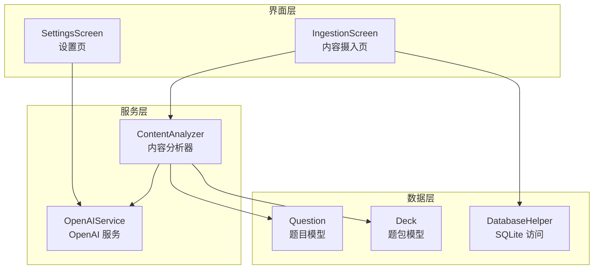
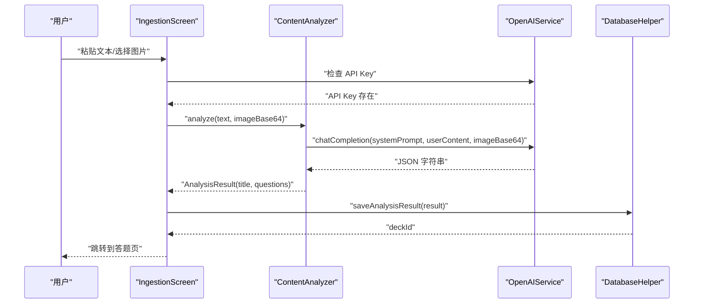
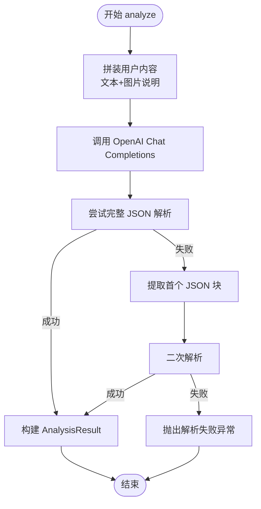
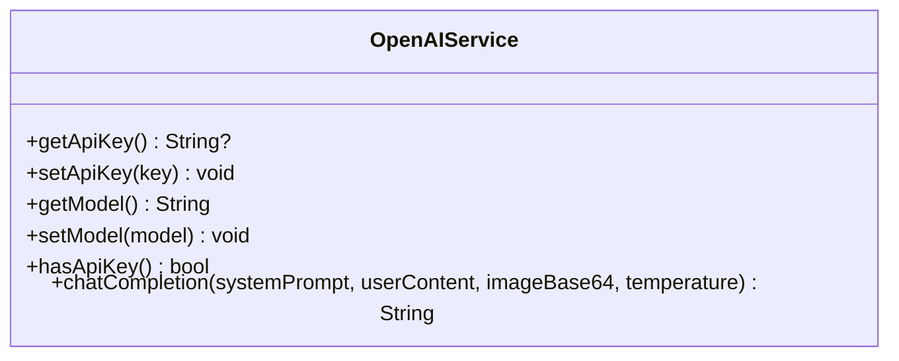
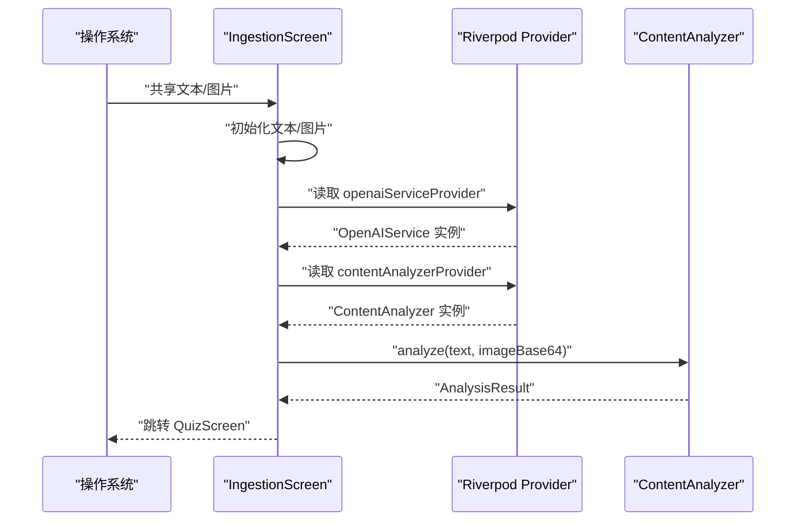
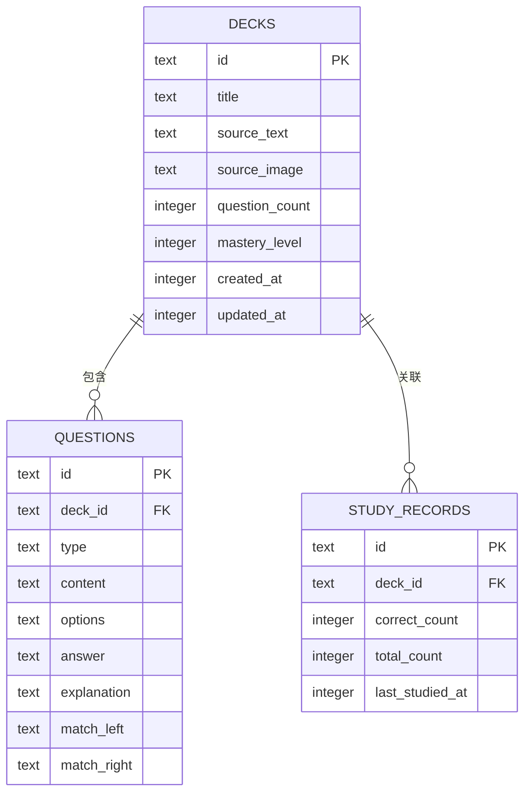
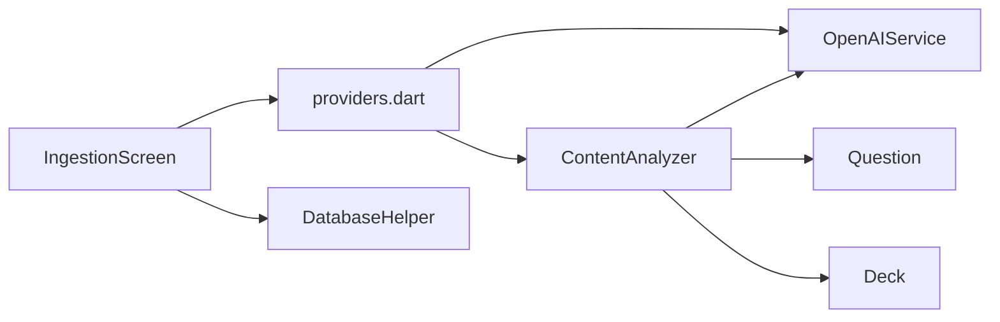

# 内容分析服务

<cite>
**本文引用的文件**
- [lib/services/content_analyzer.dart](file://lib/services/content_analyzer.dart)
- [lib/services/openai_service.dart](file://lib/services/openai_service.dart)
- [lib/core/providers/providers.dart](file://lib/core/providers/providers.dart)
- [lib/features/ingestion/ingestion_screen.dart](file://lib/features/ingestion/ingestion_screen.dart)
- [lib/data/models/question.dart](file://lib/data/models/question.dart)
- [lib/data/models/deck.dart](file://lib/data/models/deck.dart)
- [lib/data/database/database_helper.dart](file://lib/data/database/database_helper.dart)
- [lib/features/settings/settings_screen.dart](file://lib/features/settings/settings_screen.dart)
- [android/app/src/main/AndroidManifest.xml](file://android/app/src/main/AndroidManifest.xml)
</cite>

## 目录
1. [简介](#简介)
2. [项目结构](#项目结构)
3. [核心组件](#核心组件)
4. [架构总览](#架构总览)
5. [详细组件分析](#详细组件分析)
6. [依赖关系分析](#依赖关系分析)
7. [性能考虑](#性能考虑)
8. [故障排查指南](#故障排查指南)
9. [结论](#结论)
10. [附录](#附录)

## 简介
本文件面向内容分析服务的实现与使用，聚焦 ContentAnalysisService 的工作原理与细节，涵盖应用间分享内容的接收与处理、文本提取与结构化拆题流程、内容预处理（格式识别、清洗与结构化转换）、与 OpenAI 服务的集成（提示词设计、API 调用与结果解析）、配置项（来源、精度与自定义规则）、分析示例、错误处理策略与性能优化建议。

## 项目结构
内容分析服务位于 Flutter 应用的 lib 目录下，采用分层组织：
- services 层：封装与外部服务交互（OpenAI 与内容分析）
- data 层：数据模型与本地数据库访问
- features 层：业务功能页面（内容摄入、设置、学习等）
- core 层：全局 Provider 与常量

图示来源
- [lib/features/ingestion/ingestion_screen.dart:13-148](file://lib/features/ingestion/ingestion_screen.dart#L13-L148)
- [lib/services/content_analyzer.dart:14-172](file://lib/services/content_analyzer.dart#L14-L172)
- [lib/services/openai_service.dart:6-108](file://lib/services/openai_service.dart#L6-L108)
- [lib/data/models/question.dart:4-75](file://lib/data/models/question.dart#L4-L75)
- [lib/data/models/deck.dart:2-71](file://lib/data/models/deck.dart#L2-L71)
- [lib/data/database/database_helper.dart:9-192](file://lib/data/database/database_helper.dart#L9-L192)

章节来源
- [lib/features/ingestion/ingestion_screen.dart:13-148](file://lib/features/ingestion/ingestion_screen.dart#L13-L148)
- [lib/core/providers/providers.dart:17-23](file://lib/core/providers/providers.dart#L17-L23)

## 核心组件
- ContentAnalyzer：负责将用户输入的文本/图片内容转化为结构化的题目集合；内置系统提示词与 JSON 结构约束，调用 OpenAI 完成 AI 智能拆题。
- OpenAIService：封装 OpenAI Chat Completions API 调用，管理 API Key 与模型配置，统一响应格式与错误处理。
- IngestionScreen：应用间分享内容的入口界面，支持文本粘贴与图片选择，触发内容分析与题包保存。
- Question/Deck：数据模型，用于描述题目与题包结构，并持久化到本地数据库。
- DatabaseHelper：SQLite 访问层，提供题包、题目、学习记录与用户统计的 CRUD 操作。
- SettingsScreen：配置 OpenAI API Key 与模型，以及每日目标等用户偏好。

章节来源
- [lib/services/content_analyzer.dart:14-172](file://lib/services/content_analyzer.dart#L14-L172)
- [lib/services/openai_service.dart:6-108](file://lib/services/openai_service.dart#L6-L108)
- [lib/features/ingestion/ingestion_screen.dart:69-126](file://lib/features/ingestion/ingestion_screen.dart#L69-L126)
- [lib/data/models/question.dart:4-75](file://lib/data/models/question.dart#L4-L75)
- [lib/data/models/deck.dart:2-71](file://lib/data/models/deck.dart#L2-L71)
- [lib/data/database/database_helper.dart:9-192](file://lib/data/database/database_helper.dart#L9-L192)
- [lib/features/settings/settings_screen.dart:41-166](file://lib/features/settings/settings_screen.dart#L41-L166)

## 架构总览
内容分析服务的端到端流程如下：
- 应用间分享（文本/图片）进入 IngestionScreen
- 校验 OpenAI API Key 后，调用 ContentAnalyzer.analyze
- ContentAnalyzer 组装系统提示词与用户内容，调用 OpenAIService.chatCompletion
- OpenAI 返回 JSON 字符串，ContentAnalyzer 解析为 AnalysisResult（含题包标题与题目列表）
- 题包与题目通过 DatabaseHelper 保存至本地数据库
- 成功后跳转到 QuizScreen 进行学习

图示来源
- [lib/features/ingestion/ingestion_screen.dart:69-126](file://lib/features/ingestion/ingestion_screen.dart#L69-L126)
- [lib/services/content_analyzer.dart:108-133](file://lib/services/content_analyzer.dart#L108-L133)
- [lib/services/openai_service.dart:46-107](file://lib/services/openai_service.dart#L46-L107)
- [lib/core/providers/providers.dart:106-141](file://lib/core/providers/providers.dart#L106-L141)

## 详细组件分析

### ContentAnalyzer：AI 智能拆题引擎
- 系统提示词设计：明确任务边界（提取 5-10 个核心知识点，生成多种题型，提供解析），并给出严格的 JSON 输出规范与字段约束。
- 输入拼装：将文本与图片信息组合为用户内容，确保 AI 能同时理解图文上下文。
- API 调用：通过 OpenAIService.chatCompletion 发送请求，设置温度、响应格式为 JSON、最大 token 数等参数。
- 结果解析：优先尝试完整 JSON 解析；若返回包含代码块，则提取第一个 JSON 片段；最后将每道题反序列化为 Question 对象，构建 AnalysisResult。

图示来源
- [lib/services/content_analyzer.dart:108-133](file://lib/services/content_analyzer.dart#L108-L133)
- [lib/services/content_analyzer.dart:135-170](file://lib/services/content_analyzer.dart#L135-L170)

章节来源
- [lib/services/content_analyzer.dart:19-103](file://lib/services/content_analyzer.dart#L19-L103)
- [lib/services/content_analyzer.dart:108-133](file://lib/services/content_analyzer.dart#L108-L133)
- [lib/services/content_analyzer.dart:135-170](file://lib/services/content_analyzer.dart#L135-L170)

### OpenAIService：OpenAI 集成
- 配置管理：通过 SharedPreferences 存储 API Key 与模型名称，默认模型为 gpt-4o-mini。
- 请求构造：组装 system+user 消息，支持图片（base64 data URL）与纯文本两种用户内容形式。
- 响应处理：校验状态码、提取 choices[0].message.content，要求返回 JSON 字符串。
- 错误处理：未配置 Key、HTTP 失败、空结果均抛出可诊断异常。

图示来源
- [lib/services/openai_service.dart:17-40](file://lib/services/openai_service.dart#L17-L40)
- [lib/services/openai_service.dart:46-107](file://lib/services/openai_service.dart#L46-L107)

章节来源
- [lib/services/openai_service.dart:6-108](file://lib/services/openai_service.dart#L6-L108)

### IngestionScreen：应用间分享与内容接收
- 入口能力：支持接收来自其他应用的文本共享（PROCESS_TEXT intent）与图片路径，自动填充输入框与图片预览。
- 流程控制：校验输入非空与 API Key 存在，按阶段更新 UI 状态（分析中/生成题目/保存题包），捕获异常并展示错误信息。
- 跳转逻辑：保存成功后导航至 QuizScreen。

图示来源
- [lib/features/ingestion/ingestion_screen.dart:36-45](file://lib/features/ingestion/ingestion_screen.dart#L36-L45)
- [lib/features/ingestion/ingestion_screen.dart:69-126](file://lib/features/ingestion/ingestion_screen.dart#L69-L126)
- [android/app/src/main/AndroidManifest.xml:58-63](file://android/app/src/main/AndroidManifest.xml#L58-L63)

章节来源
- [lib/features/ingestion/ingestion_screen.dart:13-148](file://lib/features/ingestion/ingestion_screen.dart#L13-L148)
- [android/app/src/main/AndroidManifest.xml:58-63](file://android/app/src/main/AndroidManifest.xml#L58-L63)

### 数据模型与持久化
- Question：统一承载题目类型、题干、选项、答案与解析；支持 fromJson/fromMap/toMap，满足跨层传输与本地存储。
- Deck：承载题包元信息（标题、来源、题目数、掌握度、时间戳）。
- DatabaseHelper：创建 decks/questions/study_records/user_stats 表，提供插入、查询、更新、删除与冲突处理。

图示来源
- [lib/data/database/database_helper.dart:34-87](file://lib/data/database/database_helper.dart#L34-L87)
- [lib/data/models/question.dart:28-54](file://lib/data/models/question.dart#L28-L54)
- [lib/data/models/deck.dart:45-69](file://lib/data/models/deck.dart#L45-L69)

章节来源
- [lib/data/models/question.dart:4-75](file://lib/data/models/question.dart#L4-L75)
- [lib/data/models/deck.dart:2-71](file://lib/data/models/deck.dart#L2-L71)
- [lib/data/database/database_helper.dart:9-192](file://lib/data/database/database_helper.dart#L9-L192)

### 设置与配置
- API Key 与模型：在设置页配置 OpenAI API Key 与模型（gpt-4o-mini、gpt-4o、gpt-4o-2024-11-20），保存于 SharedPreferences。
- 用户偏好：设置每日学习目标，驱动后续学习行为。

章节来源
- [lib/features/settings/settings_screen.dart:41-166](file://lib/features/settings/settings_screen.dart#L41-L166)
- [lib/services/openai_service.dart:17-35](file://lib/services/openai_service.dart#L17-L35)

## 依赖关系分析
- IngestionScreen 依赖 Riverpod 提供的 contentAnalyzerProvider 与 openaiServiceProvider。
- ContentAnalyzer 依赖 OpenAIService 与 Question/Deck 模型。
- Provider 层集中管理服务实例与数据库访问。
- 数据持久化由 DatabaseHelper 统一提供。

图示来源
- [lib/core/providers/providers.dart:17-23](file://lib/core/providers/providers.dart#L17-L23)
- [lib/features/ingestion/ingestion_screen.dart:69-126](file://lib/features/ingestion/ingestion_screen.dart#L69-L126)
- [lib/services/content_analyzer.dart:14-17](file://lib/services/content_analyzer.dart#L14-L17)

章节来源
- [lib/core/providers/providers.dart:17-23](file://lib/core/providers/providers.dart#L17-L23)
- [lib/features/ingestion/ingestion_screen.dart:69-126](file://lib/features/ingestion/ingestion_screen.dart#L69-L126)

## 性能考虑
- API 调用超时与重试：OpenAI 服务默认连接与接收超时，可根据网络环境调整；建议在 UI 层增加“重试”按钮与进度反馈。
- 温度与响应格式：当前温度为 0.7，兼顾创造性与稳定性；固定 response_format 为 JSON，减少解析开销。
- 图片处理：仅传递 base64 编码的图片，避免额外文件 IO；注意图片尺寸与 base64 字符串长度对请求体的影响。
- 结果解析健壮性：ContentAnalyzer 支持 JSON 块提取，降低因模型输出不规范导致的失败率。
- 数据库写入批量化：批量插入题目时尽量减少事务外的多次往返，SQLite 已在插入时保证一致性。
- UI 响应：分析过程分阶段更新状态文本，避免主线程阻塞。

## 故障排查指南
- 未配置 API Key：IngestionScreen 在分析前检查 openai.hasApiKey()，若为假则提示用户前往设置配置。
- OpenAI 请求失败：OpenAIService 在状态码非 200 或 choices 为空时抛出异常，需检查网络、Key 有效性与模型可用性。
- JSON 解析失败：ContentAnalyzer 尝试完整解析与 JSON 块提取，若仍失败，检查系统提示词与模型输出格式是否一致。
- 无有效题目：当解析后的题目列表为空时，抛出异常提示 AI 未生成有效题目。
- 图片加载失败：IngestionScreen 的图片加载被忽略式处理，不影响文本分析流程。

章节来源
- [lib/features/ingestion/ingestion_screen.dart:76-82](file://lib/features/ingestion/ingestion_screen.dart#L76-L82)
- [lib/services/openai_service.dart:96-107](file://lib/services/openai_service.dart#L96-L107)
- [lib/services/content_analyzer.dart:138-149](file://lib/services/content_analyzer.dart#L138-L149)
- [lib/services/content_analyzer.dart:165-167](file://lib/services/content_analyzer.dart#L165-L167)
- [lib/features/ingestion/ingestion_screen.dart:47-58](file://lib/features/ingestion/ingestion_screen.dart#L47-L58)

## 结论
内容分析服务通过清晰的职责划分与稳健的错误处理，实现了从应用间分享到结构化题目的自动化流程。系统提示词与 JSON 规范确保了输出的一致性，Provider 与数据库层提供了良好的扩展性。建议在生产环境中进一步完善重试与降级策略、监控 API 调用耗时与成功率，并根据用户反馈持续优化提示词与题型多样性。

## 附录

### 内容预处理步骤
- 格式识别：区分纯文本与图文混合输入，为图片附加说明以便 AI 识别。
- 内容清洗：去除多余空白，保留关键上下文；对图片仅传递 base64，避免路径依赖。
- 结构化转换：将 AI 返回的 JSON 映射为 Question/Deck 对象，统一字段与类型。

章节来源
- [lib/services/content_analyzer.dart:112-124](file://lib/services/content_analyzer.dart#L112-L124)
- [lib/data/models/question.dart:57-74](file://lib/data/models/question.dart#L57-L74)
- [lib/data/models/deck.dart:12-21](file://lib/data/models/deck.dart#L12-L21)

### AI 智能拆题流程要点
- 知识点提取：要求 5-10 个核心知识点，覆盖多类型题型。
- 题型多样性：至少包含 2 种题型，确保覆盖面。
- 解析质量：每题提供清晰解析，解释正确答案的原因。

章节来源
- [lib/services/content_analyzer.dart:19-103](file://lib/services/content_analyzer.dart#L19-L103)

### 配置选项
- 支持的内容来源：文本（剪贴板/共享）、图片（文件路径转 base64）。
- 分析精度设置：温度（temperature，默认 0.7）、响应格式（JSON）、最大 token（默认 4096）。
- 自定义规则：可通过调整系统提示词与 JSON Schema 控制输出结构与题型分布。

章节来源
- [lib/features/settings/settings_screen.dart:141-166](file://lib/features/settings/settings_screen.dart#L141-L166)
- [lib/services/openai_service.dart:87-94](file://lib/services/openai_service.dart#L87-L94)
- [lib/services/content_analyzer.dart:19-103](file://lib/services/content_analyzer.dart#L19-L103)

### 分析示例（流程示意）
- 输入：知乎文章链接或截图、小红书笔记文本或图片
- 处理：ContentAnalyzer 组装提示词与内容，OpenAI 生成 JSON
- 输出：AnalysisResult（title + questions），保存为题包与题目，进入答题页

章节来源
- [lib/features/ingestion/ingestion_screen.dart:69-126](file://lib/features/ingestion/ingestion_screen.dart#L69-L126)
- [lib/core/providers/providers.dart:106-141](file://lib/core/providers/providers.dart#L106-L141)