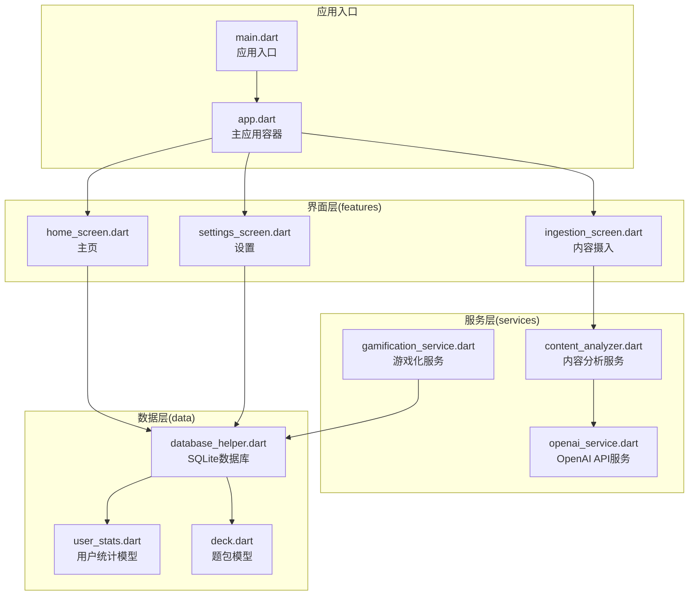
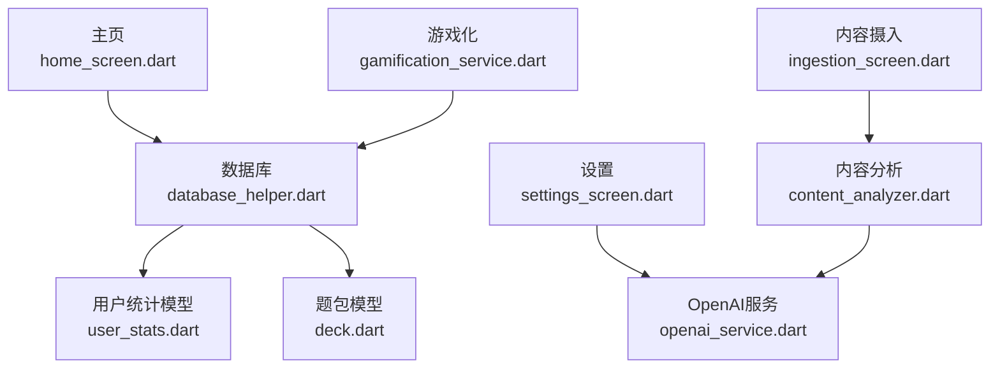
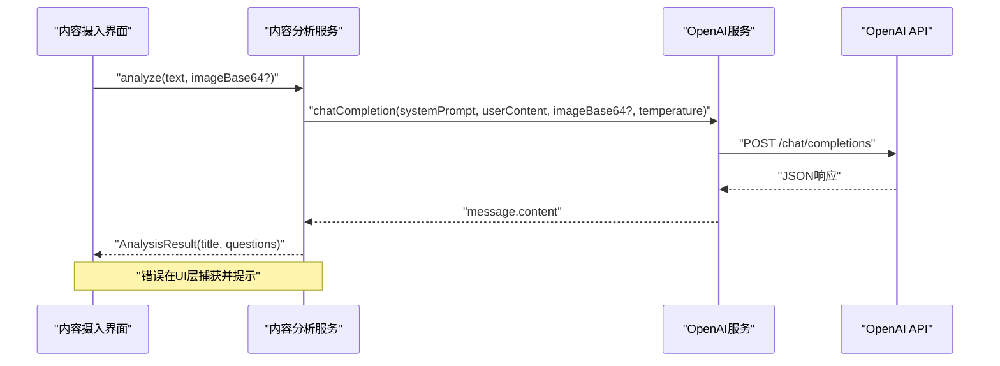
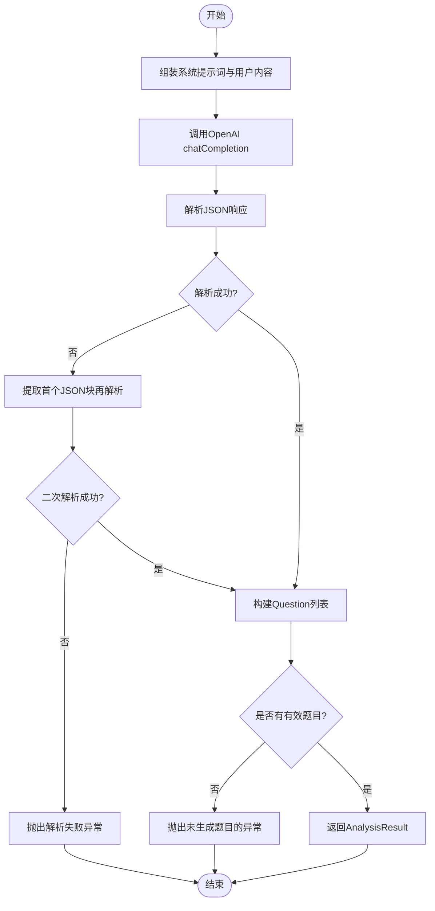
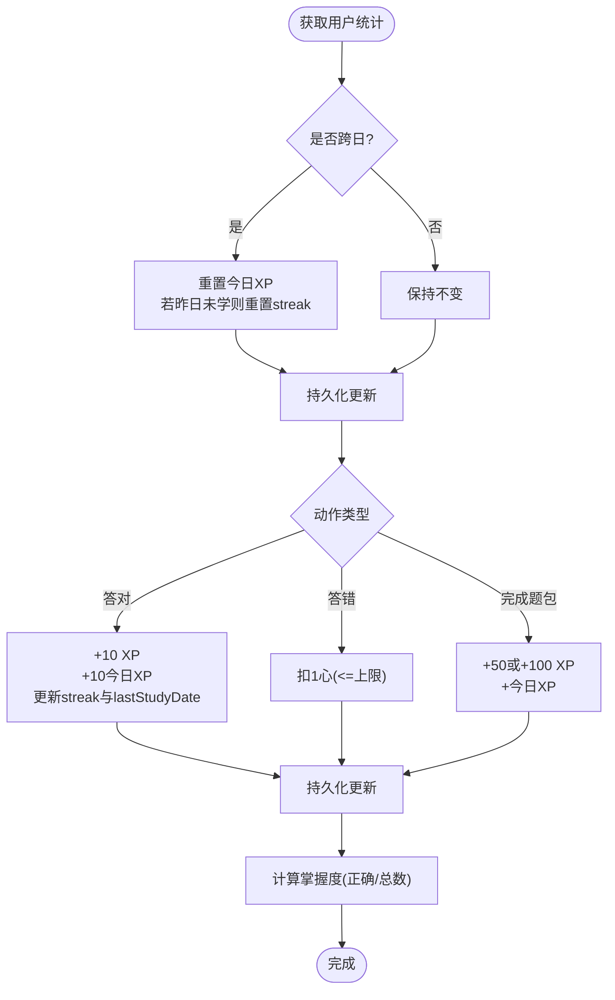
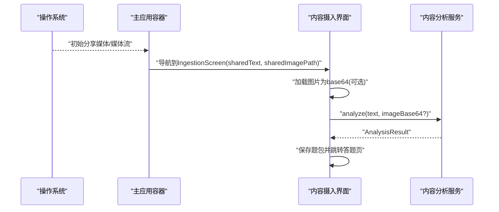
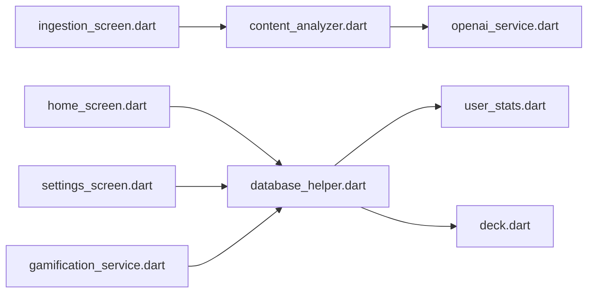
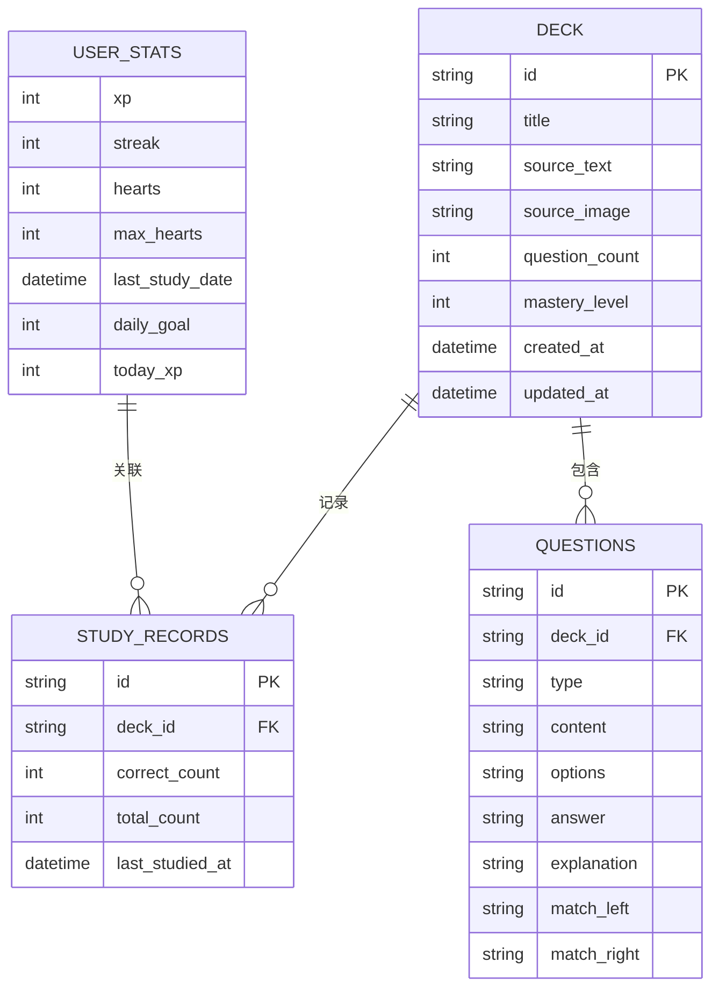

# 服务集成

<cite>
**本文引用的文件**
- [lib/main.dart](file://lib/main.dart)
- [lib/app.dart](file://lib/app.dart)
- [lib/services/openai_service.dart](file://lib/services/openai_service.dart)
- [lib/services/content_analyzer.dart](file://lib/services/content_analyzer.dart)
- [lib/services/gamification_service.dart](file://lib/services/gamification_service.dart)
- [lib/features/ingestion/ingestion_screen.dart](file://lib/features/ingestion/ingestion_screen.dart)
- [lib/features/settings/settings_screen.dart](file://lib/features/settings/settings_screen.dart)
- [lib/features/home/home_screen.dart](file://lib/features/home/home_screen.dart)
- [lib/data/database/database_helper.dart](file://lib/data/database/database_helper.dart)
- [lib/data/models/user_stats.dart](file://lib/data/models/user_stats.dart)
- [lib/data/models/deck.dart](file://lib/data/models/deck.dart)
</cite>

## 目录
1. [简介](#简介)
2. [项目结构](#项目结构)
3. [核心组件](#核心组件)
4. [架构总览](#架构总览)
5. [详细组件分析](#详细组件分析)
6. [依赖分析](#依赖分析)
7. [性能考虑](#性能考虑)
8. [故障排除指南](#故障排除指南)
9. [结论](#结论)
10. [附录](#附录)

## 简介
本文件面向Dlg-Q服务集成的技术文档，聚焦以下目标：
- OpenAI API集成：API配置、请求处理、响应解析与错误处理
- 游戏化服务：经验值(XP)、生命值(心数)、连续打卡与掌握度
- 内容分析服务：应用间分享处理、文本与图片提取、AI智能拆题
- 服务抽象与可替换性：通过Riverpod Provider实现服务注入与测试友好设计
- 实操指南：API调用示例、配置参数说明、故障排除

## 项目结构
Dlg-Q采用模块化分层组织，核心目录与职责如下：
- lib/main.dart：应用入口，初始化系统UI样式与Provider作用域
- lib/app.dart：主应用容器，负责底部导航与应用内分享意图处理
- lib/features/*：界面层，包含主页、题库、个人中心、设置、内容摄入与答题等页面
- lib/services/*：服务层，封装OpenAI API、内容分析与游戏化逻辑
- lib/data/*：数据层，包含数据库帮助类与模型定义（题包、题目、学习记录、用户统计）

**图示来源**
- [lib/main.dart:1-36](file://lib/main.dart#L1-L36)
- [lib/app.dart:10-111](file://lib/app.dart#L10-L111)
- [lib/features/home/home_screen.dart:11-335](file://lib/features/home/home_screen.dart#L11-L335)
- [lib/features/ingestion/ingestion_screen.dart:13-335](file://lib/features/ingestion/ingestion_screen.dart#L13-L335)
- [lib/features/settings/settings_screen.dart:7-356](file://lib/features/settings/settings_screen.dart#L7-L356)
- [lib/services/openai_service.dart:1-109](file://lib/services/openai_service.dart#L1-L109)
- [lib/services/content_analyzer.dart:1-172](file://lib/services/content_analyzer.dart#L1-L172)
- [lib/services/gamification_service.dart:1-116](file://lib/services/gamification_service.dart#L1-L116)
- [lib/data/database/database_helper.dart:1-192](file://lib/data/database/database_helper.dart#L1-L192)
- [lib/data/models/user_stats.dart:1-83](file://lib/data/models/user_stats.dart#L1-L83)
- [lib/data/models/deck.dart:1-71](file://lib/data/models/deck.dart#L1-L71)

**章节来源**
- [lib/main.dart:1-36](file://lib/main.dart#L1-L36)
- [lib/app.dart:10-111](file://lib/app.dart#L10-L111)

## 核心组件
- OpenAI API服务：封装Dio客户端、偏好存储读写、Chat Completions调用、JSON响应解析与错误处理
- 内容分析服务：基于系统提示词与用户内容，调用OpenAI生成结构化题目，解析返回并构建题包
- 游戏化服务：管理XP、心数、连续打卡、每日目标与掌握度计算，结合数据库进行持久化
- 数据层：SQLite建表、CRUD操作与模型映射，支撑题包、题目、学习记录与用户统计
- 界面层：主页展示学习路径与统计，设置页配置API Key与模型，内容摄入页处理分享与AI拆题

**章节来源**
- [lib/services/openai_service.dart:1-109](file://lib/services/openai_service.dart#L1-L109)
- [lib/services/content_analyzer.dart:1-172](file://lib/services/content_analyzer.dart#L1-L172)
- [lib/services/gamification_service.dart:1-116](file://lib/services/gamification_service.dart#L1-L116)
- [lib/data/database/database_helper.dart:1-192](file://lib/data/database/database_helper.dart#L1-L192)
- [lib/data/models/user_stats.dart:1-83](file://lib/data/models/user_stats.dart#L1-L83)
- [lib/data/models/deck.dart:1-71](file://lib/data/models/deck.dart#L1-L71)

## 架构总览
Dlg-Q采用“界面层-服务层-数据层”的分层架构，配合Riverpod进行状态与服务注入，形成清晰的依赖方向与可替换性。

**图示来源**
- [lib/features/home/home_screen.dart:11-335](file://lib/features/home/home_screen.dart#L11-L335)
- [lib/features/ingestion/ingestion_screen.dart:13-335](file://lib/features/ingestion/ingestion_screen.dart#L13-L335)
- [lib/features/settings/settings_screen.dart:7-356](file://lib/features/settings/settings_screen.dart#L7-L356)
- [lib/services/openai_service.dart:1-109](file://lib/services/openai_service.dart#L1-L109)
- [lib/services/content_analyzer.dart:1-172](file://lib/services/content_analyzer.dart#L1-L172)
- [lib/services/gamification_service.dart:1-116](file://lib/services/gamification_service.dart#L1-L116)
- [lib/data/database/database_helper.dart:1-192](file://lib/data/database/database_helper.dart#L1-L192)
- [lib/data/models/user_stats.dart:1-83](file://lib/data/models/user_stats.dart#L1-L83)
- [lib/data/models/deck.dart:1-71](file://lib/data/models/deck.dart#L1-L71)

## 详细组件分析

### OpenAI API集成
- 配置与持久化
  - API Key与模型名称通过SharedPreferences存储与读取
  - 默认模型为“gpt-4o-mini”，可通过设置页切换
- 请求处理
  - 使用Dio发起POST请求至/chat/completions
  - 支持文本与图片（base64，不含data:image前缀）混合消息
  - 启用JSON输出格式与最大token限制
- 响应解析
  - 校验HTTP状态码与choices非空
  - 提取message.content作为字符串返回
- 错误处理
  - 未配置API Key抛出异常
  - HTTP非200或空结果抛出异常
  - 异常在界面层捕获并显示错误信息

**图示来源**
- [lib/features/ingestion/ingestion_screen.dart:69-126](file://lib/features/ingestion/ingestion_screen.dart#L69-L126)
- [lib/services/content_analyzer.dart:105-133](file://lib/services/content_analyzer.dart#L105-L133)
- [lib/services/openai_service.dart:42-107](file://lib/services/openai_service.dart#L42-L107)

**章节来源**
- [lib/services/openai_service.dart:1-109](file://lib/services/openai_service.dart#L1-L109)
- [lib/features/ingestion/ingestion_screen.dart:69-126](file://lib/features/ingestion/ingestion_screen.dart#L69-L126)

### 内容分析服务（AI智能拆题）
- 输入处理
  - 组装系统提示词与用户内容，支持纯文本与图文混合
- 调用AI
  - 通过OpenAI服务调用Chat Completions，温度默认0.7
- 结果解析
  - 先尝试直接解析JSON，失败则提取首个JSON块
  - 将每道题反序列化为Question对象，过滤无效项
- 输出
  - 返回AnalysisResult，包含题包标题与问题列表；若无有效题目则抛出异常

**图示来源**
- [lib/services/content_analyzer.dart:105-171](file://lib/services/content_analyzer.dart#L105-L171)

**章节来源**
- [lib/services/content_analyzer.dart:1-172](file://lib/services/content_analyzer.dart#L1-L172)

### 游戏化服务（XP、心数、连续打卡与掌握度）
- 统计重置
  - 每日首次访问检查是否跨日，若中断则清空今日XP并重置连续天数；否则仅清今日XP
- 回答奖励
  - 答对：累计XP与今日XP，若当日未学习则更新连续天数与学习日期
  - 答错：同样记录当日学习，但扣减一颗心（不超过上限）
- 题包完成
  - 完成题包获得固定XP奖励（全对额外奖励），累加今日与总XP
- 恢复心数
  - 在上限范围内恢复一颗心
- 目标与掌握度
  - 设置每日XP目标，检查是否达成
  - 掌握度=正确率×100，按题包维度计算

**图示来源**
- [lib/services/gamification_service.dart:14-115](file://lib/services/gamification_service.dart#L14-L115)
- [lib/data/models/user_stats.dart:67-82](file://lib/data/models/user_stats.dart#L67-L82)

**章节来源**
- [lib/services/gamification_service.dart:1-116](file://lib/services/gamification_service.dart#L1-L116)
- [lib/data/models/user_stats.dart:1-83](file://lib/data/models/user_stats.dart#L1-L83)

### 应用间分享与内容摄入流程
- 分享意图处理
  - 应用启动或运行时监听分享事件，区分文本与图片
  - 将分享内容传递至内容摄入页
- 内容摄入页
  - 支持粘贴板导入、图片加载为base64
  - 校验API Key后调用内容分析服务，保存题包并跳转答题页
  - 错误统一捕获并在UI提示

**图示来源**
- [lib/app.dart:33-72](file://lib/app.dart#L33-L72)
- [lib/features/ingestion/ingestion_screen.dart:35-126](file://lib/features/ingestion/ingestion_screen.dart#L35-L126)

**章节来源**
- [lib/app.dart:17-78](file://lib/app.dart#L17-L78)
- [lib/features/ingestion/ingestion_screen.dart:13-335](file://lib/features/ingestion/ingestion_screen.dart#L13-L335)

### 设置与配置
- OpenAI配置
  - API Key与模型选择，保存至SharedPreferences
- 学习目标
  - 每日XP目标，通过游戏化服务持久化
- 数据管理
  - 支持一键清除所有题包与学习记录

**章节来源**
- [lib/features/settings/settings_screen.dart:27-57](file://lib/features/settings/settings_screen.dart#L27-L57)
- [lib/features/settings/settings_screen.dart:265-304](file://lib/features/settings/settings_screen.dart#L265-L304)

## 依赖分析
- 组件耦合
  - 内容分析服务依赖OpenAI服务；游戏化服务依赖数据库；界面层通过Riverpod依赖服务与数据库
- 外部依赖
  - Dio（网络）、SharedPreferences（配置）、sqflite（本地数据库）、flutter_riverpod（状态/服务注入）
- 可替换性
  - 通过接口抽象与Provider注入，可在测试中以Mock服务替代真实实现

**图示来源**
- [lib/features/ingestion/ingestion_screen.dart:91-107](file://lib/features/ingestion/ingestion_screen.dart#L91-L107)
- [lib/services/content_analyzer.dart:17](file://lib/services/content_analyzer.dart#L17)
- [lib/services/openai_service.dart:11-15](file://lib/services/openai_service.dart#L11-L15)
- [lib/features/home/home_screen.dart:16-17](file://lib/features/home/home_screen.dart#L16-L17)
- [lib/features/settings/settings_screen.dart:28-46](file://lib/features/settings/settings_screen.dart#L28-L46)
- [lib/services/gamification_service.dart:8](file://lib/services/gamification_service.dart#L8)
- [lib/data/database/database_helper.dart:104-190](file://lib/data/database/database_helper.dart#L104-L190)

**章节来源**
- [lib/features/ingestion/ingestion_screen.dart:91-107](file://lib/features/ingestion/ingestion_screen.dart#L91-L107)
- [lib/services/content_analyzer.dart:17](file://lib/services/content_analyzer.dart#L17)
- [lib/services/openai_service.dart:11-15](file://lib/services/openai_service.dart#L11-L15)
- [lib/features/home/home_screen.dart:16-17](file://lib/features/home/home_screen.dart#L16-L17)
- [lib/features/settings/settings_screen.dart:28-46](file://lib/features/settings/settings_screen.dart#L28-L46)
- [lib/services/gamification_service.dart:8](file://lib/services/gamification_service.dart#L8)
- [lib/data/database/database_helper.dart:104-190](file://lib/data/database/database_helper.dart#L104-L190)

## 性能考虑
- 网络请求
  - 合理设置连接与接收超时，避免长时间阻塞UI
  - 对大图片建议压缩后再传输，减少payload体积
- 数据库
  - 批量插入与查询使用事务或批量操作，降低I/O开销
- UI渲染
  - 大列表使用懒加载与虚拟化，避免一次性渲染过多节点
- 缓存策略
  - 对常用配置与近期统计结果进行内存缓存，减少重复IO

## 故障排除指南
- 未配置API Key
  - 现象：调用OpenAI服务抛出异常
  - 处理：前往设置页填写API Key并保存
  - 参考
    - [lib/services/openai_service.dart:53-55](file://lib/services/openai_service.dart#L53-L55)
    - [lib/features/ingestion/ingestion_screen.dart:76-82](file://lib/features/ingestion/ingestion_screen.dart#L76-L82)
- HTTP请求失败
  - 现象：状态码非200
  - 处理：检查网络、API Key有效性与模型可用性
  - 参考
    - [lib/services/openai_service.dart:96-98](file://lib/services/openai_service.dart#L96-L98)
- AI返回为空或无法解析
  - 现象：choices为空或JSON解析失败
  - 处理：调整系统提示词、降低温度或更换模型
  - 参考
    - [lib/services/openai_service.dart:102-104](file://lib/services/openai_service.dart#L102-L104)
    - [lib/services/content_analyzer.dart:139-149](file://lib/services/content_analyzer.dart#L139-L149)
- 心数耗尽
  - 现象：答错扣心导致心数为0
  - 处理：等待自然恢复或完成题包获得额外心数
  - 参考
    - [lib/services/gamification_service.dart:67-72](file://lib/services/gamification_service.dart#L67-L72)
- 数据清除后丢失学习记录
  - 现象：清除数据后题包与统计归零
  - 处理：谨慎使用数据管理功能，必要时备份
  - 参考
    - [lib/features/settings/settings_screen.dart:287-303](file://lib/features/settings/settings_screen.dart#L287-L303)

**章节来源**
- [lib/services/openai_service.dart:53-104](file://lib/services/openai_service.dart#L53-L104)
- [lib/services/content_analyzer.dart:139-149](file://lib/services/content_analyzer.dart#L139-L149)
- [lib/services/gamification_service.dart:67-72](file://lib/services/gamification_service.dart#L67-L72)
- [lib/features/settings/settings_screen.dart:287-303](file://lib/features/settings/settings_screen.dart#L287-L303)

## 结论
Dlg-Q的服务集成围绕“OpenAI API + 内容分析 + 游戏化 + 数据持久化”展开，通过清晰的分层与Provider注入实现了良好的可维护性与可替换性。内容摄入流程从应用间分享到AI拆题再到题包保存，闭环完整；游戏化机制提升了学习体验与持续性。建议在生产环境中进一步完善重试与降级策略、增强日志追踪与监控告警，以提升稳定性与可观测性。

## 附录

### API调用示例（路径指引）
- 调用OpenAI Chat Completions
  - 方法：POST /chat/completions
  - 请求头：Authorization: Bearer <API_KEY>, Content-Type: application/json
  - 请求体字段：model、messages、temperature、response_format、max_tokens
  - 参考
    - [lib/services/openai_service.dart:79-94](file://lib/services/openai_service.dart#L79-L94)
- 内容分析调用链
  - 入口：IngestionScreen.analyze
  - 中心：ContentAnalyzer.analyze
  - 底层：OpenAIService.chatCompletion
  - 参考
    - [lib/features/ingestion/ingestion_screen.dart:91-97](file://lib/features/ingestion/ingestion_screen.dart#L91-L97)
    - [lib/services/content_analyzer.dart:125-130](file://lib/services/content_analyzer.dart#L125-L130)
    - [lib/services/openai_service.dart:46-107](file://lib/services/openai_service.dart#L46-L107)

### 配置参数说明
- OpenAI
  - API Key：在设置页填写，保存于SharedPreferences
  - 模型：支持gpt-4o-mini、gpt-4o、gpt-4o-2024-11-20，默认gpt-4o-mini
  - 温度：默认0.7，影响创造性与稳定性
  - 参考
    - [lib/features/settings/settings_screen.dart:28-46](file://lib/features/settings/settings_screen.dart#L28-L46)
    - [lib/services/openai_service.dart:17-35](file://lib/services/openai_service.dart#L17-L35)
    - [lib/services/openai_service.dart:89-93](file://lib/services/openai_service.dart#L89-L93)

### 数据模型概览

**图示来源**
- [lib/data/models/user_stats.dart:2-65](file://lib/data/models/user_stats.dart#L2-L65)
- [lib/data/models/deck.dart:2-69](file://lib/data/models/deck.dart#L2-L69)
- [lib/data/database/database_helper.dart:34-87](file://lib/data/database/database_helper.dart#L34-L87)