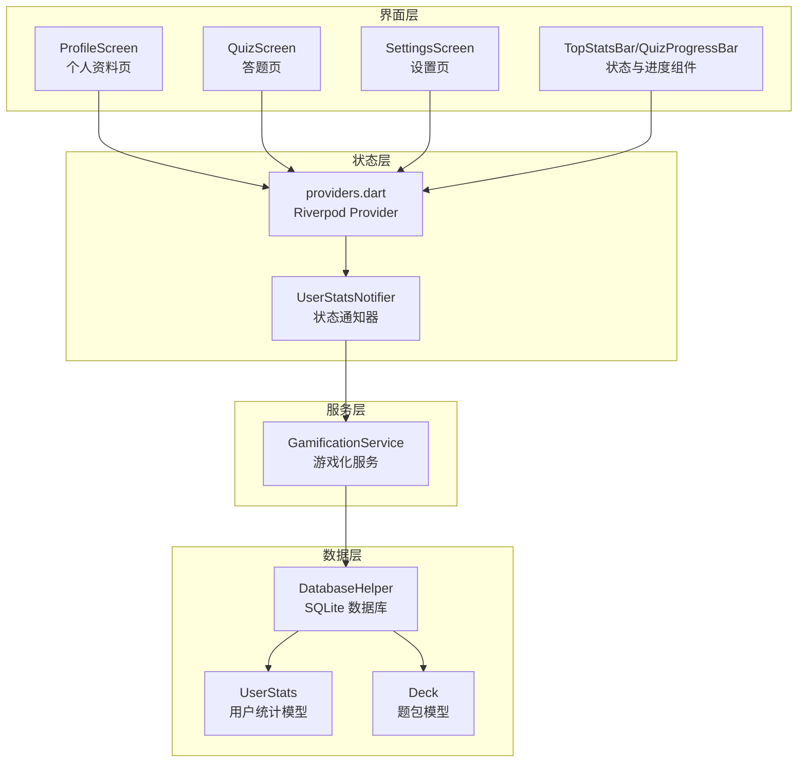
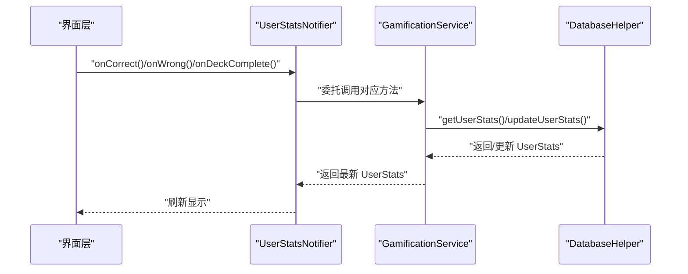
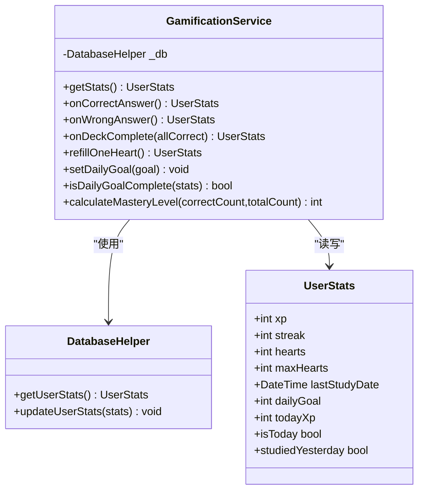
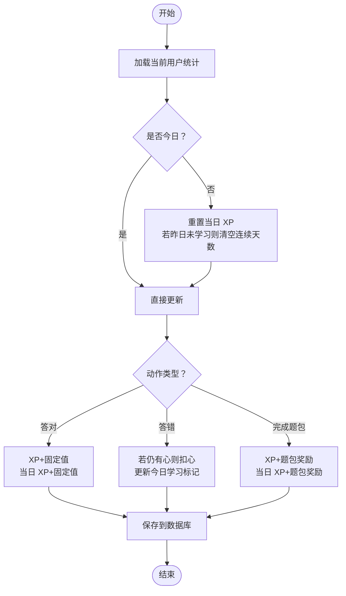
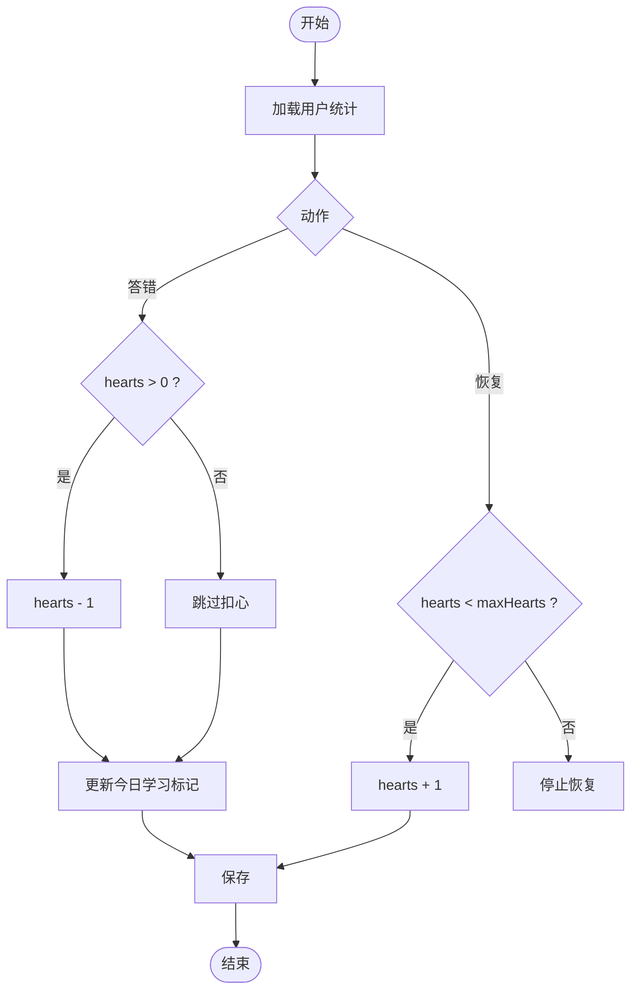
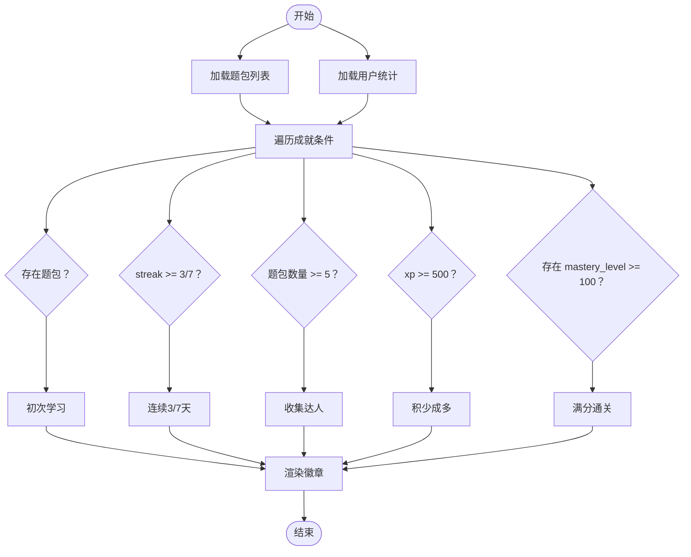
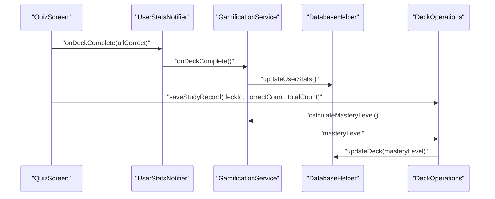
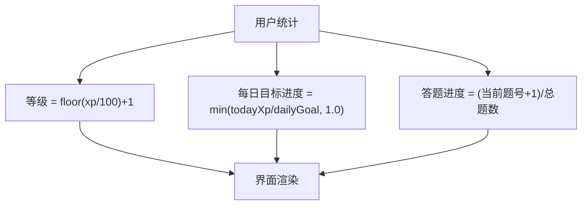
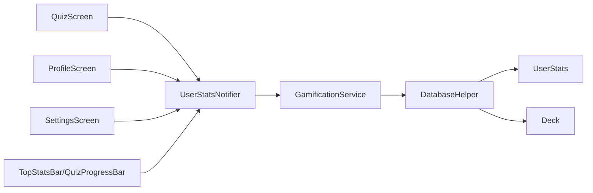

# 游戏化服务

<cite>
**本文档引用的文件**
- [lib/services/gamification_service.dart](file://lib/services/gamification_service.dart)
- [lib/core/providers/providers.dart](file://lib/core/providers/providers.dart)
- [lib/data/database/database_helper.dart](file://lib/data/database/database_helper.dart)
- [lib/data/models/user_stats.dart](file://lib/data/models/user_stats.dart)
- [lib/data/models/deck.dart](file://lib/data/models/deck.dart)
- [lib/features/profile/profile_screen.dart](file://lib/features/profile/profile_screen.dart)
- [lib/shared/widgets/stats_widgets.dart](file://lib/shared/widgets/stats_widgets.dart)
- [lib/features/learning/quiz_screen.dart](file://lib/features/learning/quiz_screen.dart)
- [lib/features/settings/settings_screen.dart](file://lib/features/settings/settings_screen.dart)
</cite>

## 目录
1. [简介](#简介)
2. [项目结构](#项目结构)
3. [核心组件](#核心组件)
4. [架构概览](#架构概览)
5. [详细组件分析](#详细组件分析)
6. [依赖关系分析](#依赖关系分析)
7. [性能考虑](#性能考虑)
8. [故障排除指南](#故障排除指南)
9. [结论](#结论)
10. [附录：配置与使用示例](#附录配置与使用示例)

## 简介
本文件面向“游戏化服务”的技术文档，系统性阐述 GamificationService 的设计原理与实现机制，涵盖经验值（XP）计算算法、生命值（心数）管理系统、成就解锁机制，以及掌握度（Mastery Level）的计算方法与可视化展示。文档同时提供服务配置选项、使用示例与扩展指南，帮助开发者在现有架构上进行二次开发与定制。

## 项目结构
游戏化功能围绕以下模块协同工作：
- 服务层：GamificationService 提供 XP、心数、连续打卡、掌握度等核心逻辑
- 数据层：DatabaseHelper 通过 SQLite 存储用户统计、题包与学习记录
- 状态层：Riverpod Provider 管理服务实例与用户统计状态
- 展示层：ProfileScreen、QuizScreen、SettingsScreen 等界面消费状态并触发事件
- 可视化组件：TopStatsBar、QuizProgressBar 等组件负责进度与状态展示

图表来源
- [lib/core/providers/providers.dart:25-81](file://lib/core/providers/providers.dart#L25-L81)
- [lib/services/gamification_service.dart:5-115](file://lib/services/gamification_service.dart#L5-L115)
- [lib/data/database/database_helper.dart:9-191](file://lib/data/database/database_helper.dart#L9-L191)
- [lib/data/models/user_stats.dart:2-82](file://lib/data/models/user_stats.dart#L2-L82)
- [lib/data/models/deck.dart:2-70](file://lib/data/models/deck.dart#L2-L70)

章节来源
- [lib/core/providers/providers.dart:1-178](file://lib/core/providers/providers.dart#L1-L178)
- [lib/services/gamification_service.dart:1-116](file://lib/services/gamification_service.dart#L1-L116)
- [lib/data/database/database_helper.dart:1-192](file://lib/data/database/database_helper.dart#L1-L192)

## 核心组件
- GamificationService：负责 XP 获取、心数消耗、连续打卡更新、每日目标检查与掌握度计算
- DatabaseHelper：封装 SQLite 表结构与 CRUD 操作，维护 user_stats、decks、questions、study_records
- UserStats：用户统计模型，包含 XP、连续天数、心数、最大心数、最后学习时间、每日目标、当日 XP
- Deck：题包模型，包含 mastery_level 掌握度字段
- Riverpod Provider：提供 GamificationService 实例与 UserStatsNotifier 状态管理
- 展示组件：ProfileScreen、QuizScreen、SettingsScreen、TopStatsBar、QuizProgressBar

章节来源
- [lib/services/gamification_service.dart:5-115](file://lib/services/gamification_service.dart#L5-L115)
- [lib/data/database/database_helper.dart:75-191](file://lib/data/database/database_helper.dart#L75-L191)
- [lib/data/models/user_stats.dart:2-82](file://lib/data/models/user_stats.dart#L2-L82)
- [lib/data/models/deck.dart:2-70](file://lib/data/models/deck.dart#L2-L70)
- [lib/core/providers/providers.dart:25-81](file://lib/core/providers/providers.dart#L25-L81)

## 架构概览
游戏化服务采用分层架构：
- 界面层通过 Riverpod 订阅状态，调用 UserStatsNotifier 触发服务方法
- 服务层与数据库层解耦，通过 DatabaseHelper 抽象访问
- 数据模型清晰分离，便于扩展与测试

图表来源
- [lib/core/providers/providers.dart:58-81](file://lib/core/providers/providers.dart#L58-L81)
- [lib/services/gamification_service.dart:31-85](file://lib/services/gamification_service.dart#L31-L85)
- [lib/data/database/database_helper.dart:178-190](file://lib/data/database/database_helper.dart#L178-L190)

## 详细组件分析

### 组件一：GamificationService 设计与实现
- XP 获取规则
  - 答对一题：固定增量
  - 完成题包：根据是否全对给予不同奖励
- 心数管理
  - 答错一题扣心，但不改变连续打卡状态
  - 支持恢复心数上限
- 连续打卡与每日重置
  - 通过 lastStudyDate 与 isToday 判断是否跨日
  - 若中断学习则清空连续天数
- 掌握度计算
  - 基于正确数量与总数量的比例换算为百分制

图表来源
- [lib/services/gamification_service.dart:5-115](file://lib/services/gamification_service.dart#L5-L115)
- [lib/data/database/database_helper.dart:178-190](file://lib/data/database/database_helper.dart#L178-L190)
- [lib/data/models/user_stats.dart:2-82](file://lib/data/models/user_stats.dart#L2-L82)

章节来源
- [lib/services/gamification_service.dart:10-115](file://lib/services/gamification_service.dart#L10-L115)
- [lib/data/models/user_stats.dart:68-82](file://lib/data/models/user_stats.dart#L68-L82)

### 组件二：经验值计算算法
- 基础规则
  - 答对一题：固定增量
  - 完成题包：全对额外奖励
- 算法流程

图表来源
- [lib/services/gamification_service.dart:15-85](file://lib/services/gamification_service.dart#L15-L85)
- [lib/data/database/database_helper.dart:178-190](file://lib/data/database/database_helper.dart#L178-L190)

章节来源
- [lib/services/gamification_service.dart:15-85](file://lib/services/gamification_service.dart#L15-L85)

### 组件三：生命值（心数）管理系统
- 答错扣心：当 hearts > 0 时扣减
- 连续打卡不受影响：即使答错也会更新 lastStudyDate 并更新 streak
- 恢复心数：达到最大心数上限前可恢复

图表来源
- [lib/services/gamification_service.dart:53-95](file://lib/services/gamification_service.dart#L53-L95)

章节来源
- [lib/services/gamification_service.dart:53-95](file://lib/services/gamification_service.dart#L53-L95)

### 组件四：成就解锁机制
- 成就条件
  - 初次学习：存在题包即解锁
  - 连续天数：streak 达到阈值
  - 收集达人：题包数量达到阈值
  - 积少成多：累计 XP 达到阈值
  - 满分通关：任一题包 mastery_level 达到阈值
- 可视化
  - 使用网格布局展示成就徽章，按解锁状态切换样式

图表来源
- [lib/features/profile/profile_screen.dart:212-289](file://lib/features/profile/profile_screen.dart#L212-L289)

章节来源
- [lib/features/profile/profile_screen.dart:212-289](file://lib/features/profile/profile_screen.dart#L212-L289)

### 组件五：掌握度计算与展示
- 计算方法
  - 正确率 = 正确数量 / 总数量
  - 掌握度 = 正确率 × 100（取整）
- 存储与更新
  - 将掌握度写回题包记录，并在题包列表中展示
- 界面展示
  - 个人资料页与答题结果页均体现掌握度与正确率

图表来源
- [lib/features/learning/quiz_screen.dart:92-101](file://lib/features/learning/quiz_screen.dart#L92-L101)
- [lib/core/providers/providers.dart:150-177](file://lib/core/providers/providers.dart#L150-L177)
- [lib/services/gamification_service.dart:109-115](file://lib/services/gamification_service.dart#L109-L115)

章节来源
- [lib/features/learning/quiz_screen.dart:92-101](file://lib/features/learning/quiz_screen.dart#L92-L101)
- [lib/core/providers/providers.dart:150-177](file://lib/core/providers/providers.dart#L150-L177)
- [lib/services/gamification_service.dart:109-115](file://lib/services/gamification_service.dart#L109-L115)

### 组件六：等级提升规则与进度可视化
- 等级规则
  - 当前等级 = total XP ÷ 100 向下取整 + 1
- 进度可视化
  - 个人资料页展示 XP 与等级
  - 每日目标进度条按 todayXp / dailyGoal 计算
  - 答题进度条按当前题号 / 总题数 计算

图表来源
- [lib/features/profile/profile_screen.dart:64-75](file://lib/features/profile/profile_screen.dart#L64-L75)
- [lib/features/profile/profile_screen.dart:135-210](file://lib/features/profile/profile_screen.dart#L135-L210)
- [lib/shared/widgets/stats_widgets.dart:75-139](file://lib/shared/widgets/stats_widgets.dart#L75-L139)

章节来源
- [lib/features/profile/profile_screen.dart:64-75](file://lib/features/profile/profile_screen.dart#L64-L75)
- [lib/features/profile/profile_screen.dart:135-210](file://lib/features/profile/profile_screen.dart#L135-L210)
- [lib/shared/widgets/stats_widgets.dart:75-139](file://lib/shared/widgets/stats_widgets.dart#L75-L139)

## 依赖关系分析
- 组件耦合
  - GamificationService 仅依赖 DatabaseHelper 与 UserStats 模型，内聚性高
  - Riverpod Provider 作为粘合层，避免界面与服务直接耦合
- 外部依赖
  - SQLite（sqflite）用于本地持久化
  - Riverpod 用于状态管理
- 潜在循环依赖
  - 未发现直接循环；Provider 在顶层注入，服务与数据库之间为单向依赖

图表来源
- [lib/core/providers/providers.dart:25-81](file://lib/core/providers/providers.dart#L25-L81)
- [lib/services/gamification_service.dart:5-115](file://lib/services/gamification_service.dart#L5-L115)
- [lib/data/database/database_helper.dart:75-191](file://lib/data/database/database_helper.dart#L75-L191)

章节来源
- [lib/core/providers/providers.dart:25-81](file://lib/core/providers/providers.dart#L25-L81)
- [lib/data/database/database_helper.dart:75-191](file://lib/data/database/database_helper.dart#L75-L191)

## 性能考虑
- 数据库访问
  - 所有读写操作均为异步，建议在高频操作（如答题过程）中合并状态更新
- 状态订阅
  - 使用 Riverpod 的细粒度订阅，避免不必要的重建
- 计算复杂度
  - 掌握度计算为 O(1)，用户体验流畅
- I/O 优化
  - 将每日重置判断放在服务层，减少界面层重复计算

## 故障排除指南
- 问题：跨日未重置当日 XP
  - 检查 lastStudyDate 是否正确更新
  - 确认 isToday 判断逻辑
- 问题：连续天数异常增长
  - 确保 onWrongAnswer 仍会更新今日学习标记
- 问题：成就未解锁
  - 检查题包数量、累计 XP、mastery_level 是否正确写入
- 问题：设置页面无法保存每日目标
  - 确认 UserStatsNotifier.setDailyGoal 已调用并重新加载

章节来源
- [lib/services/gamification_service.dart:15-28](file://lib/services/gamification_service.dart#L15-L28)
- [lib/features/settings/settings_screen.dart:41-57](file://lib/features/settings/settings_screen.dart#L41-L57)

## 结论
本游戏化服务以简洁明确的职责划分实现了 XP、心数、连续打卡与掌握度的核心功能。通过 Riverpod 与 SQLite 的组合，系统具备良好的可维护性与扩展性。建议后续可在以下方面增强：
- 增加等级经验曲线（非线性 XP 获取）
- 引入更丰富的成就类型与条件
- 支持多语言与主题定制
- 提供导出/导入用户统计数据的能力

## 附录：配置与使用示例

### 服务配置选项
- XP 获取规则
  - 答对一题：固定增量
  - 完成题包：普通完成与完美完成两种奖励
- 生命值消耗策略
  - 答错扣心，上限为 maxHearts
- 成就条件设置
  - 初次学习、连续天数、题包数量、累计 XP、满分通关
- 掌握度计算
  - 正确率 × 100 取整，范围 0-100

章节来源
- [lib/services/gamification_service.dart:10-12](file://lib/services/gamification_service.dart#L10-L12)
- [lib/features/profile/profile_screen.dart:216-259](file://lib/features/profile/profile_screen.dart#L216-L259)
- [lib/services/gamification_service.dart:109-115](file://lib/services/gamification_service.dart#L109-L115)

### 使用示例路径
- 答题后更新统计
  - [lib/features/learning/quiz_screen.dart:55-58](file://lib/features/learning/quiz_screen.dart#L55-L58)
- 完成题包并保存学习记录
  - [lib/features/learning/quiz_screen.dart:94-99](file://lib/features/learning/quiz_screen.dart#L94-L99)
- 设置每日目标
  - [lib/features/settings/settings_screen.dart:46](file://lib/features/settings/settings_screen.dart#L46)
- 计算掌握度
  - [lib/core/providers/providers.dart:173-176](file://lib/core/providers/providers.dart#L173-L176)

### 扩展指南
- 新增 XP 来源
  - 在 GamificationService 中新增事件处理方法，并在界面层触发
- 自定义成就
  - 在 ProfileScreen 中添加新的成就条件与徽章
- 调整等级规则
  - 修改等级计算表达式或引入经验曲线
- 增强数据持久化
  - 扩展 DatabaseHelper 的表结构与查询方法