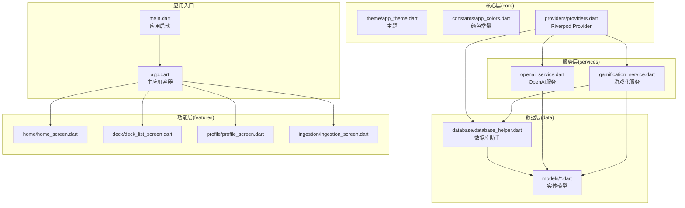
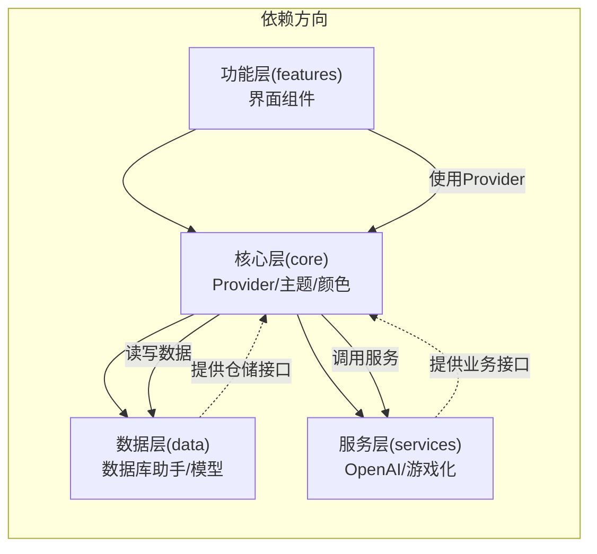
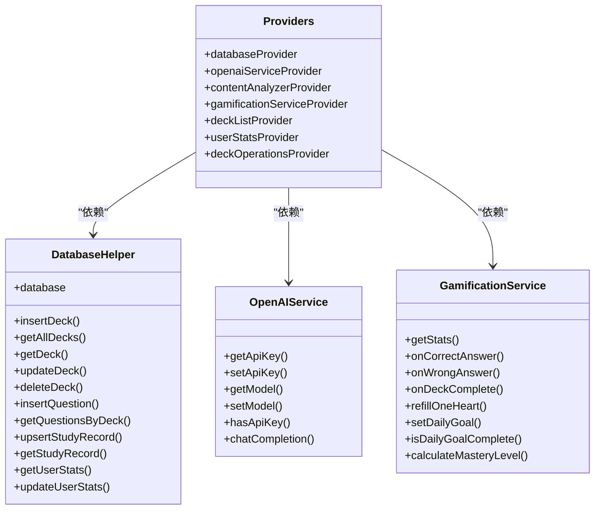
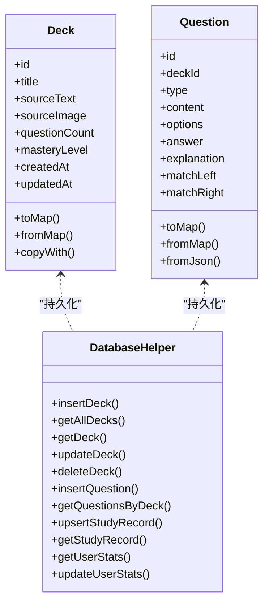
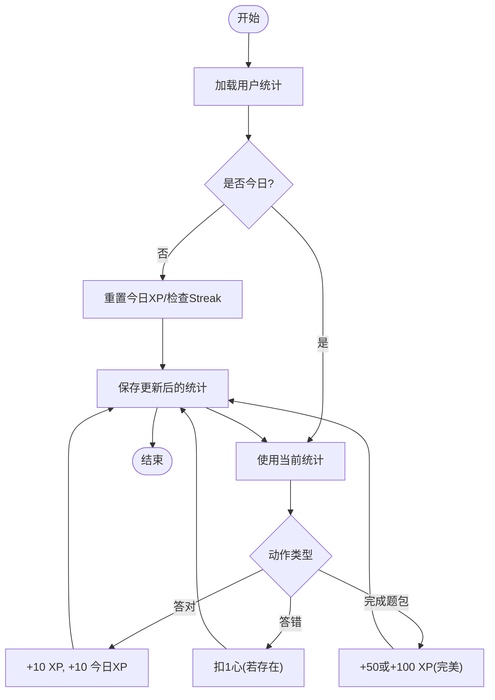
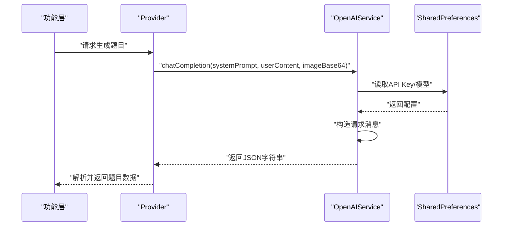
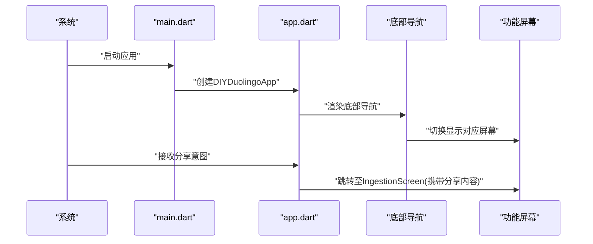
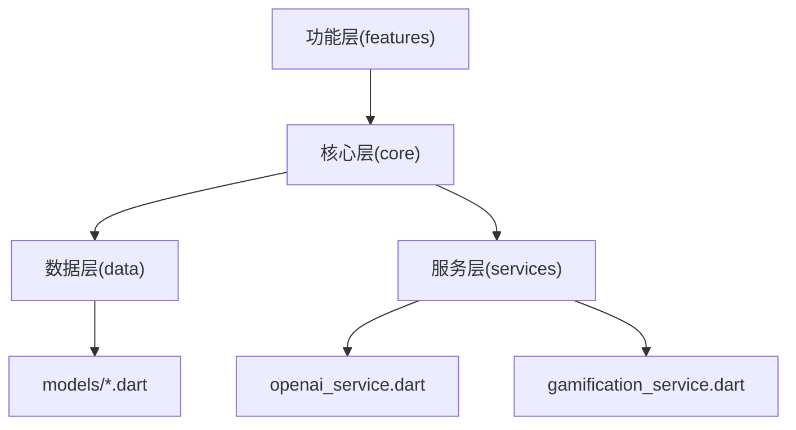

# Clean Architecture实现

<cite>
**本文档引用的文件**
- [lib/main.dart](file://lib/main.dart)
- [lib/app.dart](file://lib/app.dart)
- [lib/core/theme/app_theme.dart](file://lib/core/theme/app_theme.dart)
- [lib/core/constants/app_colors.dart](file://lib/core/constants/app_colors.dart)
- [lib/core/providers/providers.dart](file://lib/core/providers/providers.dart)
- [lib/data/database/database_helper.dart](file://lib/data/database/database_helper.dart)
- [lib/data/models/deck.dart](file://lib/data/models/deck.dart)
- [lib/data/models/question.dart](file://lib/data/models/question.dart)
- [lib/services/gamification_service.dart](file://lib/services/gamification_service.dart)
- [lib/services/openai_service.dart](file://lib/services/openai_service.dart)
</cite>

## 目录
1. [引言](#引言)
2. [项目结构](#项目结构)
3. [核心组件](#核心组件)
4. [架构总览](#架构总览)
5. [详细组件分析](#详细组件分析)
6. [依赖关系分析](#依赖关系分析)
7. [性能考虑](#性能考虑)
8. [故障排除指南](#故障排除指南)
9. [结论](#结论)

## 引言
本项目采用Clean Architecture五层架构设计，围绕“核心层(core)、数据层(data)、功能层(features)、服务层(services)、共享层(shared)”进行分层组织。通过依赖倒置原则与Riverpod状态管理，实现从UI到数据库的单向依赖，确保业务逻辑可测试、可替换、可扩展。

## 项目结构
项目采用按层划分的目录结构，便于职责分离与维护：
- 核心层(core): 提供主题、颜色常量、全局Provider等基础设施与通用逻辑
- 数据层(data): 封装SQLite数据库访问、实体模型定义
- 功能层(features): 实现具体业务界面与交互
- 服务层(services): 封装外部服务集成(如OpenAI)与游戏化规则
- 共享层(shared): 提供通用UI组件

图表来源
- [lib/main.dart:1-36](file://lib/main.dart#L1-L36)
- [lib/app.dart:1-111](file://lib/app.dart#L1-L111)
- [lib/core/providers/providers.dart:1-178](file://lib/core/providers/providers.dart#L1-L178)
- [lib/data/database/database_helper.dart:1-192](file://lib/data/database/database_helper.dart#L1-L192)
- [lib/services/openai_service.dart:1-109](file://lib/services/openai_service.dart#L1-L109)
- [lib/services/gamification_service.dart:1-116](file://lib/services/gamification_service.dart#L1-L116)

章节来源
- [lib/main.dart:1-36](file://lib/main.dart#L1-L36)
- [lib/app.dart:1-111](file://lib/app.dart#L1-L111)

## 核心组件
本节聚焦于五层架构中的关键组件及其职责边界、依赖方向与接口设计原则。

- 核心层(core)
  - 主题与颜色：提供统一的主题与颜色常量，避免UI硬编码，便于全局切换
  - Provider：集中声明基础服务与数据Provider，作为依赖注入中心
  - 设计原则：仅依赖抽象或通用工具，不直接依赖UI或数据实现

- 数据层(data)
  - 数据库助手：封装sqflite数据库初始化、表结构、CRUD操作
  - 实体模型：定义Deck、Question等数据模型及序列化/反序列化方法
  - 设计原则：对外暴露稳定的数据接口，内部封装存储细节

- 功能层(features)
  - 屏幕组件：Home、DeckList、Profile、Ingestion等界面
  - 设计原则：仅消费Provider，不直接操作数据库或调用外部服务

- 服务层(services)
  - OpenAI服务：封装API Key管理、请求构建与响应解析
  - 游戏化服务：封装XP、心数、连续打卡、掌握度计算等业务规则
  - 设计原则：业务规则内聚，依赖数据层提供的仓储接口

- 共享层(shared)
  - 通用UI组件：按钮、统计卡片等可复用组件
  - 设计原则：无业务逻辑，仅负责渲染与简单交互

章节来源
- [lib/core/theme/app_theme.dart:1-116](file://lib/core/theme/app_theme.dart#L1-L116)
- [lib/core/constants/app_colors.dart:1-43](file://lib/core/constants/app_colors.dart#L1-L43)
- [lib/core/providers/providers.dart:1-178](file://lib/core/providers/providers.dart#L1-L178)
- [lib/data/database/database_helper.dart:1-192](file://lib/data/database/database_helper.dart#L1-L192)
- [lib/data/models/deck.dart:1-71](file://lib/data/models/deck.dart#L1-L71)
- [lib/data/models/question.dart:1-76](file://lib/data/models/question.dart#L1-L76)
- [lib/services/openai_service.dart:1-109](file://lib/services/openai_service.dart#L1-L109)
- [lib/services/gamification_service.dart:1-116](file://lib/services/gamification_service.dart#L1-L116)

## 架构总览
下图展示了从UI到数据库的依赖流向，体现Clean Architecture的依赖倒置原则：上层仅依赖抽象，下层实现抽象；所有依赖均指向内部接口，而非外部框架。

图表来源
- [lib/app.dart:1-111](file://lib/app.dart#L1-L111)
- [lib/core/providers/providers.dart:1-178](file://lib/core/providers/providers.dart#L1-L178)
- [lib/data/database/database_helper.dart:1-192](file://lib/data/database/database_helper.dart#L1-L192)
- [lib/services/openai_service.dart:1-109](file://lib/services/openai_service.dart#L1-L109)
- [lib/services/gamification_service.dart:1-116](file://lib/services/gamification_service.dart#L1-L116)

## 详细组件分析

### 组件A：Provider体系与依赖注入
- 职责边界
  - 基础服务Provider：创建并注入数据库、OpenAI、内容分析器、游戏化服务实例
  - 数据Provider：封装题包列表、题目列表、学习记录、用户统计等数据流
  - 操作Provider：封装题包增删改查、学习记录保存、掌握度更新等操作
- 依赖方向
  - 上层(功能层)仅依赖Provider，不感知底层实现
  - Provider依赖数据层与服务层的具体实现
- 接口设计原则
  - 使用Riverpod的Provider/FutureProvider/StateNotifierProvider明确数据类型与生命周期
  - 通过Ref隔离依赖，支持测试替身

图表来源
- [lib/core/providers/providers.dart:1-178](file://lib/core/providers/providers.dart#L1-L178)
- [lib/data/database/database_helper.dart:1-192](file://lib/data/database/database_helper.dart#L1-L192)
- [lib/services/openai_service.dart:1-109](file://lib/services/openai_service.dart#L1-L109)
- [lib/services/gamification_service.dart:1-116](file://lib/services/gamification_service.dart#L1-L116)

章节来源
- [lib/core/providers/providers.dart:1-178](file://lib/core/providers/providers.dart#L1-L178)

### 组件B：数据库助手与实体模型
- 职责边界
  - 数据库助手：负责数据库初始化、表结构创建、CRUD操作
  - 实体模型：定义数据结构、序列化/反序列化、拷贝方法
- 依赖方向
  - Provider依赖数据库助手以提供数据访问能力
  - 游戏化服务依赖数据库助手读写用户统计
- 接口设计原则
  - 模型toMap/fromMap保证持久化一致性
  - 数据库操作返回Future，保证异步一致性

图表来源
- [lib/data/models/deck.dart:1-71](file://lib/data/models/deck.dart#L1-L71)
- [lib/data/models/question.dart:1-76](file://lib/data/models/question.dart#L1-L76)
- [lib/data/database/database_helper.dart:1-192](file://lib/data/database/database_helper.dart#L1-L192)

章节来源
- [lib/data/database/database_helper.dart:1-192](file://lib/data/database/database_helper.dart#L1-L192)
- [lib/data/models/deck.dart:1-71](file://lib/data/models/deck.dart#L1-L71)
- [lib/data/models/question.dart:1-76](file://lib/data/models/question.dart#L1-L76)

### 组件C：游戏化服务与业务规则
- 职责边界
  - 用户统计管理：XP、连续打卡、心数、每日目标
  - 掌握度计算：基于正确率的百分制掌握度
- 依赖方向
  - 依赖数据库助手读写用户统计
  - 被Provider与功能层调用
- 接口设计原则
  - 方法粒度清晰，单一职责
  - 对外暴露纯函数式接口，便于测试

图表来源
- [lib/services/gamification_service.dart:1-116](file://lib/services/gamification_service.dart#L1-L116)
- [lib/data/database/database_helper.dart:1-192](file://lib/data/database/database_helper.dart#L1-L192)

章节来源
- [lib/services/gamification_service.dart:1-116](file://lib/services/gamification_service.dart#L1-L116)

### 组件D：OpenAI服务与外部集成
- 职责边界
  - API Key与模型管理：通过SharedPreferences持久化配置
  - 请求构建与响应解析：封装Dio请求、参数拼装、JSON解析
- 依赖方向
  - 被Provider注入，供内容分析器使用
  - 不直接依赖UI，保持纯服务特性
- 接口设计原则
  - 明确异常处理与错误码映射
  - 支持文本与图片输入(多模态)

图表来源
- [lib/core/providers/providers.dart:1-178](file://lib/core/providers/providers.dart#L1-L178)
- [lib/services/openai_service.dart:1-109](file://lib/services/openai_service.dart#L1-L109)

章节来源
- [lib/services/openai_service.dart:1-109](file://lib/services/openai_service.dart#L1-L109)

### 组件E：应用入口与导航
- 职责边界
  - 应用入口：初始化系统UI样式、运行ProviderScope
  - 主应用容器：底部导航、分享意图处理、页面路由
- 依赖方向
  - 仅依赖功能层屏幕组件，不反向依赖UI
  - 分享意图通过接收器处理后转交功能层
- 接口设计原则
  - 页面间通过Widget组合与Navigator传递参数
  - 生命周期内订阅/取消订阅外部事件

图表来源
- [lib/main.dart:1-36](file://lib/main.dart#L1-L36)
- [lib/app.dart:1-111](file://lib/app.dart#L1-L111)

章节来源
- [lib/main.dart:1-36](file://lib/main.dart#L1-L36)
- [lib/app.dart:1-111](file://lib/app.dart#L1-L111)

## 依赖关系分析
- 层间依赖方向
  - 功能层 → 核心层：通过Provider消费数据与服务
  - 核心层 → 数据层/服务层：通过Provider注入具体实现
  - 数据层/服务层之间低耦合，仅通过Provider协调
- 耦合与内聚
  - Provider集中管理依赖，提升内聚性
  - 数据模型与数据库助手解耦，便于替换存储方案
- 循环依赖
  - 未发现循环依赖；Provider作为唯一依赖入口

图表来源
- [lib/core/providers/providers.dart:1-178](file://lib/core/providers/providers.dart#L1-L178)
- [lib/data/database/database_helper.dart:1-192](file://lib/data/database/database_helper.dart#L1-L192)
- [lib/services/openai_service.dart:1-109](file://lib/services/openai_service.dart#L1-L109)
- [lib/services/gamification_service.dart:1-116](file://lib/services/gamification_service.dart#L1-L116)

章节来源
- [lib/core/providers/providers.dart:1-178](file://lib/core/providers/providers.dart#L1-L178)

## 性能考虑
- 数据访问
  - 使用FutureProvider缓存查询结果，减少重复IO
  - 数据库操作在后台线程执行，避免阻塞UI
- 状态管理
  - Riverpod的StateNotifierProvider按需刷新，避免全量重建
- 外部服务
  - OpenAI请求设置超时与合理的温度参数，平衡质量与性能
- 图标与资源
  - 共享层组件尽量复用，减少重复绘制

## 故障排除指南
- OpenAI API Key缺失
  - 现象：调用chatCompletion抛出异常
  - 处理：在设置中配置API Key与模型，或通过Provider注入默认值
- 数据库初始化失败
  - 现象：首次启动报错或数据为空
  - 处理：检查数据库路径权限与版本号，确认_onCreate回调成功执行
- 用户统计异常
  - 现象：连续打卡或心数不正确
  - 处理：检查日期判定逻辑与每日重置条件，确保时间戳一致

章节来源
- [lib/services/openai_service.dart:37-40](file://lib/services/openai_service.dart#L37-L40)
- [lib/data/database/database_helper.dart:22-30](file://lib/data/database/database_helper.dart#L22-L30)
- [lib/services/gamification_service.dart:14-28](file://lib/services/gamification_service.dart#L14-L28)

## 结论
本项目通过Clean Architecture实现了清晰的分层与稳定的依赖关系：核心层提供通用能力，数据层封装持久化细节，功能层专注界面与交互，服务层集成外部能力，共享层沉淀通用组件。配合Riverpod的Provider体系与依赖倒置原则，系统具备良好的可测试性、可维护性与可扩展性。后续可在以下方面持续优化：
- 引入Repository模式进一步抽象数据访问
- 增加单元测试与集成测试覆盖
- 逐步引入网络与本地双栈存储策略