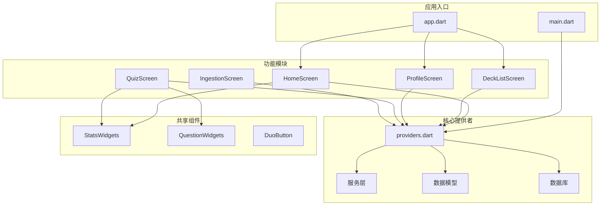
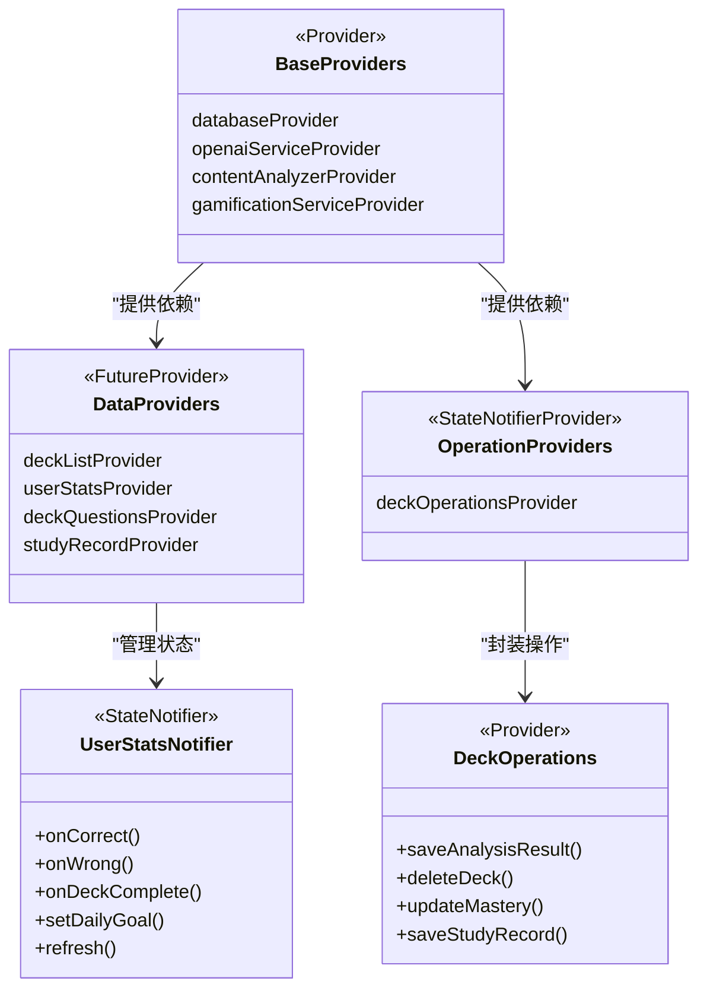
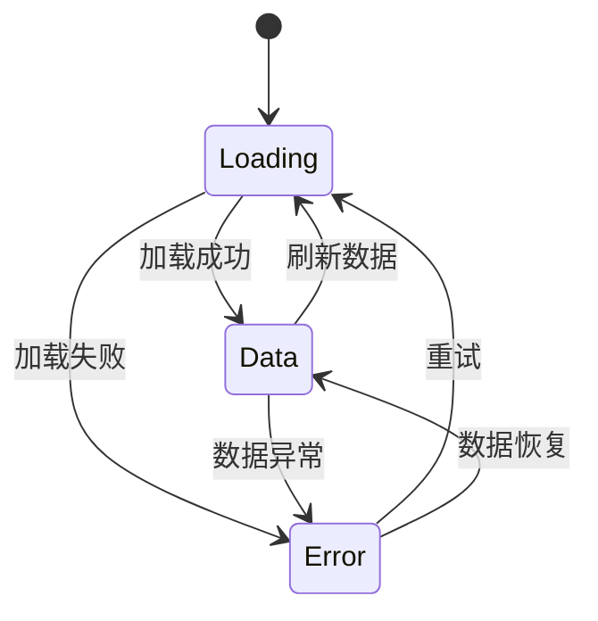
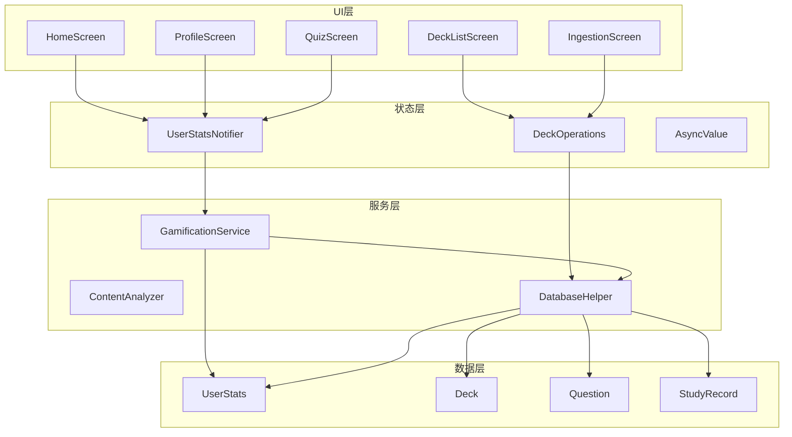
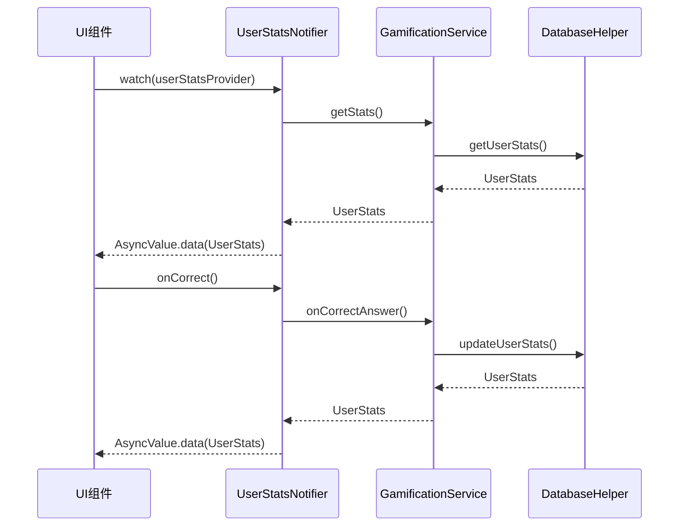
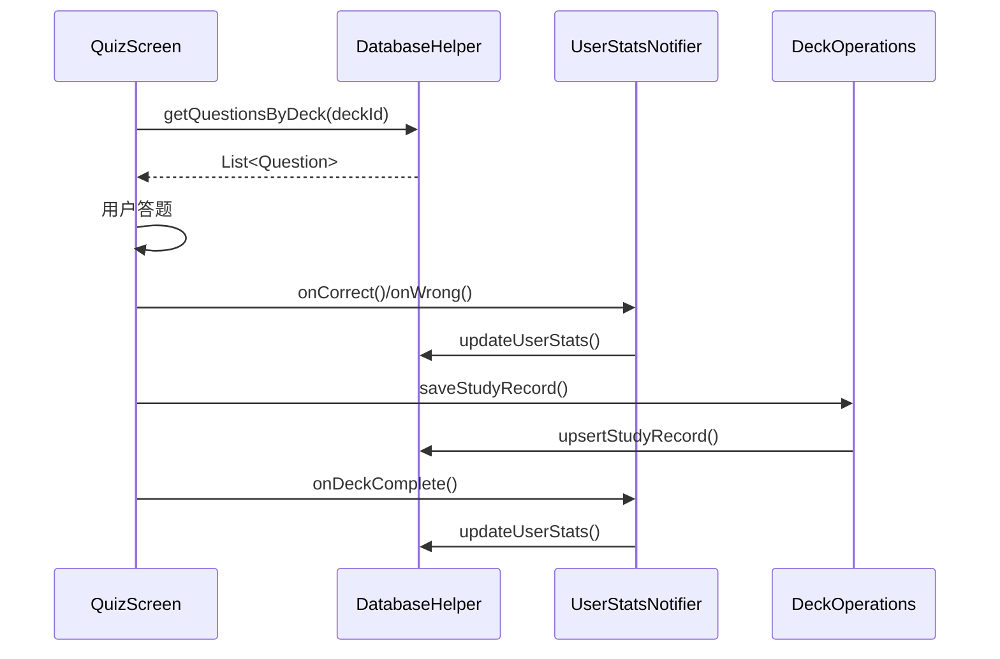
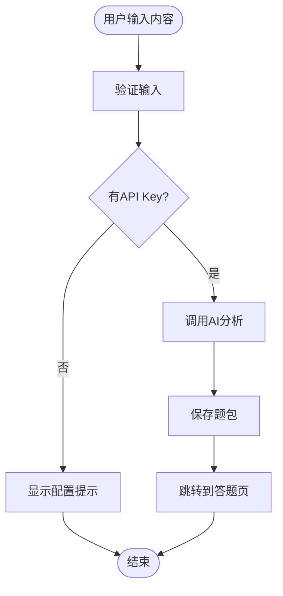
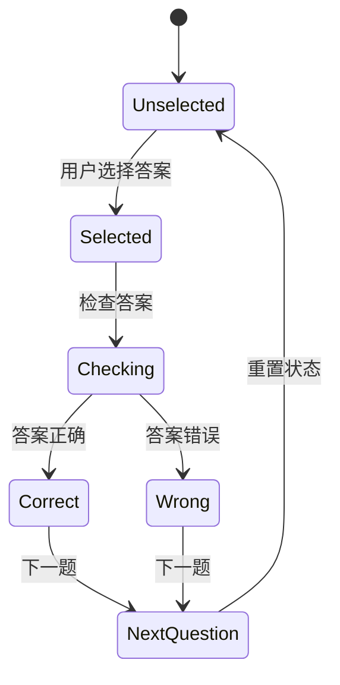
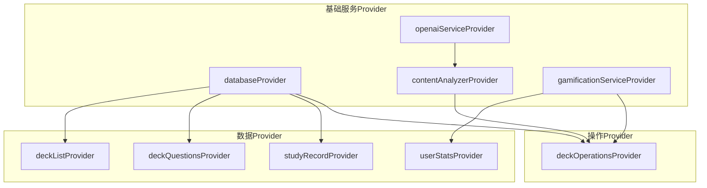
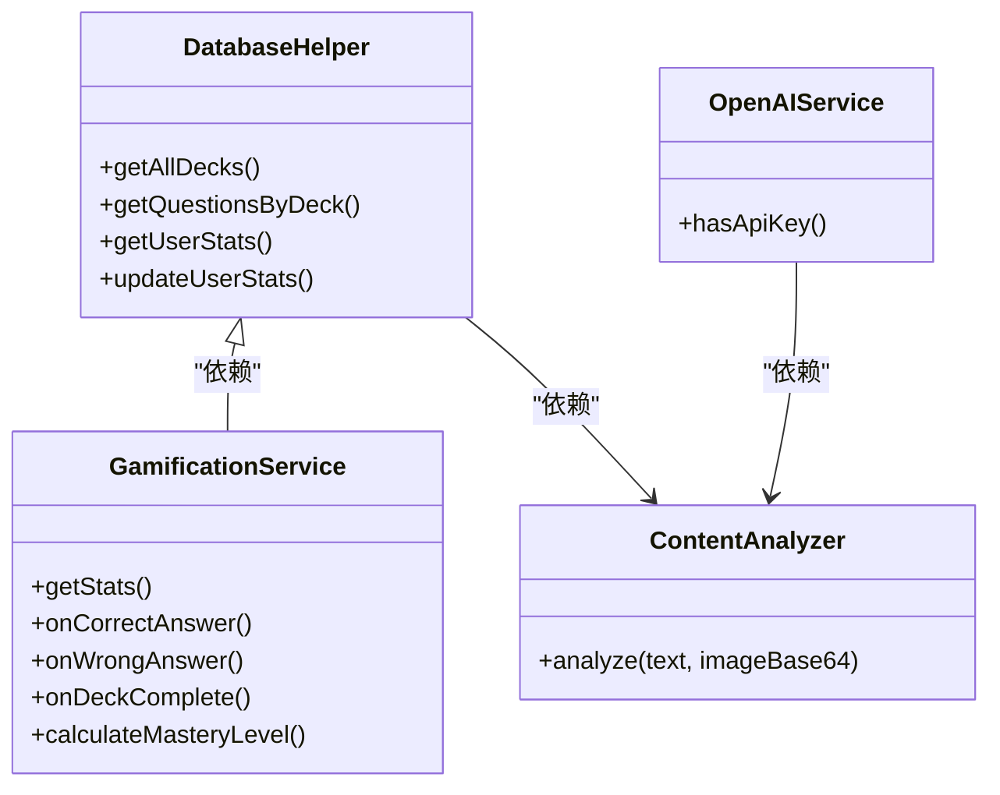

# Riverpod状态管理

<cite>
**本文档引用的文件**
- [main.dart](file://lib/main.dart)
- [app.dart](file://lib/app.dart)
- [providers.dart](file://lib/core/providers/providers.dart)
- [home_screen.dart](file://lib/features/home/home_screen.dart)
- [deck_list_screen.dart](file://lib/features/deck/deck_list_screen.dart)
- [profile_screen.dart](file://lib/features/profile/profile_screen.dart)
- [quiz_screen.dart](file://lib/features/learning/quiz_screen.dart)
- [ingestion_screen.dart](file://lib/features/ingestion/ingestion_screen.dart)
- [gamification_service.dart](file://lib/services/gamification_service.dart)
- [user_stats.dart](file://lib/data/models/user_stats.dart)
- [database_helper.dart](file://lib/data/database/database_helper.dart)
- [question_widgets.dart](file://lib/features/learning/widgets/question_widgets.dart)
- [stats_widgets.dart](file://lib/shared/widgets/stats_widgets.dart)
- [pubspec.yaml](file://pubspec.yaml)
</cite>

## 目录
1. [简介](#简介)
2. [项目结构](#项目结构)
3. [核心组件](#核心组件)
4. [架构概览](#架构概览)
5. [详细组件分析](#详细组件分析)
6. [依赖关系分析](#依赖关系分析)
7. [性能考虑](#性能考虑)
8. [故障排除指南](#故障排除指南)
9. [结论](#结论)

## 简介

Dlg-Q项目采用Flutter Riverpod作为状态管理解决方案，实现了现代化的状态管理模式。该项目展示了Riverpod Provider模式的完整实现，包括AsyncNotifier、StateNotifier等核心概念，以及Provider的作用域管理、依赖注入机制和异步状态处理。

Riverpod相比传统Provider模式具有以下优势：
- 编译时类型安全
- 更好的测试支持
- 更清晰的依赖关系
- 更灵活的作用域管理
- 更好的异步状态处理

## 项目结构

项目采用基于功能的组织方式，Riverpod相关的状态管理集中在`lib/core/providers/`目录下：



**图表来源**
- [main.dart:1-36](file://lib/main.dart#L1-L36)
- [app.dart:1-111](file://lib/app.dart#L1-L111)
- [providers.dart:1-178](file://lib/core/providers/providers.dart#L1-L178)

**章节来源**
- [main.dart:1-36](file://lib/main.dart#L1-L36)
- [app.dart:1-111](file://lib/app.dart#L1-L111)
- [pubspec.yaml:1-34](file://pubspec.yaml#L1-L34)

## 核心组件

### Provider体系结构

项目实现了完整的Provider层次结构，涵盖基础服务、数据Provider和操作Provider三个层面：



**图表来源**
- [providers.dart:13-27](file://lib/core/providers/providers.dart#L13-L27)
- [providers.dart:32-40](file://lib/core/providers/providers.dart#L32-L40)
- [providers.dart:98-100](file://lib/core/providers/providers.dart#L98-L100)

### 异步状态管理

项目使用AsyncValue模式处理异步状态，确保UI能够优雅地处理加载、成功和错误状态：



**图表来源**
- [providers.dart:42-81](file://lib/core/providers/providers.dart#L42-L81)

**章节来源**
- [providers.dart:1-178](file://lib/core/providers/providers.dart#L1-L178)

## 架构概览

### 状态管理模式

项目采用分层的状态管理模式，每层都有明确的职责分工：



**图表来源**
- [home_screen.dart:15-57](file://lib/features/home/home_screen.dart#L15-L57)
- [deck_list_screen.dart:21-97](file://lib/features/deck/deck_list_screen.dart#L21-L97)
- [profile_screen.dart:12-106](file://lib/features/profile/profile_screen.dart#L12-L106)
- [quiz_screen.dart:21-101](file://lib/features/learning/quiz_screen.dart#L21-L101)

## 详细组件分析

### 全局状态管理

#### 用户统计状态

用户统计状态是整个应用的核心状态，使用StateNotifierProvider实现：



**图表来源**
- [providers.dart:38-81](file://lib/core/providers/providers.dart#L38-L81)
- [gamification_service.dart:15-28](file://lib/services/gamification_service.dart#L15-L28)

#### 题包列表状态

题包列表使用FutureProvider实现异步数据加载：

```mermaid
flowchart TD
Start([组件初始化]) --> Watch[watch(deckListProvider)]
Watch --> Loading[显示加载状态]
Loading --> LoadData[加载题包数据]
LoadData --> Success{加载成功?}
Success --> |是| ShowData[显示题包列表]
Success --> |否| ShowError[显示错误信息]
ShowData --> Refresh[用户刷新]
Refresh --> LoadData
ShowError --> Retry[重试加载]
Retry --> LoadData
```

**图表来源**
- [providers.dart:32-35](file://lib/core/providers/providers.dart#L32-L35)
- [home_screen.dart:31-37](file://lib/features/home/home_screen.dart#L31-L37)

**章节来源**
- [providers.dart:38-81](file://lib/core/providers/providers.dart#L38-L81)
- [home_screen.dart:15-57](file://lib/features/home/home_screen.dart#L15-L57)

### 功能模块状态

#### 学习模块状态

学习模块实现了完整的答题流程，包括题目加载、答案检查、结果计算等功能：



**图表来源**
- [quiz_screen.dart:36-101](file://lib/features/learning/quiz_screen.dart#L36-L101)
- [providers.dart:98-177](file://lib/core/providers/providers.dart#L98-L177)

#### 内容摄入状态

内容摄入模块处理外部内容的分析和题包创建：



**图表来源**
- [ingestion_screen.dart:69-126](file://lib/features/ingestion/ingestion_screen.dart#L69-L126)

**章节来源**
- [quiz_screen.dart:21-101](file://lib/features/learning/quiz_screen.dart#L21-L101)
- [ingestion_screen.dart:27-126](file://lib/features/ingestion/ingestion_screen.dart#L27-L126)

### 组件局部状态

项目中的组件局部状态主要体现在交互状态的管理：

#### 问答组件状态

问答组件使用本地状态管理用户的选择和结果显示：



**图表来源**
- [question_widgets.dart:27-130](file://lib/features/learning/widgets/question_widgets.dart#L27-L130)

**章节来源**
- [question_widgets.dart:1-656](file://lib/features/learning/widgets/question_widgets.dart#L1-L656)

## 依赖关系分析

### Provider依赖图



**图表来源**
- [providers.dart:13-27](file://lib/core/providers/providers.dart#L13-L27)
- [providers.dart:32-40](file://lib/core/providers/providers.dart#L32-L40)
- [providers.dart:98-100](file://lib/core/providers/providers.dart#L98-L100)

### 服务依赖关系



**图表来源**
- [database_helper.dart:178-190](file://lib/data/database/database_helper.dart#L178-L190)
- [gamification_service.dart:15-28](file://lib/services/gamification_service.dart#L15-L28)
- [providers.dart:17-23](file://lib/core/providers/providers.dart#L17-L23)

**章节来源**
- [providers.dart:1-178](file://lib/core/providers/providers.dart#L1-L178)
- [database_helper.dart:1-192](file://lib/data/database/database_helper.dart#L1-L192)
- [gamification_service.dart:1-116](file://lib/services/gamification_service.dart#L1-L116)

## 性能考虑

### 状态更新优化

项目采用了多种性能优化策略：

1. **按需刷新**: 使用`invalidate()`方法精确控制状态刷新范围
2. **缓存机制**: 数据Provider自动处理缓存和重新加载
3. **异步加载**: 使用FutureProvider处理异步数据加载
4. **状态分离**: 将UI状态和业务状态分离，减少不必要的重建

### 内存管理

- 合理使用`ConsumerWidget`和`ConsumerStatefulWidget`避免过度重建
- 及时清理订阅和监听器
- 使用`maybeWhen`和`when`处理AsyncValue，避免重复渲染

## 故障排除指南

### 常见问题及解决方案

#### 状态未更新问题

**症状**: UI不响应状态变化
**原因**: 
- 未正确使用`ref.watch()`或`ref.read()`
- 状态更新后未触发刷新

**解决方案**:
- 确保使用`ref.watch()`监听状态
- 使用`ref.invalidate()`手动触发刷新
- 检查Provider的依赖关系

#### 异步状态处理问题

**症状**: 加载状态显示异常
**原因**:
- AsyncValue状态未正确处理
- 错误状态未捕获

**解决方案**:
- 使用`when`和`maybeWhen`正确处理所有状态
- 实现适当的错误边界
- 提供重试机制

#### 性能问题

**症状**: 页面加载缓慢或卡顿
**原因**:
- 过度重建
- 不必要的状态监听

**解决方案**:
- 使用`const`构造函数
- 合理分割状态
- 避免在构建方法中进行昂贵操作

**章节来源**
- [providers.dart:42-81](file://lib/core/providers/providers.dart#L42-L81)
- [home_screen.dart:24-37](file://lib/features/home/home_screen.dart#L24-L37)

## 结论

Dlg-Q项目展示了Riverpod状态管理的最佳实践，通过合理的Provider分层设计、清晰的依赖关系和完善的异步状态处理，实现了可维护、可扩展的状态管理方案。

### 主要优势

1. **类型安全**: 编译时检查确保代码质量
2. **易于测试**: 清晰的依赖注入便于单元测试
3. **性能优化**: 精确的状态控制和按需刷新
4. **可维护性**: 分层架构便于代码维护和扩展

### 最佳实践总结

1. **Provider分层**: 基础服务、数据Provider、操作Provider的清晰分离
2. **异步状态**: 使用AsyncValue优雅处理加载、成功、错误状态
3. **作用域管理**: 合理使用ProviderScope控制状态作用域
4. **依赖注入**: 通过Provider实现松耦合的依赖关系
5. **状态提升**: 在适当层级管理状态，避免过度细分

这个实现为Flutter应用的状态管理提供了完整的参考模板，特别适合中大型项目的开发需求。