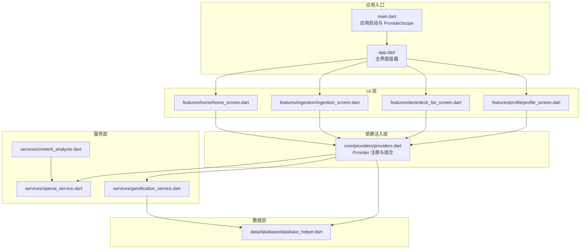
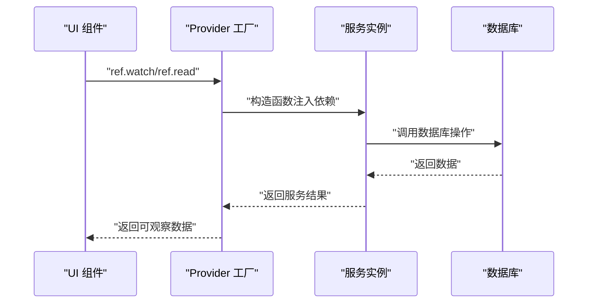
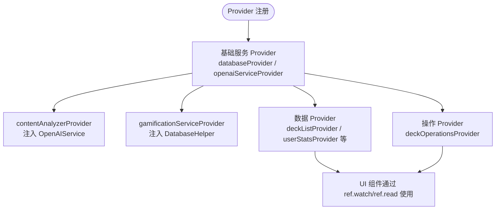
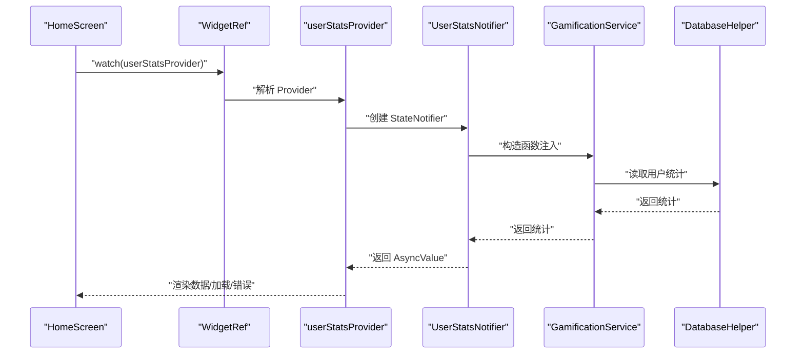
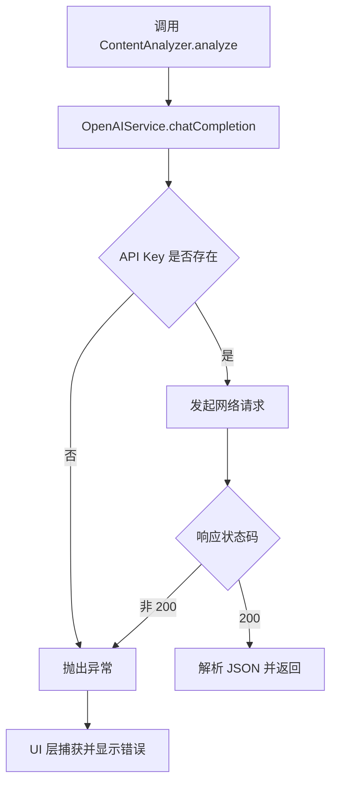
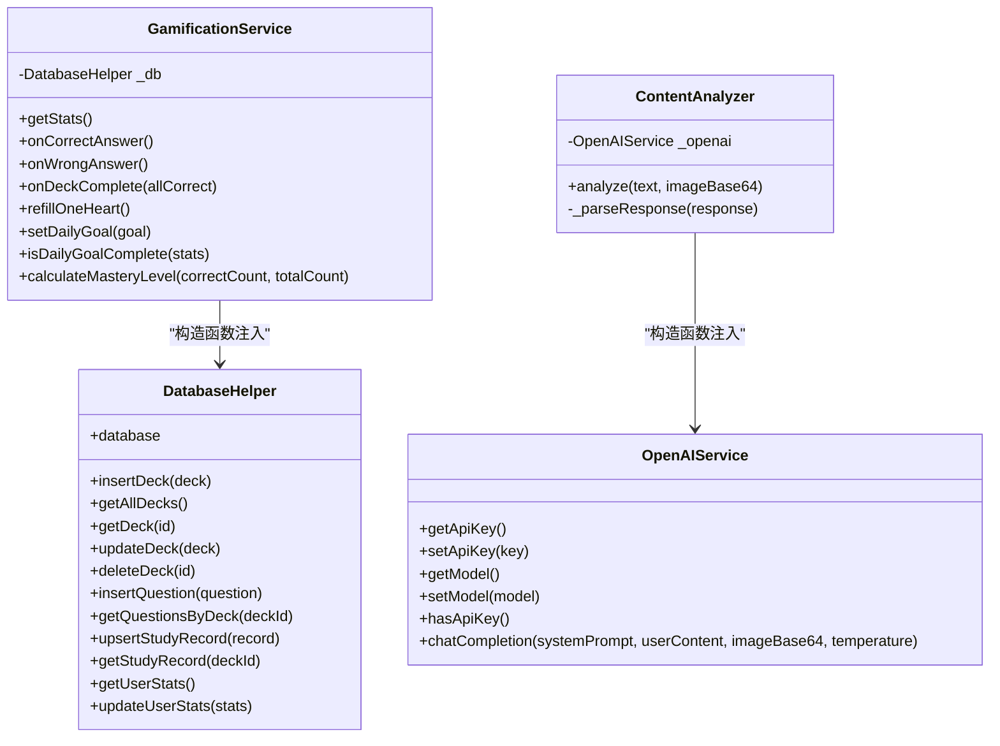
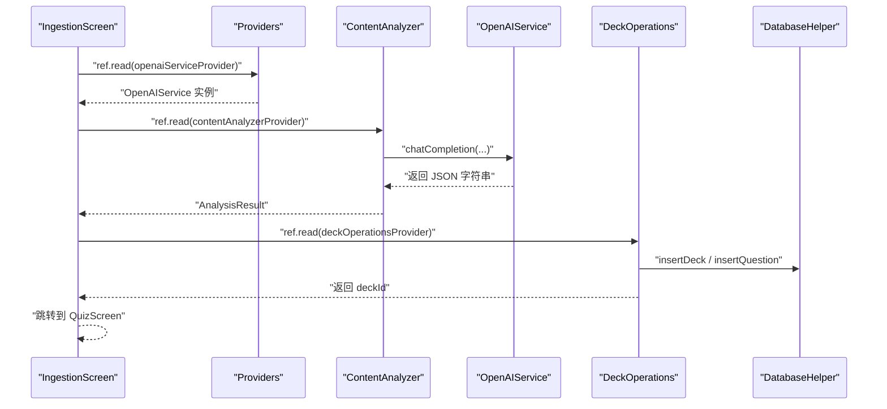
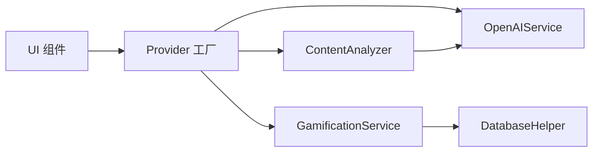

# 依赖注入机制

<cite>
**本文引用的文件**
- [main.dart](file://lib/main.dart)
- [app.dart](file://lib/app.dart)
- [providers.dart](file://lib/core/providers/providers.dart)
- [openai_service.dart](file://lib/services/openai_service.dart)
- [gamification_service.dart](file://lib/services/gamification_service.dart)
- [content_analyzer.dart](file://lib/services/content_analyzer.dart)
- [database_helper.dart](file://lib/data/database/database_helper.dart)
- [home_screen.dart](file://lib/features/home/home_screen.dart)
- [ingestion_screen.dart](file://lib/features/ingestion/ingestion_screen.dart)
- [deck_list_screen.dart](file://lib/features/deck/deck_list_screen.dart)
- [profile_screen.dart](file://lib/features/profile/profile_screen.dart)
- [pubspec.yaml](file://pubspec.yaml)
</cite>

## 目录
1. [简介](#简介)
2. [项目结构](#项目结构)
3. [核心组件](#核心组件)
4. [架构总览](#架构总览)
5. [详细组件分析](#详细组件分析)
6. [依赖关系分析](#依赖关系分析)
7. [性能考量](#性能考量)
8. [故障排查指南](#故障排查指南)
9. [结论](#结论)
10. [附录](#附录)

## 简介
本文件系统性梳理 Dlg-Q 项目中的依赖注入机制，基于 Riverpod 实现的服务注册与解析。文档覆盖以下要点：
- 依赖注入模式：构造函数注入为主，配合 Provider 的工厂式注册与懒加载特性
- Provider 注册与管理：集中于 core/providers/providers.dart，统一声明基础服务、数据 Provider 和操作 Provider
- 作用域与生命周期：通过 ProviderScope 在应用根部集中管理，结合 Riverpod 的惰性初始化与失效传播
- 依赖解析流程：从 UI 层通过 ref.watch/ref.read 触发 Provider 解析，按需构建实例
- 循环依赖检测与错误处理：通过清晰的分层设计避免循环依赖；在服务层抛出异常并在 UI 层捕获显示
- 最佳实践与常见陷阱：接口抽象建议、避免在 Provider 中做重逻辑、保持 Provider 的纯工厂特性

## 项目结构
Dlg-Q 采用功能模块化组织，依赖注入集中在 core/providers/providers.dart，服务层位于 services/，数据访问位于 data/database/，UI 层位于 features/。

**图示来源**
- [main.dart:1-36](file://lib/main.dart#L1-L36)
- [app.dart:10-111](file://lib/app.dart#L10-L111)
- [providers.dart:13-178](file://lib/core/providers/providers.dart#L13-L178)
- [openai_service.dart:6-109](file://lib/services/openai_service.dart#L6-L109)
- [gamification_service.dart:5-116](file://lib/services/gamification_service.dart#L5-L116)
- [content_analyzer.dart:14-172](file://lib/services/content_analyzer.dart#L14-L172)
- [database_helper.dart:9-192](file://lib/data/database/database_helper.dart#L9-L192)
- [home_screen.dart:11-335](file://lib/features/home/home_screen.dart#L11-L335)
- [ingestion_screen.dart:13-335](file://lib/features/ingestion/ingestion_screen.dart#L13-L335)
- [deck_list_screen.dart:10-314](file://lib/features/deck/deck_list_screen.dart#L10-L314)
- [profile_screen.dart:8-474](file://lib/features/profile/profile_screen.dart#L8-L474)

**章节来源**
- [main.dart:1-36](file://lib/main.dart#L1-L36)
- [app.dart:10-111](file://lib/app.dart#L10-L111)
- [providers.dart:13-178](file://lib/core/providers/providers.dart#L13-L178)

## 核心组件
- 应用根与作用域
  - 应用通过 ProviderScope 包裹，确保所有 Provider 在同一作用域内解析与缓存
  - 主题与导航在应用顶层配置，不参与依赖注入
- Provider 注册与分类
  - 基础服务 Provider：数据库、AI 服务、内容分析器、游戏化服务
  - 数据 Provider：异步加载题包列表、用户统计、题包题目与学习记录
  - 操作 Provider：封装业务操作（题包增删改、学习记录保存等），内部通过 ref 读取其他 Provider
- 服务与数据模型
  - OpenAIService：封装网络请求与配置存储
  - GamificationService：封装用户统计与经验值计算
  - ContentAnalyzer：封装 AI 结果解析与结构化输出
  - DatabaseHelper：封装 SQLite 初始化与 CRUD

**章节来源**
- [main.dart:7-21](file://lib/main.dart#L7-L21)
- [providers.dart:13-178](file://lib/core/providers/providers.dart#L13-L178)
- [openai_service.dart:6-109](file://lib/services/openai_service.dart#L6-L109)
- [gamification_service.dart:5-116](file://lib/services/gamification_service.dart#L5-L116)
- [content_analyzer.dart:14-172](file://lib/services/content_analyzer.dart#L14-L172)
- [database_helper.dart:9-192](file://lib/data/database/database_helper.dart#L9-L192)

## 架构总览
Dlg-Q 的依赖注入采用“Provider 工厂 + 构造函数注入”的组合模式：
- Provider 工厂负责实例化与缓存，支持惰性初始化与失效传播
- 服务间通过构造函数注入依赖，保证可测试性与可替换性
- UI 层通过 ref.watch/ref.read 读取 Provider，触发依赖解析与数据流更新

**图示来源**
- [providers.dart:13-178](file://lib/core/providers/providers.dart#L13-L178)
- [openai_service.dart:6-109](file://lib/services/openai_service.dart#L6-L109)
- [gamification_service.dart:5-116](file://lib/services/gamification_service.dart#L5-L116)
- [database_helper.dart:9-192](file://lib/data/database/database_helper.dart#L9-L192)

## 详细组件分析

### Provider 注册与管理
- 基础服务 Provider
  - 数据库 Provider：用于提供 DatabaseHelper 单例
  - OpenAI Provider：用于提供 OpenAIService 单例
  - 内容分析器 Provider：通过 ref.read 注入 OpenAIService，构造 ContentAnalyzer
  - 游戏化服务 Provider：通过 ref.read 注入 DatabaseHelper，构造 GamificationService
- 数据 Provider
  - 题包列表 Provider：异步加载，内部读取数据库
  - 用户统计 Provider：StateNotifierProvider，内部读取游戏化服务
  - 题包题目与学习记录 Provider：FutureProvider.family，按参数异步加载
- 操作 Provider
  - 题包操作 Provider：封装保存、删除、更新、记录学习等业务逻辑，内部读取数据库与游戏化服务

**图示来源**
- [providers.dart:13-178](file://lib/core/providers/providers.dart#L13-L178)

**章节来源**
- [providers.dart:13-178](file://lib/core/providers/providers.dart#L13-L178)

### 依赖解析流程
- UI 层通过 ConsumerWidget/ConsumerStatefulWidget 的 ref.watch/ref.read 触发 Provider 解析
- Provider 工厂根据依赖链递归解析，首次访问时惰性初始化
- 解析完成后，Provider 缓存实例，后续访问直接返回缓存
- 当依赖失效（invalidate）时，相关 Provider 重新解析

**图示来源**
- [home_screen.dart:15-57](file://lib/features/home/home_screen.dart#L15-L57)
- [providers.dart:38-81](file://lib/core/providers/providers.dart#L38-L81)
- [gamification_service.dart:15-28](file://lib/services/gamification_service.dart#L15-L28)
- [database_helper.dart:178-190](file://lib/data/database/database_helper.dart#L178-L190)

**章节来源**
- [home_screen.dart:15-57](file://lib/features/home/home_screen.dart#L15-L57)
- [providers.dart:38-81](file://lib/core/providers/providers.dart#L38-L81)

### 循环依赖检测与处理
- 项目采用清晰分层，避免循环依赖：
  - UI 层仅消费 Provider，不反向注入服务
  - 服务层通过构造函数注入底层依赖（数据库）
  - Provider 工厂只负责组装，不持有 UI 引用
- 若出现循环，Riverpod 会在解析阶段报错；建议通过引入中间层或拆分职责解决

**章节来源**
- [providers.dart:13-178](file://lib/core/providers/providers.dart#L13-L178)
- [gamification_service.dart:5-116](file://lib/services/gamification_service.dart#L5-L116)
- [database_helper.dart:9-192](file://lib/data/database/database_helper.dart#L9-L192)

### 错误处理策略
- 服务层错误：OpenAIService 在缺少 API Key 或网络异常时抛出异常
- UI 层错误：IngestionScreen 捕获异常并显示错误信息
- Provider 层错误：UserStatsNotifier 在加载失败时返回 AsyncValue.error

**图示来源**
- [ingestion_screen.dart:77-126](file://lib/features/ingestion/ingestion_screen.dart#L77-L126)
- [openai_service.dart:51-107](file://lib/services/openai_service.dart#L51-L107)
- [content_analyzer.dart:136-170](file://lib/services/content_analyzer.dart#L136-L170)

**章节来源**
- [ingestion_screen.dart:77-126](file://lib/features/ingestion/ingestion_screen.dart#L77-L126)
- [openai_service.dart:51-107](file://lib/services/openai_service.dart#L51-L107)
- [content_analyzer.dart:136-170](file://lib/services/content_analyzer.dart#L136-L170)

### 服务接口定义、实现类注册与运行时解析
- 接口定义建议
  - 对外暴露抽象接口（如 ContentAnalyzerInterface、OpenAIInterface），便于替换实现与单元测试
- 实现类注册
  - 在 providers.dart 中通过 Provider 工厂注册具体实现
  - 通过 ref.read 注入依赖，形成清晰的依赖图
- 运行时解析
  - UI 通过 ref.watch/ref.read 触发解析
  - Provider 按需惰性初始化，避免无用资源占用

**图示来源**
- [openai_service.dart:6-109](file://lib/services/openai_service.dart#L6-L109)
- [gamification_service.dart:5-116](file://lib/services/gamification_service.dart#L5-L116)
- [content_analyzer.dart:14-172](file://lib/services/content_analyzer.dart#L14-L172)
- [database_helper.dart:9-192](file://lib/data/database/database_helper.dart#L9-L192)

**章节来源**
- [providers.dart:13-178](file://lib/core/providers/providers.dart#L13-L178)
- [openai_service.dart:6-109](file://lib/services/openai_service.dart#L6-L109)
- [gamification_service.dart:5-116](file://lib/services/gamification_service.dart#L5-L116)
- [content_analyzer.dart:14-172](file://lib/services/content_analyzer.dart#L14-L172)
- [database_helper.dart:9-192](file://lib/data/database/database_helper.dart#L9-L192)

### 典型使用场景：内容导入与题包生成
- 流程概览
  - IngestionScreen 校验 API Key，读取 ContentAnalyzer
  - ContentAnalyzer 调用 OpenAIService 生成结构化题目
  - 通过 DeckOperations 保存题包与题目，刷新题包列表
- 关键点
  - 依赖解析由 Provider 自动完成
  - 失败时 UI 层捕获并提示

**图示来源**
- [ingestion_screen.dart:77-126](file://lib/features/ingestion/ingestion_screen.dart#L77-L126)
- [providers.dart:17-178](file://lib/core/providers/providers.dart#L17-L178)
- [content_analyzer.dart:108-133](file://lib/services/content_analyzer.dart#L108-L133)
- [openai_service.dart:46-107](file://lib/services/openai_service.dart#L46-L107)
- [database_helper.dart:104-153](file://lib/data/database/database_helper.dart#L104-L153)

**章节来源**
- [ingestion_screen.dart:77-126](file://lib/features/ingestion/ingestion_screen.dart#L77-L126)
- [providers.dart:17-178](file://lib/core/providers/providers.dart#L17-L178)

## 依赖关系分析
- 依赖方向
  - UI → Provider → 服务 → 数据库
  - Provider 工厂之间通过 ref.read 组合，形成单向依赖
- 耦合与内聚
  - 服务层高内聚，UI 低耦合
  - Provider 工厂集中管理，便于替换与测试
- 外部依赖
  - Riverpod 提供 Provider 生命周期与缓存
  - Dio、SharedPreferences、sqflite 等作为外部库被服务层使用

**图示来源**
- [providers.dart:13-178](file://lib/core/providers/providers.dart#L13-L178)
- [openai_service.dart:6-109](file://lib/services/openai_service.dart#L6-L109)
- [gamification_service.dart:5-116](file://lib/services/gamification_service.dart#L5-L116)
- [content_analyzer.dart:14-172](file://lib/services/content_analyzer.dart#L14-L172)
- [database_helper.dart:9-192](file://lib/data/database/database_helper.dart#L9-L192)

**章节来源**
- [providers.dart:13-178](file://lib/core/providers/providers.dart#L13-L178)
- [pubspec.yaml:9-27](file://pubspec.yaml#L9-L27)

## 性能考量
- 惰性初始化：Provider 首次访问才创建实例，减少启动开销
- 缓存策略：Provider 默认缓存实例，避免重复创建
- 异步加载：数据 Provider 使用 FutureProvider/StateNotifierProvider，避免阻塞 UI
- 失效传播：通过 invalidate 触发局部刷新，避免全量重建
- 建议
  - 将重逻辑放在服务层，保持 Provider 纯工厂
  - 对高频访问的数据使用合适的缓存策略
  - 控制异步任务并发，避免过度 IO

## 故障排查指南
- 常见问题
  - API Key 未配置：OpenAIService.hasApiKey 返回 false，导致分析失败
  - 网络异常：Dio 返回非 200 状态码，抛出异常
  - 数据库未初始化：DatabaseHelper._initDatabase 未执行或失败
- 排查步骤
  - 在 UI 层捕获异常并显示友好提示
  - 检查 Provider 注册顺序与依赖链
  - 使用 ProviderScope 的调试工具定位失效 Provider
- 相关实现参考
  - IngestionScreen 的错误处理与状态管理
  - UserStatsNotifier 的错误包装与重试策略

**章节来源**
- [ingestion_screen.dart:77-126](file://lib/features/ingestion/ingestion_screen.dart#L77-L126)
- [openai_service.dart:51-107](file://lib/services/openai_service.dart#L51-L107)
- [providers.dart:42-81](file://lib/core/providers/providers.dart#L42-L81)

## 结论
Dlg-Q 通过 Riverpod 实现了清晰、可维护的依赖注入体系：
- 以 Provider 工厂为核心，结合构造函数注入，形成稳定的依赖图
- 通过 ProviderScope 统一作用域，利用惰性初始化与失效传播优化性能
- UI 层专注于展示与交互，服务层专注业务逻辑，职责分离明确
- 建议进一步引入接口抽象与单元测试，提升可扩展性与可维护性

## 附录
- 术语
  - Provider：Riverpod 的依赖项定义与工厂
  - ConsumerWidget/ConsumerStatefulWidget：可读取 Provider 的组件
  - StateNotifierProvider：状态通知器 Provider，适合复杂状态管理
  - FutureProvider/FutureProvider.family：异步数据 Provider
- 最佳实践清单
  - 优先使用构造函数注入
  - 将 Provider 工厂集中管理，避免分散注册
  - 在服务层抛出语义化异常，在 UI 层捕获并提示
  - 对高频访问的数据使用合适的缓存与失效策略
  - 避免在 Provider 中执行重逻辑，保持其纯工厂特性