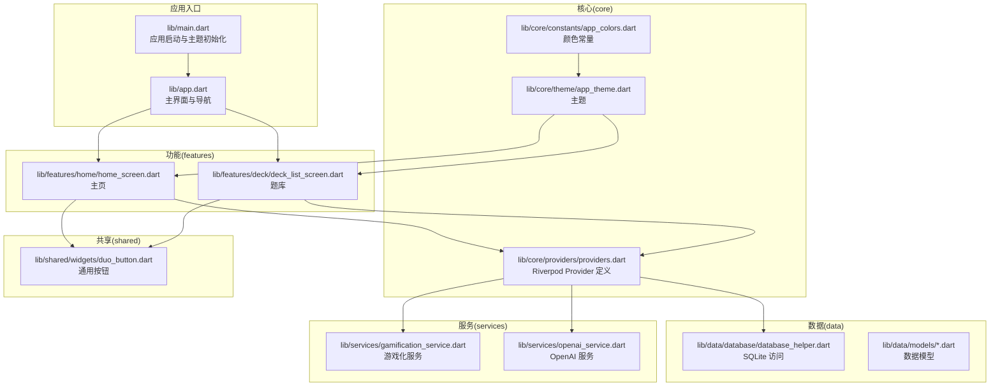
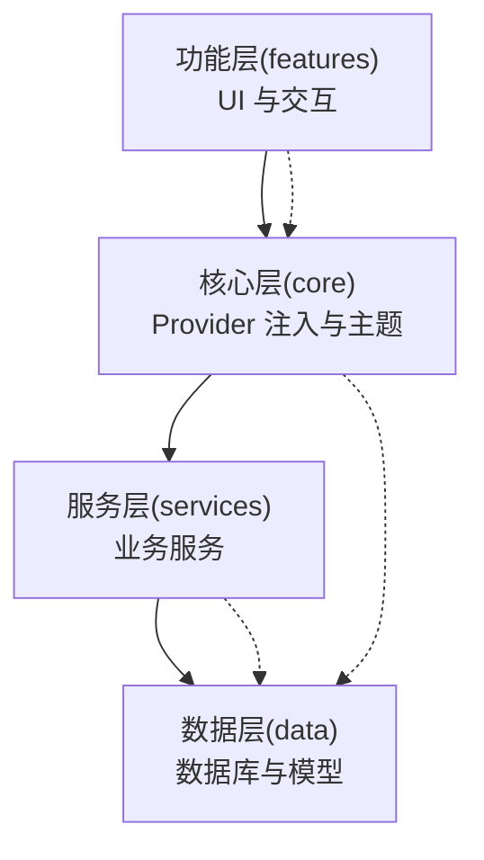
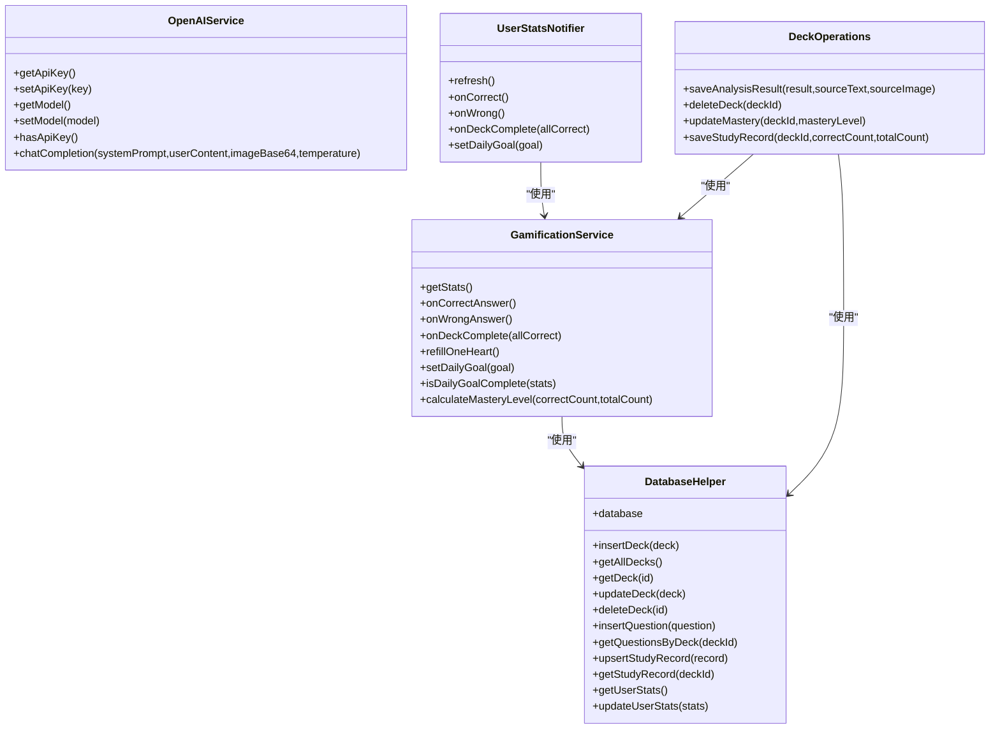
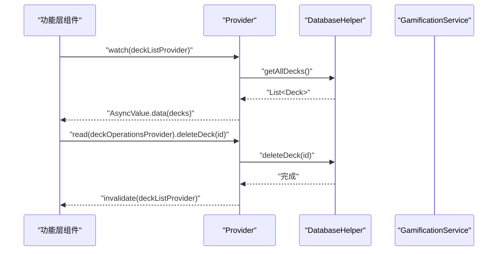
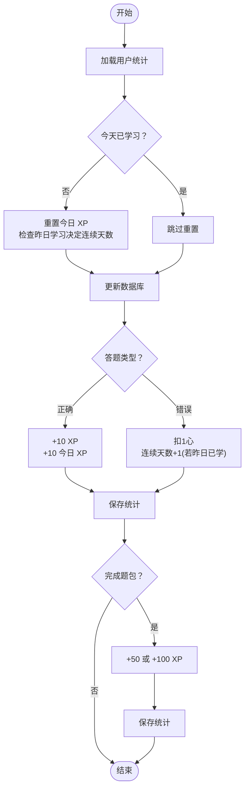
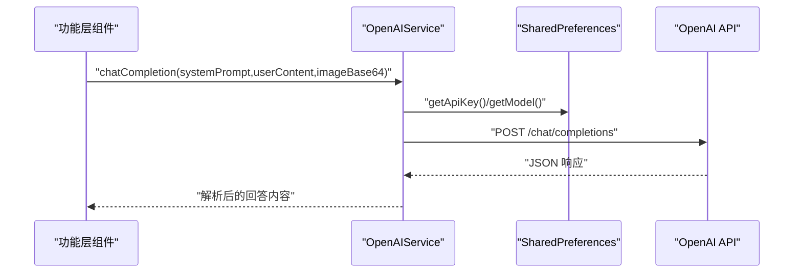
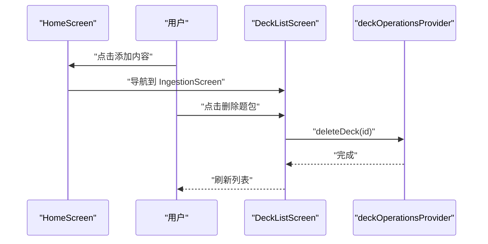
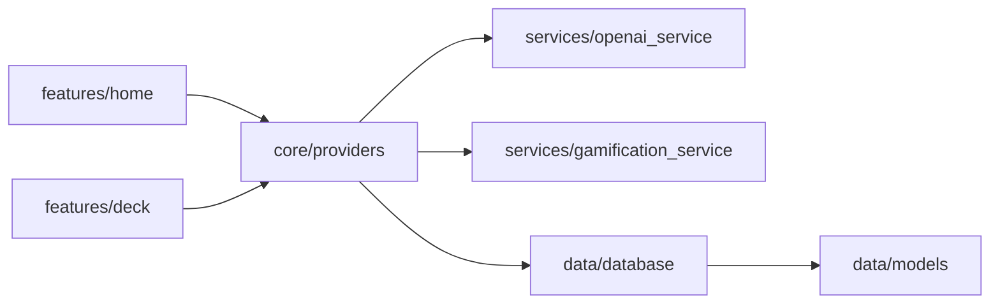

# 架构设计

<cite>
**本文引用的文件**
- [lib/main.dart](file://lib/main.dart)
- [lib/app.dart](file://lib/app.dart)
- [pubspec.yaml](file://pubspec.yaml)
- [lib/core/providers/providers.dart](file://lib/core/providers/providers.dart)
- [lib/core/theme/app_theme.dart](file://lib/core/theme/app_theme.dart)
- [lib/core/constants/app_colors.dart](file://lib/core/constants/app_colors.dart)
- [lib/data/database/database_helper.dart](file://lib/data/database/database_helper.dart)
- [lib/data/models/deck.dart](file://lib/data/models/deck.dart)
- [lib/services/gamification_service.dart](file://lib/services/gamification_service.dart)
- [lib/services/openai_service.dart](file://lib/services/openai_service.dart)
- [lib/features/home/home_screen.dart](file://lib/features/home/home_screen.dart)
- [lib/features/deck/deck_list_screen.dart](file://lib/features/deck/deck_list_screen.dart)
- [lib/shared/widgets/duo_button.dart](file://lib/shared/widgets/duo_button.dart)
</cite>

## 目录
1. [引言](#引言)
2. [项目结构](#项目结构)
3. [核心组件](#核心组件)
4. [架构总览](#架构总览)
5. [详细组件分析](#详细组件分析)
6. [依赖分析](#依赖分析)
7. [性能考虑](#性能考虑)
8. [故障排查指南](#故障排查指南)
9. [结论](#结论)
10. [附录](#附录)

## 引言
本项目以“DIY 多邻国”为主题，提供一个可扩展、模块化的学习应用原型，支持用户从外部内容（文本/图片）导入并由 AI 自动拆题生成题库，随后进行学习与复习。项目采用 Clean Architecture 分层思想，结合 Flutter Riverpod 实现的状态管理与依赖注入，明确分层边界与数据流向，确保业务逻辑可测试、UI 层轻薄、数据持久化稳定。

## 项目结构
项目采用按“关注点”分层的目录组织方式：
- core：基础设施与通用能力（主题、颜色、Provider 定义）
- data：数据模型与数据库访问层
- features：功能特性（主页、题库、学习、个人中心、设置等）
- services：跨领域服务（AI、游戏化）
- shared：跨功能共享组件（通用控件）

**图表来源**
- [lib/main.dart:1-36](file://lib/main.dart#L1-L36)
- [lib/app.dart:1-111](file://lib/app.dart#L1-L111)
- [lib/core/providers/providers.dart:1-178](file://lib/core/providers/providers.dart#L1-L178)
- [lib/core/theme/app_theme.dart:1-116](file://lib/core/theme/app_theme.dart#L1-L116)
- [lib/core/constants/app_colors.dart:1-43](file://lib/core/constants/app_colors.dart#L1-L43)
- [lib/data/database/database_helper.dart:1-192](file://lib/data/database/database_helper.dart#L1-L192)
- [lib/data/models/deck.dart:1-71](file://lib/data/models/deck.dart#L1-L71)
- [lib/services/gamification_service.dart:1-116](file://lib/services/gamification_service.dart#L1-L116)
- [lib/services/openai_service.dart:1-109](file://lib/services/openai_service.dart#L1-L109)
- [lib/features/home/home_screen.dart:1-335](file://lib/features/home/home_screen.dart#L1-L335)
- [lib/features/deck/deck_list_screen.dart:1-314](file://lib/features/deck/deck_list_screen.dart#L1-L314)
- [lib/shared/widgets/duo_button.dart:1-103](file://lib/shared/widgets/duo_button.dart#L1-L103)

**章节来源**
- [lib/main.dart:1-36](file://lib/main.dart#L1-L36)
- [lib/app.dart:1-111](file://lib/app.dart#L1-L111)
- [pubspec.yaml:1-34](file://pubspec.yaml#L1-L34)

## 核心组件
- 应用入口与启动
  - 在应用入口初始化系统状态栏样式，并通过 ProviderScope 包裹根组件，启用全局 Provider 作用域。
  - 根组件为自定义 Material 应用壳，设置标题、主题与首页容器。
- 主界面与导航
  - 使用底部导航承载三个主要页面：学习、题库、我的；通过 IndexedStack 管理页面栈与懒加载。
  - 支持处理系统分享意图（文本/图片），进入内容导入流程。
- Provider 体系
  - 提供数据库、AI、内容分析、游戏化等服务的 Provider，统一依赖注入与生命周期管理。
  - 定义数据 Provider（题库列表、题目列表、学习记录）与操作 Provider（题包增删改、学习记录保存）。
  - 使用 StateNotifierProvider 管理异步状态（用户统计），支持刷新、答题反馈、目标更新等操作。
- 主题与颜色
  - 统一多邻国风格主题，包含文字、按钮、输入框、卡片、导航等组件的主题样式。
  - 颜色常量集中管理，便于主题切换与一致性维护。
- 数据层
  - 基于 sqflite 的本地数据库，提供题包、题目、学习记录、用户统计的 CRUD。
  - 数据模型与数据库映射清晰，支持外键约束与级联删除。
- 服务层
  - 游戏化服务：XP、连续天数、心数、每日目标、掌握度计算。
  - OpenAI 服务：API Key/模型管理、Chat Completions 调用、错误处理。
- 功能层
  - 主页：展示用户统计与题包学习路径，支持跳转到学习。
  - 题库：展示题包列表、搜索、删除确认、继续/开始学习。
- 共享组件
  - 通用按钮：模拟多邻国 3D 凸起按钮，支持禁用态与按下反馈。

**章节来源**
- [lib/main.dart:7-21](file://lib/main.dart#L7-L21)
- [lib/app.dart:17-110](file://lib/app.dart#L17-L110)
- [lib/core/providers/providers.dart:13-178](file://lib/core/providers/providers.dart#L13-L178)
- [lib/core/theme/app_theme.dart:9-114](file://lib/core/theme/app_theme.dart#L9-L114)
- [lib/core/constants/app_colors.dart:7-42](file://lib/core/constants/app_colors.dart#L7-L42)
- [lib/data/database/database_helper.dart:9-192](file://lib/data/database/database_helper.dart#L9-L192)
- [lib/services/gamification_service.dart:5-116](file://lib/services/gamification_service.dart#L5-L116)
- [lib/services/openai_service.dart:6-109](file://lib/services/openai_service.dart#L6-L109)
- [lib/features/home/home_screen.dart:11-335](file://lib/features/home/home_screen.dart#L11-L335)
- [lib/features/deck/deck_list_screen.dart:10-314](file://lib/features/deck/deck_list_screen.dart#L10-L314)
- [lib/shared/widgets/duo_button.dart:5-103](file://lib/shared/widgets/duo_button.dart#L5-L103)

## 架构总览
本项目遵循 Clean Architecture 的分层思想：
- 最内层为核心业务规则（服务层），不依赖外部框架。
- 数据层封装存储细节（sqflite），向上暴露稳定的接口。
- 功能层负责用户交互与视图渲染，仅通过 Provider 访问数据与服务。
- 共享层提供跨功能的通用组件与资源。
- 核心层提供主题、颜色与 Provider 注入，作为横切关注点。

**图表来源**
- [lib/core/providers/providers.dart:13-178](file://lib/core/providers/providers.dart#L13-L178)
- [lib/services/gamification_service.dart:5-116](file://lib/services/gamification_service.dart#L5-L116)
- [lib/services/openai_service.dart:6-109](file://lib/services/openai_service.dart#L6-L109)
- [lib/data/database/database_helper.dart:9-192](file://lib/data/database/database_helper.dart#L9-L192)
- [lib/features/home/home_screen.dart:11-335](file://lib/features/home/home_screen.dart#L11-L335)
- [lib/features/deck/deck_list_screen.dart:10-314](file://lib/features/deck/deck_list_screen.dart#L10-L314)

## 详细组件分析

### Provider 与依赖注入（Riverpod）
- 基础服务 Provider
  - 数据库 Provider：提供 DatabaseHelper 单例。
  - OpenAI Provider：提供 OpenAIService 单例。
  - 内容分析 Provider：基于 OpenAI Provider 初始化内容分析器。
  - 游戏化 Provider：基于 DatabaseHelper 初始化游戏化服务。
- 数据 Provider
  - 题包列表：FutureProvider，异步加载所有题包。
  - 用户统计：StateNotifierProvider，封装异步状态与操作（答题、完成题包、刷新等）。
  - 题目列表与学习记录：FutureProvider.family，按题包 ID 加载。
- 操作 Provider
  - 题包操作：封装保存分析结果、删除题包、更新掌握度、保存学习记录等操作，并在必要时失效相关列表缓存。

**图表来源**
- [lib/core/providers/providers.dart:13-178](file://lib/core/providers/providers.dart#L13-L178)
- [lib/data/database/database_helper.dart:9-192](file://lib/data/database/database_helper.dart#L9-L192)
- [lib/services/gamification_service.dart:5-116](file://lib/services/gamification_service.dart#L5-L116)
- [lib/services/openai_service.dart:6-109](file://lib/services/openai_service.dart#L6-L109)

**章节来源**
- [lib/core/providers/providers.dart:13-178](file://lib/core/providers/providers.dart#L13-L178)

### 数据流与状态管理（Riverpod）
- 数据流向
  - UI 通过 ref.watch 订阅 Provider，获得异步数据或状态变化。
  - 操作通过 ref.read 获取操作 Provider，执行业务操作并触发缓存失效与重新加载。
- 错误处理
  - UI 对 AsyncValue 的 loading/error/data 三态进行分支渲染，保证健壮性。
  - 服务层对网络请求与数据库异常进行捕获与上抛，由 UI 或 Provider 层处理。

**图表来源**
- [lib/features/home/home_screen.dart:16-37](file://lib/features/home/home_screen.dart#L16-L37)
- [lib/features/deck/deck_list_screen.dart:22-82](file://lib/features/deck/deck_list_screen.dart#L22-L82)
- [lib/core/providers/providers.dart:32-35](file://lib/core/providers/providers.dart#L32-L35)
- [lib/core/providers/providers.dart:144-148](file://lib/core/providers/providers.dart#L144-L148)
- [lib/data/database/database_helper.dart:128-133](file://lib/data/database/database_helper.dart#L128-L133)

**章节来源**
- [lib/features/home/home_screen.dart:16-37](file://lib/features/home/home_screen.dart#L16-L37)
- [lib/features/deck/deck_list_screen.dart:22-82](file://lib/features/deck/deck_list_screen.dart#L22-L82)
- [lib/core/providers/providers.dart:32-35](file://lib/core/providers/providers.dart#L32-L35)
- [lib/core/providers/providers.dart:144-148](file://lib/core/providers/providers.dart#L144-L148)

### 游戏化服务（XP/心数/连续天数/掌握度）
- 用户统计每日重置逻辑：若非今日，重置当日 XP 并根据昨天学习情况调整连续天数。
- 答对/答错影响 XP 与心数，连续天数与最后学习日期同步更新。
- 完成题包奖励额外 XP，完美完成额外奖励。
- 掌握度计算：正确率百分比取整。

**图表来源**
- [lib/services/gamification_service.dart:14-107](file://lib/services/gamification_service.dart#L14-L107)

**章节来源**
- [lib/services/gamification_service.dart:14-107](file://lib/services/gamification_service.dart#L14-L107)

### OpenAI 服务（内容拆题）
- 支持设置/读取 API Key 与模型，具备超时与格式校验。
- 支持文本与图片（base64）混合消息结构，返回 JSON 格式内容。
- 未配置 API Key 时抛出明确异常，便于 UI 提示。

**图表来源**
- [lib/services/openai_service.dart:17-107](file://lib/services/openai_service.dart#L17-L107)

**章节来源**
- [lib/services/openai_service.dart:17-107](file://lib/services/openai_service.dart#L17-L107)

### 主页与题库（UI 与交互）
- 主页
  - 顶部展示用户统计，内容区展示题包学习路径，支持跳转到学习。
  - 无题包时展示引导页与添加按钮。
- 题库
  - 支持搜索过滤、删除确认、继续/开始学习。
  - 删除后失效题包列表缓存并刷新。

**图表来源**
- [lib/features/home/home_screen.dart:42-56](file://lib/features/home/home_screen.dart#L42-L56)
- [lib/features/deck/deck_list_screen.dart:124-148](file://lib/features/deck/deck_list_screen.dart#L124-L148)
- [lib/core/providers/providers.dart:144-148](file://lib/core/providers/providers.dart#L144-L148)

**章节来源**
- [lib/features/home/home_screen.dart:42-56](file://lib/features/home/home_screen.dart#L42-L56)
- [lib/features/deck/deck_list_screen.dart:124-148](file://lib/features/deck/deck_list_screen.dart#L124-L148)

## 依赖分析
- 外部依赖
  - Flutter 生态：Riverpod、sqflite、dio、shared_preferences、receive_sharing_intent、cached_network_image、google_fonts、flutter_svg 等。
- 内部依赖
  - features 依赖 core 的 Provider 与主题；通过 Provider 访问 data 与 services。
  - core 的 Provider 聚合 data 与 services，形成稳定的横切面。
  - data 与 services 之间弱耦合，通过接口与方法调用交互。

**图表来源**
- [lib/features/home/home_screen.dart:5](file://lib/features/home/home_screen.dart#L5)
- [lib/features/deck/deck_list_screen.dart:4](file://lib/features/deck/deck_list_screen.dart#L4)
- [lib/core/providers/providers.dart:2-9](file://lib/core/providers/providers.dart#L2-L9)
- [lib/data/database/database_helper.dart:1-7](file://lib/data/database/database_helper.dart#L1-L7)
- [lib/services/openai_service.dart:1-4](file://lib/services/openai_service.dart#L1-L4)
- [lib/services/gamification_service.dart:1-3](file://lib/services/gamification_service.dart#L1-L3)

**章节来源**
- [pubspec.yaml:9-23](file://pubspec.yaml#L9-L23)

## 性能考虑
- Provider 缓存与失效
  - 使用 FutureProvider 缓存异步数据，通过 invalidate 触发重载，避免重复网络/数据库请求。
  - StateNotifierProvider 管理局部状态，减少不必要的重建。
- 数据库优化
  - 表结构设计合理，外键约束保障数据一致性；查询按时间倒序默认排序，符合用户习惯。
- UI 渲染
  - 使用 IndexedStack 管理底部导航页面，减少重建成本。
  - 列表使用惰性加载与条件渲染，提升滚动性能。

## 故障排查指南
- 未设置 OpenAI API Key
  - 现象：调用 chatCompletion 抛出异常。
  - 处理：在设置中配置 Key 与模型后重试。
- 分享内容无法进入导入
  - 现象：分享文本/图片后无响应。
  - 处理：检查分享权限与 Intent 初始化逻辑，确认接收与解析流程。
- 题包删除后列表未刷新
  - 现象：删除成功但 UI 未更新。
  - 处理：确认调用 deleteDeck 后是否触发 invalidate(deckListProvider)。

**章节来源**
- [lib/services/openai_service.dart:52-55](file://lib/services/openai_service.dart#L52-L55)
- [lib/app.dart:33-72](file://lib/app.dart#L33-L72)
- [lib/core/providers/providers.dart:144-148](file://lib/core/providers/providers.dart#L144-L148)

## 结论
本项目以 Clean Architecture 为骨架，结合 Riverpod 的 Provider 体系，实现了清晰的分层与依赖注入。核心亮点包括：
- Provider 将服务与数据访问抽象为可注入的依赖，UI 仅关注状态订阅与事件派发。
- 游戏化服务与数据库协同，构建可持续的学习激励闭环。
- 主题与颜色集中管理，保证视觉一致性与可扩展性。
建议后续增强：
- 为 Provider 与服务增加单元测试覆盖；
- 对网络与数据库异常进行更细粒度的 UI 反馈；
- 引入日志与监控，辅助问题定位与性能分析。

## 附录
- 主题与颜色
  - 主题：多邻国风格，强调绿色主色与卡片化设计。
  - 颜色：定义主色、辅色、中性色与状态色，便于主题切换与品牌统一。
- 通用组件
  - 3D 凸起按钮：支持禁用态与按下反馈，提升交互体验。

**章节来源**
- [lib/core/theme/app_theme.dart:9-114](file://lib/core/theme/app_theme.dart#L9-L114)
- [lib/core/constants/app_colors.dart:7-42](file://lib/core/constants/app_colors.dart#L7-L42)
- [lib/shared/widgets/duo_button.dart:33-91](file://lib/shared/widgets/duo_button.dart#L33-L91)