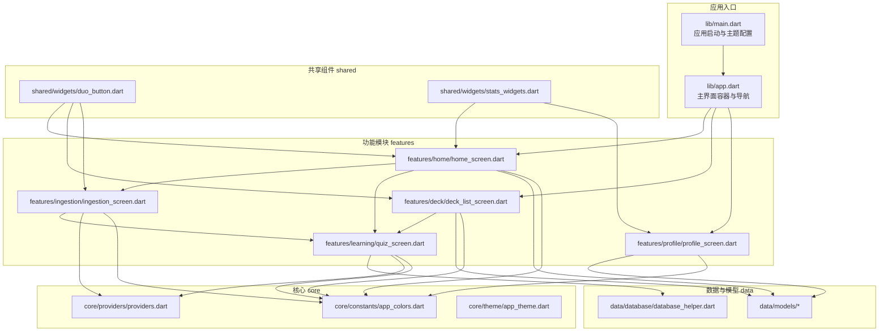
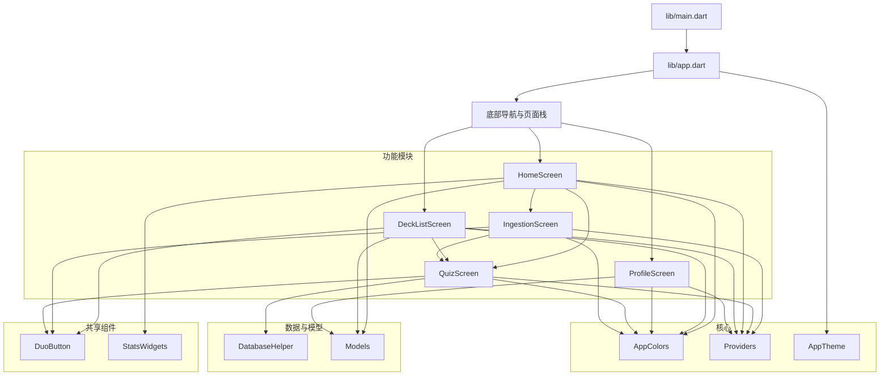
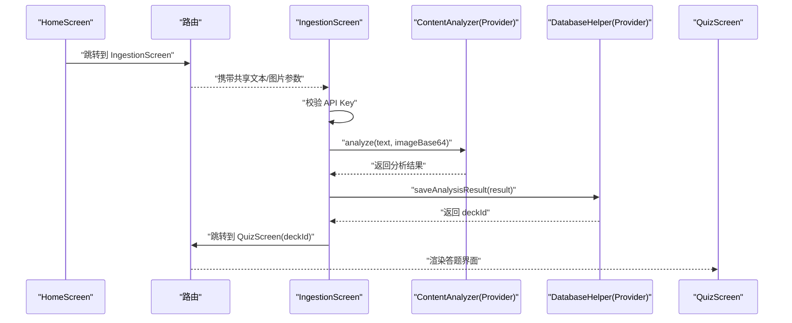
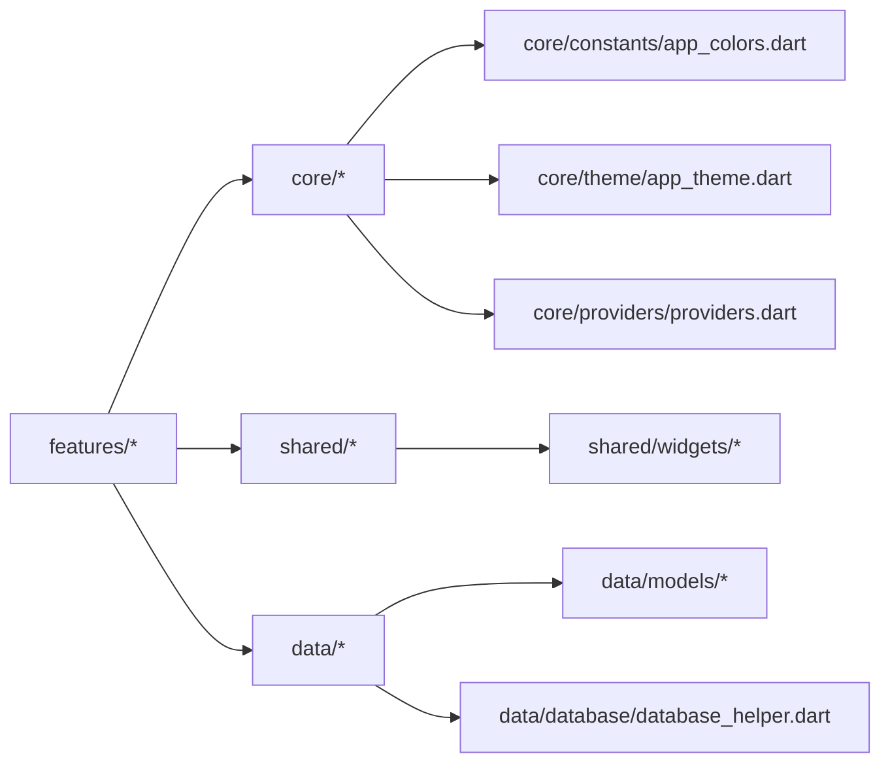

# 模块化设计模式

<cite>
**本文引用的文件**
- [lib/main.dart](file://lib/main.dart)
- [lib/app.dart](file://lib/app.dart)
- [lib/features/home/home_screen.dart](file://lib/features/home/home_screen.dart)
- [lib/features/deck/deck_list_screen.dart](file://lib/features/deck/deck_list_screen.dart)
- [lib/features/profile/profile_screen.dart](file://lib/features/profile/profile_screen.dart)
- [lib/features/learning/quiz_screen.dart](file://lib/features/learning/quiz_screen.dart)
- [lib/features/ingestion/ingestion_screen.dart](file://lib/features/ingestion/ingestion_screen.dart)
- [lib/data/database/database_helper.dart](file://lib/data/database/database_helper.dart)
- [lib/data/models/deck.dart](file://lib/data/models/deck.dart)
- [lib/data/models/question.dart](file://lib/data/models/question.dart)
- [lib/data/models/question_type.dart](file://lib/data/models/question_type.dart)
- [lib/data/models/study_record.dart](file://lib/data/models/study_record.dart)
- [lib/data/models/user_stats.dart](file://lib/data/models/user_stats.dart)
- [lib/shared/widgets/duo_button.dart](file://lib/shared/widgets/duo_button.dart)
- [lib/shared/widgets/stats_widgets.dart](file://lib/shared/widgets/stats_widgets.dart)
- [lib/core/constants/app_colors.dart](file://lib/core/constants/app_colors.dart)
- [lib/core/providers/providers.dart](file://lib/core/providers/providers.dart)
- [lib/core/theme/app_theme.dart](file://lib/core/theme/app_theme.dart)
- [pubspec.yaml](file://pubspec.yaml)
</cite>

## 目录
1. [引言](#引言)
2. [项目结构](#项目结构)
3. [核心组件](#核心组件)
4. [架构总览](#架构总览)
5. [详细组件分析](#详细组件分析)
6. [依赖分析](#依赖分析)
7. [性能考虑](#性能考虑)
8. [故障排查指南](#故障排查指南)
9. [结论](#结论)
10. [附录](#附录)

## 引言
本文件系统性梳理 Dlg-Q 项目的模块化设计与实现，围绕“功能模块（features）”“共享组件（shared）”“服务模块（services）”三大维度展开，结合实际代码路径，解释模块组织原则、命名规范、封装策略、模块间通信、依赖注入配置以及模块生命周期管理，并提供重构与扩展的最佳实践建议。

## 项目结构
项目采用按职责分层的模块化布局：
- features：按业务功能划分的屏幕级模块，彼此低耦合，通过 Riverpod 提供的状态与依赖进行交互。
- data：数据访问与模型层，包含数据库辅助类与领域模型。
- shared：跨模块复用的通用 UI 组件与工具。
- core：应用级常量、主题与全局 Provider 定义。
- services：对外部能力的抽象（当前以 Provider 形式体现）。
- lib/main.dart 与 lib/app.dart：应用入口与根应用容器。

图表来源
- [lib/main.dart:1-36](file://lib/main.dart#L1-L36)
- [lib/app.dart:1-111](file://lib/app.dart#L1-L111)
- [lib/features/home/home_screen.dart:1-335](file://lib/features/home/home_screen.dart#L1-L335)
- [lib/features/deck/deck_list_screen.dart:1-314](file://lib/features/deck/deck_list_screen.dart#L1-L314)
- [lib/features/profile/profile_screen.dart:1-474](file://lib/features/profile/profile_screen.dart#L1-L474)
- [lib/features/learning/quiz_screen.dart:1-438](file://lib/features/learning/quiz_screen.dart#L1-L438)
- [lib/features/ingestion/ingestion_screen.dart:1-335](file://lib/features/ingestion/ingestion_screen.dart#L1-L335)
- [lib/shared/widgets/duo_button.dart](file://lib/shared/widgets/duo_button.dart)
- [lib/shared/widgets/stats_widgets.dart](file://lib/shared/widgets/stats_widgets.dart)
- [lib/data/database/database_helper.dart](file://lib/data/database/database_helper.dart)
- [lib/data/models/deck.dart](file://lib/data/models/deck.dart)
- [lib/data/models/question.dart](file://lib/data/models/question.dart)
- [lib/data/models/question_type.dart](file://lib/data/models/question_type.dart)
- [lib/data/models/study_record.dart](file://lib/data/models/study_record.dart)
- [lib/data/models/user_stats.dart](file://lib/data/models/user_stats.dart)
- [lib/core/constants/app_colors.dart](file://lib/core/constants/app_colors.dart)
- [lib/core/providers/providers.dart](file://lib/core/providers/providers.dart)
- [lib/core/theme/app_theme.dart](file://lib/core/theme/app_theme.dart)

章节来源
- [lib/main.dart:1-36](file://lib/main.dart#L1-L36)
- [lib/app.dart:1-111](file://lib/app.dart#L1-L111)
- [pubspec.yaml:1-34](file://pubspec.yaml#L1-L34)

## 核心组件
- 应用入口与主题
  - 入口负责初始化系统 UI 样式与 Provider 作用域，随后渲染根应用容器。
  - 主题与颜色常量集中于 core 层，确保视觉一致性。
- 主界面容器
  - 通过底部导航聚合多个功能模块，使用 IndexedStack 切换页面，维持各模块状态。
- 状态与依赖注入
  - 使用 Riverpod Provider 管理全局状态与服务依赖，避免直接依赖外部框架或第三方库。
- 数据与模型
  - 数据访问通过数据库辅助类统一处理；模型定义清晰，便于跨模块复用。

章节来源
- [lib/main.dart:1-36](file://lib/main.dart#L1-L36)
- [lib/app.dart:1-111](file://lib/app.dart#L1-L111)
- [lib/core/theme/app_theme.dart](file://lib/core/theme/app_theme.dart)
- [lib/core/constants/app_colors.dart](file://lib/core/constants/app_colors.dart)
- [lib/core/providers/providers.dart](file://lib/core/providers/providers.dart)
- [lib/data/database/database_helper.dart](file://lib/data/database/database_helper.dart)
- [lib/data/models/deck.dart](file://lib/data/models/deck.dart)
- [lib/data/models/question.dart](file://lib/data/models/question.dart)
- [lib/data/models/question_type.dart](file://lib/data/models/question_type.dart)
- [lib/data/models/study_record.dart](file://lib/data/models/study_record.dart)
- [lib/data/models/user_stats.dart](file://lib/data/models/user_stats.dart)

## 架构总览
Dlg-Q 的整体架构遵循“功能模块 + 数据/模型 + 共享组件 + 核心”的分层设计，模块间通过 Provider 解耦，实现可测试、可替换与可扩展。

图表来源
- [lib/main.dart:1-36](file://lib/main.dart#L1-L36)
- [lib/app.dart:1-111](file://lib/app.dart#L1-L111)
- [lib/features/home/home_screen.dart:1-335](file://lib/features/home/home_screen.dart#L1-L335)
- [lib/features/deck/deck_list_screen.dart:1-314](file://lib/features/deck/deck_list_screen.dart#L1-L314)
- [lib/features/profile/profile_screen.dart:1-474](file://lib/features/profile/profile_screen.dart#L1-L474)
- [lib/features/learning/quiz_screen.dart:1-438](file://lib/features/learning/quiz_screen.dart#L1-L438)
- [lib/features/ingestion/ingestion_screen.dart:1-335](file://lib/features/ingestion/ingestion_screen.dart#L1-L335)
- [lib/shared/widgets/duo_button.dart](file://lib/shared/widgets/duo_button.dart)
- [lib/shared/widgets/stats_widgets.dart](file://lib/shared/widgets/stats_widgets.dart)
- [lib/data/database/database_helper.dart](file://lib/data/database/database_helper.dart)
- [lib/data/models/deck.dart](file://lib/data/models/deck.dart)
- [lib/data/models/question.dart](file://lib/data/models/question.dart)
- [lib/data/models/question_type.dart](file://lib/data/models/question_type.dart)
- [lib/data/models/study_record.dart](file://lib/data/models/study_record.dart)
- [lib/data/models/user_stats.dart](file://lib/data/models/user_stats.dart)
- [lib/core/constants/app_colors.dart](file://lib/core/constants/app_colors.dart)
- [lib/core/providers/providers.dart](file://lib/core/providers/providers.dart)
- [lib/core/theme/app_theme.dart](file://lib/core/theme/app_theme.dart)

## 详细组件分析

### 功能模块（features）组织与封装
- 组织原则
  - 按业务边界划分：home、deck、profile、learning、ingestion、settings 等模块各自承担明确职责。
  - 低耦合高内聚：模块内部封装 UI、交互与状态，仅通过 Provider 与数据层交互。
- 命名规范
  - 屏幕文件统一以模块名加后缀命名，如 deck_list_screen.dart、quiz_screen.dart。
  - 内部组件采用私有类（以下划线前缀）封装，避免对外暴露。
- 封装策略
  - 使用 ConsumerWidget/ConsumerStatefulWidget 与 ref.watch/ref.read 访问 Provider。
  - 屏幕内复用逻辑抽取为私有方法，提升可读性与可维护性。
  - 通过路由参数传递必要上下文（如 QuizScreen 的 deckId）。

章节来源
- [lib/features/home/home_screen.dart:1-335](file://lib/features/home/home_screen.dart#L1-L335)
- [lib/features/deck/deck_list_screen.dart:1-314](file://lib/features/deck/deck_list_screen.dart#L1-L314)
- [lib/features/profile/profile_screen.dart:1-474](file://lib/features/profile/profile_screen.dart#L1-L474)
- [lib/features/learning/quiz_screen.dart:1-438](file://lib/features/learning/quiz_screen.dart#L1-L438)
- [lib/features/ingestion/ingestion_screen.dart:1-335](file://lib/features/ingestion/ingestion_screen.dart#L1-L335)

### 共享组件（shared）设计理念
- 通用 UI 组件
  - duo_button：提供统一风格的按钮组件，支持宽度、颜色、图标与禁用态控制，被多处模块复用。
  - stats_widgets：提供统计卡片与进度条等通用组件，用于 Home 与 Profile 屏幕。
- 工具与常量
  - app_colors：集中管理主题色值，保证视觉一致性。
  - 通过 Provider 抽象服务调用，避免模块直接依赖具体实现。
- 复用策略
  - 组件参数化与样式分离，降低耦合度。
  - 在 shared 下保持纯 UI 与纯样式逻辑，不引入业务状态。

章节来源
- [lib/shared/widgets/duo_button.dart](file://lib/shared/widgets/duo_button.dart)
- [lib/shared/widgets/stats_widgets.dart](file://lib/shared/widgets/stats_widgets.dart)
- [lib/core/constants/app_colors.dart](file://lib/core/constants/app_colors.dart)

### 服务模块（services）抽象设计
- 当前形态
  - 服务以 Provider 的形式注入，如 openaiServiceProvider、contentAnalyzerProvider、databaseProvider、deckOperationsProvider、userStatsProvider 等。
- 抽象与可替换性
  - 通过 ProviderScope 注入不同实现，可在测试或生产环境切换具体服务。
  - 服务接口以 Provider 类型约束，调用方只依赖类型，不依赖具体实现。
- 生命周期管理
  - Riverpod 提供的 Provider 生命周期由其自身管理；模块内通过 ref.read/ref.watch 控制消费时机，避免内存泄漏。

章节来源
- [lib/core/providers/providers.dart](file://lib/core/providers/providers.dart)
- [lib/features/ingestion/ingestion_screen.dart:1-335](file://lib/features/ingestion/ingestion_screen.dart#L1-L335)
- [lib/features/learning/quiz_screen.dart:1-438](file://lib/features/learning/quiz_screen.dart#L1-L438)

### 模块间通信机制
- 导航与上下文传递
  - Home -> Ingestion：通过路由跳转并传参（如共享文本/图片），Ingestion 分析完成后跳转至 QuizScreen。
  - DeckList -> Quiz：通过路由参数传递 deckId，QuizScreen 加载对应题库并进入答题流程。
- 状态与数据共享
  - 通过 Provider 共享用户统计、题库列表、数据库访问等，避免跨模块直接依赖。
  - 使用 ref.watch 观察异步数据流，ref.read 触发副作用（如保存记录、更新统计）。

图表来源
- [lib/features/home/home_screen.dart:1-335](file://lib/features/home/home_screen.dart#L1-L335)
- [lib/features/ingestion/ingestion_screen.dart:1-335](file://lib/features/ingestion/ingestion_screen.dart#L1-L335)
- [lib/features/learning/quiz_screen.dart:1-438](file://lib/features/learning/quiz_screen.dart#L1-L438)
- [lib/data/database/database_helper.dart](file://lib/data/database/database_helper.dart)
- [lib/core/providers/providers.dart](file://lib/core/providers/providers.dart)

### 依赖注入配置与模块生命周期
- 依赖注入
  - 在入口文件通过 ProviderScope 包裹根应用，集中注入 Provider。
  - 模块内部通过 ref.read/ref.watch 获取所需 Provider，形成清晰的依赖链。
- 生命周期
  - 页面级 StatefulWidget 在 initState 初始化资源，在 dispose 释放资源。
  - Riverpod Provider 的生命周期由框架管理，模块仅需关注消费与清理。

章节来源
- [lib/main.dart:1-36](file://lib/main.dart#L1-L36)
- [lib/app.dart:1-111](file://lib/app.dart#L1-L111)
- [lib/features/ingestion/ingestion_screen.dart:1-335](file://lib/features/ingestion/ingestion_screen.dart#L1-L335)
- [lib/features/learning/quiz_screen.dart:1-438](file://lib/features/learning/quiz_screen.dart#L1-L438)

## 依赖分析
- 外部依赖
  - 使用 Flutter 生态与 Riverpod、sqflite、dio、shared_preferences 等库。
- 模块间依赖方向
  - features 依赖 core（颜色、主题、Provider）、shared（通用组件）、data（模型与数据库）。
  - data 与 shared 之间无循环依赖，保持单向依赖。
- 可能的循环依赖风险
  - 当前未发现直接循环依赖；若未来扩展 services 层，应避免 features 与 services 的双向引用。

图表来源
- [lib/features/home/home_screen.dart:1-335](file://lib/features/home/home_screen.dart#L1-L335)
- [lib/features/deck/deck_list_screen.dart:1-314](file://lib/features/deck/deck_list_screen.dart#L1-L314)
- [lib/features/profile/profile_screen.dart:1-474](file://lib/features/profile/profile_screen.dart#L1-L474)
- [lib/features/learning/quiz_screen.dart:1-438](file://lib/features/learning/quiz_screen.dart#L1-L438)
- [lib/features/ingestion/ingestion_screen.dart:1-335](file://lib/features/ingestion/ingestion_screen.dart#L1-L335)
- [lib/shared/widgets/duo_button.dart](file://lib/shared/widgets/duo_button.dart)
- [lib/shared/widgets/stats_widgets.dart](file://lib/shared/widgets/stats_widgets.dart)
- [lib/data/database/database_helper.dart](file://lib/data/database/database_helper.dart)
- [lib/data/models/deck.dart](file://lib/data/models/deck.dart)
- [lib/data/models/question.dart](file://lib/data/models/question.dart)
- [lib/data/models/question_type.dart](file://lib/data/models/question_type.dart)
- [lib/data/models/study_record.dart](file://lib/data/models/study_record.dart)
- [lib/data/models/user_stats.dart](file://lib/data/models/user_stats.dart)
- [lib/core/constants/app_colors.dart](file://lib/core/constants/app_colors.dart)
- [lib/core/providers/providers.dart](file://lib/core/providers/providers.dart)
- [lib/core/theme/app_theme.dart](file://lib/core/theme/app_theme.dart)

章节来源
- [pubspec.yaml:1-34](file://pubspec.yaml#L1-L34)

## 性能考虑
- 渲染与状态更新
  - 使用 ConsumerWidget/ConsumerStatefulWidget 粒度化订阅，避免不必要的重建。
  - 列表渲染使用 ListView.builder 与惰性加载，减少内存占用。
- 数据访问
  - 数据库操作异步执行，避免阻塞主线程；通过 Provider 缓存常用查询结果。
- UI 动画与资源
  - 合理使用动画组件，避免过度动画影响性能；图片加载失败兜底处理。
- 网络与外部服务
  - 外部服务调用增加超时与重试策略，避免阻塞 UI；在入口统一配置网络层。

## 故障排查指南
- 分享内容无法进入 Ingestion
  - 检查入口是否正确初始化分享监听与初始分享内容处理。
  - 确认 Ingestion 是否接收到了共享文本/图片参数。
- AI 拆题失败
  - 确认已配置 OpenAI API Key；检查 ContentAnalyzer Provider 的可用性。
  - 关注异常捕获与错误提示，定位分析阶段的失败原因。
- 答题完成后未更新统计
  - 确认 QuizScreen 是否正确触发 userStatsProvider 与 deckOperationsProvider 的更新。
- 题库为空或加载失败
  - 检查数据库初始化与查询逻辑；确认 Provider 的数据源是否正确。

章节来源
- [lib/app.dart:1-111](file://lib/app.dart#L1-L111)
- [lib/features/ingestion/ingestion_screen.dart:1-335](file://lib/features/ingestion/ingestion_screen.dart#L1-L335)
- [lib/features/learning/quiz_screen.dart:1-438](file://lib/features/learning/quiz_screen.dart#L1-L438)
- [lib/data/database/database_helper.dart](file://lib/data/database/database_helper.dart)

## 结论
Dlg-Q 项目通过 features、shared、data、core 的清晰分层，配合 Riverpod 的 Provider 体系，实现了模块间的低耦合与高内聚。功能模块以屏幕为单位封装业务，共享组件提供跨模块复用，核心层统一主题与常量，服务以 Provider 抽象实现可替换性。该设计有利于团队协作、测试覆盖与长期演进。

## 附录

### 最佳实践清单
- 模块化组织
  - 以业务边界划分模块，避免跨模块直接依赖；通过 Provider 明确依赖方向。
  - 屏幕内私有组件与方法尽量收敛，保持模块内部高内聚。
- 命名与结构
  - 文件与类命名清晰表达职责；目录结构与功能一一对应。
- 依赖注入
  - 在入口集中注入 Provider；模块内仅通过类型消费，不关心具体实现。
- 状态管理
  - 使用 ref.watch 观察数据流，ref.read 触发副作用；避免在构建函数中做耗时操作。
- 可测试性
  - 将业务逻辑与 UI 解耦；通过 Provider 注入可替换的服务实现，便于 Mock 测试。
- 扩展与重构
  - 新增模块时优先考虑共享组件复用；重构时保持 Provider 接口稳定，逐步替换实现。