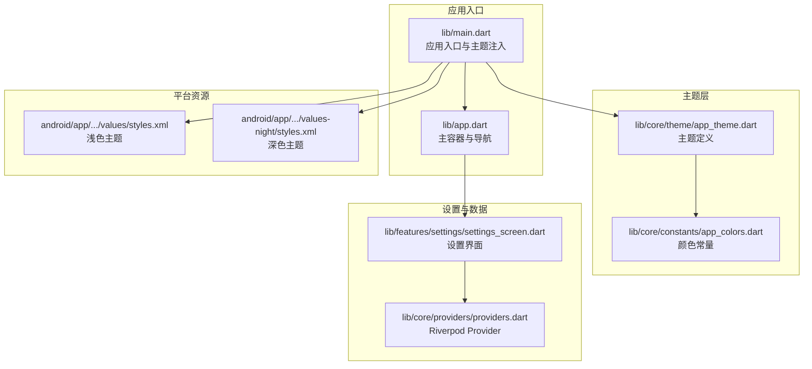
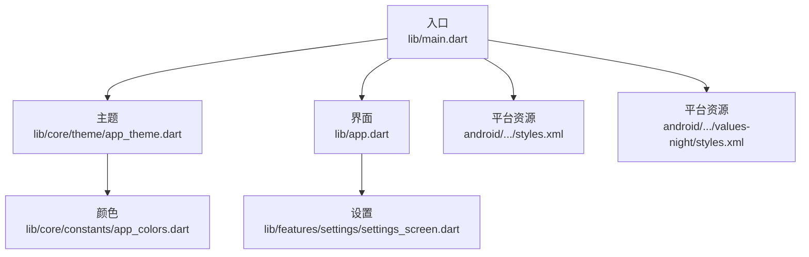
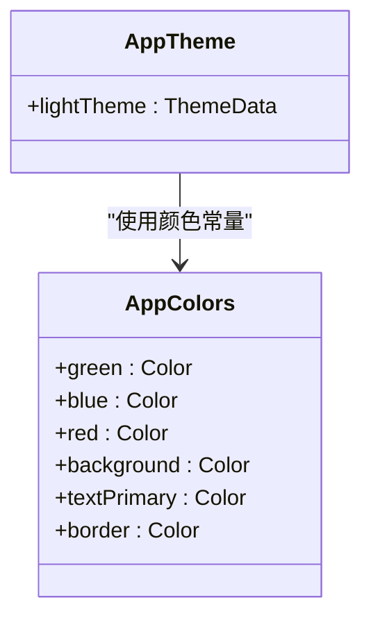
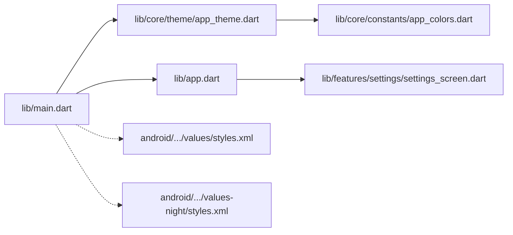

# 主题系统

<cite>
**本文引用的文件**
- [lib/main.dart](file://lib/main.dart)
- [lib/app.dart](file://lib/app.dart)
- [lib/core/theme/app_theme.dart](file://lib/core/theme/app_theme.dart)
- [lib/core/constants/app_colors.dart](file://lib/core/constants/app_colors.dart)
- [lib/features/settings/settings_screen.dart](file://lib/features/settings/settings_screen.dart)
- [lib/core/providers/providers.dart](file://lib/core/providers/providers.dart)
- [pubspec.yaml](file://pubspec.yaml)
- [android/app/src/main/res/values/styles.xml](file://android/app/src/main/res/values/styles.xml)
- [android/app/src/main/res/values-night/styles.xml](file://android/app/src/main/res/values-night/styles.xml)
</cite>

## 目录
1. [简介](#简介)
2. [项目结构](#项目结构)
3. [核心组件](#核心组件)
4. [架构总览](#架构总览)
5. [详细组件分析](#详细组件分析)
6. [依赖关系分析](#依赖关系分析)
7. [性能考虑](#性能考虑)
8. [故障排查指南](#故障排查指南)
9. [结论](#结论)
10. [附录](#附录)

## 简介
本文件系统性梳理 Dlg-Q 应用的主题系统，重点覆盖以下方面：
- 设计架构：颜色方案、字体配置与样式定义的组织方式
- 主题切换机制：动态主题更新、主题持久化与响应式设计支持
- 可扩展性：自定义主题创建、主题变量管理与跨平台兼容
- 实践示例：如何定义新主题、应用主题样式以及处理主题变更事件

当前仓库实现了基于 Material Design 的浅色主题，并通过全局 ThemeData 统一注入；Android 端提供了明暗模式资源以适配系统深色模式。

## 项目结构
主题系统主要由以下模块构成：
- 入口与根组件：负责初始化应用、设置状态栏样式并将主题注入到 MaterialApp
- 主题定义：集中于 AppTheme 类，统一管理颜色、字体、控件样式等
- 颜色常量：集中于 AppColors 类，便于复用与维护
- 设置界面：用于配置外部服务参数（与主题无直接耦合），但可作为主题扩展入口
- 平台资源：Android 明/暗主题资源，配合系统深色模式

图表来源
- [lib/main.dart:1-36](file://lib/main.dart#L1-L36)
- [lib/app.dart:1-111](file://lib/app.dart#L1-L111)
- [lib/core/theme/app_theme.dart:1-116](file://lib/core/theme/app_theme.dart#L1-L116)
- [lib/core/constants/app_colors.dart:1-43](file://lib/core/constants/app_colors.dart#L1-L43)
- [lib/features/settings/settings_screen.dart:1-356](file://lib/features/settings/settings_screen.dart#L1-L356)
- [lib/core/providers/providers.dart:1-178](file://lib/core/providers/providers.dart#L1-L178)
- [android/app/src/main/res/values/styles.xml:1-19](file://android/app/src/main/res/values/styles.xml#L1-L19)
- [android/app/src/main/res/values-night/styles.xml:1-19](file://android/app/src/main/res/values-night/styles.xml#L1-L19)

章节来源
- [lib/main.dart:1-36](file://lib/main.dart#L1-L36)
- [lib/app.dart:1-111](file://lib/app.dart#L1-L111)
- [lib/core/theme/app_theme.dart:1-116](file://lib/core/theme/app_theme.dart#L1-L116)
- [lib/core/constants/app_colors.dart:1-43](file://lib/core/constants/app_colors.dart#L1-L43)
- [lib/features/settings/settings_screen.dart:1-356](file://lib/features/settings/settings_screen.dart#L1-L356)
- [lib/core/providers/providers.dart:1-178](file://lib/core/providers/providers.dart#L1-L178)
- [android/app/src/main/res/values/styles.xml:1-19](file://android/app/src/main/res/values/styles.xml#L1-L19)
- [android/app/src/main/res/values-night/styles.xml:1-19](file://android/app/src/main/res/values-night/styles.xml#L1-L19)

## 核心组件
- AppTheme：集中定义 ThemeData，包含 primaryColor、ColorScheme、textTheme、AppBarTheme、ElevatedButtonTheme、InputDecorationTheme、CardTheme、BottomNavigationBarTheme 等
- AppColors：集中定义颜色常量，包括主色、辅色、中性色、文本色、边框色、阴影色等
- DIYDuolingoApp：在 MaterialApp 中注入 AppTheme.lightTheme
- SettingsScreen：设置界面，使用 AppColors 与基础控件样式，不直接参与主题切换逻辑
- Riverpod Providers：提供业务能力，与主题系统解耦

章节来源
- [lib/core/theme/app_theme.dart:1-116](file://lib/core/theme/app_theme.dart#L1-L116)
- [lib/core/constants/app_colors.dart:1-43](file://lib/core/constants/app_colors.dart#L1-L43)
- [lib/main.dart:23-35](file://lib/main.dart#L23-L35)
- [lib/features/settings/settings_screen.dart:1-356](file://lib/features/settings/settings_screen.dart#L1-L356)
- [lib/core/providers/providers.dart:1-178](file://lib/core/providers/providers.dart#L1-L178)

## 架构总览
Dlg-Q 的主题系统采用“集中式主题定义 + 全局注入”的架构：
- 在入口处创建 ThemeData 并注入到 MaterialApp
- 使用 ColorScheme 和 Google Fonts 提供一致的色彩与排版体系
- 控件样式通过 ThemeData 的子主题统一配置，避免分散修改
- Android 端通过 values 与 values-night 资源适配系统深色模式

图表来源
- [lib/main.dart:1-36](file://lib/main.dart#L1-L36)
- [lib/core/theme/app_theme.dart:1-116](file://lib/core/theme/app_theme.dart#L1-L116)
- [lib/core/constants/app_colors.dart:1-43](file://lib/core/constants/app_colors.dart#L1-L43)
- [lib/app.dart:1-111](file://lib/app.dart#L1-L111)
- [lib/features/settings/settings_screen.dart:1-356](file://lib/features/settings/settings_screen.dart#L1-L356)
- [android/app/src/main/res/values/styles.xml:1-19](file://android/app/src/main/res/values/styles.xml#L1-L19)
- [android/app/src/main/res/values-night/styles.xml:1-19](file://android/app/src/main/res/values-night/styles.xml#L1-L19)

## 详细组件分析

### AppTheme：主题定义与样式组织
- 颜色体系：通过 primaryColor 与 ColorScheme.primary/secondary/surface/error 统一主色与语义色
- 字体体系：基于 Google Fonts 的 Nunito，定义 display/body 系列字号与字重
- 控件样式：
  - ElevatedButtonTheme：圆角、内边距、文字样式统一
  - InputDecorationTheme：输入框边框、聚焦态、圆角与内边距
  - CardTheme：卡片背景、圆角、边框与间距
  - BottomNavigationBarTheme：选中/未选中颜色与标签样式
  - AppBarTheme：标题与图标颜色
- 设计原则：以 AppColors 为唯一颜色来源，确保一致性与可维护性

图表来源
- [lib/core/theme/app_theme.dart:1-116](file://lib/core/theme/app_theme.dart#L1-L116)
- [lib/core/constants/app_colors.dart:1-43](file://lib/core/constants/app_colors.dart#L1-L43)

章节来源
- [lib/core/theme/app_theme.dart:1-116](file://lib/core/theme/app_theme.dart#L1-L116)
- [lib/core/constants/app_colors.dart:1-43](file://lib/core/constants/app_colors.dart#L1-L43)

### AppColors：颜色常量管理
- 分类明确：主色/辅色、中性色、文本色、边框与阴影、徽章色
- 命名规范：使用语义化命名，如 green/greenDark/greenLight
- 单一职责：所有颜色引用均来自此处，便于主题扩展与替换

章节来源
- [lib/core/constants/app_colors.dart:1-43](file://lib/core/constants/app_colors.dart#L1-L43)

### 入口与主题注入：DIYDuolingoApp
- 在入口处创建 MaterialApp，并将 AppTheme.lightTheme 注入
- 设置状态栏透明与深色图标，提升视觉一致性
- 通过 ProviderScope 提供全局状态管理能力

章节来源
- [lib/main.dart:1-36](file://lib/main.dart#L1-L36)

### 设置界面与主题扩展点
- SettingsScreen 使用 AppColors 与基础控件样式，体现主题一致性
- 当前未实现动态主题切换，但可通过扩展 Provider 与状态管理实现主题持久化与切换
- 可在设置界面新增“深色模式”开关，结合 ThemeData 的 darkTheme 字段进行切换

章节来源
- [lib/features/settings/settings_screen.dart:1-356](file://lib/features/settings/settings_screen.dart#L1-L356)

### Android 平台资源：明/暗主题适配
- values/styles.xml：浅色主题，窗口背景使用系统色
- values-night/styles.xml：深色主题，窗口背景使用系统深色
- 与 Flutter 主题解耦，系统深色模式下自动生效

章节来源
- [android/app/src/main/res/values/styles.xml:1-19](file://android/app/src/main/res/values/styles.xml#L1-L19)
- [android/app/src/main/res/values-night/styles.xml:1-19](file://android/app/src/main/res/values-night/styles.xml#L1-L19)

## 依赖关系分析
- 主题依赖链：main.dart -> AppTheme -> AppColors
- 界面依赖链：app.dart -> settings_screen.dart（间接通过路由）
- 平台依赖链：Android 资源文件独立于 Flutter 主题
- 第三方依赖：google_fonts 用于字体，shared_preferences 可用于主题持久化（建议）

图表来源
- [lib/main.dart:1-36](file://lib/main.dart#L1-L36)
- [lib/core/theme/app_theme.dart:1-116](file://lib/core/theme/app_theme.dart#L1-L116)
- [lib/core/constants/app_colors.dart:1-43](file://lib/core/constants/app_colors.dart#L1-L43)
- [lib/app.dart:1-111](file://lib/app.dart#L1-L111)
- [lib/features/settings/settings_screen.dart:1-356](file://lib/features/settings/settings_screen.dart#L1-L356)
- [android/app/src/main/res/values/styles.xml:1-19](file://android/app/src/main/res/values/styles.xml#L1-L19)
- [android/app/src/main/res/values-night/styles.xml:1-19](file://android/app/src/main/res/values-night/styles.xml#L1-L19)

章节来源
- [lib/main.dart:1-36](file://lib/main.dart#L1-L36)
- [lib/core/theme/app_theme.dart:1-116](file://lib/core/theme/app_theme.dart#L1-L116)
- [lib/core/constants/app_colors.dart:1-43](file://lib/core/constants/app_colors.dart#L1-L43)
- [lib/app.dart:1-111](file://lib/app.dart#L1-L111)
- [lib/features/settings/settings_screen.dart:1-356](file://lib/features/settings/settings_screen.dart#L1-L356)
- [android/app/src/main/res/values/styles.xml:1-19](file://android/app/src/main/res/values/styles.xml#L1-L19)
- [android/app/src/main/res/values-night/styles.xml:1-19](file://android/app/src/main/res/values-night/styles.xml#L1-L19)

## 性能考虑
- 主题构建：ThemeData 为轻量对象，构建成本低；避免在热路径频繁重建
- 字体加载：Google Fonts 在首次使用时下载，建议在应用启动阶段预热或缓存
- 控件样式：统一使用 ThemeData 子主题，减少重复样式计算
- 平台资源：Android 明/暗主题由系统处理，无需额外渲染开销

## 故障排查指南
- 字体未生效：检查 google_fonts 依赖是否正确引入，确认网络可用
- 颜色不一致：检查是否直接硬编码颜色，应统一从 AppColors 引用
- 设置界面样式异常：确认使用了 AppColors 与基础控件样式
- 深色模式无效：检查 Android values-night 资源是否存在，或在 Flutter 层补充 ThemeData.darkTheme

章节来源
- [pubspec.yaml:19-22](file://pubspec.yaml#L19-L22)
- [lib/core/constants/app_colors.dart:1-43](file://lib/core/constants/app_colors.dart#L1-L43)
- [lib/features/settings/settings_screen.dart:1-356](file://lib/features/settings/settings_screen.dart#L1-L356)
- [android/app/src/main/res/values-night/styles.xml:1-19](file://android/app/src/main/res/values-night/styles.xml#L1-L19)

## 结论
Dlg-Q 的主题系统以 AppTheme 为核心，通过 AppColors 统一颜色管理，结合 Google Fonts 实现一致的排版风格。入口处集中注入 ThemeData，界面层遵循统一样式约定。Android 端提供明/暗资源以适配系统深色模式。当前未实现动态主题切换，但具备良好的扩展空间：可在设置界面增加主题开关，并通过 Provider 与 shared_preferences 实现主题持久化与动态切换。

## 附录

### 如何定义新主题（步骤指引）
- 新建 ThemeData：参考 AppTheme.lightTheme 的结构，创建新主题方法
- 定义颜色映射：在 AppColors 中添加新主题所需的颜色常量
- 注入到入口：在 DIYDuolingoApp 中将新主题注入到 MaterialApp
- 可选：在设置界面新增主题切换项，结合 Provider 与持久化存储实现动态切换

章节来源
- [lib/core/theme/app_theme.dart:1-116](file://lib/core/theme/app_theme.dart#L1-L116)
- [lib/core/constants/app_colors.dart:1-43](file://lib/core/constants/app_colors.dart#L1-L43)
- [lib/main.dart:23-35](file://lib/main.dart#L23-L35)

### 如何应用主题样式（步骤指引）
- 使用 AppColors：所有颜色引用统一从 AppColors 获取
- 使用 ThemeData 子主题：按钮、输入框、卡片、底部导航等样式通过对应子主题配置
- 字体使用：通过 Google Fonts 的 NunitoTextTheme 获取一致的排版

章节来源
- [lib/core/theme/app_theme.dart:1-116](file://lib/core/theme/app_theme.dart#L1-L116)
- [lib/core/constants/app_colors.dart:1-43](file://lib/core/constants/app_colors.dart#L1-L43)

### 如何处理主题变更事件（步骤指引）
- 添加主题状态：使用 Riverpod 或其他状态管理，在设置界面维护当前主题标识
- 持久化：使用 shared_preferences 保存用户选择的主题偏好
- 动态切换：根据偏好值在入口处选择对应的 ThemeData（如 lightTheme/darkTheme）
- 触发重建：通过 Provider 的状态变更触发 UI 重建

章节来源
- [lib/core/providers/providers.dart:1-178](file://lib/core/providers/providers.dart#L1-L178)
- [pubspec.yaml:21](file://pubspec.yaml#L21)
- [lib/main.dart:23-35](file://lib/main.dart#L23-L35)