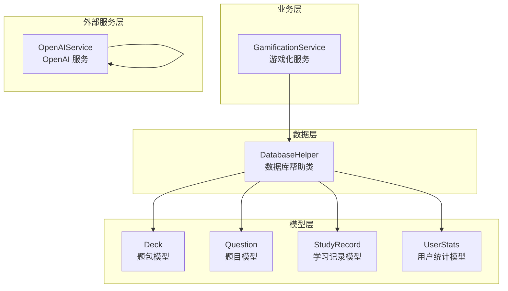
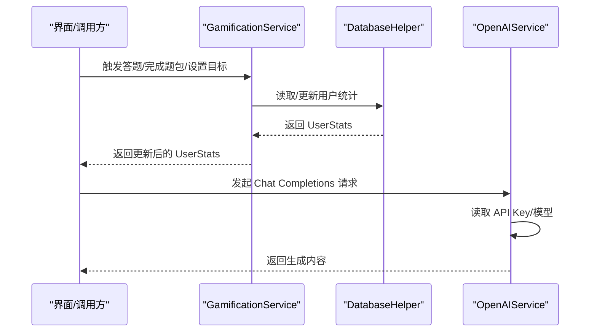
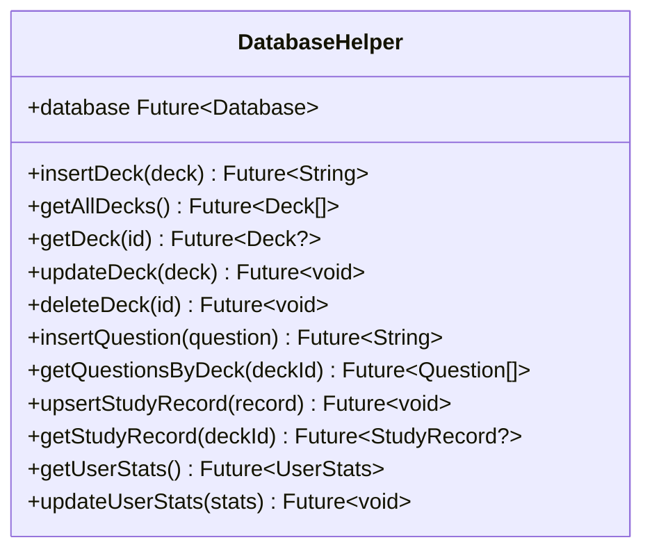
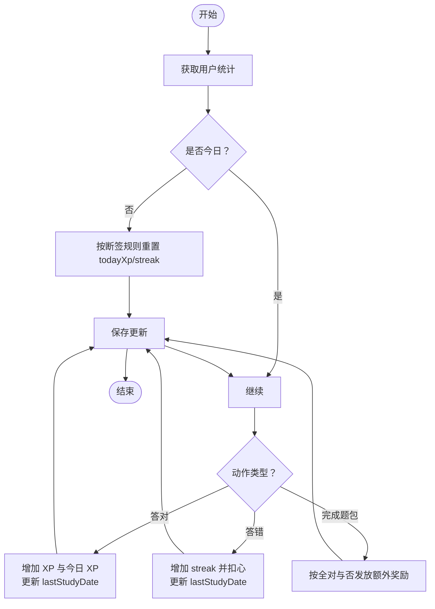
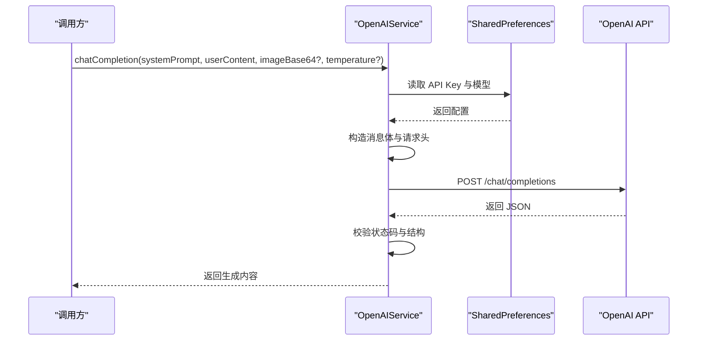
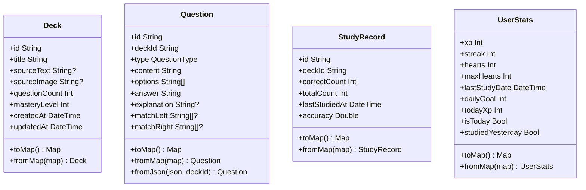
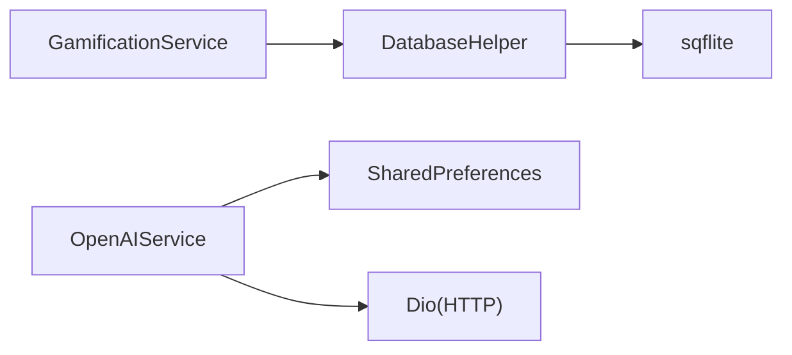

# 工具类

<cite>
**本文引用的文件**
- [lib/data/database/database_helper.dart](file://lib/data/database/database_helper.dart)
- [lib/services/gamification_service.dart](file://lib/services/gamification_service.dart)
- [lib/services/openai_service.dart](file://lib/services/openai_service.dart)
- [lib/data/models/deck.dart](file://lib/data/models/deck.dart)
- [lib/data/models/question.dart](file://lib/data/models/question.dart)
- [lib/data/models/study_record.dart](file://lib/data/models/study_record.dart)
- [lib/data/models/user_stats.dart](file://lib/data/models/user_stats.dart)
</cite>

## 目录
1. [引言](#引言)
2. [项目结构](#项目结构)
3. [核心组件](#核心组件)
4. [架构总览](#架构总览)
5. [详细组件分析](#详细组件分析)
6. [依赖分析](#依赖分析)
7. [性能考虑](#性能考虑)
8. [故障排查指南](#故障排查指南)
9. [结论](#结论)
10. [附录](#附录)

## 引言
本文件系统性梳理 Dlg-Q 工具类体系与相关支撑模块，聚焦以下目标：
- 设计原则与实现模式：统一的通用方法封装、数据处理与辅助函数组织方式
- 功能分类：数据库访问、游戏化机制、外部服务集成（如 OpenAI）、以及数据模型转换
- 可复用性设计：方法签名标准化、异常处理策略、性能优化建议
- 使用示例与扩展指引：如何使用现有工具类、如何新增工具方法，提升开发效率与代码质量

## 项目结构
Dlg-Q 的工具类与支撑能力主要分布在如下层次：
- 数据层：数据库帮助类负责初始化、建表、CRUD 操作
- 业务层：游戏化服务封装 XP、连续打卡、心数、掌握度等行为逻辑
- 外部服务层：OpenAI 服务封装 API Key 管理、请求构建与响应解析
- 模型层：各实体模型提供 toMap/fromMap 序列化与领域属性（如准确率、是否今日）

图表来源
- [lib/data/database/database_helper.dart:1-192](file://lib/data/database/database_helper.dart#L1-L192)
- [lib/services/gamification_service.dart:1-116](file://lib/services/gamification_service.dart#L1-L116)
- [lib/services/openai_service.dart:1-109](file://lib/services/openai_service.dart#L1-L109)
- [lib/data/models/deck.dart:1-71](file://lib/data/models/deck.dart#L1-L71)
- [lib/data/models/question.dart:1-76](file://lib/data/models/question.dart#L1-L76)
- [lib/data/models/study_record.dart:1-41](file://lib/data/models/study_record.dart#L1-L41)
- [lib/data/models/user_stats.dart:1-83](file://lib/data/models/user_stats.dart#L1-L83)

章节来源
- [lib/data/database/database_helper.dart:1-192](file://lib/data/database/database_helper.dart#L1-L192)
- [lib/services/gamification_service.dart:1-116](file://lib/services/gamification_service.dart#L1-L116)
- [lib/services/openai_service.dart:1-109](file://lib/services/openai_service.dart#L1-L109)
- [lib/data/models/deck.dart:1-71](file://lib/data/models/deck.dart#L1-L71)
- [lib/data/models/question.dart:1-76](file://lib/data/models/question.dart#L1-L76)
- [lib/data/models/study_record.dart:1-41](file://lib/data/models/study_record.dart#L1-L41)
- [lib/data/models/user_stats.dart:1-83](file://lib/data/models/user_stats.dart#L1-L83)

## 核心组件
- 数据库帮助类（DatabaseHelper）
  - 单例模式管理数据库连接
  - 初始化数据库路径、版本与建表脚本
  - 提供题包、题目、学习记录、用户统计的 CRUD 操作
- 游戏化服务（GamificationService）
  - 基于用户统计进行 XP 奖励、连续打卡、心数扣减与恢复
  - 支持每日目标检查与题包掌握度计算
- OpenAI 服务（OpenAIService）
  - 封装 API Key 与模型存储（SharedPreferences）
  - 统一封装 Chat Completions 请求与响应解析
- 模型层（Deck、Question、StudyRecord、UserStats）
  - 提供 toMap/fromMap 序列化与常用派生属性（如准确率、是否今日）

章节来源
- [lib/data/database/database_helper.dart:8-192](file://lib/data/database/database_helper.dart#L8-L192)
- [lib/services/gamification_service.dart:4-116](file://lib/services/gamification_service.dart#L4-L116)
- [lib/services/openai_service.dart:5-109](file://lib/services/openai_service.dart#L5-L109)
- [lib/data/models/deck.dart:1-71](file://lib/data/models/deck.dart#L1-L71)
- [lib/data/models/question.dart:1-76](file://lib/data/models/question.dart#L1-L76)
- [lib/data/models/study_record.dart:1-41](file://lib/data/models/study_record.dart#L1-L41)
- [lib/data/models/user_stats.dart:1-83](file://lib/data/models/user_stats.dart#L1-L83)

## 架构总览
下图展示了工具类与服务之间的交互关系，以及数据在模型与数据库之间的流转。

图表来源
- [lib/services/gamification_service.dart:14-107](file://lib/services/gamification_service.dart#L14-L107)
- [lib/data/database/database_helper.dart:176-190](file://lib/data/database/database_helper.dart#L176-L190)
- [lib/services/openai_service.dart:42-107](file://lib/services/openai_service.dart#L42-L107)

## 详细组件分析

### 数据库帮助类（DatabaseHelper）
- 设计要点
  - 单例模式确保数据库连接唯一，避免重复打开
  - 延迟初始化：首次访问时才打开数据库
  - 分层职责：建表、CRUD 操作与模型映射分离
- 关键流程
  - 初始化数据库路径与版本，执行建表脚本
  - 题包 CRUD：插入、查询列表、按 ID 查询、更新、删除（级联清理子表）
  - 题目 CRUD：插入（自动生成 ID）、按题包查询
  - 学习记录：Upsert（冲突替换）与按题包查询
  - 用户统计：读取固定行、更新
- 性能与健壮性
  - 使用事务外的批量写入；如需高并发可引入事务包装
  - 查询使用参数绑定防止注入
  - 建表默认值保证数据完整性

图表来源
- [lib/data/database/database_helper.dart:8-192](file://lib/data/database/database_helper.dart#L8-L192)

章节来源
- [lib/data/database/database_helper.dart:16-192](file://lib/data/database/database_helper.dart#L16-L192)

### 游戏化服务（GamificationService）
- 设计要点
  - 依赖注入 DatabaseHelper，便于测试与替换
  - 将“每日重置”“连续打卡”等规则内聚到服务层
  - 提供 XP 奖励、心数扣减/恢复、题包掌握度计算等纯函数式方法
- 关键流程
  - 获取用户统计：若非今日则根据是否断签重置当日 XP 并更新
  - 答对/答错：分别更新 XP、今日 XP、连续打卡与最后学习时间；答错扣心
  - 完成题包：按全对与否发放额外奖励
  - 恢复心数：上限不超过最大心数
  - 每日目标检查：比较今日 XP 与目标
  - 掌握度计算：正确数/总数百分比取整
- 可扩展性
  - 将常量抽离为配置项或持久化存储
  - 将规则迁移为策略对象，支持动态调整

图表来源
- [lib/services/gamification_service.dart:14-107](file://lib/services/gamification_service.dart#L14-L107)

章节来源
- [lib/services/gamification_service.dart:4-116](file://lib/services/gamification_service.dart#L4-L116)

### OpenAI 服务（OpenAIService）
- 设计要点
  - 通过 SharedPreferences 管理 API Key 与模型，避免硬编码
  - 统一封装请求头、超时、消息体构建与响应校验
  - 支持文本与图片输入（base64），自动拼接 MIME 前缀
- 关键流程
  - 读取/设置 API Key 与模型
  - 构造系统提示词与用户消息（含图片数组）
  - 发送请求并解析 choices[0].message.content
  - 对状态码与返回结构进行异常处理
- 可扩展性
  - 支持更多模型参数（温度、最大 token 等）
  - 支持流式响应与错误重试策略

图表来源
- [lib/services/openai_service.dart:42-107](file://lib/services/openai_service.dart#L42-L107)

章节来源
- [lib/services/openai_service.dart:5-109](file://lib/services/openai_service.dart#L5-L109)

### 模型层（Deck、Question、StudyRecord、UserStats）
- 设计要点
  - 提供 toMap/fromMap 序列化，适配数据库字段
  - 使用分隔符存储数组，反序列化时还原
  - 提供 copyWith 与派生属性（如准确率、是否今日）
- 典型用途
  - 数据库读写：toMap 写入，fromMap 构造对象
  - 展示层：利用派生属性减少 UI 侧计算

图表来源
- [lib/data/models/deck.dart:1-71](file://lib/data/models/deck.dart#L1-L71)
- [lib/data/models/question.dart:1-76](file://lib/data/models/question.dart#L1-L76)
- [lib/data/models/study_record.dart:1-41](file://lib/data/models/study_record.dart#L1-L41)
- [lib/data/models/user_stats.dart:1-83](file://lib/data/models/user_stats.dart#L1-L83)

章节来源
- [lib/data/models/deck.dart:1-71](file://lib/data/models/deck.dart#L1-L71)
- [lib/data/models/question.dart:1-76](file://lib/data/models/question.dart#L1-L76)
- [lib/data/models/study_record.dart:1-41](file://lib/data/models/study_record.dart#L1-L41)
- [lib/data/models/user_stats.dart:1-83](file://lib/data/models/user_stats.dart#L1-L83)

## 依赖分析
- 组件耦合
  - GamificationService 依赖 DatabaseHelper，形成清晰的业务-数据边界
  - OpenAIService 与 SharedPreferences 耦合，便于配置管理但需注意密钥安全
- 外部依赖
  - sqflite：本地数据库
  - dio：HTTP 客户端
  - shared_preferences：轻量配置存储
- 循环依赖
  - 当前无循环依赖，模型之间仅作为数据载体被读写

图表来源
- [lib/services/gamification_service.dart:1-8](file://lib/services/gamification_service.dart#L1-L8)
- [lib/services/openai_service.dart:1-15](file://lib/services/openai_service.dart#L1-L15)
- [lib/data/database/database_helper.dart:1-6](file://lib/data/database/database_helper.dart#L1-L6)

章节来源
- [lib/services/gamification_service.dart:1-8](file://lib/services/gamification_service.dart#L1-L8)
- [lib/services/openai_service.dart:1-15](file://lib/services/openai_service.dart#L1-L15)
- [lib/data/database/database_helper.dart:1-6](file://lib/data/database/database_helper.dart#L1-L6)

## 性能考虑
- 数据库
  - 批量写入建议使用事务包裹，减少磁盘 IO
  - 查询条件尽量使用索引字段（如 deck_id），避免全表扫描
  - 合理使用参数绑定，避免字符串拼接
- 网络
  - 为长耗时请求设置合理的连接与接收超时
  - 对频繁调用的配置（API Key/模型）做本地缓存，减少 IO
- 业务逻辑
  - 将纯计算逻辑（如掌握度、准确率）放在服务层，避免 UI 重复计算
  - 使用不可变对象与 copyWith，降低副作用与调试成本

## 故障排查指南
- OpenAI 服务
  - 未设置 API Key：抛出明确异常，引导用户在设置页配置
  - 请求失败：检查状态码与返回结构，必要时打印响应体
  - 返回空结果：校验消息构造与模型参数
- 数据库
  - 连接失败：确认数据库路径与版本号一致
  - 插入失败：检查主键冲突与字段类型匹配
  - 删除未级联：确认外键约束与删除顺序
- 游戏化
  - 今日重置异常：核对 lastStudyDate 的时区与日期比较逻辑
  - 心数越界：确保恢复与扣减逻辑在 maxHearts 范围内

章节来源
- [lib/services/openai_service.dart:37-107](file://lib/services/openai_service.dart#L37-L107)
- [lib/data/database/database_helper.dart:16-30](file://lib/data/database/database_helper.dart#L16-L30)
- [lib/services/gamification_service.dart:14-107](file://lib/services/gamification_service.dart#L14-L107)

## 结论
Dlg-Q 的工具类体系以“职责单一、接口稳定、可测试性强”为核心设计原则，通过数据库帮助类、游戏化服务与外部服务封装，形成了清晰的数据流与业务流。建议在后续迭代中：
- 将常量与配置进一步抽象为可配置项
- 引入统一的错误码与日志埋点
- 对高频路径进行缓存与批处理优化
- 逐步将工具方法沉淀为独立的工具模块，提升复用性与可维护性

## 附录
- 如何使用现有工具类
  - 数据库操作：通过 DatabaseHelper 的 CRUD 方法访问题包、题目、学习记录与用户统计
  - 游戏化：通过 GamificationService 的 onCorrectAnswer/onWrongAnswer/onDeckComplete/refillOneHeart/setDailyGoal/isDailyGoalComplete/calculateMasteryLevel 等方法管理用户进度
  - 外部服务：通过 OpenAIService 的 chatCompletion 方法发起对话，并传入系统提示词与可选图片
- 如何新增工具方法
  - 若为纯函数：放入对应服务或新建纯工具类，保持无状态与幂等
  - 若涉及持久化：优先封装在 DatabaseHelper 或其上层服务中，确保一致性
  - 若涉及网络：封装在 OpenAIService 或新服务中，统一处理鉴权与异常
  - 命名与签名：遵循现有风格，参数命名清晰，返回 Future/Stream 明确异步语义