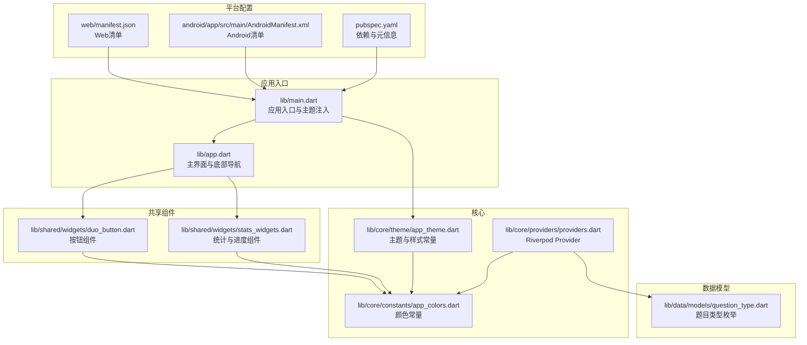
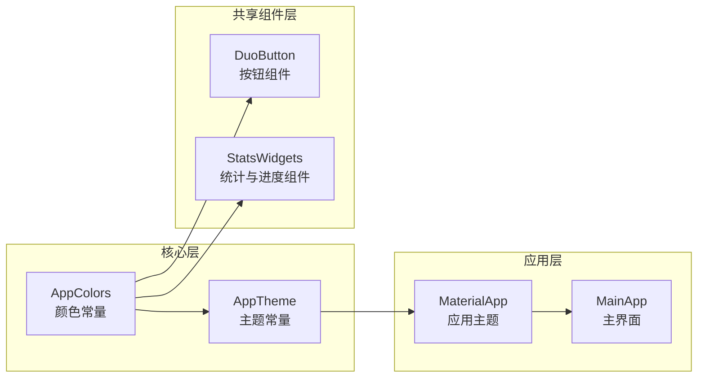
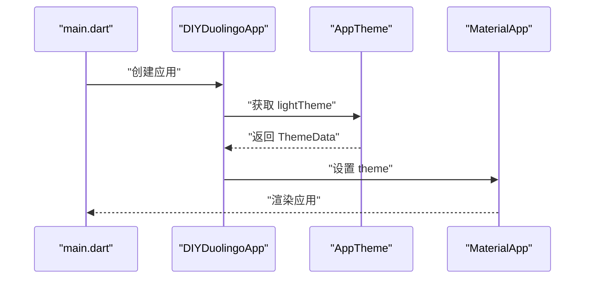
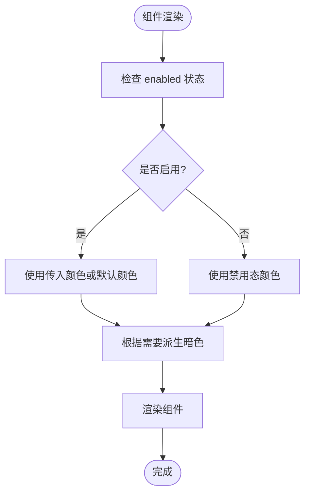
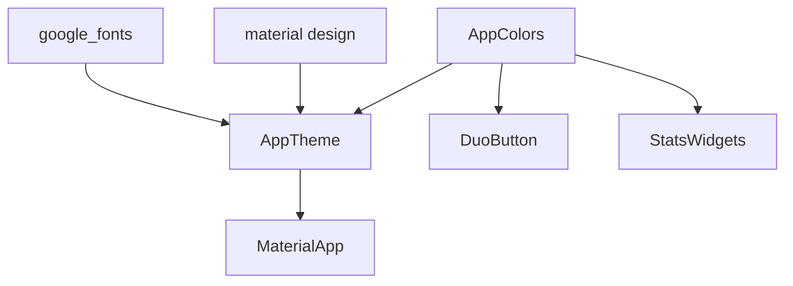

# 常量管理

<cite>
**本文档引用的文件**
- [lib/main.dart](file://lib/main.dart)
- [lib/app.dart](file://lib/app.dart)
- [lib/core/constants/app_colors.dart](file://lib/core/constants/app_colors.dart)
- [lib/core/theme/app_theme.dart](file://lib/core/theme/app_theme.dart)
- [lib/shared/widgets/duo_button.dart](file://lib/shared/widgets/duo_button.dart)
- [lib/shared/widgets/stats_widgets.dart](file://lib/shared/widgets/stats_widgets.dart)
- [lib/core/providers/providers.dart](file://lib/core/providers/providers.dart)
- [lib/data/models/question_type.dart](file://lib/data/models/question_type.dart)
- [pubspec.yaml](file://pubspec.yaml)
- [web/manifest.json](file://web/manifest.json)
- [android/app/src/main/AndroidManifest.xml](file://android/app/src/main/AndroidManifest.xml)
</cite>

## 目录
1. [简介](#简介)
2. [项目结构](#项目结构)
3. [核心组件](#核心组件)
4. [架构总览](#架构总览)
5. [详细组件分析](#详细组件分析)
6. [依赖分析](#依赖分析)
7. [性能考虑](#性能考虑)
8. [故障排查指南](#故障排查指南)
9. [结论](#结论)
10. [附录](#附录)

## 简介
本文件面向Dlg-Q常量管理系统，系统性梳理颜色常量、主题与UI组件、配置参数等常量的组织方式与最佳实践。重点覆盖以下方面：
- 常量分类与命名约定：颜色常量、尺寸常量、字符串常量（含枚举）、配置参数
- 分类管理策略：按功能域划分、模块化组织、集中式入口
- 维护性保障：更新流程、向后兼容、国际化支持建议
- 实践示例：如何新增常量、引用常量、管理常量变更

## 项目结构
Dlg-Q采用分层与功能域结合的目录组织方式，常量主要集中在核心层的constants与theme子目录，并在UI组件与业务Provider中被广泛使用。



图表来源
- [lib/main.dart:1-36](file://lib/main.dart#L1-L36)
- [lib/app.dart:1-111](file://lib/app.dart#L1-L111)
- [lib/core/constants/app_colors.dart:1-43](file://lib/core/constants/app_colors.dart#L1-L43)
- [lib/core/theme/app_theme.dart:1-116](file://lib/core/theme/app_theme.dart#L1-L116)
- [lib/shared/widgets/duo_button.dart:1-103](file://lib/shared/widgets/duo_button.dart#L1-L103)
- [lib/shared/widgets/stats_widgets.dart:1-139](file://lib/shared/widgets/stats_widgets.dart#L1-L139)
- [lib/core/providers/providers.dart:1-178](file://lib/core/providers/providers.dart#L1-L178)
- [lib/data/models/question_type.dart:1-19](file://lib/data/models/question_type.dart#L1-L19)
- [pubspec.yaml:1-34](file://pubspec.yaml#L1-L34)
- [web/manifest.json:1-35](file://web/manifest.json#L1-L35)
- [android/app/src/main/AndroidManifest.xml:57-64](file://android/app/src/main/AndroidManifest.xml#L57-L64)

章节来源
- [lib/main.dart:1-36](file://lib/main.dart#L1-L36)
- [lib/app.dart:1-111](file://lib/app.dart#L1-L111)
- [pubspec.yaml:1-34](file://pubspec.yaml#L1-L34)

## 核心组件
本节聚焦常量系统的三大支柱：颜色常量、主题常量、以及在UI与Provider中的使用。

- 颜色常量（AppColors）
  - 职责：统一管理品牌色、中性色、语义色（如心形红、连击橙）等
  - 组织：按“主色系”“中性色”“语义色”分组，便于查找与复用
  - 使用：被主题与多个UI组件直接引用

- 主题常量（AppTheme）
  - 职责：基于颜色常量构建Material主题，包含文本、按钮、输入框、卡片、底部导航等样式
  - 组织：集中在一个类中，提供lightTheme静态访问点
  - 使用：应用入口注入到MaterialApp

- UI组件中的常量使用
  - 按钮组件：默认使用绿色系常量，支持传入自定义颜色与禁用态配色
  - 统计与进度组件：使用心形红、连击橙、背景色等常量

- Provider与配置
  - Riverpod Provider中未直接定义常量，但可作为常量变更的触发点（如刷新列表、更新统计）

章节来源
- [lib/core/constants/app_colors.dart:1-43](file://lib/core/constants/app_colors.dart#L1-L43)
- [lib/core/theme/app_theme.dart:1-116](file://lib/core/theme/app_theme.dart#L1-L116)
- [lib/shared/widgets/duo_button.dart:1-103](file://lib/shared/widgets/duo_button.dart#L1-L103)
- [lib/shared/widgets/stats_widgets.dart:1-139](file://lib/shared/widgets/stats_widgets.dart#L1-L139)
- [lib/core/providers/providers.dart:1-178](file://lib/core/providers/providers.dart#L1-L178)

## 架构总览
Dlg-Q的常量管理遵循“集中定义、按需引用”的原则。颜色常量作为基础，主题常量作为上层封装，UI组件与Provider通过导入常量实现一致性。



图表来源
- [lib/core/constants/app_colors.dart:1-43](file://lib/core/constants/app_colors.dart#L1-L43)
- [lib/core/theme/app_theme.dart:1-116](file://lib/core/theme/app_theme.dart#L1-L116)
- [lib/shared/widgets/duo_button.dart:1-103](file://lib/shared/widgets/duo_button.dart#L1-L103)
- [lib/shared/widgets/stats_widgets.dart:1-139](file://lib/shared/widgets/stats_widgets.dart#L1-L139)
- [lib/main.dart:23-35](file://lib/main.dart#L23-L35)
- [lib/app.dart:80-111](file://lib/app.dart#L80-L111)

## 详细组件分析

### 颜色常量（AppColors）分析
- 设计要点
  - 将颜色按“主色系”“中性色”“语义色”分组，提升可读性与可维护性
  - 使用static const确保编译期优化与内存效率
  - 提供明暗变体（如green/greenDark/greenLight），便于在不同交互态使用
- 引用关系
  - 主题常量直接引用颜色常量
  - UI组件在默认态或禁用态下引用颜色常量
- 变更影响面
  - 修改颜色常量会影响主题与所有引用该颜色的组件

```mermaid
classDiagram
class AppColors {
"+static const Color green"
"+static const Color greenDark"
"+static const Color greenLight"
"+static const Color blue"
"+static const Color red"
"+static const Color background"
"+static const Color textPrimary"
"+static const Color border"
"+static const Color heartRed"
"+static const Color streakOrange"
}
class AppTheme {
"+static ThemeData lightTheme"
}
class DuoButton {
"+color : Color"
"+darkColor : Color?"
"+height : double"
}
class StatsWidgets {
"+iconColor : Color"
}
AppTheme --> AppColors : "引用"
DuoButton --> AppColors : "默认使用"
StatsWidgets --> AppColors : "使用语义色"
```

图表来源
- [lib/core/constants/app_colors.dart:1-43](file://lib/core/constants/app_colors.dart#L1-L43)
- [lib/core/theme/app_theme.dart:1-116](file://lib/core/theme/app_theme.dart#L1-L116)
- [lib/shared/widgets/duo_button.dart:1-103](file://lib/shared/widgets/duo_button.dart#L1-L103)
- [lib/shared/widgets/stats_widgets.dart:1-139](file://lib/shared/widgets/stats_widgets.dart#L1-L139)

章节来源
- [lib/core/constants/app_colors.dart:1-43](file://lib/core/constants/app_colors.dart#L1-L43)

### 主题常量（AppTheme）分析
- 设计要点
  - 基于颜色常量构建Material主题，统一文本、按钮、输入框、卡片、底部导航等样式
  - 使用Google Fonts与Material风格，保持一致性
- 引用关系
  - 应用入口通过AppTheme.lightTheme注入到MaterialApp
- 变更影响面
  - 修改主题会全局影响UI外观



图表来源
- [lib/main.dart:23-35](file://lib/main.dart#L23-L35)
- [lib/core/theme/app_theme.dart:9-114](file://lib/core/theme/app_theme.dart#L9-L114)

章节来源
- [lib/core/theme/app_theme.dart:1-116](file://lib/core/theme/app_theme.dart#L1-L116)
- [lib/main.dart:23-35](file://lib/main.dart#L23-L35)

### UI组件中的常量使用
- 按钮组件（DuoButton）
  - 默认使用绿色系常量；支持传入自定义颜色与禁用态配色
  - 通过darkColor派生暗色边框，保证视觉一致性
- 统计与进度组件（StatsWidgets）
  - 使用心形红、连击橙等语义色，突出关键信息
  - 文本颜色统一使用文字主色，保证可读性



图表来源
- [lib/shared/widgets/duo_button.dart:33-103](file://lib/shared/widgets/duo_button.dart#L33-L103)
- [lib/shared/widgets/stats_widgets.dart:15-139](file://lib/shared/widgets/stats_widgets.dart#L15-L139)

章节来源
- [lib/shared/widgets/duo_button.dart:1-103](file://lib/shared/widgets/duo_button.dart#L1-L103)
- [lib/shared/widgets/stats_widgets.dart:1-139](file://lib/shared/widgets/stats_widgets.dart#L1-L139)

### Provider与配置中的常量使用
- Provider层未直接定义常量，但可通过常量驱动的逻辑（如刷新列表、更新统计）间接体现常量价值
- 平台配置（pubspec、Web清单、Android清单）属于外部配置参数，不参与运行时常量，但与应用整体行为相关

章节来源
- [lib/core/providers/providers.dart:1-178](file://lib/core/providers/providers.dart#L1-L178)
- [pubspec.yaml:1-34](file://pubspec.yaml#L1-L34)
- [web/manifest.json:1-35](file://web/manifest.json#L1-L35)
- [android/app/src/main/AndroidManifest.xml:57-64](file://android/app/src/main/AndroidManifest.xml#L57-L64)

## 依赖分析
- 内部依赖
  - AppTheme依赖AppColors
  - UI组件依赖AppColors
  - 应用入口依赖AppTheme
- 外部依赖
  - Google Fonts用于字体主题
  - Material Design用于UI组件与样式



图表来源
- [lib/core/constants/app_colors.dart:1-43](file://lib/core/constants/app_colors.dart#L1-L43)
- [lib/core/theme/app_theme.dart:1-116](file://lib/core/theme/app_theme.dart#L1-L116)
- [lib/shared/widgets/duo_button.dart:1-103](file://lib/shared/widgets/duo_button.dart#L1-L103)
- [lib/shared/widgets/stats_widgets.dart:1-139](file://lib/shared/widgets/stats_widgets.dart#L1-L139)
- [lib/main.dart:23-35](file://lib/main.dart#L23-L35)

章节来源
- [lib/core/theme/app_theme.dart:1-116](file://lib/core/theme/app_theme.dart#L1-L116)
- [lib/main.dart:23-35](file://lib/main.dart#L23-L35)

## 性能考虑
- 编译期优化：颜色常量使用static const，减少运行时开销
- 渲染一致性：统一的颜色与主题常量有助于减少重复计算与样式切换成本
- 维护成本：集中式常量降低因分散修改导致的回归风险

## 故障排查指南
- 颜色不一致
  - 检查是否直接硬编码颜色而非使用AppColors
  - 确认AppTheme是否正确注入到MaterialApp
- 主题未生效
  - 确认AppTheme.lightTheme是否被正确设置
  - 检查MaterialApp的theme属性是否被覆盖
- 组件显示异常
  - 检查组件是否正确引用AppColors
  - 对比禁用态与启用态的颜色使用

章节来源
- [lib/core/constants/app_colors.dart:1-43](file://lib/core/constants/app_colors.dart#L1-L43)
- [lib/core/theme/app_theme.dart:1-116](file://lib/core/theme/app_theme.dart#L1-L116)
- [lib/main.dart:23-35](file://lib/main.dart#L23-L35)

## 结论
Dlg-Q的常量管理以AppColors为核心，AppTheme进行统一封装，UI组件与Provider通过导入常量实现一致性与可维护性。建议继续坚持集中式、分组化的常量组织方式，并在新增常量时明确其作用域与命名规范，确保未来扩展与迭代的稳定性。

## 附录

### 常量分类与命名约定建议
- 颜色常量
  - 命名：主色系使用名称（如green、blue、red），明暗变体使用名称+Dark/Light（如greenDark、greenLight）
  - 分组：按主色系、中性色、语义色分组
- 字符串常量
  - 建议使用枚举或本地化资源，避免硬编码
  - 示例：题目类型枚举已采用枚举+标签的方式
- 尺寸常量
  - 建议在组件内部使用const double或统一的尺寸常量文件，避免魔法数字
- 配置参数
  - 建议集中于独立配置文件，区分开发/生产环境

章节来源
- [lib/data/models/question_type.dart:1-19](file://lib/data/models/question_type.dart#L1-L19)

### 新增常量的实践步骤
- 定义位置
  - 颜色常量：在AppColors中新增
  - 主题常量：在AppTheme中引用
  - UI组件：在组件内使用或通过参数传入
- 引用方式
  - 在组件中直接导入并使用
  - 在主题中统一引用
- 变更管理
  - 先在AppColors中定义，再在AppTheme与组件中逐步替换
  - 通过Git提交记录追踪变更范围

章节来源
- [lib/core/constants/app_colors.dart:1-43](file://lib/core/constants/app_colors.dart#L1-L43)
- [lib/core/theme/app_theme.dart:1-116](file://lib/core/theme/app_theme.dart#L1-L116)
- [lib/shared/widgets/duo_button.dart:1-103](file://lib/shared/widgets/duo_button.dart#L1-L103)
- [lib/shared/widgets/stats_widgets.dart:1-139](file://lib/shared/widgets/stats_widgets.dart#L1-L139)