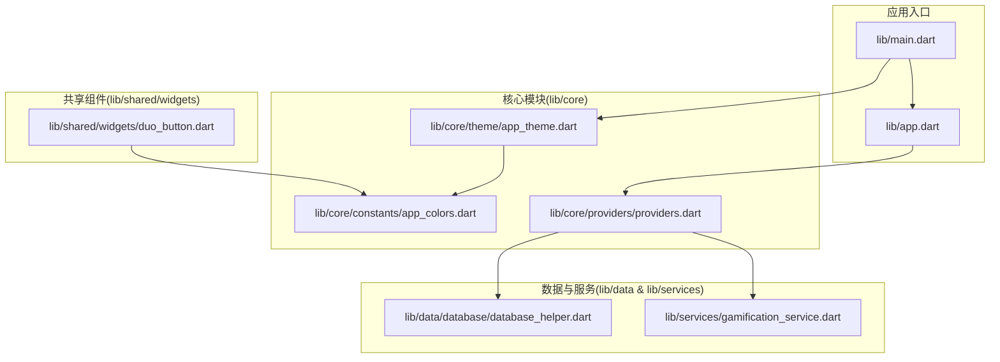
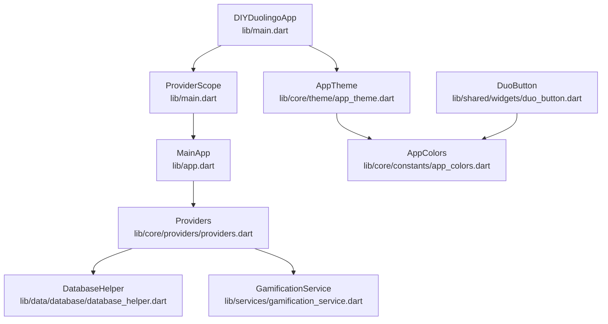
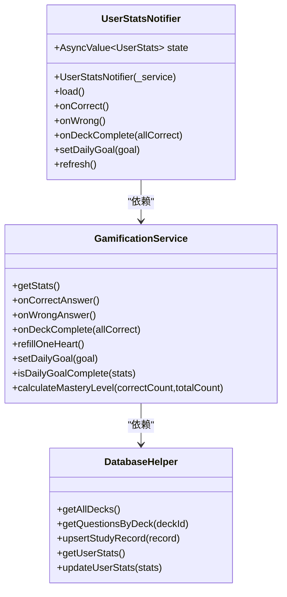
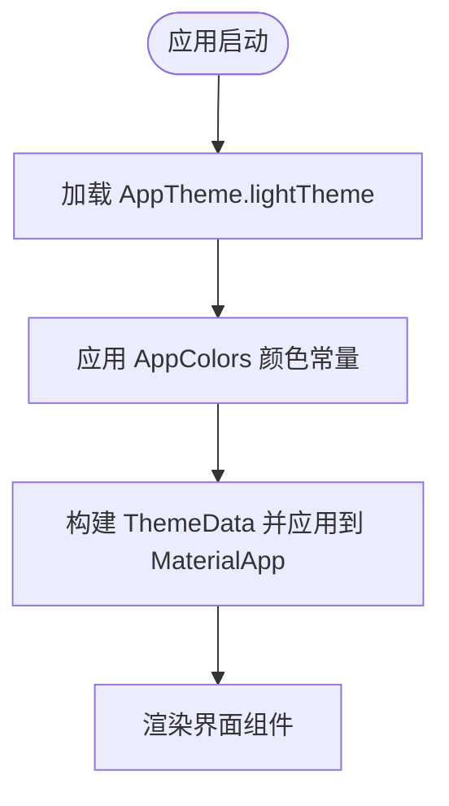
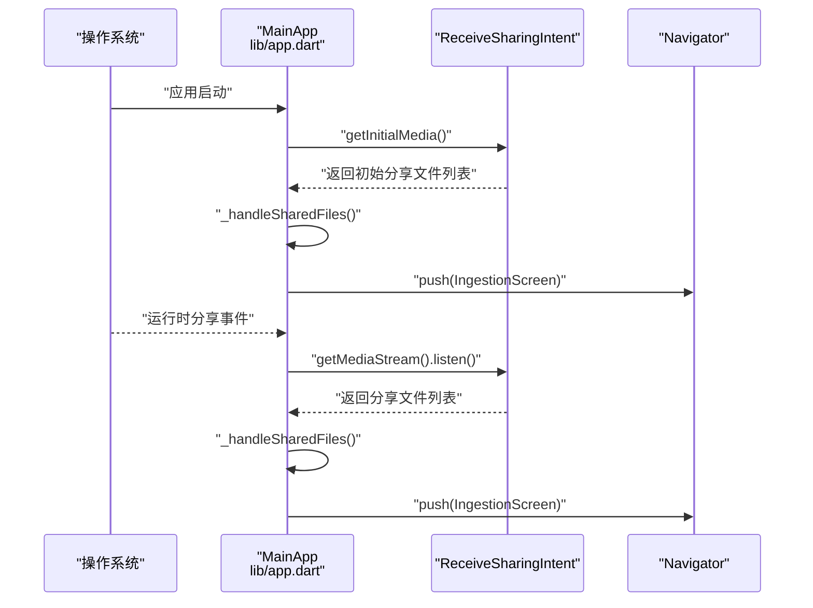
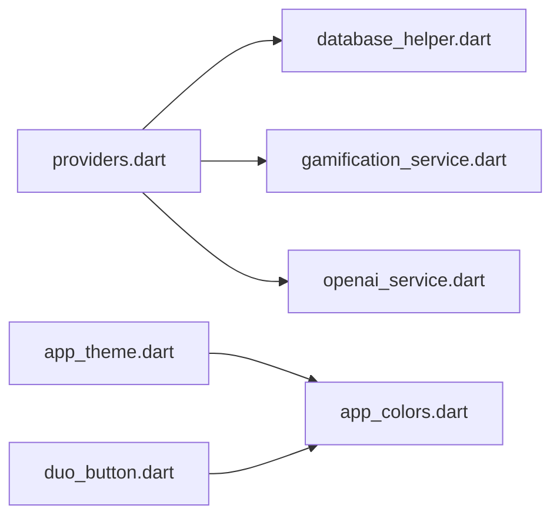

# 核心模块

<cite>
**本文引用的文件**
- [main.dart](file://lib/main.dart)
- [app.dart](file://lib/app.dart)
- [app_theme.dart](file://lib/core/theme/app_theme.dart)
- [app_colors.dart](file://lib/core/constants/app_colors.dart)
- [providers.dart](file://lib/core/providers/providers.dart)
- [database_helper.dart](file://lib/data/database/database_helper.dart)
- [gamification_service.dart](file://lib/services/gamification_service.dart)
- [duo_button.dart](file://lib/shared/widgets/duo_button.dart)
</cite>

## 目录
1. [简介](#简介)
2. [项目结构](#项目结构)
3. [核心组件](#核心组件)
4. [架构总览](#架构总览)
5. [详细组件分析](#详细组件分析)
6. [依赖关系分析](#依赖关系分析)
7. [性能考量](#性能考量)
8. [故障排查指南](#故障排查指南)
9. [结论](#结论)
10. [附录](#附录)

## 简介
本文件聚焦Dlg-Q应用的核心模块，系统性阐述以下方面：
- 状态管理与依赖注入：基于Riverpod Provider的体系化设计，涵盖基础服务Provider、数据Provider、状态通知器与操作Provider。
- 主题系统：多邻国风格主题的构建方式、颜色体系与可定制性。
- 常量管理：颜色常量的集中化组织与最佳实践。
- 工具与组件：共享按钮组件如何复用主题与颜色常量。
- 使用模式与扩展建议：如何在现有Provider模式下新增状态、服务与UI。

## 项目结构
核心模块位于lib/core，包含主题、常量与Provider三大子域；应用入口位于lib/main.dart与lib/app.dart；数据访问与业务服务分别位于lib/data与lib/services；共享组件位于lib/shared。

图表来源
- [main.dart:1-36](file://lib/main.dart#L1-L36)
- [app.dart:1-111](file://lib/app.dart#L1-L111)
- [app_theme.dart:1-116](file://lib/core/theme/app_theme.dart#L1-L116)
- [app_colors.dart:1-43](file://lib/core/constants/app_colors.dart#L1-L43)
- [providers.dart:1-178](file://lib/core/providers/providers.dart#L1-L178)
- [database_helper.dart:1-192](file://lib/data/database/database_helper.dart#L1-L192)
- [gamification_service.dart:1-116](file://lib/services/gamification_service.dart#L1-L116)
- [duo_button.dart:1-103](file://lib/shared/widgets/duo_button.dart#L1-L103)

章节来源
- [main.dart:1-36](file://lib/main.dart#L1-L36)
- [app.dart:1-111](file://lib/app.dart#L1-L111)

## 核心组件
- 主题系统：通过AppTheme.lightTheme集中定义Material主题、颜色方案、文本样式、输入框、卡片、导航栏等，确保UI一致性与可维护性。
- 颜色常量：AppColors集中管理主色、辅色、中性色与语义色，供主题与组件复用。
- Provider体系：以Riverpod为核心，分为基础服务Provider、数据Provider（FutureProvider）、状态Provider（StateNotifierProvider）与操作Provider（Provider），形成清晰的依赖注入与状态流。
- 数据访问：DatabaseHelper封装SQLite初始化与CRUD，提供Deck、Question、StudyRecord、UserStats的持久化能力。
- 游戏化服务：GamificationService负责XP、连续打卡、心数、掌握度与每日目标等逻辑。
- 共享组件：DuoButton提供多邻国风格的3D凸起按钮，复用颜色常量与主题。

章节来源
- [app_theme.dart:1-116](file://lib/core/theme/app_theme.dart#L1-L116)
- [app_colors.dart:1-43](file://lib/core/constants/app_colors.dart#L1-L43)
- [providers.dart:1-178](file://lib/core/providers/providers.dart#L1-L178)
- [database_helper.dart:1-192](file://lib/data/database/database_helper.dart#L1-L192)
- [gamification_service.dart:1-116](file://lib/services/gamification_service.dart#L1-L116)
- [duo_button.dart:1-103](file://lib/shared/widgets/duo_button.dart#L1-L103)

## 架构总览
Dlg-Q采用“入口应用 -> 核心主题与Provider -> 数据与服务 -> 共享组件”的分层架构。入口应用设置系统UI样式与Provider作用域，核心模块提供主题与状态管理，数据与服务层提供持久化与业务逻辑，共享组件复用主题与颜色常量。

图表来源
- [main.dart:1-36](file://lib/main.dart#L1-L36)
- [app.dart:1-111](file://lib/app.dart#L1-L111)
- [app_theme.dart:1-116](file://lib/core/theme/app_theme.dart#L1-L116)
- [app_colors.dart:1-43](file://lib/core/constants/app_colors.dart#L1-L43)
- [providers.dart:1-178](file://lib/core/providers/providers.dart#L1-L178)
- [database_helper.dart:1-192](file://lib/data/database/database_helper.dart#L1-L192)
- [gamification_service.dart:1-116](file://lib/services/gamification_service.dart#L1-L116)
- [duo_button.dart:1-103](file://lib/shared/widgets/duo_button.dart#L1-L103)

## 详细组件分析

### Provider体系与状态管理
- 基础服务Provider：数据库、AI服务、内容分析、游戏化服务均以Provider形式注册，便于按需注入与替换。
- 数据Provider：
  - deckListProvider：FutureProvider加载所有题包列表。
  - deckQuestionsProvider：FutureProvider.family按题包ID异步加载题目。
  - studyRecordProvider：FutureProvider.family按题包ID加载学习记录。
  - userStatsProvider：StateNotifierProvider<UserStatsNotifier, AsyncValue<UserStats>>管理用户统计数据的异步状态。
- 操作Provider：deckOperationsProvider封装题包的保存、删除、更新掌握度与学习记录保存等复合操作，并在完成后使相关Provider失效以触发刷新。
- 状态通知器UserStatsNotifier：
  - 初始化即加载统计数据。
  - 提供onCorrect/onWrong/onDeckComplete/setDailyGoal/refresh等方法，内部调用服务并更新状态。
  - 统一使用AsyncValue承载加载、数据与错误状态，便于UI订阅与渲染。

图表来源
- [providers.dart:42-81](file://lib/core/providers/providers.dart#L42-L81)
- [gamification_service.dart:1-116](file://lib/services/gamification_service.dart#L1-L116)
- [database_helper.dart:176-191](file://lib/data/database/database_helper.dart#L176-L191)

章节来源
- [providers.dart:1-178](file://lib/core/providers/providers.dart#L1-L178)

### 主题系统与可定制性
- 主题入口：AppTheme.lightTheme返回完整的Material主题配置，覆盖primaryColor、scaffold背景、ColorScheme、textTheme、AppBar、Button、InputDecoration、Card、BottomNavigationBar等。
- 颜色来源：主题直接引用AppColors中的静态颜色常量，保证全局一致。
- 可定制性：
  - 颜色方案：通过修改AppColors即可调整整体配色。
  - 字体配置：GoogleFonts与Nunito组合，可在textTheme中进一步细化。
  - 响应式设计：当前未见断点或媒体查询逻辑，如需响应式可扩展至不同屏幕尺寸的主题变体。

图表来源
- [app_theme.dart:9-114](file://lib/core/theme/app_theme.dart#L9-L114)
- [app_colors.dart:1-43](file://lib/core/constants/app_colors.dart#L1-L43)
- [main.dart:23-35](file://lib/main.dart#L23-L35)

章节来源
- [app_theme.dart:1-116](file://lib/core/theme/app_theme.dart#L1-L116)
- [app_colors.dart:1-43](file://lib/core/constants/app_colors.dart#L1-L43)
- [main.dart:1-36](file://lib/main.dart#L1-L36)

### 常量管理与最佳实践
- 集中式颜色常量：AppColors将品牌色、辅色、中性色与语义色统一管理，避免魔法值，提升可读性与一致性。
- 最佳实践：
  - 将所有颜色、尺寸、字符串常量收敛到单一文件，便于全局替换与审计。
  - 在主题与组件中仅引用常量，不直接硬编码颜色值。
  - 对于API端点、错误码与配置参数，建议仿照此模式建立独立常量文件并在Provider中集中注入。

章节来源
- [app_colors.dart:1-43](file://lib/core/constants/app_colors.dart#L1-L43)

### 共享组件与主题集成
- DuoButton复用AppColors与主题色彩，提供按下态的视觉反馈与3D凸起效果，体现品牌风格的一致性。
- 使用建议：在需要强调交互反馈的场景优先使用该组件，减少重复样式代码。

章节来源
- [duo_button.dart:1-103](file://lib/shared/widgets/duo_button.dart#L1-L103)
- [app_colors.dart:1-43](file://lib/core/constants/app_colors.dart#L1-L43)

### 分享意图与导航流程
- 应用启动时与运行时监听分享内容（文本/图片），解析后跳转到IngestionScreen进行内容处理。
- 流程要点：初始分享与实时分享分别通过getInitialMedia与getMediaStream处理；解析后通过Navigator路由跳转。

图表来源
- [app.dart:33-72](file://lib/app.dart#L33-L72)

章节来源
- [app.dart:1-111](file://lib/app.dart#L1-L111)

## 依赖关系分析
- Provider依赖链：
  - deckListProvider依赖databaseProvider。
  - userStatsProvider依赖gamificationServiceProvider。
  - contentAnalyzerProvider依赖openaiServiceProvider。
  - deckOperationsProvider依赖databaseProvider与gamificationServiceProvider。
- 数据与服务：
  - DatabaseHelper提供Deck/Question/StudyRecord/UserStats的CRUD。
  - GamificationService基于DatabaseHelper计算XP、连续打卡、心数与掌握度。
- 主题与颜色：
  - AppTheme依赖AppColors；共享组件（如DuoButton）依赖AppColors。

图表来源
- [providers.dart:1-27](file://lib/core/providers/providers.dart#L1-L27)
- [database_helper.dart:1-192](file://lib/data/database/database_helper.dart#L1-L192)
- [gamification_service.dart:1-116](file://lib/services/gamification_service.dart#L1-L116)
- [app_theme.dart:1-116](file://lib/core/theme/app_theme.dart#L1-L116)
- [app_colors.dart:1-43](file://lib/core/constants/app_colors.dart#L1-L43)
- [duo_button.dart:1-103](file://lib/shared/widgets/duo_button.dart#L1-L103)

章节来源
- [providers.dart:1-178](file://lib/core/providers/providers.dart#L1-L178)

## 性能考量
- Provider刷新粒度：通过FutureProvider.family与invalidate精确控制刷新范围，避免全量重建。
- 异步状态管理：使用AsyncValue承载加载/数据/错误，UI可按需显示骨架屏或错误提示，提升用户体验。
- 数据库访问：DatabaseHelper延迟初始化与连接池化策略有助于降低冷启动开销。
- 主题渲染： ThemeData一次性构建，避免在Widget树中重复计算颜色与样式。

## 故障排查指南
- Provider未生效或报错：
  - 检查Provider作用域是否包裹目标Widget（ProviderScope）。
  - 确认依赖顺序：先注册底层服务Provider，再注册上层数据/状态Provider。
- 异步状态不更新：
  - 确保StateNotifier中正确设置state为AsyncValue.data或AsyncValue.error。
  - 调用invalidate后确认订阅侧已重新build。
- 数据库异常：
  - 检查数据库版本与迁移脚本；确认表结构与字段类型匹配。
  - 关注外键约束与级联删除逻辑。
- 主题不一致：
  - 确认AppTheme引用的颜色常量存在且未被误删。
  - 检查MaterialApp.theme是否正确赋值。

章节来源
- [providers.dart:38-81](file://lib/core/providers/providers.dart#L38-L81)
- [database_helper.dart:32-100](file://lib/data/database/database_helper.dart#L32-L100)
- [main.dart:23-35](file://lib/main.dart#L23-L35)

## 结论
Dlg-Q的核心模块以Riverpod为状态中枢，结合集中式颜色常量与主题系统，实现了高内聚、低耦合的状态管理与UI一致性。通过明确的Provider职责划分与清晰的依赖链，开发者可以快速扩展新功能、新增Provider与服务，并保持良好的可维护性与可扩展性。

## 附录
- 使用模式建议：
  - 新增状态：优先使用FutureProvider或StateNotifierProvider，配合AsyncValue处理异步与错误。
  - 新增服务：以Provider形式注入，避免在UI层直接依赖具体实现。
  - 新增页面：在MainApp底部导航中注册，并在路由中传入必要参数。
  - 新增组件：尽量复用AppColors与主题样式，保持品牌一致性。