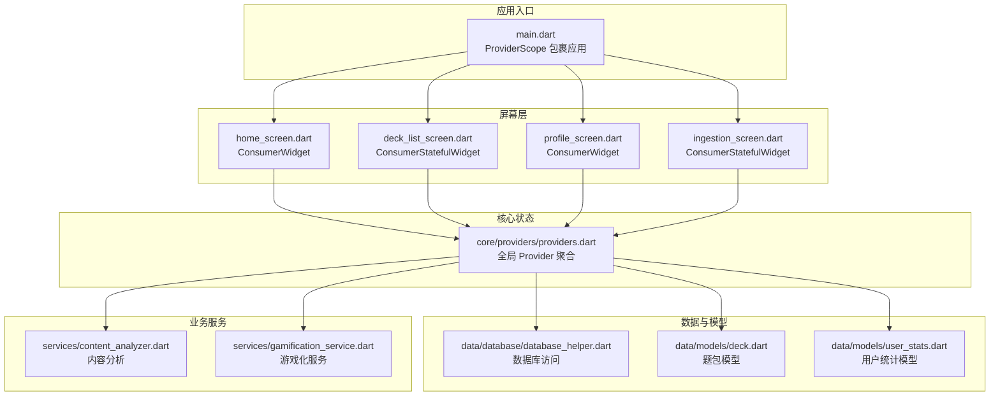
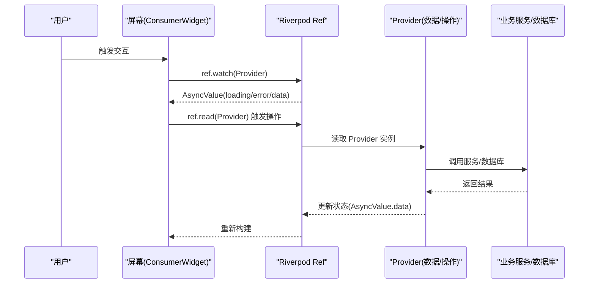
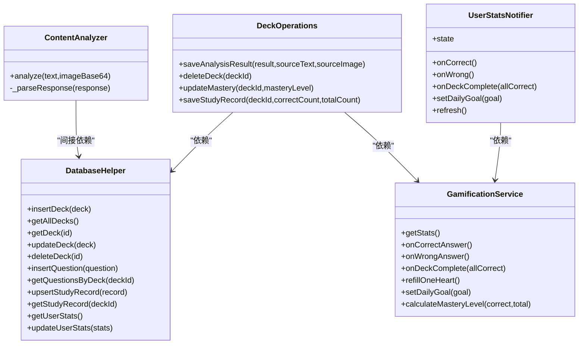
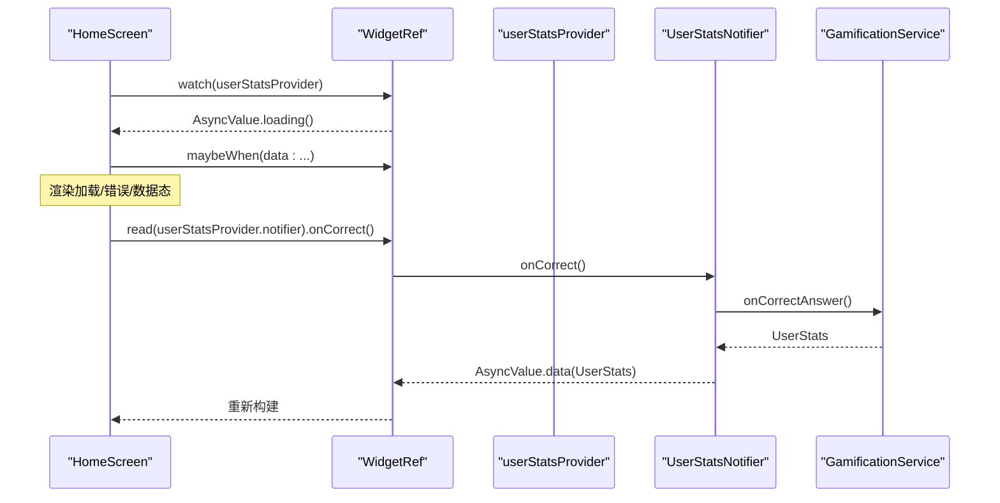
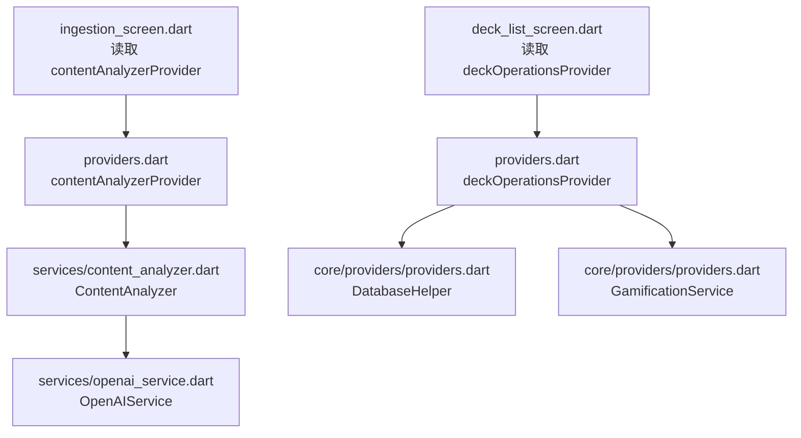
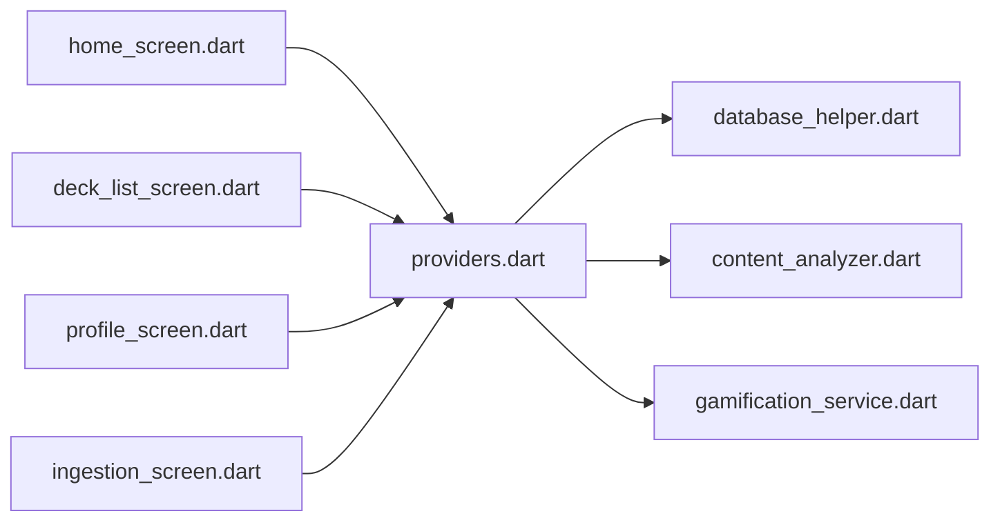

# 状态管理

<cite>
**本文引用的文件**
- [main.dart](file://lib/main.dart)
- [app.dart](file://lib/app.dart)
- [providers.dart](file://lib/core/providers/providers.dart)
- [home_screen.dart](file://lib/features/home/home_screen.dart)
- [deck_list_screen.dart](file://lib/features/deck/deck_list_screen.dart)
- [profile_screen.dart](file://lib/features/profile/profile_screen.dart)
- [ingestion_screen.dart](file://lib/features/ingestion/ingestion_screen.dart)
- [database_helper.dart](file://lib/data/database/database_helper.dart)
- [deck.dart](file://lib/data/models/deck.dart)
- [user_stats.dart](file://lib/data/models/user_stats.dart)
- [content_analyzer.dart](file://lib/services/content_analyzer.dart)
- [gamification_service.dart](file://lib/services/gamification_service.dart)
- [stats_widgets.dart](file://lib/shared/widgets/stats_widgets.dart)
</cite>

## 目录
1. [简介](#简介)
2. [项目结构](#项目结构)
3. [核心组件](#核心组件)
4. [架构总览](#架构总览)
5. [组件详解](#组件详解)
6. [依赖关系分析](#依赖关系分析)
7. [性能考量](#性能考量)
8. [故障排查指南](#故障排查指南)
9. [结论](#结论)
10. [附录](#附录)

## 简介
本文件系统性梳理 Dlg-Q 的状态管理方案，基于 Riverpod Provider 架构，覆盖全局服务 Provider、数据 Provider、操作 Provider 以及组合 Provider 的组织方式；解释状态订阅机制、异步状态处理与依赖注入；总结最佳实践与性能优化策略，并提供可直接定位到源码位置的示例路径，帮助开发者快速上手与正确使用。

## 项目结构
Dlg-Q 采用功能分层 + Provider 集中式管理的组织方式：
- 入口与根作用域：应用入口在根作用域包裹 ProviderScope，确保全局 Provider 生效。
- 屏幕层：Home、DeckList、Profile、Ingestion 等屏幕通过 ConsumerWidget/ConsumerStatefulWidget 订阅状态。
- 核心层：core/providers 聚合所有 Provider，包含基础服务、数据与操作三类。
- 数据层：数据库访问封装于 DatabaseHelper，模型位于 data/models。
- 服务层：内容分析、游戏化等业务服务位于 services。
- 共享组件：共享 UI 小部件位于 shared/widgets。

**图示来源**
- [main.dart:1-36](file://lib/main.dart#L1-L36)
- [home_screen.dart:11-57](file://lib/features/home/home_screen.dart#L11-L57)
- [deck_list_screen.dart:10-97](file://lib/features/deck/deck_list_screen.dart#L10-L97)
- [profile_screen.dart:8-106](file://lib/features/profile/profile_screen.dart#L8-L106)
- [ingestion_screen.dart:13-148](file://lib/features/ingestion/ingestion_screen.dart#L13-L148)
- [providers.dart:13-178](file://lib/core/providers/providers.dart#L13-L178)
- [database_helper.dart:9-192](file://lib/data/database/database_helper.dart#L9-L192)
- [deck.dart:1-71](file://lib/data/models/deck.dart#L1-L71)
- [user_stats.dart:1-83](file://lib/data/models/user_stats.dart#L1-L83)
- [content_analyzer.dart:14-172](file://lib/services/content_analyzer.dart#L14-L172)
- [gamification_service.dart:5-116](file://lib/services/gamification_service.dart#L5-L116)

**章节来源**
- [main.dart:1-36](file://lib/main.dart#L1-L36)
- [providers.dart:13-178](file://lib/core/providers/providers.dart#L13-L178)

## 核心组件
- 全局服务 Provider
  - 数据库服务：提供 DatabaseHelper 单例，供各模块读取/写入。
  - AI 分析服务：提供 OpenAIService，驱动内容分析。
  - 内容分析器：基于 OpenAI 服务生成结构化题目。
  - 游戏化服务：维护用户 XP、连续天数、心数、每日目标等。
- 数据 Provider
  - 题包列表：FutureProvider 加载所有 Deck。
  - 用户统计：StateNotifierProvider<UserStatsNotifier, AsyncValue<UserStats>> 管理异步状态与更新。
  - 题目列表：FutureProvider.family 根据 deckId 异步加载问题。
  - 学习记录：FutureProvider.family 根据 deckId 异步加载记录。
- 操作 Provider
  - 题包操作：Provider 封装保存/删除/更新/记录学习等操作，并触发列表失效刷新。
- 屏幕层订阅
  - Home/DeckList/Profile/Ingestion 等屏幕通过 ref.watch 订阅 Provider，使用 AsyncValue 的 when/maybeWhen 渲染加载/错误/数据态。

**章节来源**
- [providers.dart:13-178](file://lib/core/providers/providers.dart#L13-L178)
- [home_screen.dart:11-57](file://lib/features/home/home_screen.dart#L11-L57)
- [deck_list_screen.dart:10-97](file://lib/features/deck/deck_list_screen.dart#L10-L97)
- [profile_screen.dart:8-106](file://lib/features/profile/profile_screen.dart#L8-L106)
- [ingestion_screen.dart:13-148](file://lib/features/ingestion/ingestion_screen.dart#L13-L148)

## 架构总览
Dlg-Q 的状态管理以 Riverpod 为核心，采用“Provider 聚合 + 屏幕订阅”的分层设计：
- ProviderScope 在应用根部提供全局作用域，保证依赖注入与生命周期统一。
- 屏幕层仅负责订阅状态与触发 UI 更新，不直接持有业务逻辑。
- 业务服务与数据访问被抽象为独立 Provider，便于替换与测试。
- 异步状态通过 FutureProvider/StateNotifierProvider 统一管理，配合 AsyncValue 的 when/maybeWhen 实现健壮渲染。

**图示来源**
- [home_screen.dart:16-37](file://lib/features/home/home_screen.dart#L16-L37)
- [providers.dart:32-40](file://lib/core/providers/providers.dart#L32-L40)
- [providers.dart:98-177](file://lib/core/providers/providers.dart#L98-L177)
- [database_helper.dart:104-191](file://lib/data/database/database_helper.dart#L104-L191)

## 组件详解

### Provider 组织与职责
- 基础服务 Provider
  - databaseProvider：提供 DatabaseHelper 单例。
  - openaiServiceProvider：提供 OpenAIService。
  - contentAnalyzerProvider：基于 OpenAI 服务进行内容分析。
  - gamificationServiceProvider：提供游戏化服务，用于 XP/心数/连续天数等。
- 数据 Provider
  - deckListProvider：FutureProvider 加载题包列表。
  - userStatsProvider：StateNotifierProvider<UserStatsNotifier, AsyncValue<UserStats>> 管理用户统计的异步状态与更新。
  - deckQuestionsProvider：FutureProvider.family 按 deckId 加载题目。
  - studyRecordProvider：FutureProvider.family 按 deckId 加载学习记录。
- 操作 Provider
  - deckOperationsProvider：Provider 封装保存/删除/更新/记录学习等操作，并调用 ref.invalidate 刷新列表。

**图示来源**
- [providers.dart:13-178](file://lib/core/providers/providers.dart#L13-L178)
- [database_helper.dart:9-192](file://lib/data/database/database_helper.dart#L9-L192)
- [gamification_service.dart:5-116](file://lib/services/gamification_service.dart#L5-L116)
- [content_analyzer.dart:14-172](file://lib/services/content_analyzer.dart#L14-L172)

**章节来源**
- [providers.dart:13-178](file://lib/core/providers/providers.dart#L13-L178)

### 状态订阅机制与异步处理
- 屏幕层通过 ref.watch 订阅 Provider，得到 AsyncValue，使用 when/maybeWhen 渲染不同状态。
- 用户统计使用 StateNotifierProvider，内部通过 StateNotifier<AsyncValue<T>> 管理加载/错误/数据三态，并提供方法触发异步更新。
- 题包列表与题目列表使用 FutureProvider/FutureProvider.family，自动处理异步加载与缓存。

**图示来源**
- [home_screen.dart:16-28](file://lib/features/home/home_screen.dart#L16-L28)
- [providers.dart:42-81](file://lib/core/providers/providers.dart#L42-L81)
- [gamification_service.dart:31-50](file://lib/services/gamification_service.dart#L31-L50)

**章节来源**
- [home_screen.dart:16-37](file://lib/features/home/home_screen.dart#L16-L37)
- [providers.dart:38-81](file://lib/core/providers/providers.dart#L38-L81)

### 依赖注入与 Provider 间协作
- contentAnalyzerProvider 依赖 openaiServiceProvider；deckOperationsProvider 依赖 databaseProvider 与 gamificationServiceProvider。
- 屏幕层通过 ref.read 获取 Provider 实例，执行操作后由 Provider 内部调用 ref.invalidate 刷新相关列表。

**图示来源**
- [ingestion_screen.dart:77-107](file://lib/features/ingestion/ingestion_screen.dart#L77-L107)
- [providers.dart:21-27](file://lib/core/providers/providers.dart#L21-L27)
- [deck_list_screen.dart:146](file://lib/features/deck/deck_list_screen.dart#L146)
- [providers.dart:98-177](file://lib/core/providers/providers.dart#L98-L177)

**章节来源**
- [ingestion_screen.dart:77-107](file://lib/features/ingestion/ingestion_screen.dart#L77-L107)
- [deck_list_screen.dart:146](file://lib/features/deck/deck_list_screen.dart#L146)
- [providers.dart:21-27](file://lib/core/providers/providers.dart#L21-L27)
- [providers.dart:98-177](file://lib/core/providers/providers.dart#L98-L177)

### Provider 使用场景与示例路径
- 全局状态 Provider
  - 用途：跨屏共享的只读或可变状态，如用户统计、题包列表。
  - 示例路径：[userStatsProvider:38-40](file://lib/core/providers/providers.dart#L38-L40)，[deckListProvider:32-35](file://lib/core/providers/providers.dart#L32-L35)
- 局部状态 Provider
  - 用途：屏幕内临时状态，如 IngestionScreen 的输入框、图片加载状态。
  - 示例路径：[ingestion_screen.dart:27-45](file://lib/features/ingestion/ingestion_screen.dart#L27-L45)
- 组合 Provider
  - 用途：封装复杂业务流程，如保存分析结果、删除题包、记录学习。
  - 示例路径：[deckOperationsProvider.saveAnalysisResult:107-141](file://lib/core/providers/providers.dart#L107-L141)，[deckOperationsProvider.deleteDeck:144-148](file://lib/core/providers/providers.dart#L144-L148)

**章节来源**
- [providers.dart:32-40](file://lib/core/providers/providers.dart#L32-L40)
- [providers.dart:98-177](file://lib/core/providers/providers.dart#L98-L177)
- [ingestion_screen.dart:27-45](file://lib/features/ingestion/ingestion_screen.dart#L27-L45)

## 依赖关系分析
- Provider 聚合：core/providers 聚合所有 Provider，形成清晰的依赖边界。
- 低耦合高内聚：业务服务与数据访问分离，Provider 仅负责装配与转发。
- 循环依赖规避：通过 Provider 间的显式读取避免直接互相引用。

**图示来源**
- [providers.dart:13-178](file://lib/core/providers/providers.dart#L13-L178)
- [home_screen.dart:11-17](file://lib/features/home/home_screen.dart#L11-L17)
- [deck_list_screen.dart:10-22](file://lib/features/deck/deck_list_screen.dart#L10-L22)
- [profile_screen.dart:8-14](file://lib/features/profile/profile_screen.dart#L8-L14)
- [ingestion_screen.dart:13-21](file://lib/features/ingestion/ingestion_screen.dart#L13-L21)

**章节来源**
- [providers.dart:13-178](file://lib/core/providers/providers.dart#L13-L178)

## 性能考量
- 使用 FutureProvider.family 时，注意 key 的稳定性，避免不必要的重建。
- 对频繁刷新的列表（如题包列表），在操作完成后仅对必要 Provider 调用 invalidate，减少无关重建。
- 异步状态渲染优先使用 AsyncValue 的 when/maybeWhen，避免在 loading/error 状态做昂贵计算。
- 屏幕内局部状态尽量使用 StatefulWidget 内部状态，减少跨屏共享带来的无谓订阅。
- 数据库查询建议在后台线程执行，避免阻塞主线程。

## 故障排查指南
- 异步状态未更新
  - 检查 StateNotifier 是否正确设置 state 为 AsyncValue.data/error/loading。
  - 确认操作后是否调用 ref.invalidate 刷新相关 Provider。
  - 示例路径：[UserStatsNotifier.refresh:78-81](file://lib/core/providers/providers.dart#L78-L81)
- 列表不刷新
  - 确认操作 Provider 是否调用了 ref.invalidate(deckListProvider)。
  - 示例路径：[DeckOperations.saveAnalysisResult](file://lib/core/providers/providers.dart#L138)，[DeckOperations.deleteDeck](file://lib/core/providers/providers.dart#L147)
- 数据库异常
  - 检查数据库初始化与表结构是否正确。
  - 示例路径：[DatabaseHelper._onCreate:32-100](file://lib/data/database/database_helper.dart#L32-L100)
- 内容分析失败
  - 检查 OpenAI API Key 配置与网络连通性。
  - 示例路径：[IngestionScreen._analyze:77-126](file://lib/features/ingestion/ingestion_screen.dart#L77-L126)

**章节来源**
- [providers.dart:78-81](file://lib/core/providers/providers.dart#L78-L81)
- [providers.dart:138](file://lib/core/providers/providers.dart#L138)
- [providers.dart:147](file://lib/core/providers/providers.dart#L147)
- [database_helper.dart:32-100](file://lib/data/database/database_helper.dart#L32-L100)
- [ingestion_screen.dart:77-126](file://lib/features/ingestion/ingestion_screen.dart#L77-L126)

## 结论
Dlg-Q 的状态管理以 Riverpod 为基础，通过 Provider 聚合、异步状态统一处理与清晰的依赖注入，实现了可维护、可扩展的状态体系。遵循本文的最佳实践与示例路径，开发者可以高效地创建、使用与测试 Provider，构建稳定可靠的 UI 交互与业务流程。

## 附录
- 入口与根作用域
  - [main.dart:17-20](file://lib/main.dart#L17-L20)
- 屏幕订阅示例
  - [home_screen.dart:16-37](file://lib/features/home/home_screen.dart#L16-L37)
  - [deck_list_screen.dart:22-82](file://lib/features/deck/deck_list_screen.dart#L22-L82)
  - [profile_screen.dart:13-94](file://lib/features/profile/profile_screen.dart#L13-L94)
  - [ingestion_screen.dart:103-126](file://lib/features/ingestion/ingestion_screen.dart#L103-L126)
- Provider 定义与实现
  - [providers.dart:13-178](file://lib/core/providers/providers.dart#L13-178)
- 数据与模型
  - [database_helper.dart:104-191](file://lib/data/database/database_helper.dart#L104-L191)
  - [deck.dart:1-71](file://lib/data/models/deck.dart#L1-L71)
  - [user_stats.dart:1-83](file://lib/data/models/user_stats.dart#L1-L83)
- 业务服务
  - [content_analyzer.dart:108-133](file://lib/services/content_analyzer.dart#L108-L133)
  - [gamification_service.dart:14-28](file://lib/services/gamification_service.dart#L14-L28)