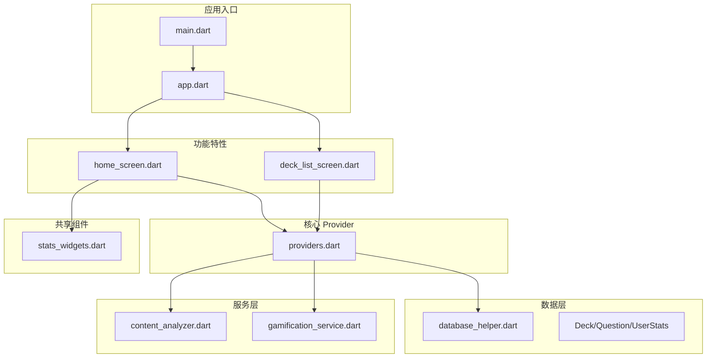
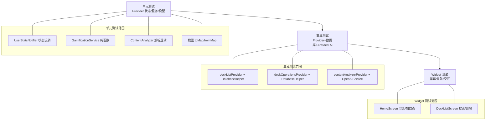
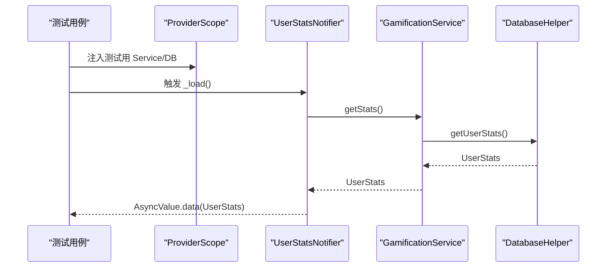
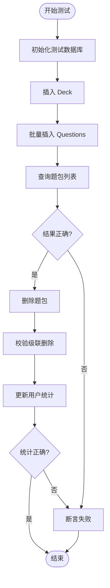
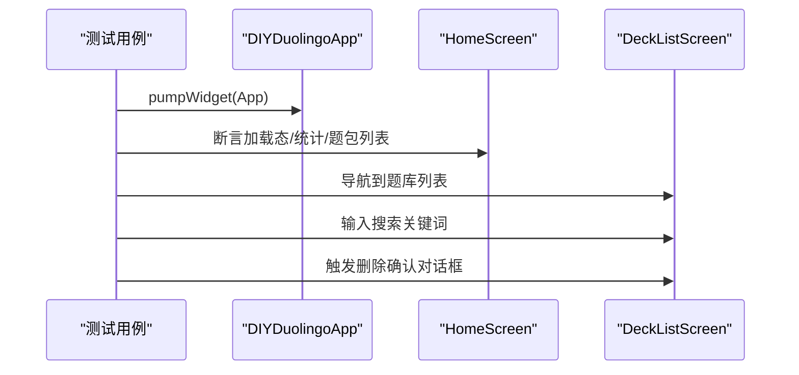
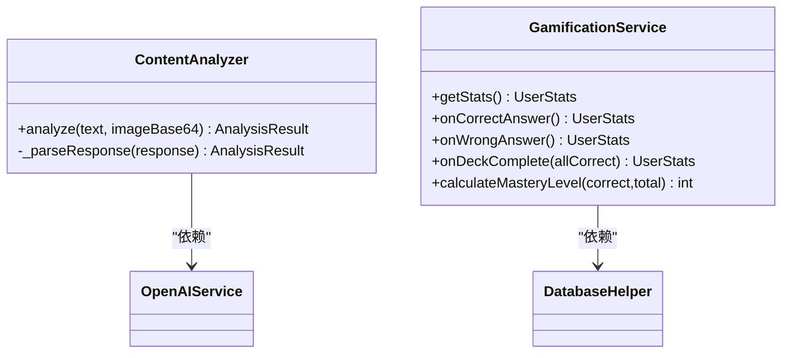
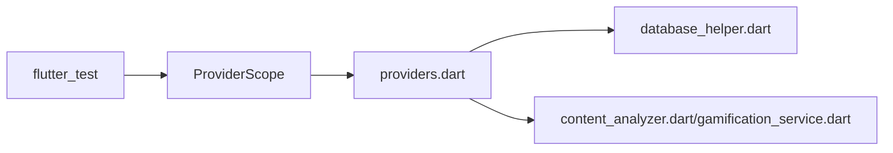

# 测试策略

<cite>
**本文引用的文件**
- [lib/main.dart](file://lib/main.dart)
- [lib/app.dart](file://lib/app.dart)
- [lib/core/providers/providers.dart](file://lib/core/providers/providers.dart)
- [lib/data/database/database_helper.dart](file://lib/data/database/database_helper.dart)
- [lib/data/models/deck.dart](file://lib/data/models/deck.dart)
- [lib/data/models/question.dart](file://lib/data/models/question.dart)
- [lib/data/models/user_stats.dart](file://lib/data/models/user_stats.dart)
- [lib/features/home/home_screen.dart](file://lib/features/home/home_screen.dart)
- [lib/features/deck/deck_list_screen.dart](file://lib/features/deck/deck_list_screen.dart)
- [lib/services/content_analyzer.dart](file://lib/services/content_analyzer.dart)
- [lib/services/gamification_service.dart](file://lib/services/gamification_service.dart)
- [lib/shared/widgets/stats_widgets.dart](file://lib/shared/widgets/stats_widgets.dart)
- [test/widget_test.dart](file://test/widget_test.dart)
- [pubspec.yaml](file://pubspec.yaml)
</cite>

## 目录
1. 引言
2. 项目结构
3. 核心组件
4. 架构总览
5. 详细组件分析
6. 依赖分析
7. 性能考虑
8. 故障排查指南
9. 结论
10. 附录

## 引言
本测试策略文档面向 Dlg-Q 项目，围绕测试金字塔（单元测试、集成测试、Widget 测试）进行系统化设计，重点覆盖：
- Riverpod Provider 的测试方法：状态模拟、异步 Provider 的测试策略
- 数据层测试最佳实践：数据库操作与 Repository 方法的测试覆盖
- 测试驱动开发（TDD）指导：测试用例设计与 Mock 对象使用
- 具体测试示例与持续集成配置建议，确保代码质量与功能稳定

## 项目结构
项目采用按功能域分层的目录组织方式，核心模块如下：
- 应用入口与根组件：lib/main.dart、lib/app.dart
- 核心 Provider 层：lib/core/providers/providers.dart
- 数据层：lib/data/database/database_helper.dart 与数据模型（Deck、Question、UserStats）
- 功能特性：lib/features/home、lib/features/deck 等
- 服务层：lib/services/content_analyzer.dart、lib/services/gamification_service.dart
- 共享 UI 组件：lib/shared/widgets/stats_widgets.dart
- 测试：test/widget_test.dart

**图示来源**
- [lib/main.dart:1-36](file://lib/main.dart#L1-L36)
- [lib/app.dart:1-111](file://lib/app.dart#L1-L111)
- [lib/core/providers/providers.dart:1-178](file://lib/core/providers/providers.dart#L1-L178)
- [lib/data/database/database_helper.dart:1-192](file://lib/data/database/database_helper.dart#L1-L192)
- [lib/features/home/home_screen.dart:1-335](file://lib/features/home/home_screen.dart#L1-L335)
- [lib/features/deck/deck_list_screen.dart:1-314](file://lib/features/deck/deck_list_screen.dart#L1-L314)
- [lib/services/content_analyzer.dart:1-172](file://lib/services/content_analyzer.dart#L1-L172)
- [lib/services/gamification_service.dart:1-116](file://lib/services/gamification_service.dart#L1-L116)
- [lib/shared/widgets/stats_widgets.dart:1-139](file://lib/shared/widgets/stats_widgets.dart#L1-L139)

**章节来源**
- [lib/main.dart:1-36](file://lib/main.dart#L1-L36)
- [lib/app.dart:1-111](file://lib/app.dart#L1-L111)
- [pubspec.yaml:1-34](file://pubspec.yaml#L1-L34)

## 核心组件
- 应用入口与根组件：负责初始化系统 UI 样式、Provider 作用域包裹与主界面导航容器
- Provider 体系：集中管理数据库、AI 分析、游戏化服务以及业务操作（题包 CRUD、学习记录、统计刷新）
- 数据层：SQLite 抽象封装，提供题包、题目、学习记录、用户统计的增删改查
- 服务层：内容分析器（调用 OpenAI）、游戏化服务（XP/心数/连续天数/掌握度）
- 功能特性：首页展示统计与题包路径、题库列表与搜索、删除确认流程
- 共享组件：顶部统计条、答题进度条等

**章节来源**
- [lib/main.dart:1-36](file://lib/main.dart#L1-L36)
- [lib/app.dart:1-111](file://lib/app.dart#L1-L111)
- [lib/core/providers/providers.dart:1-178](file://lib/core/providers/providers.dart#L1-L178)
- [lib/data/database/database_helper.dart:1-192](file://lib/data/database/database_helper.dart#L1-L192)
- [lib/services/content_analyzer.dart:1-172](file://lib/services/content_analyzer.dart#L1-L172)
- [lib/services/gamification_service.dart:1-116](file://lib/services/gamification_service.dart#L1-L116)
- [lib/features/home/home_screen.dart:1-335](file://lib/features/home/home_screen.dart#L1-L335)
- [lib/features/deck/deck_list_screen.dart:1-314](file://lib/features/deck/deck_list_screen.dart#L1-L314)
- [lib/shared/widgets/stats_widgets.dart:1-139](file://lib/shared/widgets/stats_widgets.dart#L1-L139)

## 架构总览
测试金字塔在本项目中的落地要点：
- 单元测试：Provider 状态逻辑、服务层纯函数、数据模型序列化/反序列化
- 集成测试：Provider 与数据库交互、Provider 与外部服务交互（AI 分析）
- Widget 测试：屏幕渲染、导航、交互行为验证

**图示来源**
- [lib/core/providers/providers.dart:32-81](file://lib/core/providers/providers.dart#L32-L81)
- [lib/core/providers/providers.dart:98-177](file://lib/core/providers/providers.dart#L98-L177)
- [lib/data/database/database_helper.dart:104-190](file://lib/data/database/database_helper.dart#L104-L190)
- [lib/services/content_analyzer.dart:108-171](file://lib/services/content_analyzer.dart#L108-L171)
- [lib/services/gamification_service.dart:14-115](file://lib/services/gamification_service.dart#L14-L115)
- [lib/features/home/home_screen.dart:15-57](file://lib/features/home/home_screen.dart#L15-L57)
- [lib/features/deck/deck_list_screen.dart:21-97](file://lib/features/deck/deck_list_screen.dart#L21-L97)

## 详细组件分析

### Riverpod Provider 测试策略
- 状态模拟与异步 Provider
  - 使用 ProviderScope 注入测试用 Provider，替换真实数据库与外部服务为可控制的 Mock
  - 对 FutureProvider：通过提前注入 AsyncValue（loading/data/error）验证 UI 分支
  - 对 StateNotifierProvider：直接构造 Notifier 实例，调用方法后断言状态变化
- 示例参考
  - 用户统计 Provider 的加载、成功与错误分支
  - 题包列表 Provider 的加载与空数据分支
  - 题包操作 Provider 的保存与删除流程

**图示来源**
- [lib/core/providers/providers.dart:38-81](file://lib/core/providers/providers.dart#L38-L81)
- [lib/services/gamification_service.dart:14-28](file://lib/services/gamification_service.dart#L14-L28)
- [lib/data/database/database_helper.dart:178-190](file://lib/data/database/database_helper.dart#L178-L190)

**章节来源**
- [lib/core/providers/providers.dart:32-81](file://lib/core/providers/providers.dart#L32-L81)
- [lib/core/providers/providers.dart:98-177](file://lib/core/providers/providers.dart#L98-L177)

### 数据层测试最佳实践
- 数据库操作测试
  - 使用内存数据库或临时数据库路径，避免污染本地环境
  - 覆盖插入、查询、更新、删除的正向与边界场景
  - 验证外键约束与级联删除行为
- Repository 方法测试
  - 将数据库 Helper 作为依赖注入，便于替换为 Mock
  - 验证返回值映射（toMap/fromMap）与空值处理
- 示例参考
  - 插入题包与题目、查询列表、删除题包级联清理
  - 用户统计读取与更新

**图示来源**
- [lib/data/database/database_helper.dart:104-190](file://lib/data/database/database_helper.dart#L104-L190)
- [lib/data/models/deck.dart:45-70](file://lib/data/models/deck.dart#L45-L70)
- [lib/data/models/question.dart:28-54](file://lib/data/models/question.dart#L28-L54)
- [lib/data/models/user_stats.dart:41-65](file://lib/data/models/user_stats.dart#L41-L65)

**章节来源**
- [lib/data/database/database_helper.dart:1-192](file://lib/data/database/database_helper.dart#L1-L192)
- [lib/data/models/deck.dart:1-71](file://lib/data/models/deck.dart#L1-L71)
- [lib/data/models/question.dart:1-76](file://lib/data/models/question.dart#L1-L76)
- [lib/data/models/user_stats.dart:1-83](file://lib/data/models/user_stats.dart#L1-L83)

### Widget 测试策略
- 屏幕渲染与交互
  - 使用 WidgetTester 渲染根组件，验证初始 UI 与导航元素存在
  - 验证异步加载态（CircularProgressIndicator）与错误提示
  - 验证导航到子页面的行为
- 示例参考
  - 应用启动烟雾测试，验证底部标签页标题可见
  - 题库列表搜索与删除确认对话框触发

**图示来源**
- [test/widget_test.dart:1-11](file://test/widget_test.dart#L1-L11)
- [lib/features/home/home_screen.dart:15-57](file://lib/features/home/home_screen.dart#L15-L57)
- [lib/features/deck/deck_list_screen.dart:21-97](file://lib/features/deck/deck_list_screen.dart#L21-L97)

**章节来源**
- [test/widget_test.dart:1-11](file://test/widget_test.dart#L1-L11)
- [lib/features/home/home_screen.dart:1-335](file://lib/features/home/home_screen.dart#L1-L335)
- [lib/features/deck/deck_list_screen.dart:1-314](file://lib/features/deck/deck_list_screen.dart#L1-L314)

### 服务层测试策略
- 内容分析器
  - 模拟 OpenAI 返回不同格式响应，验证解析健壮性（JSON 提取、异常处理）
  - 验证生成题目数量与类型多样性
- 游戏化服务
  - 验证每日重置逻辑、连续天数计算、心数扣减与恢复
  - 验证掌握度计算与 XP 奖励规则

**图示来源**
- [lib/services/content_analyzer.dart:108-171](file://lib/services/content_analyzer.dart#L108-L171)
- [lib/services/gamification_service.dart:14-115](file://lib/services/gamification_service.dart#L14-L115)

**章节来源**
- [lib/services/content_analyzer.dart:1-172](file://lib/services/content_analyzer.dart#L1-L172)
- [lib/services/gamification_service.dart:1-116](file://lib/services/gamification_service.dart#L1-L116)

## 依赖分析
- 外部依赖与测试相关性
  - flutter_test：Widget 测试框架
  - flutter_riverpod：Provider 测试需要 ProviderScope
  - sqflite/path_provider：数据库测试需隔离数据库文件
- 依赖耦合与测试友好性
  - Provider 将数据库与服务抽象为可注入依赖，利于 Mock
  - 服务层与数据层通过接口清晰分离，便于单元测试

**图示来源**
- [pubspec.yaml:24-27](file://pubspec.yaml#L24-L27)
- [lib/core/providers/providers.dart:1-178](file://lib/core/providers/providers.dart#L1-L178)

**章节来源**
- [pubspec.yaml:1-34](file://pubspec.yaml#L1-L34)

## 性能考虑
- 测试执行性能
  - 使用内存数据库或临时文件，避免磁盘 IO 开销
  - 合理使用 Future/async 测试，避免不必要的等待
- Provider 测试性能
  - 通过 ProviderScope 注入轻量 Mock，减少真实网络请求
  - 对高频调用的 Provider 使用缓存策略（如本地缓存）以降低测试时间

## 故障排查指南
- Provider 状态未更新
  - 检查 Notifier 是否正确抛出 AsyncValue.error 并在测试中断言
  - 确认 ProviderScope 注入的依赖返回预期结果
- 数据库测试失败
  - 确认数据库初始化脚本已执行（表结构、默认数据）
  - 校验 toMap/fromMap 映射一致性
- Widget 测试不稳定
  - 使用 pumpAndSettle 等待动画/加载完成
  - 避免依赖随机性，必要时固定时间戳

**章节来源**
- [lib/core/providers/providers.dart:49-81](file://lib/core/providers/providers.dart#L49-L81)
- [lib/data/database/database_helper.dart:32-100](file://lib/data/database/database_helper.dart#L32-L100)
- [test/widget_test.dart:5-10](file://test/widget_test.dart#L5-L10)

## 结论
本测试策略以测试金字塔为核心，结合 Riverpod 的可测试性与数据层的清晰职责，构建了从单元到 Widget 的完整测试体系。通过 ProviderScope 注入 Mock、数据库隔离与服务层纯函数化改造，能够高效、稳定地验证核心业务逻辑与用户交互。

## 附录
- 持续集成配置建议
  - 在 CI 中运行 flutter test，启用 --coverage 生成覆盖率报告
  - 使用临时数据库路径，避免并发写冲突
  - 对关键 Provider 与服务编写独立的单元测试套件，保证回归质量