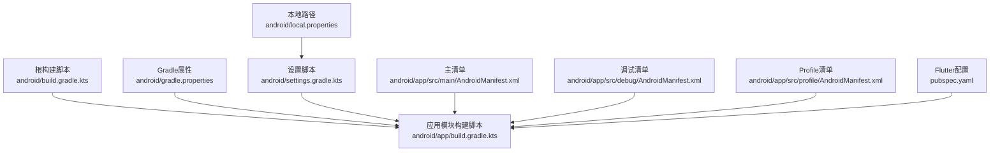
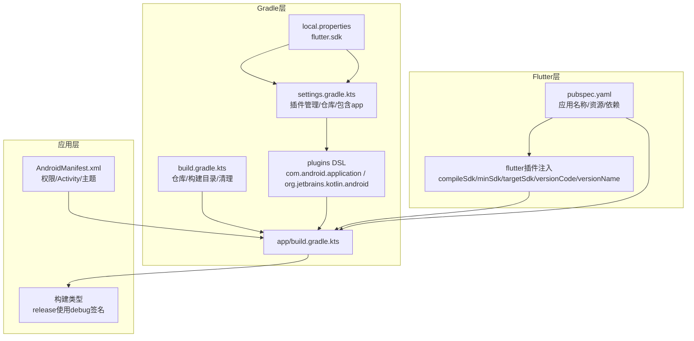
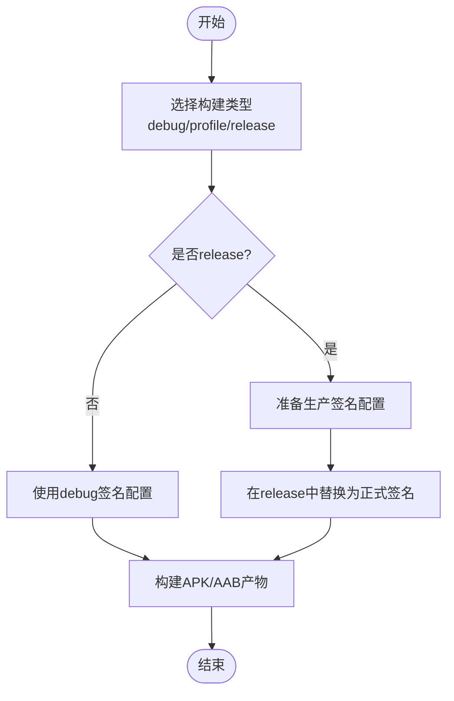
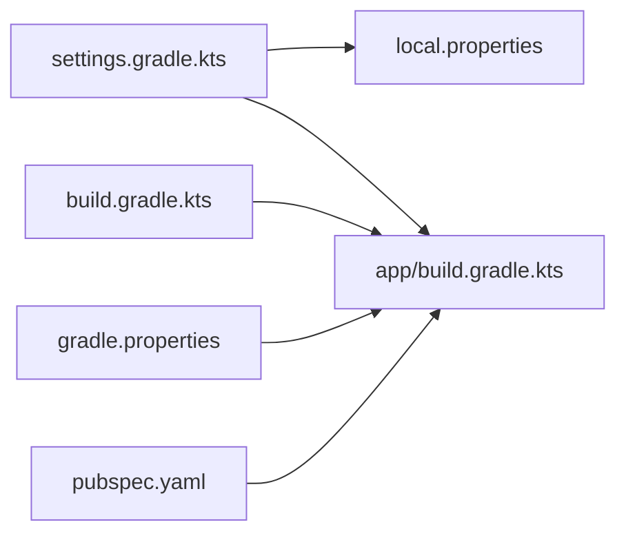

# Android部署

<cite>
**本文引用的文件**
- [android/build.gradle.kts](file://android/build.gradle.kts)
- [android/app/build.gradle.kts](file://android/app/build.gradle.kts)
- [android/gradle.properties](file://android/gradle.properties)
- [android/local.properties](file://android/local.properties)
- [android/settings.gradle.kts](file://android/settings.gradle.kts)
- [android/app/src/main/AndroidManifest.xml](file://android/app/src/main/AndroidManifest.xml)
- [android/app/src/debug/AndroidManifest.xml](file://android/app/src/debug/AndroidManifest.xml)
- [android/app/src/profile/AndroidManifest.xml](file://android/app/src/profile/AndroidManifest.xml)
- [pubspec.yaml](file://pubspec.yaml)
</cite>

## 目录
1. [简介](#简介)
2. [项目结构](#项目结构)
3. [核心组件](#核心组件)
4. [架构总览](#架构总览)
5. [详细组件分析](#详细组件分析)
6. [依赖分析](#依赖分析)
7. [性能考虑](#性能考虑)
8. [故障排查指南](#故障排查指南)
9. [结论](#结论)
10. [附录](#附录)

## 简介
本指南面向Dlg-Q项目的Android平台部署，覆盖从开发机环境准备、Gradle与Flutter集成配置、签名证书创建与配置、构建类型（Debug/Profile/Release）差异、代码混淆与资源压缩、APK/AAB产物生成到应用商店发布的全流程。文档严格基于仓库中的实际配置文件进行说明，帮助团队在不改变现有工程约定的前提下完成稳定可靠的发布。

## 项目结构
Android子工程采用标准Flutter工程布局，核心目录与文件如下：
- 根级Gradle脚本：统一仓库源与构建目录，集中清理任务
- 应用模块Gradle脚本：声明Android编译参数、默认配置、构建类型与Flutter集成
- Gradle属性：JVM内存、AndroidX开关、DSL与Kotlin内置策略
- 本地路径：指向Flutter SDK位置
- 设置脚本：插件管理、仓库源、包含应用模块
- 清单文件：主清单、调试与Profile清单
- Flutter配置：应用名称、资源清单等

图表来源
- [android/build.gradle.kts:1-25](file://android/build.gradle.kts#L1-L25)
- [android/app/build.gradle.kts:1-46](file://android/app/build.gradle.kts#L1-L46)
- [android/gradle.properties:1-7](file://android/gradle.properties#L1-L7)
- [android/local.properties:1-1](file://android/local.properties#L1-L1)
- [android/settings.gradle.kts:1-27](file://android/settings.gradle.kts#L1-L27)
- [android/app/src/main/AndroidManifest.xml:1-65](file://android/app/src/main/AndroidManifest.xml#L1-L65)
- [android/app/src/debug/AndroidManifest.xml:1-8](file://android/app/src/debug/AndroidManifest.xml#L1-L8)
- [android/app/src/profile/AndroidManifest.xml:1-8](file://android/app/src/profile/AndroidManifest.xml#L1-L8)
- [pubspec.yaml:1-34](file://pubspec.yaml#L1-L34)

章节来源
- [android/build.gradle.kts:1-25](file://android/build.gradle.kts#L1-L25)
- [android/app/build.gradle.kts:1-46](file://android/app/build.gradle.kts#L1-L46)
- [android/gradle.properties:1-7](file://android/gradle.properties#L1-L7)
- [android/local.properties:1-1](file://android/local.properties#L1-L1)
- [android/settings.gradle.kts:1-27](file://android/settings.gradle.kts#L1-L27)
- [android/app/src/main/AndroidManifest.xml:1-65](file://android/app/src/main/AndroidManifest.xml#L1-L65)
- [android/app/src/debug/AndroidManifest.xml:1-8](file://android/app/src/debug/AndroidManifest.xml#L1-L8)
- [android/app/src/profile/AndroidManifest.xml:1-8](file://android/app/src/profile/AndroidManifest.xml#L1-L8)
- [pubspec.yaml:1-34](file://pubspec.yaml#L1-L34)

## 核心组件
- 构建系统与仓库源
  - 根级构建脚本统一配置Google与Maven Central仓库，并将构建输出目录调整至项目根目录下的统一位置；同时为子项目设置独立构建目录并确保对应用模块的评估依赖。
- 应用模块配置
  - 命名空间、compileSdk、ndkVersion由Flutter插件注入；Java/Kotlin编译目标均为17；默认配置包含应用ID、最小/目标SDK、版本号与版本名；构建类型中release默认使用debug签名配置以便直接运行release变种。
- Gradle属性
  - 启用AndroidX，设置较大的JVM堆与元空间，保留代码缓存大小，开启OOM堆转储；关闭新DSL与内置Kotlin策略以兼容模板。
- 本地路径与插件管理
  - 通过local.properties读取Flutter SDK路径，settings脚本引入Flutter工具链并声明插件版本与仓库源，包含应用模块。
- 清单与权限
  - 主清单声明应用标签、图标、Activity导出状态、硬件加速、主题与Intent Filters；调试与Profile清单仅声明网络权限以支持热重载与断点。

章节来源
- [android/build.gradle.kts:1-25](file://android/build.gradle.kts#L1-L25)
- [android/app/build.gradle.kts:1-46](file://android/app/build.gradle.kts#L1-L46)
- [android/gradle.properties:1-7](file://android/gradle.properties#L1-L7)
- [android/local.properties:1-1](file://android/local.properties#L1-L1)
- [android/settings.gradle.kts:1-27](file://android/settings.gradle.kts#L1-L27)
- [android/app/src/main/AndroidManifest.xml:1-65](file://android/app/src/main/AndroidManifest.xml#L1-L65)
- [android/app/src/debug/AndroidManifest.xml:1-8](file://android/app/src/debug/AndroidManifest.xml#L1-L8)
- [android/app/src/profile/AndroidManifest.xml:1-8](file://android/app/src/profile/AndroidManifest.xml#L1-L8)

## 架构总览
下图展示Android构建与Flutter集成的关键交互关系，包括Gradle插件加载、Flutter SDK路径解析、Flutter插件注入的编译参数，以及应用模块的构建类型与签名配置。

图表来源
- [android/settings.gradle.kts:1-27](file://android/settings.gradle.kts#L1-L27)
- [android/local.properties:1-1](file://android/local.properties#L1-L1)
- [android/build.gradle.kts:1-25](file://android/build.gradle.kts#L1-L25)
- [android/app/build.gradle.kts:1-46](file://android/app/build.gradle.kts#L1-L46)
- [android/app/src/main/AndroidManifest.xml:1-65](file://android/app/src/main/AndroidManifest.xml#L1-L65)
- [pubspec.yaml:1-34](file://pubspec.yaml#L1-L34)

## 详细组件分析

### 构建类型与签名配置
- Debug/Profile/Release
  - 当前release构建类型显式指定使用debug签名配置，便于直接运行release变种；生产发布前需替换为正式签名配置。
- 签名证书创建与配置
  - 使用Android Gradle插件的标准签名配置机制，在release构建类型中添加或替换签名块，并在CI/CD中安全存储密钥库与密码。
- 混淆与资源压缩
  - 仓库未启用R8/ProGuard混淆与资源压缩；如需启用，请在应用模块中新增混淆规则文件并在构建类型中开启相应选项。
- APK与AAB产物
  - 可通过命令生成APK（调试/发布）与AAB（用于Google Play分发），具体命令与参数根据团队流水线配置。

图表来源
- [android/app/build.gradle.kts:28-34](file://android/app/build.gradle.kts#L28-L34)

章节来源
- [android/app/build.gradle.kts:28-34](file://android/app/build.gradle.kts#L28-L34)

### 清单与权限
- 主清单
  - 声明应用标签、图标、MainActivity导出状态、硬件加速、主题与多条Intent Filters（启动器、接收分享文本/图片/多图）。
- 调试与Profile清单
  - 仅声明网络权限，满足开发期热重载与断点需求。
- 权限建议
  - 如需后台运行、存储访问、相机等能力，请在主清单中按需增加对应权限，并遵循最小化原则与用户告知义务。

章节来源
- [android/app/src/main/AndroidManifest.xml:1-65](file://android/app/src/main/AndroidManifest.xml#L1-L65)
- [android/app/src/debug/AndroidManifest.xml:1-8](file://android/app/src/debug/AndroidManifest.xml#L1-L8)
- [android/app/src/profile/AndroidManifest.xml:1-8](file://android/app/src/profile/AndroidManifest.xml#L1-L8)

### Flutter与Gradle集成
- 插件注入参数
  - compileSdk、minSdk、targetSdk、versionCode、versionName均由Flutter插件从pubspec.yaml与Flutter SDK注入，避免手工维护不一致。
- SDK路径解析
  - settings脚本读取local.properties中的flutter.sdk，确保Gradle能正确加载Flutter工具链与插件。

章节来源
- [android/app/build.gradle.kts:43-45](file://android/app/build.gradle.kts#L43-L45)
- [android/settings.gradle.kts:1-18](file://android/settings.gradle.kts#L1-L18)
- [android/local.properties:1-1](file://android/local.properties#L1-L1)
- [pubspec.yaml:1-34](file://pubspec.yaml#L1-L34)

### 构建参数与环境变量
- JVM与AndroidX
  - gradle.properties设置较大的JVM内存与元空间，启用AndroidX；关闭新DSL与内置Kotlin策略以匹配模板。
- 版本与命名
  - 应用ID、版本号与版本名由Flutter插件注入；命名空间与编译目标在应用模块中显式声明。

章节来源
- [android/gradle.properties:1-7](file://android/gradle.properties#L1-L7)
- [android/app/build.gradle.kts:7-26](file://android/app/build.gradle.kts#L7-L26)
- [android/app/build.gradle.kts:43-45](file://android/app/build.gradle.kts#L43-L45)

## 依赖分析
- 组件耦合
  - 应用模块对Flutter插件注入的编译参数存在隐式依赖；settings脚本对local.properties存在显式依赖；根构建脚本对子项目有统一构建目录与清理依赖。
- 外部依赖
  - Google与Maven Central仓库源在根构建脚本与插件管理处统一声明；Flutter工具链通过settings脚本包含。

图表来源
- [android/settings.gradle.kts:1-27](file://android/settings.gradle.kts#L1-L27)
- [android/local.properties:1-1](file://android/local.properties#L1-L1)
- [android/app/build.gradle.kts:1-46](file://android/app/build.gradle.kts#L1-L46)
- [android/build.gradle.kts:1-25](file://android/build.gradle.kts#L1-L25)
- [android/gradle.properties:1-7](file://android/gradle.properties#L1-L7)
- [pubspec.yaml:1-34](file://pubspec.yaml#L1-L34)

章节来源
- [android/settings.gradle.kts:1-27](file://android/settings.gradle.kts#L1-L27)
- [android/local.properties:1-1](file://android/local.properties#L1-L1)
- [android/app/build.gradle.kts:1-46](file://android/app/build.gradle.kts#L1-L46)
- [android/build.gradle.kts:1-25](file://android/build.gradle.kts#L1-L25)
- [android/gradle.properties:1-7](file://android/gradle.properties#L1-L7)
- [pubspec.yaml:1-34](file://pubspec.yaml#L1-L34)

## 性能考虑
- 构建性能
  - gradle.properties已设置较大JVM堆与元空间，有助于大型工程编译稳定性；可结合CI/CD缓存策略进一步提升速度。
- 运行时性能
  - 已启用硬件加速与合适的主题配置；如需进一步优化，可在发布前启用资源压缩与代码混淆（见后续章节）。

## 故障排查指南
- 无法找到Flutter SDK
  - 检查local.properties中的flutter.sdk路径是否正确，确保settings脚本能成功读取。
- 无法加载Flutter插件
  - 确认settings脚本已包含Flutter工具链构建脚本，并且仓库源包含google与mavenCentral。
- release无法签名
  - 当前release使用debug签名配置；请在release构建类型中替换为正式签名配置，并在CI/CD中安全注入密钥库与密码。
- 清理构建失败
  - 根构建脚本提供了统一的clean任务，删除根构建目录；若失败，请确认无进程占用构建目录。

章节来源
- [android/local.properties:1-1](file://android/local.properties#L1-L1)
- [android/settings.gradle.kts:1-27](file://android/settings.gradle.kts#L1-L27)
- [android/build.gradle.kts:22-24](file://android/build.gradle.kts#L22-L24)
- [android/app/build.gradle.kts:28-34](file://android/app/build.gradle.kts#L28-L34)

## 结论
本指南基于仓库现有配置，明确了Android端的构建入口、Flutter集成方式、清单与权限、以及release签名与产物生成路径。建议在正式发布前完成以下事项：
- 替换release签名配置为正式证书
- 在应用模块中启用混淆与资源压缩
- 生成并验证APK与AAB产物
- 准备应用商店所需的元数据与截图

## 附录

### A. 构建与发布流程（概要）
- 开发机准备
  - 安装Android Studio与Android SDK/NDK，确保Gradle与JDK版本符合要求。
- 获取与配置
  - 克隆仓库后，确认local.properties中的Flutter SDK路径正确。
- 本地构建
  - 使用Flutter命令生成APK（调试/发布）与AAB（发布）。
- 签名与混淆
  - 在release构建类型中配置正式签名；在应用模块中启用混淆与资源压缩。
- 应用商店发布
  - 在Google Play Console创建应用，上传AAB，填写元数据与截图，完成审核与上架。

### B. 调试与发布版本差异
- 清单差异
  - 调试与Profile清单仅包含网络权限；主清单包含应用标签、图标、Activity与Intent Filters。
- 构建类型差异
  - 当前release使用debug签名配置；发布版本应使用正式签名配置。
- 功能与日志
  - 调试版本通常包含更多诊断与日志输出；发布版本应关闭冗余日志并启用混淆。

章节来源
- [android/app/src/main/AndroidManifest.xml:1-65](file://android/app/src/main/AndroidManifest.xml#L1-L65)
- [android/app/src/debug/AndroidManifest.xml:1-8](file://android/app/src/debug/AndroidManifest.xml#L1-L8)
- [android/app/src/profile/AndroidManifest.xml:1-8](file://android/app/src/profile/AndroidManifest.xml#L1-L8)
- [android/app/build.gradle.kts:28-34](file://android/app/build.gradle.kts#L28-L34)