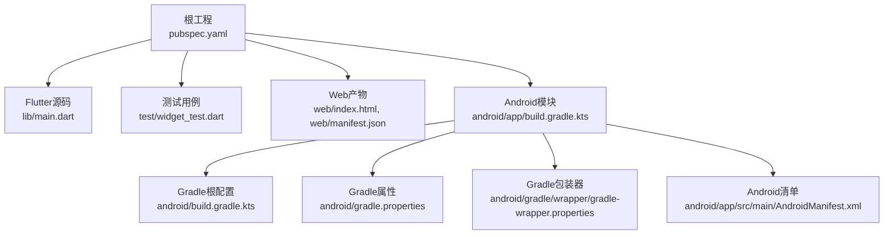
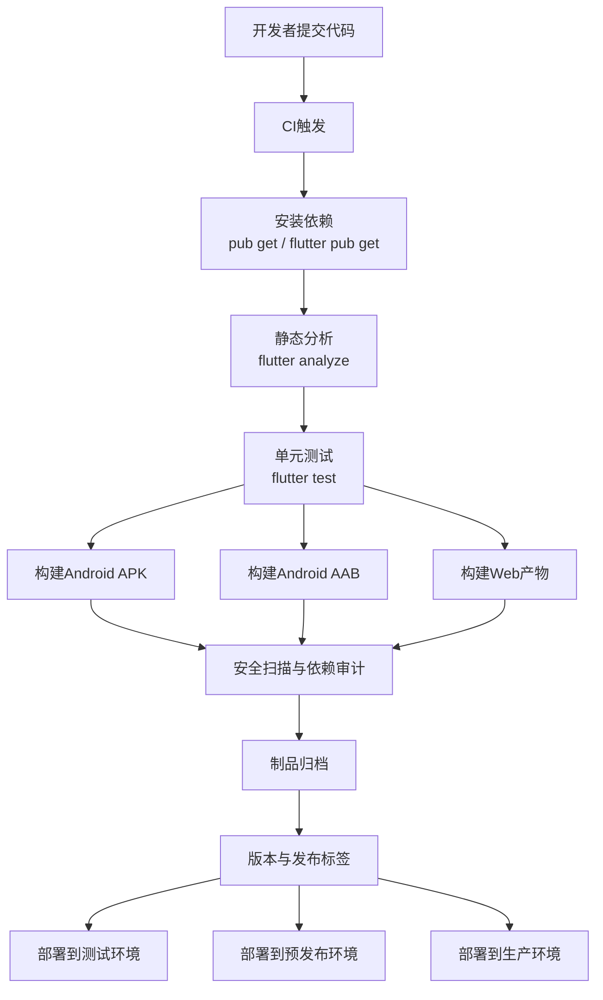
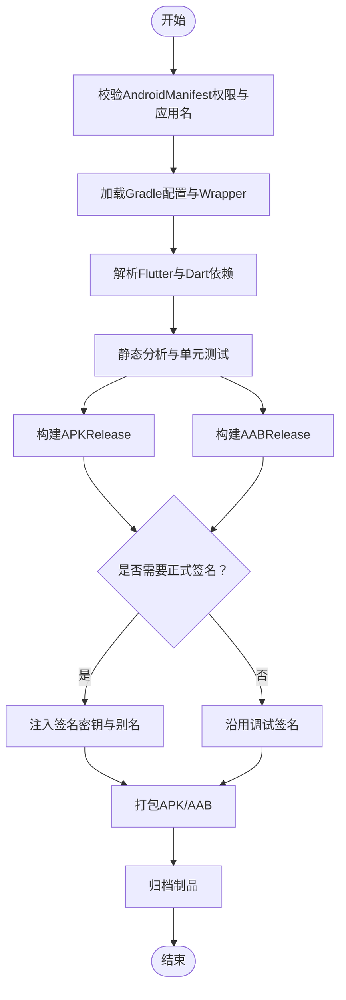
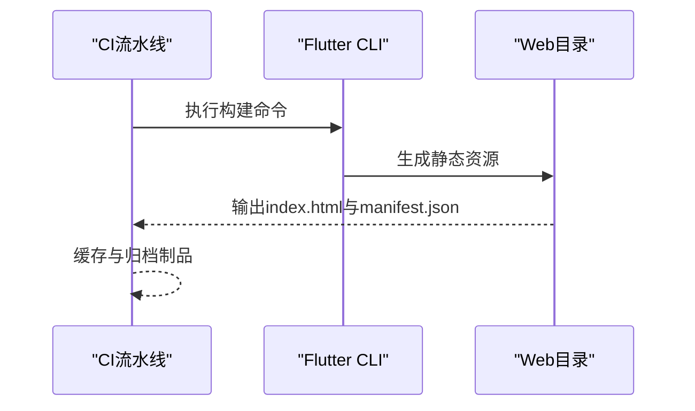
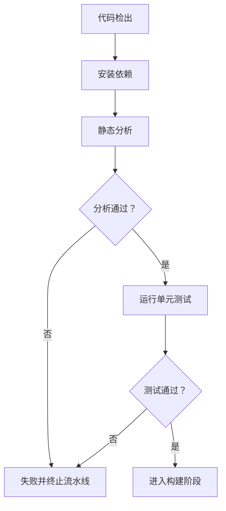
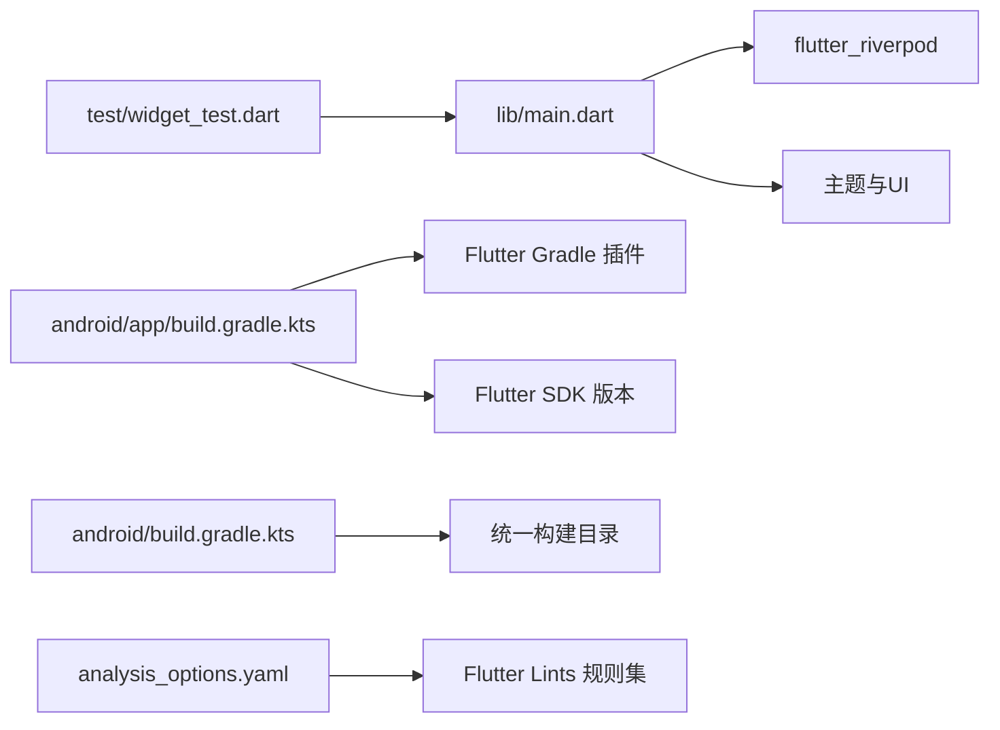

# CI/CD流水线

<cite>
**本文引用的文件**
- [pubspec.yaml](file://pubspec.yaml)
- [analysis_options.yaml](file://analysis_options.yaml)
- [README.md](file://README.md)
- [.gitignore](file://.gitignore)
- [lib/main.dart](file://lib/main.dart)
- [test/widget_test.dart](file://test/widget_test.dart)
- [web/index.html](file://web/index.html)
- [web/manifest.json](file://web/manifest.json)
- [android/app/build.gradle.kts](file://android/app/build.gradle.kts)
- [android/build.gradle.kts](file://android/build.gradle.kts)
- [android/gradle/wrapper/gradle-wrapper.properties](file://android/gradle/wrapper/gradle-wrapper.properties)
- [android/gradle.properties](file://android/gradle.properties)
- [android/local.properties](file://android/local.properties)
- [android/app/src/main/AndroidManifest.xml](file://android/app/src/main/AndroidManifest.xml)
- [android/app/src/profile/AndroidManifest.xml](file://android/app/src/profile/AndroidManifest.xml)
- [android/.gitignore](file://android/.gitignore)
</cite>

## 目录
1. [简介](#简介)
2. [项目结构](#项目结构)
3. [核心组件](#核心组件)
4. [架构总览](#架构总览)
5. [详细组件分析](#详细组件分析)
6. [依赖关系分析](#依赖关系分析)
7. [性能考量](#性能考量)
8. [故障排查指南](#故障排查指南)
9. [结论](#结论)
10. [附录](#附录)

## 简介
本指南面向Dlg-Q项目的持续集成与持续交付（CI/CD）流水线配置，覆盖以下目标：
- 自动化构建与测试：Android APK/AAB、Web应用
- 质量门禁：静态分析、代码规范检查
- 安全扫描与依赖审计
- 版本管理与发布自动化：语义化版本、变更日志、发布标签
- 多环境部署策略：测试、预发布、生产；权限与密钥管理

本指南同时给出GitHub Actions与GitLab CI的配置思路与最佳实践，帮助团队在不同CI平台上快速落地。

## 项目结构
Dlg-Q为Flutter应用，采用“根工程 + Android子模块 + Web输出”的典型结构。关键目录与文件如下：
- 根工程配置：pubspec.yaml、analysis_options.yaml、README.md、.gitignore
- Flutter源码：lib/main.dart、lib/app.dart等
- 测试：test/widget_test.dart
- Android模块：android/app/build.gradle.kts、android/build.gradle.kts、AndroidManifest.xml、gradle配置
- Web产物：web/index.html、web/manifest.json
- 构建缓存与忽略：.gitignore、android/.gitignore

图示来源
- [pubspec.yaml:1-34](file://pubspec.yaml#L1-L34)
- [lib/main.dart:1-36](file://lib/main.dart#L1-L36)
- [test/widget_test.dart:1-11](file://test/widget_test.dart#L1-L11)
- [web/index.html:1-47](file://web/index.html#L1-L47)
- [web/manifest.json:1-36](file://web/manifest.json#L1-L36)
- [android/app/build.gradle.kts:1-46](file://android/app/build.gradle.kts#L1-L46)
- [android/build.gradle.kts:1-25](file://android/build.gradle.kts#L1-L25)
- [android/gradle.properties:1-6](file://android/gradle.properties#L1-L6)
- [android/gradle/wrapper/gradle-wrapper.properties:1-5](file://android/gradle/wrapper/gradle-wrapper.properties#L1-L5)
- [android/app/src/main/AndroidManifest.xml:1-27](file://android/app/src/main/AndroidManifest.xml#L1-L27)

章节来源
- [pubspec.yaml:1-34](file://pubspec.yaml#L1-L34)
- [.gitignore:1-45](file://.gitignore#L1-L45)
- [android/.gitignore:1-14](file://android/.gitignore#L1-L14)

## 核心组件
- Flutter应用入口与主题：lib/main.dart定义了MaterialApp与Provider作用域，作为UI启动点。
- 测试套件：test/widget_test.dart包含Smoke测试，验证应用启动与基础界面元素。
- 分析规则：analysis_options.yaml启用Flutter推荐lint集合，确保代码风格与潜在问题的早期发现。
- 版本与依赖：pubspec.yaml声明版本号、SDK约束与依赖项，用于CI中依赖锁定与构建一致性。
- Android构建：android/app/build.gradle.kts定义命名空间、编译与签名策略；android/build.gradle.kts统一构建目录与清理任务。
- Web产物：web/index.html与web/manifest.json为PWA元数据与入口页面，用于flutter build web产物。

章节来源
- [lib/main.dart:1-36](file://lib/main.dart#L1-L36)
- [test/widget_test.dart:1-11](file://test/widget_test.dart#L1-L11)
- [analysis_options.yaml:1-29](file://analysis_options.yaml#L1-L29)
- [pubspec.yaml:1-34](file://pubspec.yaml#L1-L34)
- [android/app/build.gradle.kts:1-46](file://android/app/build.gradle.kts#L1-L46)
- [android/build.gradle.kts:1-25](file://android/build.gradle.kts#L1-L25)
- [web/index.html:1-47](file://web/index.html#L1-L47)
- [web/manifest.json:1-36](file://web/manifest.json#L1-L36)

## 架构总览
下图展示CI流水线的关键阶段与工件流转：代码检出 → 依赖安装 → 静态分析与单元测试 → 平台构建（Android/APK、Android/AAB、Web）→ 安全扫描与制品归档 → 发布与部署。

## 详细组件分析

### Android构建流水线（APK/AAB）
- 构建类型：release使用调试签名配置以保证flutter run --release可用；如需正式发布，建议在CI中注入签名密钥并切换到正式签名配置。
- JDK与编译：compileSdk、targetSdk、minSdk来自Flutter SDK版本；Java/Kotlin编译目标为JDK 17。
- Gradle配置：统一构建目录、清理任务、Gradle Wrapper版本固定，确保跨平台一致性。
- 清单与权限：AndroidManifest.xml声明网络权限与主Activity；profile清单用于开发调试。

图示来源
- [android/app/build.gradle.kts:1-46](file://android/app/build.gradle.kts#L1-L46)
- [android/build.gradle.kts:1-25](file://android/build.gradle.kts#L1-L25)
- [android/gradle/wrapper/gradle-wrapper.properties:1-5](file://android/gradle/wrapper/gradle-wrapper.properties#L1-L5)
- [android/app/src/main/AndroidManifest.xml:1-27](file://android/app/src/main/AndroidManifest.xml#L1-L27)
- [android/app/src/profile/AndroidManifest.xml:1-7](file://android/app/src/profile/AndroidManifest.xml#L1-L7)

章节来源
- [android/app/build.gradle.kts:1-46](file://android/app/build.gradle.kts#L1-L46)
- [android/build.gradle.kts:1-25](file://android/build.gradle.kts#L1-L25)
- [android/gradle.properties:1-6](file://android/gradle.properties#L1-L6)
- [android/gradle/wrapper/gradle-wrapper.properties:1-5](file://android/gradle/wrapper/gradle-wrapper.properties#L1-L5)
- [android/app/src/main/AndroidManifest.xml:1-27](file://android/app/src/main/AndroidManifest.xml#L1-L27)
- [android/app/src/profile/AndroidManifest.xml:1-7](file://android/app/src/profile/AndroidManifest.xml#L1-L7)

### Web构建与PWA
- 入口页与清单：web/index.html与web/manifest.json提供PWA元信息与图标资源路径。
- 构建命令：通过flutter build web生成静态资源，配合CI进行缓存与归档。
- 基础路径：index.html中的$FLUTTER_BASE_HREF可由构建参数传入，适配非根路径部署场景。

图示来源
- [web/index.html:1-47](file://web/index.html#L1-L47)
- [web/manifest.json:1-36](file://web/manifest.json#L1-L36)

章节来源
- [web/index.html:1-47](file://web/index.html#L1-L47)
- [web/manifest.json:1-36](file://web/manifest.json#L1-L36)

### 质量门禁与测试
- 静态分析：基于analysis_options.yaml启用Flutter推荐lint集合，CI中执行flutter analyze。
- 单元测试：test/widget_test.dart提供Smoke测试，验证应用启动与关键UI元素存在性。
- 依赖锁定：pubspec.lock确保依赖版本一致，CI中使用flutter pub get或pub get安装依赖。

图示来源
- [analysis_options.yaml:1-29](file://analysis_options.yaml#L1-L29)
- [test/widget_test.dart:1-11](file://test/widget_test.dart#L1-L11)
- [pubspec.yaml:1-34](file://pubspec.yaml#L1-L34)

章节来源
- [analysis_options.yaml:1-29](file://analysis_options.yaml#L1-L29)
- [test/widget_test.dart:1-11](file://test/widget_test.dart#L1-L11)
- [pubspec.yaml:1-34](file://pubspec.yaml#L1-L34)

### 安全扫描与依赖审计
- 依赖审计：建议在CI中集成第三方依赖扫描工具（如OSV、npm audit、pip-audit等），针对Dart/Flutter与Android依赖进行漏洞扫描。
- 密钥与机密：Android签名密钥、发布令牌等敏感信息应通过CI机密管理，避免硬编码在配置文件中。
- 供应链安全：结合pubspec.lock与Gradle依赖树，定期更新并审查高危依赖。

（本节为通用指导，不直接分析具体文件）

### 版本管理与发布自动化
- 版本号：pubspec.yaml中version字段遵循语义化版本格式（主.次.补丁+构建号）。建议在CI中根据分支策略或提交信息自动提升版本。
- 变更日志：建议在PR合并时要求更新CHANGELOG或使用工具自动生成变更记录。
- 发布标签：CI在成功构建后打上对应版本标签（vX.Y.Z），并创建对应发布版本（Artifacts）。
- 语义化版本策略：master/main分支默认发布稳定版；hotfix分支用于紧急修复并回滚至稳定标签。

章节来源
- [pubspec.yaml:1-34](file://pubspec.yaml#L1-L34)

### 多环境部署策略与权限控制
- 测试环境：使用最小权限账号与沙盒密钥，自动部署Web与Android APK供内部测试。
- 预发布环境：限制访问范围，仅允许授权人员触发部署；制品需通过自动化测试与安全扫描。
- 生产环境：强制双人审批与只读部署；Android AAB使用正式签名，密钥由授权Vault/Secret管理。
- 权限控制：CI中区分角色（开发者、测试、运维、安全审核），通过分支保护与部署保护规则限制操作。

（本节为通用指导，不直接分析具体文件）

## 依赖关系分析
- 应用入口依赖：lib/main.dart依赖Riverpod、主题与应用组件，作为UI启动点。
- 测试依赖：test/widget_test.dart依赖main.dart与Flutter测试框架。
- 构建依赖：android/app/build.gradle.kts依赖Flutter Gradle插件与Flutter SDK版本；android/build.gradle.kts统一构建目录。
- 分析依赖：analysis_options.yaml依赖Flutter Lints包。

图示来源
- [lib/main.dart:1-36](file://lib/main.dart#L1-L36)
- [test/widget_test.dart:1-11](file://test/widget_test.dart#L1-L11)
- [android/app/build.gradle.kts:1-46](file://android/app/build.gradle.kts#L1-L46)
- [android/build.gradle.kts:1-25](file://android/build.gradle.kts#L1-L25)
- [analysis_options.yaml:1-29](file://analysis_options.yaml#L1-L29)
- [pubspec.yaml:1-34](file://pubspec.yaml#L1-L34)

章节来源
- [lib/main.dart:1-36](file://lib/main.dart#L1-L36)
- [test/widget_test.dart:1-11](file://test/widget_test.dart#L1-L11)
- [android/app/build.gradle.kts:1-46](file://android/app/build.gradle.kts#L1-L46)
- [android/build.gradle.kts:1-25](file://android/build.gradle.kts#L1-L25)
- [analysis_options.yaml:1-29](file://analysis_options.yaml#L1-L29)
- [pubspec.yaml:1-34](file://pubspec.yaml#L1-L34)

## 性能考量
- 构建缓存：利用CI缓存Flutter SDK、Dart Pub缓存与Gradle缓存，减少重复下载时间。
- 并行任务：将静态分析、单元测试与多平台构建并行执行，缩短流水线总时长。
- 依赖增量：仅在pubspec.yaml或lock文件变化时才重新安装依赖。
- 产物复用：Web与Android构建产物按平台分目录存储，便于后续部署与审计。

（本节为通用指导，不直接分析具体文件）

## 故障排查指南
- Android构建失败
  - 检查JDK版本与编译目标是否匹配（JDK 17）。
  - 确认Gradle Wrapper版本与本地一致。
  - 若使用正式签名，确认CI中已注入密钥与别名。
- Web构建异常
  - 校验web/index.html中的base href与部署路径。
  - 确保Flutter SDK满足pubspec.yaml中的环境约束。
- 测试失败
  - 运行本地测试以复现问题；关注widget_test.dart中的断言条件。
- 分析告警
  - 根据analysis_options.yaml规则逐条处理；必要时在文件级添加抑制注释。

章节来源
- [android/app/build.gradle.kts:1-46](file://android/app/build.gradle.kts#L1-L46)
- [android/gradle/wrapper/gradle-wrapper.properties:1-5](file://android/gradle/wrapper/gradle-wrapper.properties#L1-L5)
- [web/index.html:1-47](file://web/index.html#L1-L47)
- [pubspec.yaml:1-34](file://pubspec.yaml#L1-L34)
- [test/widget_test.dart:1-11](file://test/widget_test.dart#L1-L11)
- [analysis_options.yaml:1-29](file://analysis_options.yaml#L1-L29)

## 结论
通过将静态分析、单元测试、多平台构建与安全扫描整合进CI流水线，并结合版本管理与多环境部署策略，Dlg-Q项目可在保证质量的前提下实现高效迭代与稳定发布。建议优先在GitHub Actions或GitLab CI中落地上述流程，并逐步引入自动化发布与灰度发布机制。

## 附录
- GitHub Actions参考步骤
  - 使用actions/setup-java与actions/setup-dart安装JDK与Flutter。
  - 使用actions/cache缓存Flutter SDK与依赖。
  - 在jobs中并行执行analyze、test、build-android-apk、build-android-aab、build-web。
  - 使用secrets管理签名密钥与发布令牌。
- GitLab CI参考阶段
  - 使用variables与masked secrets管理机密。
  - 将构建脚本拆分为多个stage：install、analyze、test、build-android、build-web、security、release、deploy。

（本节为通用指导，不直接分析具体文件）