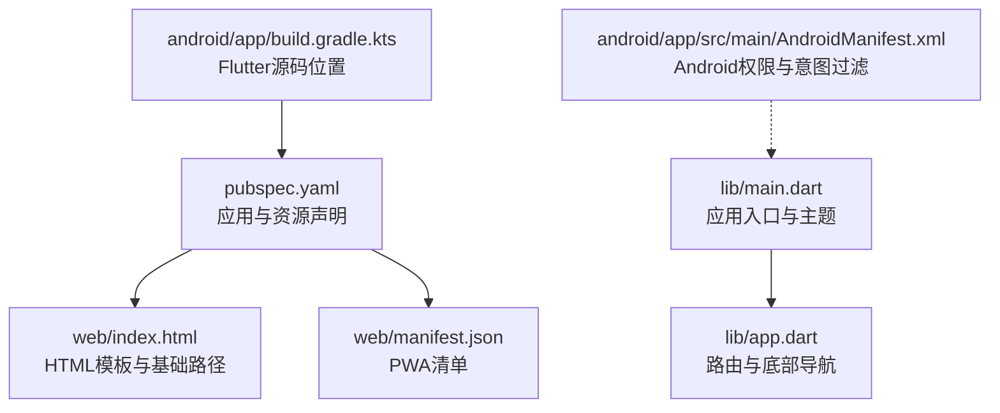
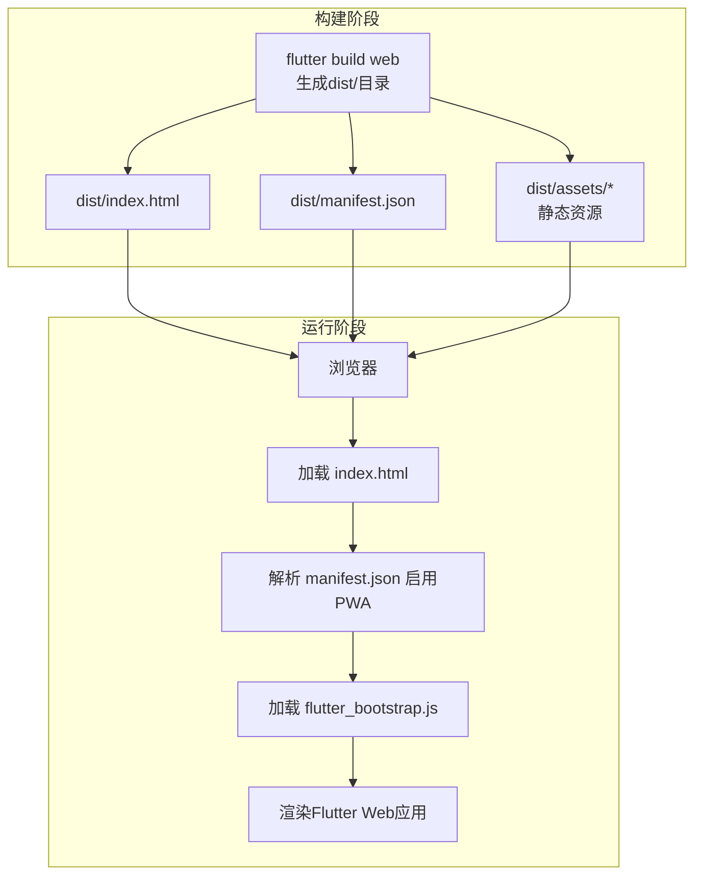
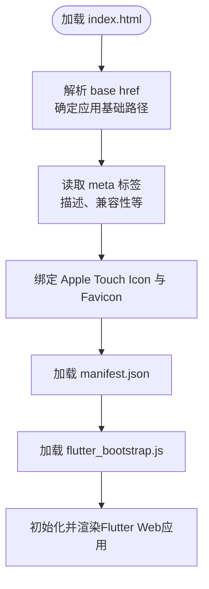
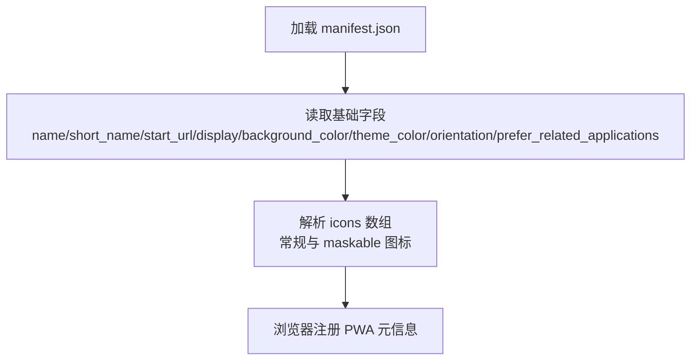
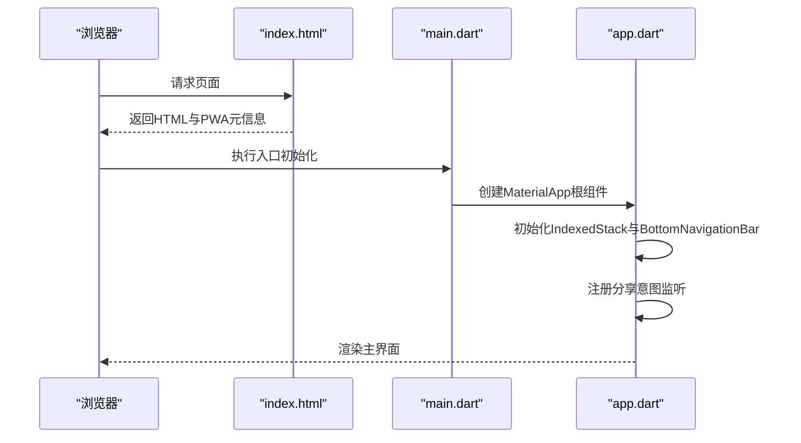
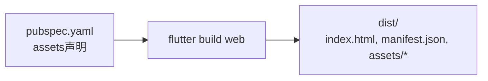
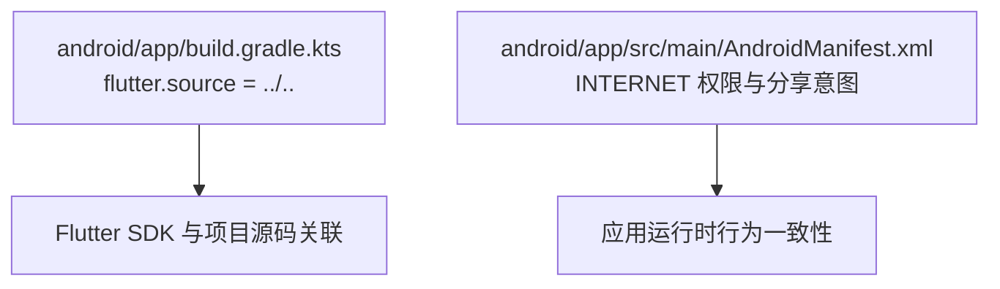

# Web部署

<cite>
**本文引用的文件**
- [pubspec.yaml](file://pubspec.yaml)
- [web/index.html](file://web/index.html)
- [web/manifest.json](file://web/manifest.json)
- [lib/main.dart](file://lib/main.dart)
- [lib/app.dart](file://lib/app.dart)
- [android/app/build.gradle.kts](file://android/app/build.gradle.kts)
- [android/app/src/main/AndroidManifest.xml](file://android/app/src/main/AndroidManifest.xml)
- [README.md](file://README.md)
- [analysis_options.yaml](file://analysis_options.yaml)
</cite>

## 目录
1. [简介](#简介)
2. [项目结构](#项目结构)
3. [核心组件](#核心组件)
4. [架构总览](#架构总览)
5. [详细组件分析](#详细组件分析)
6. [依赖关系分析](#依赖关系分析)
7. [性能考虑](#性能考虑)
8. [故障排查指南](#故障排查指南)
9. [结论](#结论)
10. [附录](#附录)

## 简介
本指南面向Dlg-Q项目的Web平台部署，聚焦于Flutter Web的构建与发布流程，涵盖以下主题：
- Flutter Web构建配置与PWA（渐进式Web应用）设置
- web目录下的HTML模板与manifest.json的作用与配置要点
- 静态资源优化策略（图标生成、缓存与性能）
- 部署至多种Web服务器与托管平台（含GitHub Pages、Firebase Hosting、Vercel等）
- SEO优化与元数据配置建议

本指南同时提供与实际源码对应的图示与来源标注，帮助读者快速定位配置位置并完成部署。

## 项目结构
Dlg-Q为Flutter多端项目，Web相关的关键文件集中在根目录的web目录与pubspec.yaml中；应用入口位于lib目录，Android侧配置位于android子目录。下图展示与Web部署直接相关的文件与职责：

图表来源
- [pubspec.yaml:29-34](file://pubspec.yaml#L29-L34)
- [web/index.html:1-47](file://web/index.html#L1-L47)
- [web/manifest.json:1-36](file://web/manifest.json#L1-L36)
- [lib/main.dart:1-36](file://lib/main.dart#L1-L36)
- [lib/app.dart:1-111](file://lib/app.dart#L1-L111)
- [android/app/build.gradle.kts:43-45](file://android/app/build.gradle.kts#L43-L45)
- [android/app/src/main/AndroidManifest.xml:1-65](file://android/app/src/main/AndroidManifest.xml#L1-L65)

章节来源
- [pubspec.yaml:1-34](file://pubspec.yaml#L1-L34)
- [web/index.html:1-47](file://web/index.html#L1-L47)
- [web/manifest.json:1-36](file://web/manifest.json#L1-L36)
- [lib/main.dart:1-36](file://lib/main.dart#L1-L36)
- [lib/app.dart:1-111](file://lib/app.dart#L1-L111)
- [android/app/build.gradle.kts:1-46](file://android/app/build.gradle.kts#L1-L46)
- [android/app/src/main/AndroidManifest.xml:1-65](file://android/app/src/main/AndroidManifest.xml#L1-L65)

## 核心组件
- 应用入口与主题：应用在入口处初始化系统界面样式，并以MaterialApp作为根组件，启用无调试横幅模式，便于Web与移动端一致体验。
- 主应用容器：主应用采用IndexedStack承载三个主要页面，配合底部导航实现切换，同时集成分享意图处理逻辑，提升Web端内容导入能力。
- 资源与资产：pubspec.yaml声明了assets/images与assets/icons两类静态资源，供应用在Web端加载使用。
- Web模板与清单：web/index.html提供基础HTML骨架、基础路径、iOS元标签、Favicon与PWA清单链接；web/manifest.json定义PWA名称、显示模式、主题色、图标集等。

章节来源
- [lib/main.dart:7-21](file://lib/main.dart#L7-L21)
- [lib/main.dart:23-35](file://lib/main.dart#L23-L35)
- [lib/app.dart:10-111](file://lib/app.dart#L10-L111)
- [pubspec.yaml:31-33](file://pubspec.yaml#L31-L33)
- [web/index.html:17-34](file://web/index.html#L17-L34)
- [web/manifest.json:1-36](file://web/manifest.json#L1-L36)

## 架构总览
下图展示从构建到部署的关键路径：Flutter Web构建产物生成后，由目标服务器提供静态资源，浏览器加载index.html并解析manifest.json以启用PWA功能。

图表来源
- [web/index.html:17-34](file://web/index.html#L17-L34)
- [web/manifest.json:1-36](file://web/manifest.json#L1-L36)

## 详细组件分析

### HTML模板与基础路径
- 基础路径（base href）：模板中的base元素占位符会在构建时被替换为--base-href参数值，用于支持非根路径部署场景。
- 元标签与图标：模板包含iOS相关meta标签、Favicon链接以及PWA清单链接，确保在移动设备上正确展示图标与标题。
- 初始化脚本：模板通过异步加载flutter_bootstrap.js，交由Flutter引擎进行应用初始化。

图表来源
- [web/index.html:17-34](file://web/index.html#L17-L34)

章节来源
- [web/index.html:1-47](file://web/index.html#L1-L47)

### PWA清单与图标配置
- 清单字段：包含应用名称、短名、启动路径、显示模式、背景色、主题色、方向偏好、是否优先推荐原生应用等。
- 图标集合：提供192x192与512x512尺寸PNG图标，以及maskable用途的图标，适配不同设备与系统UI需求。
- 与HTML模板联动：HTML模板通过<link rel="manifest">指向清单文件，使浏览器识别PWA元信息。

图表来源
- [web/manifest.json:1-36](file://web/manifest.json#L1-L36)
- [web/index.html:33-33](file://web/index.html#L33-L33)

章节来源
- [web/manifest.json:1-36](file://web/manifest.json#L1-L36)

### 应用入口与主题
- 入口初始化：在main.dart中设置系统UI覆盖样式，确保Web端状态栏视觉效果符合设计。
- 根组件：以MaterialApp包裹应用主体，禁用调试横幅，统一主题与语言环境。
- 主应用容器：在app.dart中通过IndexedStack与BottomNavigationBar实现三屏切换，并集成分享意图处理逻辑，增强Web端内容导入体验。

图表来源
- [lib/main.dart:7-21](file://lib/main.dart#L7-L21)
- [lib/main.dart:23-35](file://lib/main.dart#L23-L35)
- [lib/app.dart:10-111](file://lib/app.dart#L10-L111)
- [web/index.html:33-33](file://web/index.html#L33-L33)

章节来源
- [lib/main.dart:1-36](file://lib/main.dart#L1-L36)
- [lib/app.dart:1-111](file://lib/app.dart#L1-L111)

### 静态资源与构建产物
- 资产声明：pubspec.yaml中声明了assets/images与assets/icons两类资源，构建时会被打包进dist/assets目录。
- 构建输出：Flutter Web构建会生成dist目录，包含index.html、manifest.json及assets资源，需由Web服务器提供静态服务。

图表来源
- [pubspec.yaml:31-33](file://pubspec.yaml#L31-L33)
- [web/index.html:33-33](file://web/index.html#L33-L33)

章节来源
- [pubspec.yaml:1-34](file://pubspec.yaml#L1-L34)

## 依赖关系分析
- Flutter源码位置：Android Gradle配置中明确指定Flutter源码路径为“../..”，确保构建时能正确关联Flutter SDK与项目源码。
- Android权限与意图：AndroidManifest中声明网络权限与分享意图过滤器，保障应用在多端的一致行为与分享能力。

图表来源
- [android/app/build.gradle.kts:43-45](file://android/app/build.gradle.kts#L43-L45)
- [android/app/src/main/AndroidManifest.xml:2-39](file://android/app/src/main/AndroidManifest.xml#L2-L39)

章节来源
- [android/app/build.gradle.kts:1-46](file://android/app/build.gradle.kts#L1-L46)
- [android/app/src/main/AndroidManifest.xml:1-65](file://android/app/src/main/AndroidManifest.xml#L1-L65)

## 性能考虑
- 资源体积控制
  - 合理裁剪与压缩：对assets/images与assets/icons中的图片进行压缩与格式优化（如WebP），减少带宽占用。
  - 按需加载：将非首屏资源延迟加载，避免阻塞首屏渲染。
- 缓存策略
  - 静态资源指纹化：利用构建工具生成带哈希的文件名，结合HTTP缓存头实现长期缓存与失效更新。
  - Service Worker：在PWA基础上引入SW，实现离线缓存与网络降级策略。
- 启动性能
  - 异步加载：保持index.html中的脚本异步加载特性，避免阻塞DOM解析。
  - 代码分割：按路由拆分包体，减少初始下载量。
- 图标与清单
  - 提供多尺寸与maskable图标，确保在不同设备与系统UI中均获得最佳显示效果。

## 故障排查指南
- PWA未生效
  - 检查index.html中的<link rel="manifest">是否正确指向manifest.json。
  - 确认manifest.json字段完整且图标路径可访问。
- 图标不显示
  - 确保icons目录下包含至少192x192与512x512尺寸图标，maskable图标可选但建议提供。
- 非根路径部署异常
  - 使用--base-href参数构建，并确认HTML模板中的base href已被正确替换。
- 分享意图无法触发
  - 确认AndroidManifest中已添加对应ACTION与MIME类型过滤器，Web端需在HTTPS环境下运行以启用部分API。
- 构建失败或资源缺失
  - 检查pubspec.yaml中的assets声明是否覆盖所需目录，确保构建产物dist中包含预期资源。

章节来源
- [web/index.html:17-34](file://web/index.html#L17-L34)
- [web/manifest.json:1-36](file://web/manifest.json#L1-L36)
- [android/app/src/main/AndroidManifest.xml:28-45](file://android/app/src/main/AndroidManifest.xml#L28-L45)

## 结论
Dlg-Q的Web部署以Flutter Web为核心，结合web目录下的HTML模板与PWA清单，能够快速实现跨平台上线。通过合理配置基础路径、图标与清单、静态资源优化与缓存策略，可在多种托管平台上稳定运行。建议在生产环境中启用HTTPS、Service Worker与长期缓存策略，进一步提升用户体验与SEO表现。

## 附录

### Flutter Web构建与部署步骤（通用流程）
- 在本地执行构建命令生成dist目录
- 将dist目录中的所有文件上传至目标服务器或托管平台
- 确认服务器返回正确的Content-Type与缓存头
- 在目标平台配置基础路径（如非根路径部署）

### 部署至常见平台的注意事项
- GitHub Pages
  - 使用子目录部署时，务必设置基础路径并确保HTML模板中的base href被正确替换
  - 将构建产物dist作为站点根目录或子目录发布
- Firebase Hosting
  - 使用firebase.json配置public目录与rewrites，确保SPA路由回退至index.html
  - 可配置缓存头与安全规则，保证静态资源与HTTPS
- Vercel
  - 使用Static Site Export或框架模式，确保构建产物与基础路径配置正确
  - 利用边缘缓存与CDN加速静态资源

### SEO与元数据配置建议
- 页面标题与描述：在web/index.html中维护合适的<title>与<meta name="description">
- 结构化数据：根据业务场景添加JSON-LD或Open Graph标签
- Robots与sitemap：提供robots.txt与sitemap.xml，引导搜索引擎抓取
- HTTPS与安全：确保全站HTTPS，配置安全头部与证书自动续期

章节来源
- [web/index.html:19-21](file://web/index.html#L19-L21)
- [README.md:1-18](file://README.md#L1-L18)
- [analysis_options.yaml:8-29](file://analysis_options.yaml#L8-L29)