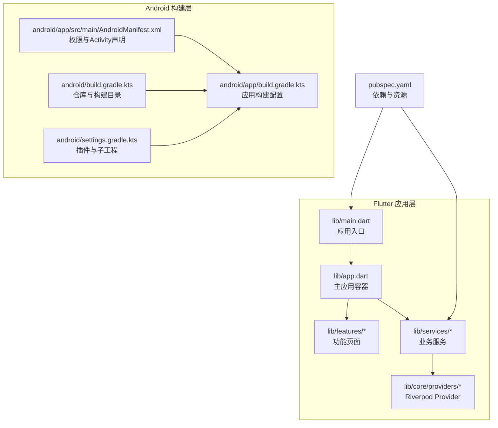
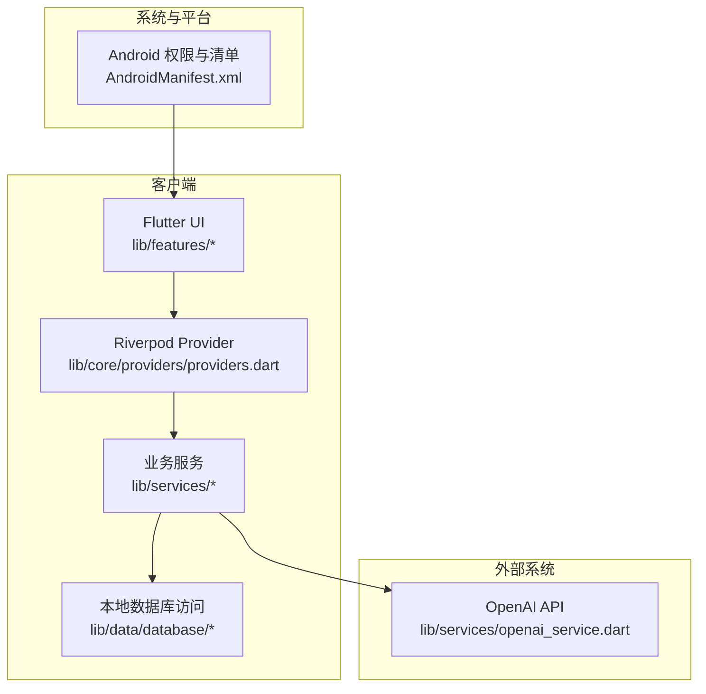
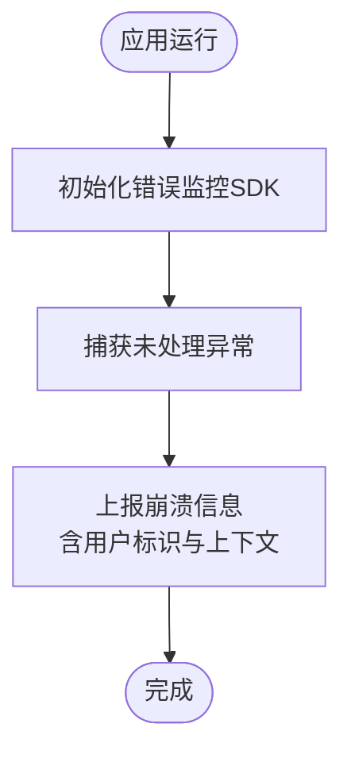
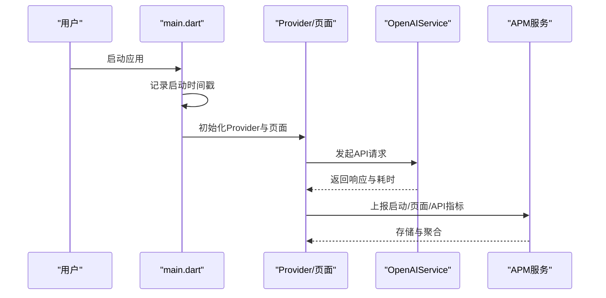
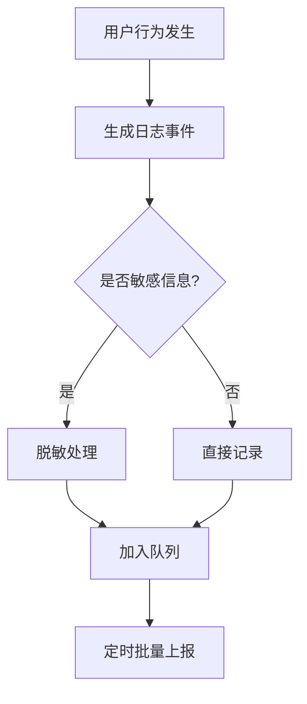
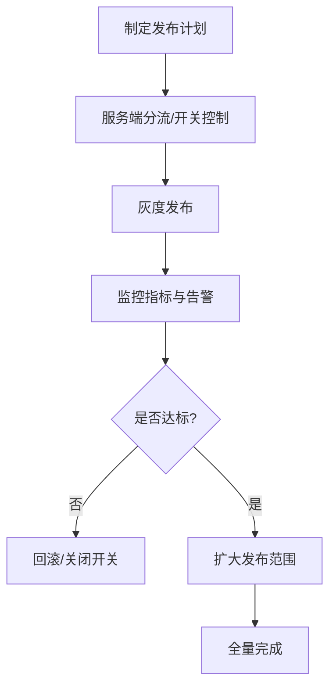
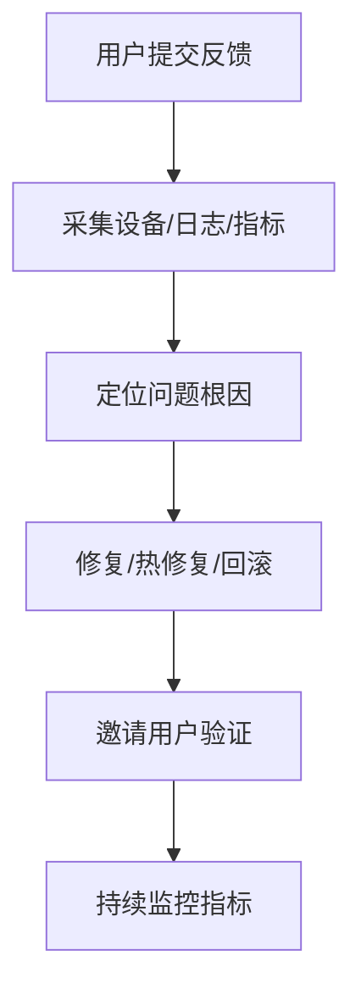
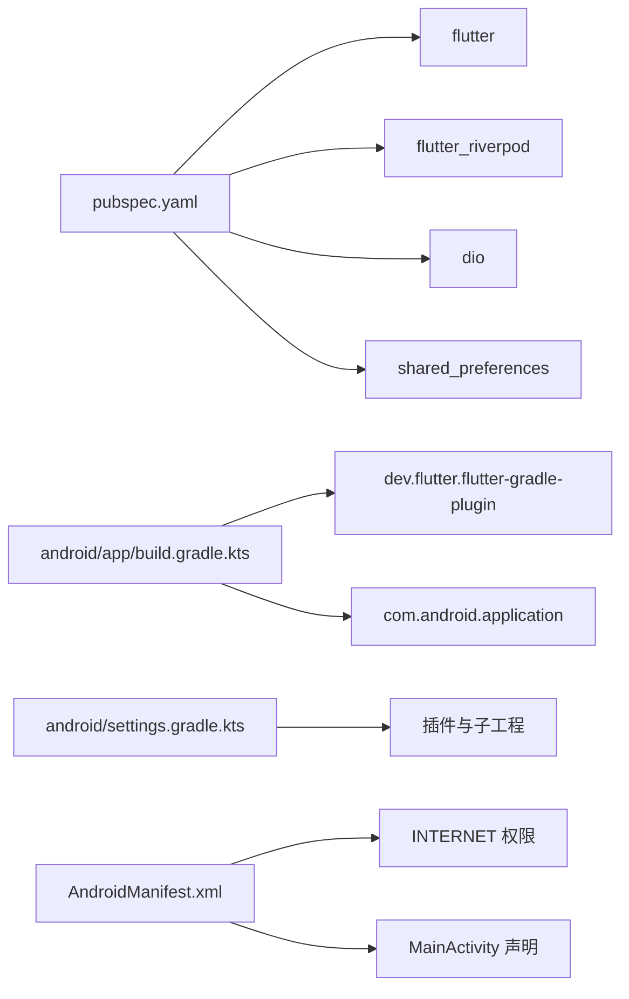

# 生产环境监控

<cite>
**本文引用的文件**
- [lib/main.dart](file://lib/main.dart)
- [lib/app.dart](file://lib/app.dart)
- [lib/services/openai_service.dart](file://lib/services/openai_service.dart)
- [lib/services/gamification_service.dart](file://lib/services/gamification_service.dart)
- [lib/core/providers/providers.dart](file://lib/core/providers/providers.dart)
- [lib/features/home/home_screen.dart](file://lib/features/home/home_screen.dart)
- [android/app/src/main/AndroidManifest.xml](file://android/app/src/main/AndroidManifest.xml)
- [android/app/build.gradle.kts](file://android/app/build.gradle.kts)
- [android/build.gradle.kts](file://android/build.gradle.kts)
- [android/settings.gradle.kts](file://android/settings.gradle.kts)
- [pubspec.yaml](file://pubspec.yaml)
</cite>

## 目录
1. [简介](#简介)
2. [项目结构](#项目结构)
3. [核心组件](#核心组件)
4. [架构总览](#架构总览)
5. [详细组件分析](#详细组件分析)
6. [依赖关系分析](#依赖关系分析)
7. [性能考量](#性能考量)
8. [故障排查指南](#故障排查指南)
9. [结论](#结论)
10. [附录](#附录)

## 简介
本指南面向Dlg-Q项目的生产环境，聚焦以下运维与监控主题：
- 错误报告与崩溃收集：如何在Android/iOS与Flutter层配置错误上报与崩溃捕获。
- 应用性能监控（APM）：关键指标采集与告警策略建议。
- 日志系统：用户行为追踪与性能日志收集方案。
- 应用更新与热修复：发布策略、A/B测试与渐进式发布。
- 用户反馈与问题排查：闭环流程与定位技巧。

当前仓库未包含任何错误监控或APM SDK集成代码，因此本指南以“最佳实践+可落地的实施步骤”为主，帮助团队在不侵入业务的前提下快速建立生产级可观测性体系。

## 项目结构
Dlg-Q采用Flutter跨平台架构，Android端通过Gradle/Kotlin构建；核心业务逻辑集中在lib目录，按功能域划分features、services、core等模块；Android侧通过AndroidManifest.xml声明权限与Activity。

**图表来源**
- [lib/main.dart:1-36](file://lib/main.dart#L1-L36)
- [lib/app.dart:1-111](file://lib/app.dart#L1-L111)
- [android/app/src/main/AndroidManifest.xml:1-65](file://android/app/src/main/AndroidManifest.xml#L1-L65)
- [android/app/build.gradle.kts:1-46](file://android/app/build.gradle.kts#L1-L46)
- [android/build.gradle.kts:1-25](file://android/build.gradle.kts#L1-L25)
- [android/settings.gradle.kts:1-27](file://android/settings.gradle.kts#L1-L27)
- [pubspec.yaml:1-34](file://pubspec.yaml#L1-L34)

**章节来源**
- [lib/main.dart:1-36](file://lib/main.dart#L1-L36)
- [lib/app.dart:1-111](file://lib/app.dart#L1-L111)
- [android/app/src/main/AndroidManifest.xml:1-65](file://android/app/src/main/AndroidManifest.xml#L1-L65)
- [android/app/build.gradle.kts:1-46](file://android/app/build.gradle.kts#L1-L46)
- [android/build.gradle.kts:1-25](file://android/build.gradle.kts#L1-L25)
- [android/settings.gradle.kts:1-27](file://android/settings.gradle.kts#L1-L27)
- [pubspec.yaml:1-34](file://pubspec.yaml#L1-L34)

## 核心组件
- 应用入口与主题：应用在入口处初始化绑定并设置主题，随后进入主应用容器。
- 主应用容器：负责底部导航、分享意图处理与页面切换。
- 业务服务：
  - OpenAI服务：封装Dio进行HTTP调用，支持超时配置与错误抛出。
  - 游戏化服务：管理XP、心数、连续打卡与掌握度等数据。
- Provider体系：基于Riverpod提供数据库、OpenAI、内容分析、游戏化等服务与数据流。

**章节来源**
- [lib/main.dart:7-21](file://lib/main.dart#L7-L21)
- [lib/app.dart:17-78](file://lib/app.dart#L17-L78)
- [lib/services/openai_service.dart:6-109](file://lib/services/openai_service.dart#L6-L109)
- [lib/services/gamification_service.dart:5-116](file://lib/services/gamification_service.dart#L5-L116)
- [lib/core/providers/providers.dart:13-27](file://lib/core/providers/providers.dart#L13-L27)

## 架构总览
Dlg-Q采用“Flutter UI + Riverpod状态管理 + 本地数据库 + 外部服务（OpenAI）”的分层架构。Android层负责系统级能力（如分享意图、网络权限），Flutter层负责业务逻辑与界面渲染。

**图表来源**
- [lib/core/providers/providers.dart:13-27](file://lib/core/providers/providers.dart#L13-L27)
- [lib/services/openai_service.dart:6-109](file://lib/services/openai_service.dart#L6-L109)
- [android/app/src/main/AndroidManifest.xml:1-65](file://android/app/src/main/AndroidManifest.xml#L1-L65)

## 详细组件分析

### 组件A：错误报告与崩溃收集（Firebase Crashlytics）
- 目标：在生产环境捕获未处理异常、ANR与崩溃信息，并关联用户上下文。
- 实施要点（非代码实现，仅步骤）：
  1) 在Android端接入SDK
     - 在应用级build.gradle引入依赖与插件，在gradle脚本中启用插件。
     - 在AndroidManifest.xml中声明必要权限（如网络）。
  2) 在Flutter端接入SDK
     - 在pubspec.yaml添加crashlytics依赖。
     - 在main.dart中初始化Crashlytics（确保在runApp之前）。
  3) 上报策略
     - 对于OpenAI等外部API调用，捕获异常并使用setCrashlyticsCollectionEnabled控制开关。
     - 对于未捕获异常，注册FlutterUncaughtExceptionHandler并上报。
  4) 用户标识与元数据
     - 使用setUserId、setCustomKey等接口标注用户ID、设备型号、课程ID等。
  5) 敏感信息脱敏
     - 上报前过滤URL参数、请求体中的敏感字段。
- 关键流程图（概念示意）

[此图为概念流程图，无需图表来源]

**章节来源**
- [android/app/build.gradle.kts:1-46](file://android/app/build.gradle.kts#L1-L46)
- [android/app/src/main/AndroidManifest.xml:1-65](file://android/app/src/main/AndroidManifest.xml#L1-L65)
- [lib/main.dart:7-21](file://lib/main.dart#L7-L21)
- [lib/services/openai_service.dart:96-98](file://lib/services/openai_service.dart#L96-L98)

### 组件B：应用性能监控（APM）
- 目标：采集关键性能指标（冷启动/热启动时间、页面切换耗时、API响应时间、内存/CPU占用）并建立告警。
- 实施要点（非代码实现，仅步骤）：
  1) 指标采集
     - 启动耗时：在main.dart中记录时间戳，对比runApp前后。
     - 页面切换：在路由跳转前后打点，计算差值。
     - API耗时：在OpenAIService中记录请求开始/结束时间与状态码。
  2) 上报与存储
     - 将指标封装为事件，周期性批量上报至APM平台。
     - 保留原始采样与聚合指标，便于回溯。
  3) 告警策略
     - 启动时间P95超过阈值、API错误率突增、内存峰值异常等触发告警。
     - 区分新旧版本与渠道，避免误报。
- 关键序列图（概念示意）

[此图为概念流程图，无需图表来源]

**章节来源**
- [lib/main.dart:7-21](file://lib/main.dart#L7-L21)
- [lib/core/providers/providers.dart:38-81](file://lib/core/providers/providers.dart#L38-L81)
- [lib/services/openai_service.dart:79-94](file://lib/services/openai_service.dart#L79-L94)

### 组件C：日志系统与用户行为追踪
- 目标：统一日志格式、分级与落盘/上报策略；追踪关键用户行为（添加内容、答题、完成题包）。
- 实施要点（非代码实现，仅步骤）：
  1) 日志分级与字段
     - 分级：trace/debug/info/warn/error。
     - 字段：时间戳、用户ID、设备信息、页面/路由、事件类型、耗时、错误堆栈。
  2) 行为追踪
     - 添加内容：IngestionScreen到Deck保存链路打点。
     - 答题流程：QuizScreen答题完成回调打点。
     - 完成题包：DeckOperations.saveStudyRecord后打点。
  3) 上报与脱敏
     - 异步批量上报，支持开关与采样。
     - 过滤手机号、邮箱、URL参数等敏感信息。
- 关键流程图（概念示意）

[此图为概念流程图，无需图表来源]

**章节来源**
- [lib/features/home/home_screen.dart:113-119](file://lib/features/home/home_screen.dart#L113-L119)
- [lib/core/providers/providers.dart:160-176](file://lib/core/providers/providers.dart#L160-L176)

### 组件D：应用更新与热修复（发布策略）
- 目标：安全、可控地发布新版本，支持A/B测试与渐进式放量。
- 实施要点（非代码实现，仅步骤）：
  1) 版本管理
     - 使用pubspec.yaml的version与build号管理版本。
     - Android使用versionCode/versionName，确保递增。
  2) A/B测试
     - 通过服务端分流规则，按用户ID哈希或随机分配实验组。
     - 不同组下发不同特性开关或UI差异。
  3) 渐进式发布
     - 先灰度1%-10%，观察指标与告警；逐步放大至全量。
     - 失败快速回滚（版本回退或服务端开关关闭）。
  4) 热修复
     - 优先通过服务端配置与特性开关临时规避问题。
     - 快速修复后以小范围发布验证，再全量。
- 关键流程图（概念示意）

[此图为概念流程图，无需图表来源]

**章节来源**
- [pubspec.yaml:4](file://pubspec.yaml#L4)
- [android/app/build.gradle.kts:22-26](file://android/app/build.gradle.kts#L22-L26)

### 组件E：用户反馈与问题排查
- 目标：建立从用户反馈到问题定位与修复的闭环。
- 实施要点（非代码实现，仅步骤）：
  1) 反馈入口
     - 在设置页或引导页提供“意见反馈”入口，收集截图与描述。
  2) 自动采集
     - 收集设备信息、版本、最近日志片段、关键指标快照。
  3) 排查流程
     - 依据用户ID与时间范围检索日志与指标。
     - 结合崩溃详情与API错误定位根因。
  4) 回访与验证
     - 修复后通知用户并邀请验证，持续观察指标变化。
- 关键流程图（概念示意）

[此图为概念流程图，无需图表来源]

## 依赖关系分析
- 依赖来源：Flutter SDK、第三方库（Riverpod、Dio、SharedPreferences等）。
- 构建依赖：Android Gradle插件、Kotlin编译器、Flutter Gradle插件。
- 运行时依赖：AndroidManifest声明的权限与Activity，确保分享意图与网络可用。

**图表来源**
- [pubspec.yaml:9-27](file://pubspec.yaml#L9-L27)
- [android/app/build.gradle.kts:1-5](file://android/app/build.gradle.kts#L1-L5)
- [android/settings.gradle.kts:20-26](file://android/settings.gradle.kts#L20-L26)
- [android/app/src/main/AndroidManifest.xml:2](file://android/app/src/main/AndroidManifest.xml#L2)

**章节来源**
- [pubspec.yaml:9-27](file://pubspec.yaml#L9-L27)
- [android/app/build.gradle.kts:1-5](file://android/app/build.gradle.kts#L1-L5)
- [android/settings.gradle.kts:20-26](file://android/settings.gradle.kts#L20-L26)
- [android/app/src/main/AndroidManifest.xml:1-65](file://android/app/src/main/AndroidManifest.xml#L1-L65)

## 性能考量
- 启动优化
  - 减少启动阶段I/O与网络请求；延迟初始化非关键Provider。
  - 合理使用缓存与预取策略，避免首屏阻塞。
- 网络与API
  - 为外部API设置合理超时与重试；区分可重试与不可重试错误。
  - 对大对象传输进行压缩或分片。
- 内存与CPU
  - 控制图片与动画资源大小；及时释放订阅与定时器。
  - 使用异步与并发优化长任务，避免主线程阻塞。

[本节为通用性能建议，无需章节来源]

## 故障排查指南
- 崩溃与异常
  - 检查错误监控面板中的堆栈与上下文，确认用户ID与设备信息。
  - 对比版本号与发布分支，定位引入问题的变更。
- API问题
  - 查看OpenAIService的错误码与响应体，确认鉴权与配额状态。
  - 核对网络权限与代理设置。
- 性能退化
  - 对比启动/页面切换/API耗时的P95曲线，识别异常时段与版本。
  - 检查日志中的慢查询与频繁重绘。

**章节来源**
- [lib/services/openai_service.dart:96-98](file://lib/services/openai_service.dart#L96-L98)
- [android/app/src/main/AndroidManifest.xml:2](file://android/app/src/main/AndroidManifest.xml#L2)

## 结论
本指南提供了Dlg-Q生产环境监控与运维的系统性建议。由于当前仓库未集成错误监控与APM SDK，建议优先完成以下工作：
- 在Android与Flutter端接入错误监控与APM SDK。
- 建立统一的日志规范与上报机制。
- 制定版本发布与热修复流程，结合A/B测试与渐进式发布。
- 明确用户反馈收集与问题排查闭环。

完成上述建设后，Dlg-Q将具备完善的生产可观测性与可维护性基础。

## 附录
- 关键文件索引
  - 应用入口与主题：[lib/main.dart:1-36](file://lib/main.dart#L1-L36)
  - 主应用容器与导航：[lib/app.dart:1-111](file://lib/app.dart#L1-L111)
  - OpenAI服务与API调用：[lib/services/openai_service.dart:1-109](file://lib/services/openai_service.dart#L1-L109)
  - 游戏化服务与统计数据：[lib/services/gamification_service.dart:1-116](file://lib/services/gamification_service.dart#L1-L116)
  - Provider体系与状态管理：[lib/core/providers/providers.dart:1-178](file://lib/core/providers/providers.dart#L1-L178)
  - 主页与学习路径：[lib/features/home/home_screen.dart:1-335](file://lib/features/home/home_screen.dart#L1-L335)
  - Android清单与权限：[android/app/src/main/AndroidManifest.xml:1-65](file://android/app/src/main/AndroidManifest.xml#L1-L65)
  - Android构建配置：[android/app/build.gradle.kts:1-46](file://android/app/build.gradle.kts#L1-L46)
  - 项目依赖与资源：[pubspec.yaml:1-34](file://pubspec.yaml#L1-L34)