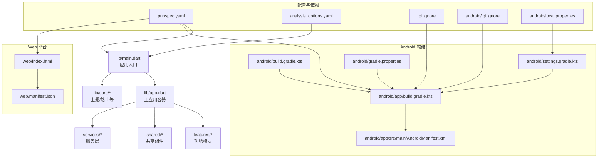
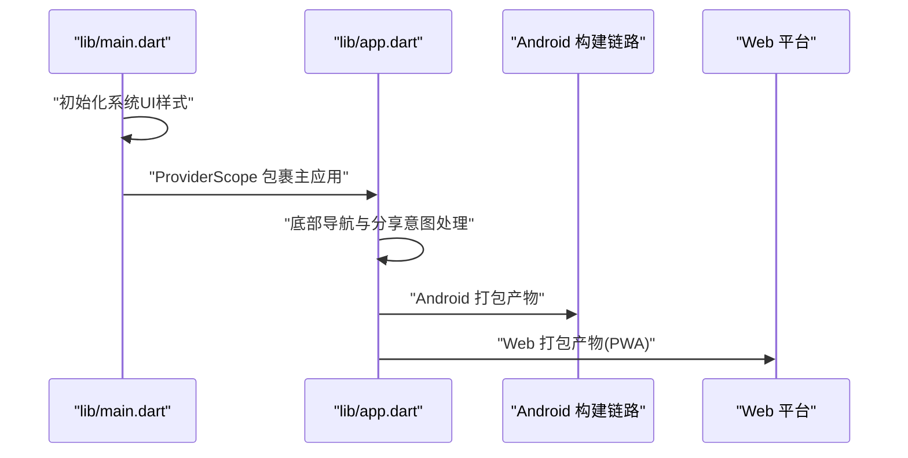
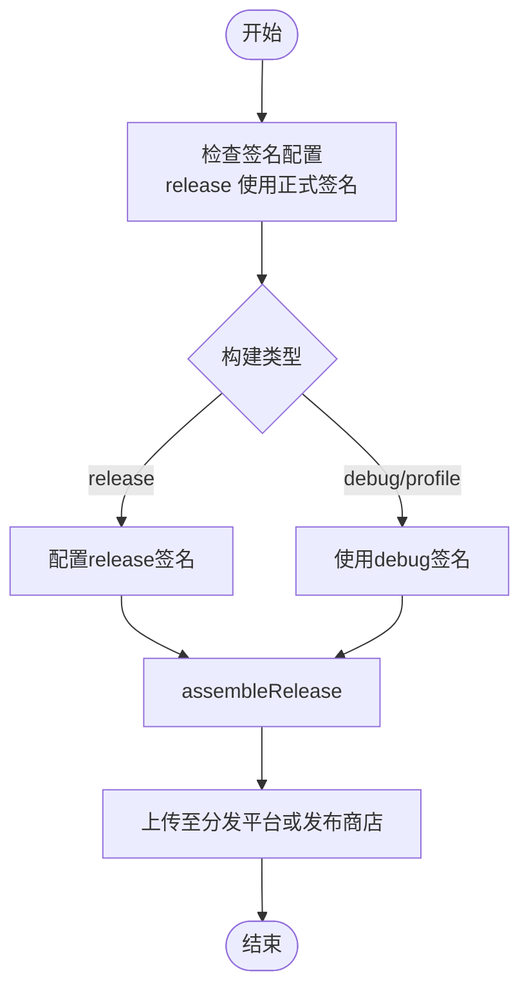
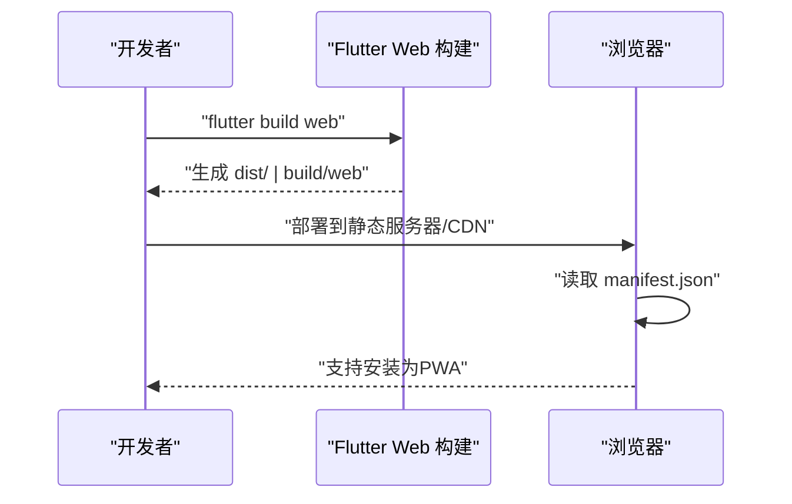
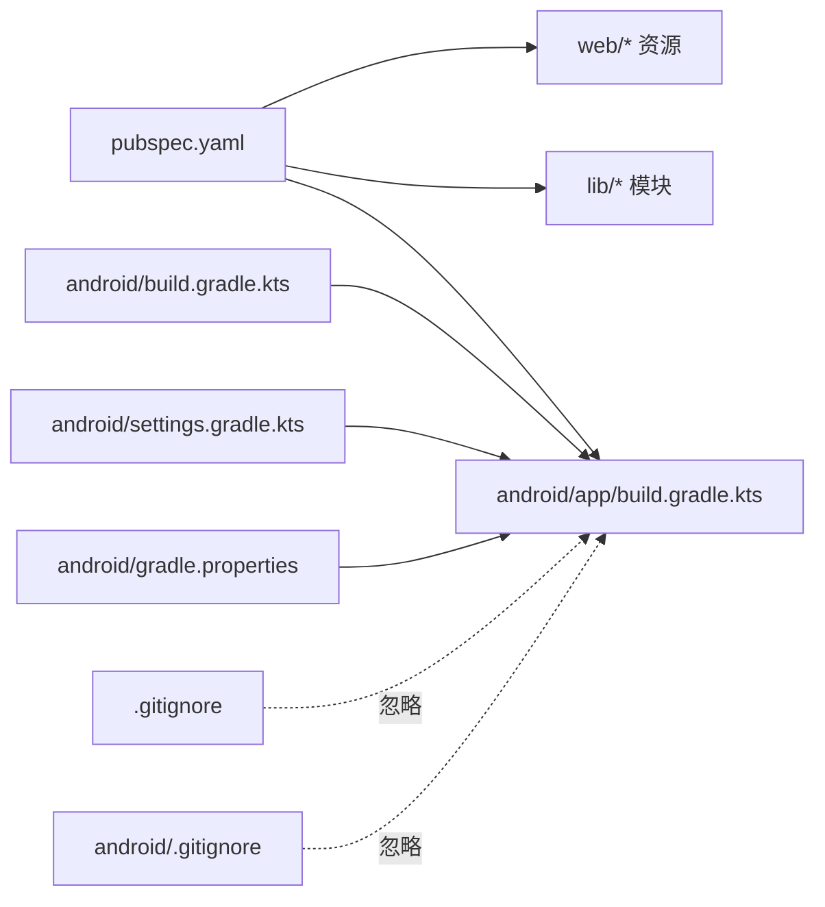

# 部署指南

<cite>
**本文引用的文件**
- [pubspec.yaml](file://pubspec.yaml)
- [analysis_options.yaml](file://analysis_options.yaml)
- [lib/main.dart](file://lib/main.dart)
- [lib/app.dart](file://lib/app.dart)
- [android/app/build.gradle.kts](file://android/app/build.gradle.kts)
- [android/build.gradle.kts](file://android/build.gradle.kts)
- [android/gradle.properties](file://android/gradle.properties)
- [android/settings.gradle.kts](file://android/settings.gradle.kts)
- [android/local.properties](file://android/local.properties)
- [android/app/src/main/AndroidManifest.xml](file://android/app/src/main/AndroidManifest.xml)
- [web/manifest.json](file://web/manifest.json)
- [web/index.html](file://web/index.html)
- [.gitignore](file://.gitignore)
- [android/.gitignore](file://android/.gitignore)
- [android/app/src/profile/AndroidManifest.xml](file://android/app/src/profile/AndroidManifest.xml)
</cite>

## 目录
1. [简介](#简介)
2. [项目结构](#项目结构)
3. [核心组件](#核心组件)
4. [架构总览](#架构总览)
5. [详细组件分析](#详细组件分析)
6. [依赖关系分析](#依赖关系分析)
7. [性能考虑](#性能考虑)
8. [故障排查指南](#故障排查指南)
9. [结论](#结论)
10. [附录](#附录)

## 简介
本指南面向Dlg-Q项目的部署与发布，覆盖Android应用构建配置（签名证书、混淆与发布渠道）、iOS平台发布准备（基于Flutter通用流程）、Web平台部署（PWA与静态资源优化）、CI/CD流水线建议（自动化测试与发布）、版本管理与发布注意事项（向后兼容与用户通知），以及生产环境监控与日志配置建议。本文所有技术要点均来源于仓库现有配置文件与源码。

## 项目结构
Dlg-Q为Flutter跨平台项目，采用标准的Flutter目录组织方式：共享业务逻辑位于lib目录，平台特定配置位于android与web目录。关键部署相关文件包括：
- 应用元数据与依赖：pubspec.yaml
- 分析规则：analysis_options.yaml
- Web端PWA清单与入口页：web/manifest.json、web/index.html
- Android应用构建脚本与清单：android/app/build.gradle.kts、android/app/src/main/AndroidManifest.xml
- Gradle与插件配置：android/build.gradle.kts、android/settings.gradle.kts、android/gradle.properties
- Flutter SDK路径与忽略规则：android/local.properties、.gitignore、android/.gitignore

图表来源
- [lib/main.dart:1-36](file://lib/main.dart#L1-L36)
- [lib/app.dart:1-48](file://lib/app.dart#L1-L48)
- [pubspec.yaml:1-34](file://pubspec.yaml#L1-L34)
- [android/app/build.gradle.kts:1-46](file://android/app/build.gradle.kts#L1-L46)
- [android/app/src/main/AndroidManifest.xml:1-65](file://android/app/src/main/AndroidManifest.xml#L1-L65)
- [android/build.gradle.kts:1-25](file://android/build.gradle.kts#L1-L25)
- [android/settings.gradle.kts:1-27](file://android/settings.gradle.kts#L1-L27)
- [android/gradle.properties:1-7](file://android/gradle.properties#L1-L7)
- [web/index.html:1-47](file://web/index.html#L1-L47)
- [web/manifest.json:1-36](file://web/manifest.json#L1-L36)
- [.gitignore:1-45](file://.gitignore#L1-L45)
- [android/.gitignore:1-14](file://android/.gitignore#L1-L14)
- [android/local.properties:1-1](file://android/local.properties#L1-L1)

章节来源
- [pubspec.yaml:1-34](file://pubspec.yaml#L1-L34)
- [lib/main.dart:1-36](file://lib/main.dart#L1-L36)
- [lib/app.dart:1-48](file://lib/app.dart#L1-L48)
- [android/app/build.gradle.kts:1-46](file://android/app/build.gradle.kts#L1-L46)
- [android/app/src/main/AndroidManifest.xml:1-65](file://android/app/src/main/AndroidManifest.xml#L1-L65)
- [web/index.html:1-47](file://web/index.html#L1-L47)
- [web/manifest.json:1-36](file://web/manifest.json#L1-L36)
- [.gitignore:1-45](file://.gitignore#L1-L45)
- [android/.gitignore:1-14](file://android/.gitignore#L1-L14)
- [android/local.properties:1-1](file://android/local.properties#L1-L1)

## 核心组件
- 应用入口与主题：应用在入口中初始化绑定、设置系统UI样式，并通过ProviderScope包裹主应用组件，使用MaterialApp作为根组件。
- 主应用容器：MainApp负责底部导航与分享意图处理，承载Home、DeckList、Profile三个主要页面。
- 依赖与资源：pubspec.yaml声明了Flutter SDK版本、核心依赖（Riverpod、网络、缓存、字体等）与资源目录；analysis_options.yaml启用官方推荐的分析规则。

章节来源
- [lib/main.dart:1-36](file://lib/main.dart#L1-L36)
- [lib/app.dart:1-48](file://lib/app.dart#L1-L48)
- [pubspec.yaml:1-34](file://pubspec.yaml#L1-L34)
- [analysis_options.yaml:1-29](file://analysis_options.yaml#L1-L29)

## 架构总览
下图展示从应用入口到平台构建的关键交互，以及Web端PWA清单与入口页的关系。

图表来源
- [lib/main.dart:1-36](file://lib/main.dart#L1-L36)
- [lib/app.dart:1-48](file://lib/app.dart#L1-L48)
- [android/app/build.gradle.kts:1-46](file://android/app/build.gradle.kts#L1-L46)
- [web/index.html:1-47](file://web/index.html#L1-L47)
- [web/manifest.json:1-36](file://web/manifest.json#L1-L36)

## 详细组件分析

### Android 应用构建与发布配置
- 应用标识与SDK版本：默认应用ID与minSdk/targetSdk由Flutter模板注入；compileSdk与NDK版本来自Flutter工具链。
- 构建类型：release构建当前使用debug签名配置以便调试运行；需替换为正式签名配置以发布。
- Java/Kotlin编译目标：JVM目标为17；Kotlin编译器选项也指向17。
- 清单权限与活动：已声明INTERNET权限与MainActivity，包含分享意图过滤器与查询声明。
- Gradle与插件：统一仓库源、子工程构建目录重定向、清理任务；settings中加载Flutter SDK路径。

图表来源
- [android/app/build.gradle.kts:28-34](file://android/app/build.gradle.kts#L28-L34)
- [android/app/src/main/AndroidManifest.xml:1-65](file://android/app/src/main/AndroidManifest.xml#L1-L65)
- [android/build.gradle.kts:1-25](file://android/build.gradle.kts#L1-L25)
- [android/settings.gradle.kts:1-27](file://android/settings.gradle.kts#L1-L27)
- [android/gradle.properties:1-7](file://android/gradle.properties#L1-L7)

章节来源
- [android/app/build.gradle.kts:1-46](file://android/app/build.gradle.kts#L1-L46)
- [android/app/src/main/AndroidManifest.xml:1-65](file://android/app/src/main/AndroidManifest.xml#L1-L65)
- [android/build.gradle.kts:1-25](file://android/build.gradle.kts#L1-L25)
- [android/settings.gradle.kts:1-27](file://android/settings.gradle.kts#L1-L27)
- [android/gradle.properties:1-7](file://android/gradle.properties#L1-L7)

### iOS 平台部署准备（基于Flutter）
- 通用流程：使用Flutter生成Xcode工程后，在Xcode中配置Bundle Identifier、Signing与证书、App Icons、Info.plist参数；设置最低系统版本与所需权限；配置TestFlight或App Store Connect上传。
- 发布要求：确保应用图标尺寸齐全、隐私标签与用途描述完整、遵守App Store审核指南；在发布前完成内测与回归测试。
- 注意事项：若使用推送通知、相机相册等敏感权限，需在Info.plist中添加对应用途字符串并在首次运行时按Apple要求申请授权。

（本节为通用流程说明，不直接分析具体文件）

### Web 平台部署与PWA配置
- PWA清单：web/manifest.json定义名称、显示模式、主题色、背景色、方向与图标集（含maskable图标），满足PWA安装条件。
- 入口页：web/index.html引入manifest、iOS元标签与图标、基础路径占位符，支持通过flutter build web传入的base-href参数。
- 静态资源优化：可结合CDN与HTTP缓存头；对图标与图片进行压缩与格式优化；利用浏览器缓存与Service Worker（如需）提升离线体验。

图表来源
- [web/manifest.json:1-36](file://web/manifest.json#L1-L36)
- [web/index.html:1-47](file://web/index.html#L1-L47)

章节来源
- [web/manifest.json:1-36](file://web/manifest.json#L1-L36)
- [web/index.html:1-47](file://web/index.html#L1-L47)

### 版本管理与发布注意事项
- 版本号：pubspec.yaml中的version字段遵循语义化版本；构建类型与渠道可通过构建脚本或CI变量控制。
- 向后兼容：Android minSdk与targetSdk由Flutter模板注入；发布前评估第三方依赖的兼容性与迁移成本。
- 用户通知：可在发布说明中明确变更点与修复项；Web端可通过更新提示或Service Worker策略引导用户刷新。

章节来源
- [pubspec.yaml:1-34](file://pubspec.yaml#L1-L34)
- [android/app/build.gradle.kts:17-26](file://android/app/build.gradle.kts#L17-L26)

### CI/CD 流水线建议
- 构建阶段：拉取代码 → 安装依赖 → Android构建（带签名密钥与混淆配置）→ Web构建（PWA）→ iOS构建（Xcode工程生成）。
- 测试阶段：执行flutter test与flutter analyze；可选集成设备/模拟器自动化测试。
- 发布阶段：根据分支或标签触发发布；上传APK/AAB至应用商店或分发平台；将Web产物部署至CDN或静态托管。
- 安全与保密：密钥与证书放入受保护的CI变量或密钥管理服务；避免提交到仓库。

（本节为通用流程建议，不直接分析具体文件）

## 依赖关系分析
- 应用依赖：pubspec.yaml声明了Riverpod、网络、缓存、字体、SVG、偏好存储等；这些依赖影响打包体积与运行时行为。
- 构建依赖：Android Gradle插件、Flutter Gradle插件、Kotlin插件；Gradle仓库与构建目录统一管理。
- 忽略规则：.gitignore与android/.gitignore屏蔽构建产物与密钥文件，降低泄露风险。

图表来源
- [pubspec.yaml:1-34](file://pubspec.yaml#L1-L34)
- [android/app/build.gradle.kts:1-46](file://android/app/build.gradle.kts#L1-L46)
- [android/build.gradle.kts:1-25](file://android/build.gradle.kts#L1-L25)
- [android/settings.gradle.kts:1-27](file://android/settings.gradle.kts#L1-L27)
- [android/gradle.properties:1-7](file://android/gradle.properties#L1-L7)
- [.gitignore:1-45](file://.gitignore#L1-L45)
- [android/.gitignore:1-14](file://android/.gitignore#L1-L14)

章节来源
- [pubspec.yaml:1-34](file://pubspec.yaml#L1-L34)
- [android/app/build.gradle.kts:1-46](file://android/app/build.gradle.kts#L1-L46)
- [android/build.gradle.kts:1-25](file://android/build.gradle.kts#L1-L25)
- [android/settings.gradle.kts:1-27](file://android/settings.gradle.kts#L1-L27)
- [android/gradle.properties:1-7](file://android/gradle.properties#L1-L7)
- [.gitignore:1-45](file://.gitignore#L1-L45)
- [android/.gitignore:1-14](file://android/.gitignore#L1-L14)

## 性能考虑
- Android：合理设置minSdk与targetSdk；避免过度依赖大体积依赖；在release构建中启用混淆与代码压缩（见“混淆配置”）。
- Web：启用Gzip/Brotli压缩；对图片与SVG进行压缩；利用manifest与Service Worker实现离线与缓存策略。
- 通用：通过分析规则与静态检查减少潜在性能问题；在发布前进行基准测试与内存占用评估。

（本节为通用指导，不直接分析具体文件）

## 故障排查指南
- Android签名问题：release构建当前使用debug签名，无法上架；请配置正式签名并妥善保管密钥。
- 权限与清单：确认AndroidManifest.xml中INTERNET与必要权限声明；分享意图过滤器是否覆盖预期场景。
- 构建目录与缓存：Gradle与Flutter构建目录被重定向至项目根目录外的build目录；清理时注意删除该目录。
- 忽略规则：确保密钥文件与构建产物未被提交到版本库；参考.gitignore与android/.gitignore。
- Web PWA：确认web/manifest.json图标路径与purpose字段正确；index.html中manifest链接与base href配置无误。

章节来源
- [android/app/build.gradle.kts:28-34](file://android/app/build.gradle.kts#L28-L34)
- [android/app/src/main/AndroidManifest.xml:1-65](file://android/app/src/main/AndroidManifest.xml#L1-L65)
- [android/build.gradle.kts:8-17](file://android/build.gradle.kts#L8-L17)
- [.gitignore:39-45](file://.gitignore#L39-L45)
- [android/.gitignore:10-14](file://android/.gitignore#L10-L14)
- [web/manifest.json:1-36](file://web/manifest.json#L1-L36)
- [web/index.html:17,33](file://web/index.html#L17,L33)

## 结论
Dlg-Q项目具备清晰的Flutter跨平台结构，Android与Web端均已具备基本的构建与PWA能力。为完成生产级发布，建议完善Android签名与混淆配置、补齐iOS发布准备、强化CI/CD自动化与测试覆盖、建立版本管理与用户通知机制，并在生产环境配置监控与日志收集策略。

## 附录

### Android 签名与混淆配置建议
- 签名配置：在gradle中新增release签名配置，使用受保护的密钥与密码；在CI中通过机密变量注入。
- 混淆与压缩：启用R8/ProGuard规则，排除Flutter嵌入与必要的反射类；保留必要的JSON序列化与依赖注解。
- 渠道准备：针对不同分发渠道（应用商店、内测、企业版）分别配置不同的签名与版本号策略。

章节来源
- [android/app/build.gradle.kts:28-34](file://android/app/build.gradle.kts#L28-L34)

### iOS 发布准备清单
- 在Xcode中配置Bundle Identifier、Team与证书；准备App Icons与Info.plist参数。
- 配置隐私用途字符串与最低系统版本；通过TestFlight进行内测验证。
- 准备App Store Connect元数据与截图；确保符合审核指南。

（本节为通用流程说明，不直接分析具体文件）

### Web 部署与PWA优化
- 部署：将flutter build web生成的产物部署至CDN或静态托管；配置HTTPS与缓存头。
- PWA：确保manifest.json图标齐全且路径正确；index.html中manifest链接与base href生效。
- 优化：图片与SVG压缩；Service Worker策略（如需）；离线页面与错误页。

章节来源
- [web/manifest.json:1-36](file://web/manifest.json#L1-L36)
- [web/index.html:1-47](file://web/index.html#L1-L47)

### CI/CD 最佳实践
- 触发策略：主分支保护、PR触发测试、tag触发发布。
- 安全：密钥与证书使用CI机密变量；构建产物与日志脱敏。
- 回滚：版本标签与工件归档；快速回滚脚本。

（本节为通用流程建议，不直接分析具体文件）

### 生产环境监控与日志
- 监控：应用崩溃上报（如Firebase Crashlytics）、关键指标埋点（启动时长、页面切换、接口耗时）。
- 日志：客户端日志分级与采样；服务端日志聚合与检索；敏感信息脱敏。
- 告警：阈值告警与趋势告警；发布后回归检测。

（本节为通用指导，不直接分析具体文件）