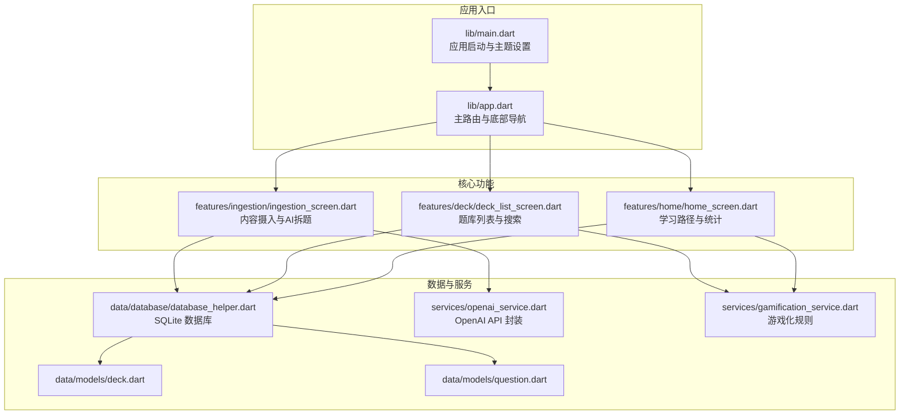
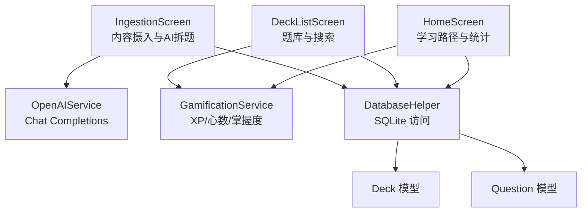
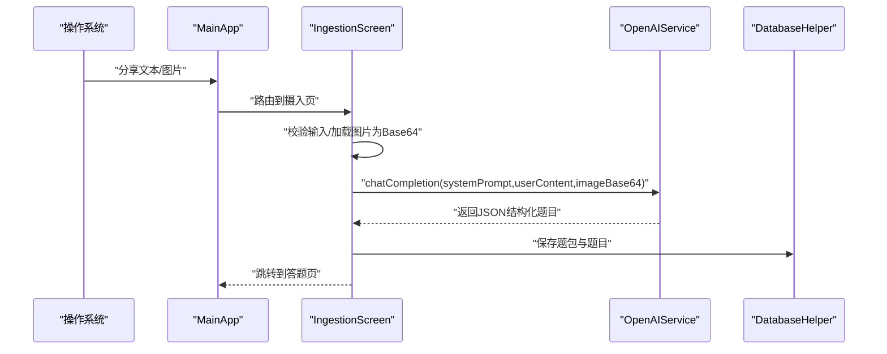
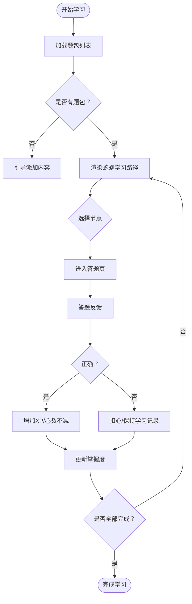
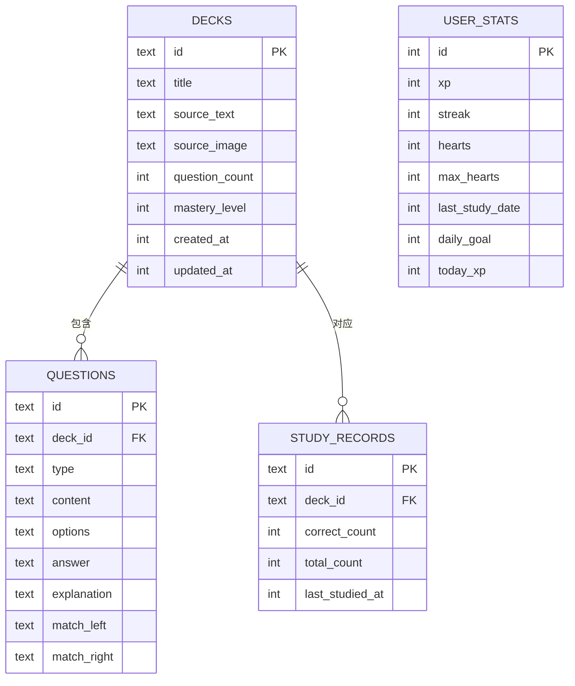
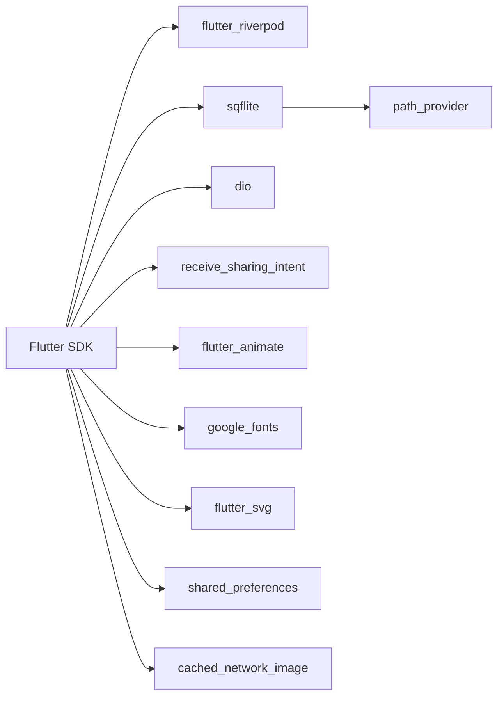

# 项目概述

<cite>
**本文引用的文件**
- [README.md](file://README.md)
- [pubspec.yaml](file://pubspec.yaml)
- [lib/main.dart](file://lib/main.dart)
- [lib/app.dart](file://lib/app.dart)
- [lib/core/theme/app_theme.dart](file://lib/core/theme/app_theme.dart)
- [lib/data/database/database_helper.dart](file://lib/data/database/database_helper.dart)
- [lib/data/models/deck.dart](file://lib/data/models/deck.dart)
- [lib/data/models/question.dart](file://lib/data/models/question.dart)
- [lib/services/openai_service.dart](file://lib/services/openai_service.dart)
- [lib/services/gamification_service.dart](file://lib/services/gamification_service.dart)
- [lib/features/ingestion/ingestion_screen.dart](file://lib/features/ingestion/ingestion_screen.dart)
- [lib/features/home/home_screen.dart](file://lib/features/home/home_screen.dart)
- [lib/features/deck/deck_list_screen.dart](file://lib/features/deck/deck_list_screen.dart)
</cite>

## 目录
1. [引言](#引言)
2. [项目结构](#项目结构)
3. [核心组件](#核心组件)
4. [架构总览](#架构总览)
5. [详细组件分析](#详细组件分析)
6. [依赖关系分析](#依赖关系分析)
7. [性能考虑](#性能考虑)
8. [故障排查指南](#故障排查指南)
9. [结论](#结论)
10. [附录](#附录)

## 引言
Dlg-Q 是一个基于 Flutter 的跨平台移动应用，专注于通过 AI 技术实现“智能内容分析与个性化学习体验”。其核心价值主张包括：
- 从微信、知乎、小红书等应用分享的内容中，自动拆题并生成题库；
- 提供渐进式学习路径与游戏化体验（XP、连续打卡、心数、掌握度）；
- 支持文本与图片内容的多模态输入，结合大模型能力进行结构化题目生成。

项目采用模块化分层架构，围绕“内容摄入 → AI 拆题 → 题库管理 → 学习与游戏化”的闭环设计，既适合初学者快速上手，也为有经验的开发者提供了清晰的扩展点与技术决策依据。

## 项目结构
项目采用按功能域划分的目录结构，配合 Riverpod 状态管理与本地 SQLite 数据存储，形成清晰的职责边界：
- lib/main.dart 与 lib/app.dart：应用入口与主路由容器，负责初始化系统 UI 样式、底部导航与分享意图处理；
- lib/core：主题与常量等通用基础设施；
- lib/data：数据模型与数据库访问层（SQLite + sqflite）；
- lib/features：各业务功能页面（首页、题库、个人中心、内容摄入、学习等）；
- lib/services：外部服务封装（OpenAI API、游戏化规则）；
- assets/web：静态资源与 Web 平台支持。

图表来源
- [lib/main.dart:1-36](file://lib/main.dart#L1-L36)
- [lib/app.dart:10-111](file://lib/app.dart#L10-L111)
- [lib/features/home/home_screen.dart:11-335](file://lib/features/home/home_screen.dart#L11-L335)
- [lib/features/deck/deck_list_screen.dart:10-314](file://lib/features/deck/deck_list_screen.dart#L10-L314)
- [lib/features/ingestion/ingestion_screen.dart:13-335](file://lib/features/ingestion/ingestion_screen.dart#L13-L335)
- [lib/data/database/database_helper.dart:9-192](file://lib/data/database/database_helper.dart#L9-L192)
- [lib/services/openai_service.dart:6-109](file://lib/services/openai_service.dart#L6-L109)
- [lib/services/gamification_service.dart:5-116](file://lib/services/gamification_service.dart#L5-L116)
- [lib/data/models/deck.dart:2-71](file://lib/data/models/deck.dart#L2-L71)
- [lib/data/models/question.dart:4-76](file://lib/data/models/question.dart#L4-L76)

章节来源
- [lib/main.dart:1-36](file://lib/main.dart#L1-L36)
- [lib/app.dart:10-111](file://lib/app.dart#L10-L111)
- [pubspec.yaml:1-34](file://pubspec.yaml#L1-L34)

## 核心组件
- 应用入口与主题
  - 入口文件设置状态栏样式，并通过 ProviderScope 包裹应用主体；主题使用自定义 AppTheme，强调多邻国风格的绿色系与 Material 风格。
- 主路由与底部导航
  - MainApp 维护底部导航与 IndexedStack 切换，集成分享意图监听，支持从其他应用分享文本/图片后直接进入内容摄入流程。
- 数据模型
  - Deck：题包模型，包含来源文本/图片、题目数量、掌握度、时间戳等；
  - Question：题目模型，支持多种题型（含匹配题左右两列）、选项、答案与解析。
- 数据库与持久化
  - DatabaseHelper 基于 sqflite，提供 decks/questions/study_records/user_stats 表的 CRUD 与初始化逻辑。
- 服务层
  - OpenAIService：封装 OpenAI Chat Completions 能力，支持文本与图片输入、API Key 与模型配置；
  - GamificationService：实现 XP、连续打卡、心数、每日目标与掌握度计算等游戏化规则。
- 功能页面
  - HomeScreen：展示学习路径、掌握度与统计卡片，支持添加内容；
  - DeckListScreen：题库列表、搜索、删除确认；
  - IngestionScreen：内容摄入界面，支持粘贴板导入、图片加载、AI 拆题与跳转答题页。

章节来源
- [lib/core/theme/app_theme.dart:6-116](file://lib/core/theme/app_theme.dart#L6-L116)
- [lib/app.dart:17-111](file://lib/app.dart#L17-L111)
- [lib/data/models/deck.dart:2-71](file://lib/data/models/deck.dart#L2-L71)
- [lib/data/models/question.dart:4-76](file://lib/data/models/question.dart#L4-L76)
- [lib/data/database/database_helper.dart:9-192](file://lib/data/database/database_helper.dart#L9-L192)
- [lib/services/openai_service.dart:6-109](file://lib/services/openai_service.dart#L6-L109)
- [lib/services/gamification_service.dart:5-116](file://lib/services/gamification_service.dart#L5-L116)
- [lib/features/home/home_screen.dart:11-335](file://lib/features/home/home_screen.dart#L11-L335)
- [lib/features/deck/deck_list_screen.dart:10-314](file://lib/features/deck/deck_list_screen.dart#L10-L314)
- [lib/features/ingestion/ingestion_screen.dart:13-335](file://lib/features/ingestion/ingestion_screen.dart#L13-L335)

## 架构总览
Dlg-Q 采用“功能域 + 分层”架构：
- 表现层：Flutter Widgets + Riverpod Provider；
- 业务层：功能页面与服务封装；
- 数据层：SQLite 本地数据库 + 模型映射；
- 外部集成：OpenAI API（用于内容拆题）。

图表来源
- [lib/features/home/home_screen.dart:11-335](file://lib/features/home/home_screen.dart#L11-L335)
- [lib/features/deck/deck_list_screen.dart:10-314](file://lib/features/deck/deck_list_screen.dart#L10-L314)
- [lib/features/ingestion/ingestion_screen.dart:13-335](file://lib/features/ingestion/ingestion_screen.dart#L13-L335)
- [lib/services/openai_service.dart:6-109](file://lib/services/openai_service.dart#L6-L109)
- [lib/services/gamification_service.dart:5-116](file://lib/services/gamification_service.dart#L5-L116)
- [lib/data/database/database_helper.dart:9-192](file://lib/data/database/database_helper.dart#L9-L192)
- [lib/data/models/deck.dart:2-71](file://lib/data/models/deck.dart#L2-L71)
- [lib/data/models/question.dart:4-76](file://lib/data/models/question.dart#L4-L76)

## 详细组件分析

### 内容摄入与 AI 拆题流程
该流程从“分享意图”触发，经过“内容校验与准备”，调用“OpenAI 拆题”，再“保存题包并跳转答题”。

图表来源
- [lib/app.dart:33-72](file://lib/app.dart#L33-L72)
- [lib/features/ingestion/ingestion_screen.dart:69-126](file://lib/features/ingestion/ingestion_screen.dart#L69-L126)
- [lib/services/openai_service.dart:46-107](file://lib/services/openai_service.dart#L46-L107)
- [lib/data/database/database_helper.dart:104-159](file://lib/data/database/database_helper.dart#L104-L159)

章节来源
- [lib/app.dart:33-72](file://lib/app.dart#L33-L72)
- [lib/features/ingestion/ingestion_screen.dart:69-126](file://lib/features/ingestion/ingestion_screen.dart#L69-L126)
- [lib/services/openai_service.dart:46-107](file://lib/services/openai_service.dart#L46-L107)
- [lib/data/database/database_helper.dart:104-159](file://lib/data/database/database_helper.dart#L104-L159)

### 渐进式学习路径与游戏化机制
- 学习路径：HomeScreen 以蜿蜒节点展示题包，区分“已完成/当前可学/未开始”，并显示掌握度进度条；
- 游戏化：GamificationService 管理 XP、连续打卡、心数、每日目标与完美通关奖励，每日重置逻辑确保长期坚持；
- 数据持久化：DatabaseHelper 提供 decks/questions/study_records/user_stats 的完整生命周期管理。

图表来源
- [lib/features/home/home_screen.dart:59-148](file://lib/features/home/home_screen.dart#L59-L148)
- [lib/services/gamification_service.dart:14-115](file://lib/services/gamification_service.dart#L14-L115)
- [lib/data/database/database_helper.dart:178-190](file://lib/data/database/database_helper.dart#L178-L190)

章节来源
- [lib/features/home/home_screen.dart:59-148](file://lib/features/home/home_screen.dart#L59-L148)
- [lib/services/gamification_service.dart:14-115](file://lib/services/gamification_service.dart#L14-L115)
- [lib/data/database/database_helper.dart:178-190](file://lib/data/database/database_helper.dart#L178-L190)

### 数据模型与关系

图表来源
- [lib/data/database/database_helper.dart:34-87](file://lib/data/database/database_helper.dart#L34-L87)
- [lib/data/models/deck.dart:2-71](file://lib/data/models/deck.dart#L2-L71)
- [lib/data/models/question.dart:4-76](file://lib/data/models/question.dart#L4-L76)

章节来源
- [lib/data/database/database_helper.dart:34-87](file://lib/data/database/database_helper.dart#L34-L87)
- [lib/data/models/deck.dart:2-71](file://lib/data/models/deck.dart#L2-L71)
- [lib/data/models/question.dart:4-76](file://lib/data/models/question.dart#L4-L76)

## 依赖关系分析
- 技术栈概览
  - Flutter/Dart：跨平台 UI 与语言；
  - Riverpod：响应式状态管理；
  - sqflite/path_provider：本地数据库与路径；
  - dio：HTTP 客户端；
  - receive_sharing_intent：接收系统分享；
  - flutter_animate/google_fonts/flutter_svg/shared_preferences/cached_network_image：动画、字体、SVG、偏好存储与网络图缓存。
- 项目依赖与资源
  - pubspec.yaml 明确声明了上述依赖与资源目录（assets/images、assets/icons）。

图表来源
- [pubspec.yaml:9-34](file://pubspec.yaml#L9-L34)

章节来源
- [pubspec.yaml:9-34](file://pubspec.yaml#L9-L34)

## 性能考虑
- 状态管理与渲染
  - 使用 Riverpod 精准订阅，避免不必要的重建；
  - Home/Deck 页面对长列表使用 ListView.builder，减少内存占用。
- 网络与 AI 调用
  - OpenAIService 设置合理的超时与 JSON 响应格式约束，避免阻塞主线程；
  - IngestionScreen 在分析过程中提供 Loading 状态与进度指示，改善用户体验。
- 数据库访问
  - DatabaseHelper 对常用查询建立外键约束与字段映射，保证数据一致性；
  - 使用 replace 策略更新学习记录，避免重复写入。
- 资源与动画
  - 使用 cached_network_image 缓存网络图片，降低重复加载成本；
  - flutter_animate 的轻量动画提升交互体验但不影响核心性能。

## 故障排查指南
- 分享内容无法进入摄入页
  - 检查分享意图初始化与订阅是否成功，确认共享内容类型（文本/图片）被正确识别与传递。
- AI 拆题失败
  - 确认已配置 OpenAI API Key 与模型参数；检查网络连通性与请求超时设置；查看返回 JSON 结构是否符合预期。
- 题包保存异常
  - 检查数据库初始化是否完成、表结构是否存在；确认插入/更新操作的字段映射与时间戳转换。
- 游戏化数据异常
  - 检查每日重置逻辑与 last_study_date 字段；确认连续打卡与心数扣减条件满足预期。

章节来源
- [lib/app.dart:33-72](file://lib/app.dart#L33-L72)
- [lib/features/ingestion/ingestion_screen.dart:76-126](file://lib/features/ingestion/ingestion_screen.dart#L76-L126)
- [lib/services/openai_service.dart:17-40](file://lib/services/openai_service.dart#L17-L40)
- [lib/data/database/database_helper.dart:32-100](file://lib/data/database/database_helper.dart#L32-L100)
- [lib/services/gamification_service.dart:14-28](file://lib/services/gamification_service.dart#L14-L28)

## 结论
Dlg-Q 以 Flutter 为核心，结合 Riverpod、sqflite 与 OpenAI，构建了从“内容摄入 → AI 拆题 → 题库管理 → 渐进式学习与游戏化”的完整闭环。其模块化结构与清晰的数据模型为后续扩展（如更多题型、多账号、云端同步）提供了良好基础。对于初学者，项目提供了直观的 UI 与明确的业务流程；对于有经验的开发者，则可在状态管理、网络层与数据库层面进行深度优化与定制。

## 附录
- 项目背景与起步
  - 新手可参考官方 Flutter 学习资源与示例，结合本项目逐步理解跨平台开发与模块化设计。
- 差异化优势
  - 从社交应用分享内容直接生成题库，减少手动录入成本；
  - 渐进式路径与游戏化元素增强学习粘性；
  - 多模态输入（文本/图片）提升 AI 拆题的覆盖面与准确性。

章节来源
- [README.md:1-18](file://README.md#L1-L18)