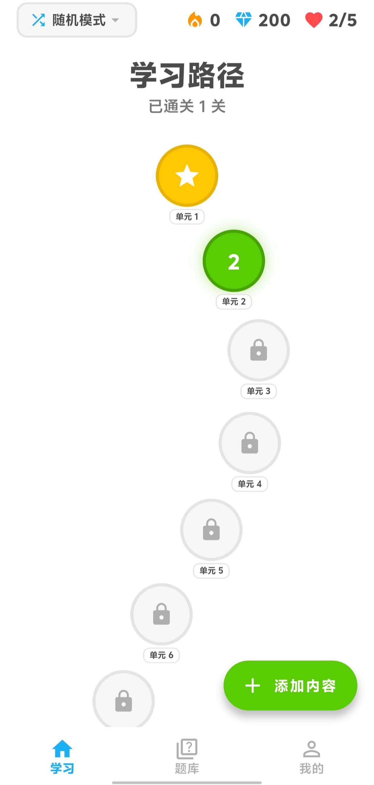
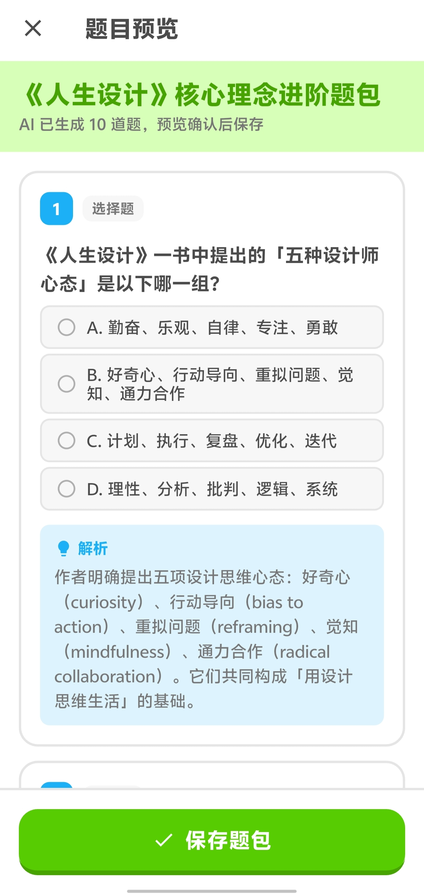
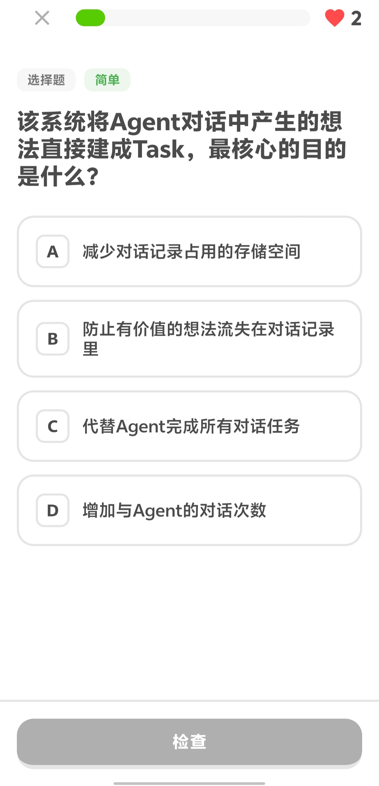
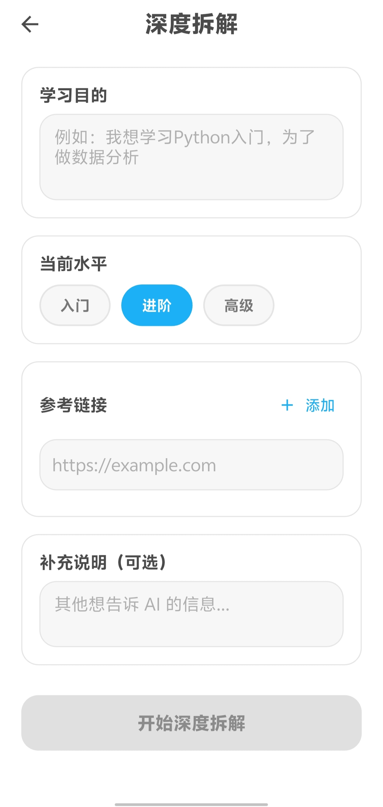

# 多多学 · Duoduo Learn (Deep Fork)

> 多邻国风格的自定义题库学习 APP —— 创建你自己的知识题包，AI 帮你拆题，游戏化打卡学习。

---

> [!IMPORTANT]
> **📜 版权与 Fork 声明**
>
> 本仓库是 [xuanli199/duoduo](https://github.com/xuanli199/duoduo) 的**二次开发增强版**（fork），基于上游 `main` 分支最新 commit。
>
> - 上游版权 © [xuanli199](https://github.com/xuanli199)，原项目采用 [MIT License](https://opensource.org/licenses/MIT)
> - 本 fork 版权 © 2026 YHlorra & duoduo-deep contributors
> - 完整协议见 [LICENSE](./LICENSE) · 上游同步策略见 [UPSTREAM.md](./UPSTREAM.md) · 变更记录见 [CHANGELOG.md](./CHANGELOG.md)
>
> 在保留原协议声明的前提下，本 fork 新增了**深度模式 (Deep Mode)**、SM-2 间隔重复、苏格拉底对话、JSON Schema 约束、概念页等能力。

---

## 🚀 快速开始

```bash
git clone https://github.com/YHlorra/duoduo-deep.git
cd duoduo-deep
flutter pub get
flutter run                 # 连真机/模拟器跑
```

构建 Release APK：

```bash
flutter build apk --release
# 产物: build/app/outputs/flutter-apk/app-release.apk
```

> [!TIP]
> 预编译版本见 [Releases](https://github.com/YHlorra/duoduo-deep/releases) 页面。

**前置条件**：Flutter ≥ 3.5、Dart ≥ 3.x、Android SDK、JDK 17+。

---

## ✨ 核心特性

### 本 fork 新增

- 🧠 **深度模式 (Deep Mode)** —— 基于 tool-calling 的多步 LLM 推理管道，支持联网搜索 + URL 抓取，从目标自动构建可学习题包
- 📐 **JSON Schema 约束** —— 自动探测 provider 能力等级 (L3 / L2 / L1) 并优雅降级，跨厂商稳定输出
- 🔧 **JSON 自修复** —— `json_extractor` 在 LLM 输出不合规时尝试本地修复，必要时 LLM 自愈
- 🧮 **SM-2 间隔重复** —— 经典 SuperMemo SM-2 算法，按记忆曲线调度复习
- 💬 **苏格拉底对话** —— 通过反问引导用户主动回忆，巩固薄弱概念
- 📚 **概念页** —— 按概念聚合卡片，可视化知识结构
- ⚙️ **设置页重构** —— AI 配置 / 学习偏好 / 进度重置统一管理

### 来自上游（原版功能）

- 🏠 **学习路径首页** —— 按题包顺序学习，知识点模式 + 随机挑战模式
- 📝 **多题型支持** —— 单选 / 多选 / 判断 / 填空 / 匹配 / 排序
- 🤖 **AI 拆题** —— 粘贴文本、拍照识别、分享内容，AI 自动生成题包
- 🎮 **游戏化系统** —— XP / Streak / Hearts / 每日目标 / 月度打卡 / 21 个成就徽章
- 🧠 **填空题 AI 判题** —— 本地不匹配时调用大模型语义判断

---

## 📱 截图

### 首页
学习路径与每日目标



### 题包导入
AI 拆题输入 + 解析预览



### 答题屏
题型交互 + 即时判题



### 深度模式
目标收集 + 管道进度



---

## 🛠 技术栈

| 分类 | 技术 |
|---|---|
| 框架 | Flutter 3.5+ / Dart 3.x |
| 状态管理 | Riverpod |
| 本地存储 | SQLite (sqflite) + SharedPreferences |
| 网络 | Dio |
| AI | OpenAI 兼容 API（多厂商 + tool-calling） |
| 动画 | flutter_animate |
| 字体 | Google Fonts |
| 分享接收 | receive_sharing_intent |
| CI/CD | GitHub Actions（analyze + test + release APK） |

---

## 📂 项目结构

```
lib/
├── main.dart                # 应用入口
├── app.dart                 # 主应用 + 底部导航
├── core/
│   ├── constants/           # 颜色、主题
│   └── providers/           # Riverpod Provider
├── data/
│   ├── database/            # SQLite Helper（含 v1→v2 迁移）
│   └── models/              # 题包 / 题目 / 偏好 / Schema
├── features/
│   ├── home/                # 学习路径首页
│   ├── deck/                # 题库管理
│   ├── learning/            # 答题界面
│   ├── ingestion/           # AI 拆题导入
│   ├── concept/             # 概念页
│   ├── deep/                # 深度模式 pipeline / tools / 目标 / 进度
│   ├── profile/             # 个人页
│   └── settings/            # 设置页
├── services/                # 游戏化 / AI / JSON / SM-2 / 苏格拉底
└── shared/widgets/          # 公共 UI

test/
├── core/                    # Provider 单测
├── features/deep/tools/     # 深度模式工具测试
└── services/                # 服务层单测
```

---

## ⚙️ 配置 AI 接口

在 APP 设置页面中配置：

- **API 地址** —— 兼容 OpenAI 协议的任意接口
- **API Key** —— 本机存储
- **模型名称** —— 或选预设厂商模型
- **高级** —— tool-calling 开关、Schema 约束等级

> [!WARNING]
> 本 fork **不会** 上传你的 API Key 到任何服务器，所有配置仅存本机 SharedPreferences。
> Release APK 已使用维护者持有的 release key 签名；如要上架 Google Play Store，请走 [Play App Signing](https://support.google.com/googleplay/android-developer/answer/9842756) 流程，用 Play 接受的签名密钥重新签名。

---

## ✅ 适合 / ❌ 不适合

**适合**

- 想用 AI 整理学习材料（粘贴文本/图片/URL → 自动出题）
- 需要间隔重复算法巩固记忆
- 偏好本地存储，不愿意把数据交给在线服务
- 想换不同 OpenAI 兼容 provider 实验

**不适合**

- 需要跨设备同步（本地存储，不上云）
- 想要开箱即用的现成题库（这里没有，要自己喂内容）
- 上架 Play Store（需走 Play App Signing 重新签名）

---

## 🛡 安全性

> [!CAUTION]
> - API Key **仅存本机**（SharedPreferences），不会上传任何服务器
> - 你选择的 provider 服务器会看到你发送的学习内容，注意隐私
> - Release APK 使用维护者持有的 release key 签名，请勿从非官方渠道下载

---

## 📥 下载

前往 [Releases](https://github.com/YHlorra/duoduo-deep/releases) 下载最新 APK。

| 版本 | 触发 | APK | CI |
|---|---|---|---|
| [v0.1.0](https://github.com/YHlorra/duoduo-deep/releases/tag/v0.1.0) | `git tag v0.1.0 && git push --tags` | 55M (debug 签名，初版) | ✅ 39/39 tests |
| v0.1.1+ | 维护者配置 release keystore 后 | release 签名 | ✅ |

---

## 🔐 Release 签名（维护者）

Release APK 由 GitHub Actions 在 tag 触发时自动构建并使用维护者持有的 release key 签名。架构：

- **本地**：`android/key.properties`（gitignored）+ `android/app/release.keystore`（gitignored）
- **CI**：4 个 GitHub Actions secret —— `KEYSTORE_BASE64`、`KEYSTORE_PASSWORD`、`KEY_ALIAS`、`KEY_PASSWORD`
- **workflow**：`.github/workflows/release.yml` 在 `flutter build apk --release` 之前从 secret 解码 keystore + 生成 `key.properties`

首次配置（一次性，维护者本地执行）：

```powershell
# 1. 生成 keystore（按提示输入密码和身份信息）
keytool -genkey -v -keystore android/app/release.keystore `
  -alias duoduo-deep -keyalg RSA -keysize 2048 -validity 10000

# 2. 复制模板并填入密码
Copy-Item android/key.properties.example android/key.properties
# 编辑 key.properties 填入 storePassword 和 keyPassword

# 3. 把 keystore + 3 个密码设为 GitHub Actions secret
$base64 = [Convert]::ToBase64String([IO.File]::ReadAllBytes("android/app/release.keystore"))
gh secret set KEYSTORE_BASE64 --repo YHlorra/duoduo-deep --body $base64
gh secret set KEYSTORE_PASSWORD --repo YHlorra/duoduo-deep   # 输入密码
gh secret set KEY_ALIAS --repo YHlorra/duoduo-deep --body "duoduo-deep"
gh secret set KEY_PASSWORD --repo YHlorra/duoduo-deep   # 输入密码（同 storePassword 也可以）

# 4. 重新打 tag 触发 release
git tag -d v0.1.0; git push origin-new :refs/tags/v0.1.0   # 删旧 tag
git tag -a v0.1.1 -m "v0.1.1 - release-signed APK"; git push origin-new v0.1.1
```

> [!NOTE]
> 上架 Google Play Store 时还需走 [Play App Signing](https://support.google.com/googleplay/android-developer/answer/9842756) 流程用 Play 接受的密钥重新签名；本仓库的 release key 仅用于 sideload 装设备。

---

## 📄 License

双重版权 © 2026：

- 原项目 [xuanli199/duoduo](https://github.com/xuanli199) —— MIT License
- 本 fork YHlorra & duoduo-deep contributors

完整协议见 [LICENSE](./LICENSE)。

---

## 🙏 致谢

- 原项目：[xuanli199/duoduo](https://github.com/xuanli199)
- 上游说明：[UPSTREAM.md](./UPSTREAM.md)
- 开源组件：见 `pubspec.yaml` 与各 LICENSE 头
